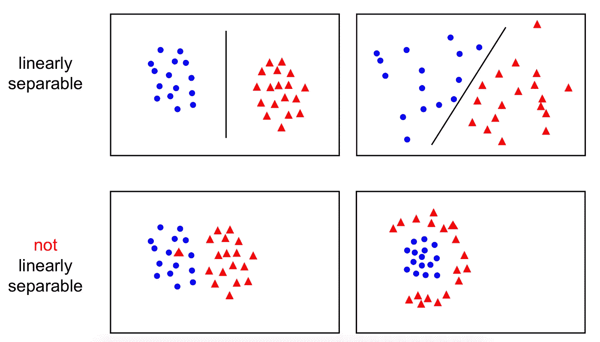
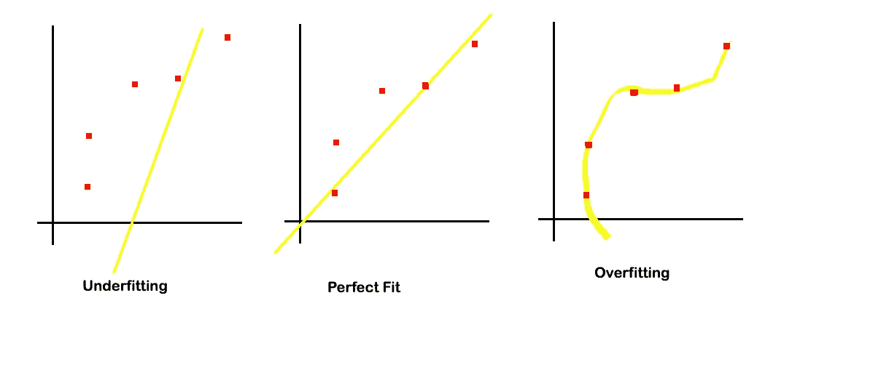

# 模型拟合背后的直觉:过度拟合 v/s 欠拟合

> 原文：<https://towardsdatascience.com/intuition-behind-model-fitting-overfitting-v-s-underfitting-d308c21655c7?source=collection_archive---------36----------------------->

## 在我们深入了解过度拟合和欠拟合背后的概念之前，让我们尝试理解机器学习模型的幕后工作。

你觉得把数据给机器学习模型会怎么样？想象一个充满白点的黑色房间。因为一个房间意味着 3 个维度(高度、宽度和长度)，所以基本上我们是在 3 个维度上可视化数据。现在，让我们假设黑色房间里的白点形状像一条蛇。你认为你的模型如何在黑房间(3D 空间)中学习白点的这种性质？实际上，让模型学习数据性质的过程称为模型拟合。

> **模型拟合**是让模型学习给定训练数据的性质的过程。

模型拟合的质量取决于三个主要因素，例如你的问题范式是什么，N 维空间(这里，N=3)中存在哪种数据，以及你选择的模型的固有性质是什么。

> ***模型拟合取决于:*** 问题范式、数据种类和所选模型性质

让我试着解释一下。当我说你的问题范式是什么的时候，我指的是不管是 ***有监督的*** 还是 ***无监督的*** 学习任务。**监督学习**简单地说就是一种机器学习的范例，其中给你的数据包含目标的值。所谓目标，我指的是模型试图预测的值。另一方面，**无监督学习**顾名思义，暗示了一种我们有数据但没有目标值的范式。在查看模型对 N 维数据模式的掌握程度时，理解问题范式的概念是一个需要考虑的重要方面。

在监督学习任务的情况下(例如*分类*或*回归)，*我们知道数据的实际模式只是因为我们有目标标签。换句话说，作为读者，你知道数据的性质(暗室中白点的蛇形结构)，只是因为我明确告诉你，你已经得到了数据的目标值或真实值。另一方面，如果你观察无监督的学习任务，例如聚类，其中你只有数据，但你没有办法检测实际的结构或模式或目标标签。你唯一能做的就是进行有根据的猜测，并尝试使用不同的类内和类间相似性标准来评估你的模型。

因此，只有在监督学习任务中，我们才有足够的能力相对容易地检测模型拟合的质量，即，我们的模型对我们的数据的底层结构的理解程度，因为我们有真实的数据与之进行比较。请注意，我并不是想说无监督学习范式不关心模型拟合。我只是想指出，在缺乏真实目标值的情况下，在无监督学习范式中，确定模型与数据的拟合程度是一项多么困难的任务。

> **监督学习:**给定目标标签
> 
> **无监督学习**:没有给定目标标签

在讨论模型拟合时，第二个需要了解的最重要的事情是我们得到了什么样的数据。我的意思是，无论数据是否线性可分。 ***线性可分性*** 的思想来源于这样一个事实:与非线性数据相比，在线性可分数据上训练和学习模型更容易。例如，再次想象一个黑暗的房间，想象红色发光点在房间的一端看起来像一朵云，蓝色发光点在房间的另一端看起来像另一朵云。在这种情况下，模型可以仅仅是线性模型(如线 y=mx+c ),并且它将能够基于任何未来点在房间中的位置来预测该点是红色还是蓝色。相比之下，想象一个房间，里面充满了随机排列的红色和蓝色发光点。现在，你能想出任何简单的(线性)模型，能够分离这些点群，同时很好地概括未来的预测吗？可能是的，但是这个模型会比线性模型复杂得多。

> **可线性分离:**数据可以通过线性模型分离
> 
> **非线性可分离:**线性模型无法分离数据

这里有一张以不同形式呈现的更多数据点的图片，可以帮助您更好地理解线性可分性的概念。

Source of Image: [http://www.robots.ox.ac.uk/~az/lectures/ml/lect2.pdf](http://www.robots.ox.ac.uk/~az/lectures/ml/lect2.pdf)

最后但同样重要的是，当我提到模型的固有性质时，我基本上是指您选择了什么类型的模型来拟合您的数据。像直线或超平面一样是线性的吗？是像曲线一样的二次型吗？还是更复杂？选择一个能够识别给我们的数据的细微差别的模型是非常重要的。所以，选择你的模型要非常小心。

现在我们更好地理解了模型拟合，让我们看看任何机器学习模型的两个最重要的特征。即，**。顾名思义，专一性仅仅意味着对给定的数据或任务的专一和专注。而可推广性意味着以可接受的性能水平推广任何未知(测试)数据的结果或模型的能力。**

> ****特异性:**对训练数据进行 **f** 集中学习的能力，以便模型学习数据的微小细节。**
> 
> ****可推广性:**通过已知数据训练，对未知测试数据推广模型的能力。**

**当我们说模型适合数据时，我们的意思是它确定了数据中的一般趋势或模式，即，它是可概括的，而不是太具体的。把模型做得太具体会让它抓住每一个微小的细节。从而增加了它在看不见的测试数据上表现不佳的脆弱性。发生这种情况是因为模型在识别给定(训练)数据的细微差别方面变得过于精通，因此当向其提供可能显示略有不同的模式的看不见的测试数据时，它往往无法以任何可接受的效率水平对测试数据使用相同的明显特定的模型，因此表现不佳。上述场景中，模型往往过于特定于训练数据而无法进行概括，这被称为 ***过拟合*** ！**

**现在你一定在想什么是不合适的？***欠拟合*** 是与过拟合相反的一种方式。想象一下，一个模型如此笼统，以至于无法从给定的训练数据中捕捉到任何有意义的东西。在这种情况下，有很高的普遍性，但很低的特异性。这也不好！**

**下图展示了红点所示给定数据的欠拟合、过拟合和完美拟合之间的差异。**

****

**您可以看到最左边的图包含一个模型(用黄线表示)，该模型无法从数据中捕获任何有意义的信息(高概化)，因为它无法通过 1 个以上的数据点(红点)(低特异性)。与之形成直接对比的是，我们看到最右边的模型穿过了所有的红点(高特异性)。这表明它试图捕捉所有数据点的复杂性，但如果我们使用这条黄色曲线并试图根据看不见的数据拟合它，它将表现不佳(低概化)。现在看中间的图片。这是一条最佳拟合或完美拟合模型线，因为它了解数据的整体结构，但在训练过程中不会太具体，从而产生一条穿过大多数数据点(红点)而遗漏一些数据点的线。换句话说，它假设可能有很少的点是异常值，并在训练时保持一定的误差幅度。**

**因此，为了使模型表现良好，总是需要在特异性和可推广性之间取得平衡。**

**简而言之，这是记住两者区别的经验法则。**

> *****过拟合*:高特异性，低概化****
> 
> *****欠拟合*:低特异性，高概化****

**请注意，我在本文中使用的模型大多是线性的，因为它们最容易被我们所有人理解。然而，同样的经验法则也适用于更复杂的模型。**

**我希望这篇文章能帮助你理解模型拟合背后的基本原理，以及过度拟合和欠拟合有什么不同！**

**感谢您的阅读！**

**继续学习！**