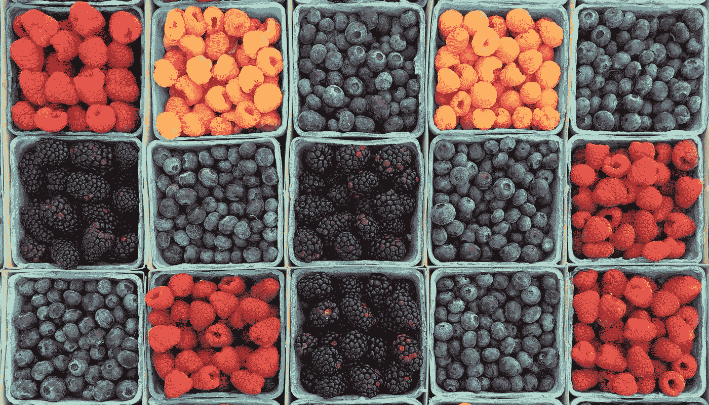
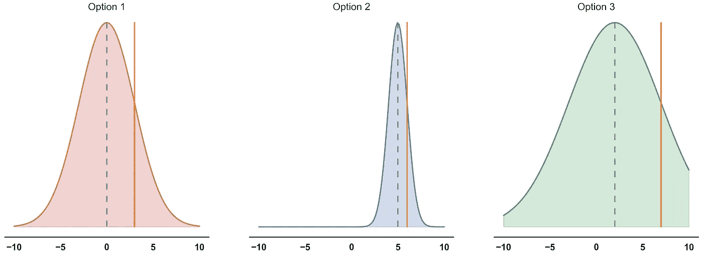
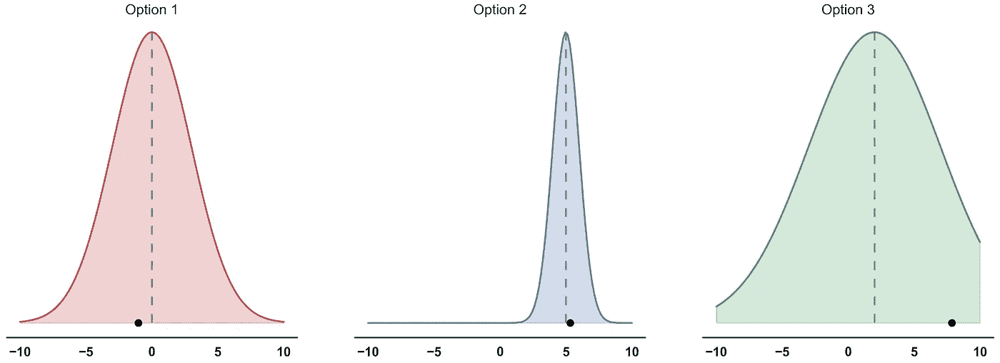

# 直觉:探索与开发

> 原文：<https://towardsdatascience.com/intuition-exploration-vs-exploitation-c645a1d37c7a?source=collection_archive---------6----------------------->

## 权衡和常见解决方案背后的直觉。

[Berries](https://unsplash.com/photos/fqkrXYMosT4) by [William Felker](https://unsplash.com/@gndclouds) on [Unsplash](https://unsplash.com/license)

探索-开发权衡是一个众所周知的问题，它发生在学习系统不得不重复做出不确定回报的选择的场景中。从本质上来说，对于一个对世界只有不完整认识的决策系统来说，困境在于是重复迄今为止行之有效的决策(exploit)还是做出新颖的决策，希望获得更大的回报(explore)。

这与[强化学习](https://www.sciencedirect.com/science/article/pii/S0893608002000564)高度相关，但对于许多其他应用也是如此，例如[推荐系统](https://www.datacouncil.ai/talks/a-multi-armed-bandit-framework-for-recommendations-at-netflix)和[在线广告](http://citeseerx.ist.psu.edu/viewdoc/download?doi=10.1.1.297.8373&rep=rep1&type=pdf)。

在这篇文章中，我给出了三个简单且行之有效的策略的概述，以解决多武装匪徒的探索-开发权衡。

术语*一个*武装强盗来自老虎机，它有一只“胳膊”可以拉，可以有效地“抢劫”玩家的钱。

如果问题包括在多个离散选项(武器)中反复选择，每个选项产生一个概率奖励(金钱)，我们称之为“[多武器强盗问题](https://homes.di.unimi.it/~cesabian/Pubblicazioni/ml-02.pdf)”。在这种情况下，就像吃角子老虎机一样，每个选择的奖励与之前选择的选项无关。随着时间的推移，决策者对每个选项的回报分配建立了理解。目标是最大化期望回报，这需要找出哪个选项给出最高的平均回报，并尽可能地利用这个选项。

例如，想象你正遭受下午疲劳的折磨，你想知道如何仍然是最有效率的。每天，你可以尝试几种策略中的一种:喝杯咖啡，小睡一会儿，试着放松一下，等等。对于每一种策略，回报看起来都是概率性的，因为许多其他因素也在影响你的生产力。你开始每天选择一个选项，有时尝试新的东西，有时重复过去行之有效的东西。当你观察你每天的工作效率时，你会对你的策略的有效性有更好的理解，使你最终能够始终如一地选择最可靠的策略。

# 解决方案策略

正如你所想象的，有许多方法可以解决多臂土匪问题。我将试着给你一个直观的概述，介绍一些简单但有效的(也就是它们实际上正在被使用的)方法。

## ϵ-greedy

这个非常简单，如果你学过强化学习 101 课程，我保证你听说过。纯粹贪婪的方法背后的想法是每一个决定都尝试一次，然后一直选择能带来最高回报的那个。

为了增加一些探索的成分， *ϵ-greedy* 让你决定你的决定中有多少部分要花在探索(ϵ)上，有多少部分要花在探索(1-ϵ)到目前为止的最佳选择上。如果你将ϵ设为 0.4，那么你会在过去 60%的时间里选择给你最好平均回报的选项，而在 40%的时间里选择任何其他选项。通常，你希望ϵ很小，这样你可以充分利用你的经验，但也可以不时地去探索。虽然有时候，从一个更大的ϵ开始是一个好主意，以鼓励最初的探索，并在你收集关于回报的知识时减少它。

对于许多应用程序，ϵ-greedy 工作得非常好。在其他场景中，由于*不加选择地*探索，它失去了一些效率。这意味着当你探索时，选择两个看似次优的选项的概率是相等的。即使有些选项总是比其他选项差，它们有时还是会被选中，浪费宝贵的资源。

## 置信上限(UCB)

现在我们在贝叶斯水域中行走。想象一下，对于每一个选项，我们都维护着一个我们在选择这个选项时收集到的奖励的分布。如果我们还没有收集到任何奖励，我们可以从一个假设开始:每个选项的先前奖励分布通常非常广泛(例如[均匀分布](https://en.wikipedia.org/wiki/Uniform_distribution_(continuous)))。当我们收集奖励时，我们会不断更新这个分布。

**UCB:** Three options with different densities. The orange lines are one standard deviation higher than the mean. As we explore the option with the highest μ + βσ, we would go for option 3 this time (if we chose β=1).

在每一步，我们不会像贪婪方法那样，只选择估计平均回报μ最高的选项，而是选择μ *加*标准差σ最高的选项。这样做的效果是，在开始时，当我们不确定任何选项的回报并且方差很大时，我们倾向于探索具有高不确定性的选项，因为σ占优势。随着我们对每个选项的平均回报越来越确定，标准差会缩小，我们倾向于选择估计平均回报μ最高的选项，而忽略回报很少的选项。

我们称 **μ + βσ** 为[置信上限](http://jmlr.org/papers/volume3/auer02a/auer02a.pdf)，其中β是一个权衡参数，用于引导更多或更少的探索。随着β趋于零，我们更接近于纯粹利用迄今为止提供最高平均回报的期权。另一方面，高β值有利于探索，直到我们几乎没有不确定性。

请注意，与ϵ-greedy 方法不同，我们的经验会影响我们要探索的选项。如果我们很早就发现其中一个选项几乎肯定比其他选项差，那么我们就不会投资去进一步探索它。

## 汤普森取样

请记住，我们不断地重新估计我们的奖励分布。当遵循 1933 年引入的[汤普森采样](https://arxiv.org/pdf/1707.02038.pdf)方案[时，我们利用了那些分布所提供的不确定性。在每个时间步，我们从每个分布中抽取一个样本。然后，我们根据这些样本的回报值对选项进行排序，就像我们之前根据平均值加上β乘以标准差对分布进行排序一样。最后，我们选择排名最高的选项。](https://www.dropbox.com/s/yhn9prnr5bz0156/1933-thompson.pdf)

**Thompson sampling:** Three options with different densities. The black dots represent one sample drawn from each distribution. For this set of samples, we would explore option 3, although it has a lower mean reward than option 2.

这样，估计平均回报高的选项就有可能被选中。尽管如此，我们不确定的期权也有机会被选中，因为它们的样本分布在一个很大的可能回报值区域。

采用这种策略，我们通常不会完全放弃任何选择，不像我们对 UCB 那样。相反，它越来越不可能选择一个看似糟糕的选项。

凭直觉，我们可以说 UCB 和汤姆森抽样都是“乐观的”，因为他们给了期权一个机会，即使这些期权到目前为止还没有带来最好的平均回报。在理论层面上，可以证明 UCB 和汤普逊抽样之间有着[密切的联系](https://www.semanticscholar.org/paper/Learning-to-Optimize-via-Posterior-Sampling-Russo-Roy/28cf1bd6110e734e20fc63f727d0d5bba612b921)。

感谢您的阅读。我希望你喜欢这篇文章，也学到了一些有用的东西！