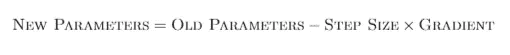
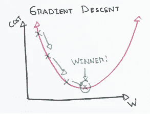

# 直观深度学习第 1a 部分:神经网络简介

> 原文：<https://towardsdatascience.com/intuitive-deep-learning-part-1a-introduction-to-neural-networks-aaeb3a1500df?source=collection_archive---------8----------------------->

## 什么是深度学习？一个非常温和和直观的神经网络及其工作原理的介绍！

近年来，eep Learning 因其在许多应用程序上令人印象深刻的表现而受到了广泛关注，包括语言翻译、x 光医疗诊断、识别图像以帮助无人驾驶汽车、击败顶级围棋选手以及高级 DotA 选手、仅从像素数据学习如何玩 Atari 游戏……所有这些都是 Deep Learning 最近取得的成就！在这篇文章中，我们将在直观的层面上(温和地)向你介绍深度学习背后的内部工作。

深度学习实际上只是机器学习的一个子集，由于它在我们上面列出的许多任务中的出色表现，最近获得了极大的关注。

这就引出了一个问题——什么是机器学习？机器学习与“传统算法”有何不同？

如果你上过算法课，那么算法的标准隐喻就是一个配方。算法是一系列步骤，当按特定顺序执行时，会产生您想要的输出。机器人制作面包的“烹饪算法”可能是这样的:

1.  向一个大碗中加入 3 杯面粉、1 汤匙盐和 3 汤匙糖。
2.  在另一个碗里，将一包酵母溶解在温水中。
3.  把两个碗放在一起，揉 10 分钟。

诸如此类……(我不是面包专家，所以我不会在这里写面包的食谱)

在机器学习中，我们不会像上面那样指定算法。相反，我们指定了烹饪方法可能采用的模板(或“架构”):

1.  向一个大碗中加入 __ 杯面粉、__ 汤匙盐和 __ 汤匙糖。
2.  在另一个碗里，将 __ 包酵母溶解在温水中。
3.  把两个碗放在一起，揉 __ 分钟。

空格是在开始时没有指定的数字，但是我们必须找出答案。然后，我们编写一个算法(另一系列指令)，依靠我们可以访问的数据，根据什么是“最佳”(我们将在后面定义)来计算这些数字。

在很高的层面上，机器学习的任务是双重的:

1.  找到最适合该任务的最佳模板。深度学习只是我们从中选择的模板的子集，这些模板已经被证明在许多任务中是有效的。
2.  使用数据找出填充模板的最佳数字。这就是“机器学习”的“学习”部分。

一个成功的机器学习模型需要这两个步骤——如果没有第一步，没有面包粉，无论你尝试多少次，都不可能代表正确的“食谱”；如果没有第二步，你的面包“配方”的比例可能会完全错误，即使配料是正确的。

举一个更具体的例子，考虑根据房屋大小(平方米)、层数、到最近学校的距离(米)等特征预测房价的任务。

一个标准的算法可能是这样的:房价大约是(100 *房子大小)+ (1000 *楼层数)——(30 *到最近学校的距离。(参数化)机器学习方法看起来像这样:

第一步:我已经指定了模板:房价 __ *房屋面积+ __ *层数+ __ *到最近学校的距离。

第二步:看我列出的所有房子的数据，似乎最好的填空数字分别是(90.3，1006.2，-40.5)。

我们将更深入地探究我们具体指定了什么样的模板，以及我们如何使用这些数据来填补这些空白。但是在高层次上，许多机器学习任务采取与上面的例子类似的形式:给定一些输入，学习一些将输入转换成期望输出的函数。

这种输入-输出对的其他例子有:

*   输入:来自照片的图像(一系列像素)；输出:判断图像中是否有汽车
*   输入:来自胸部 x 光的图像(一系列像素)；输出:患者胸部感染可能性的概率
*   输入:客户服务电话的录音；输出:预测客户对此次通话的感受，得分从 1 到 10
*   输入:英文单词序列；输出:相应的法语翻译

机器学习算法的强大之处在于，我们可以解决以前不知道答案的问题。假设我们不知道如何将语音转换为文本的公式，因为这个公式非常复杂(如果它存在的话)。通过机器学习，我们可以仅从转录服务(例如字幕)的数据中找出复杂的公式，解决(至少近似地)一个我们之前无法用算法编码的问题。

**总结**:机器学习包括两步:指定一个模板，并为该模板找到最佳参数。

如上所述，深度学习只是采用“神经网络”的架构(或模板)的一个子集，我们可以在步骤 1 中指定。“神经网络”(更具体地说，人工神经网络)松散地基于我们人类大脑的工作方式，神经网络的基本单元是神经元。

在基本水平上，神经元做两件事:

1.  接收来自其他神经元的输入并将它们组合在一起
2.  执行某种转换来给出神经元的输出

在(1)中，我们经常取一些输入的*线性组合*。通俗地说，如果神经元有三个输入(让我们称它们为 x1、x2 和 x3)，那么我们可以这样组合它们:

This is a linear combination of inputs to our neurons

其中，各个空白是将被*优化*以用于以后的参数(即，从数据中学习什么数字最好地填充那些空白)。在数学术语中，连接到输入(x1、x2 和 x3)的空白称为*权重*，不连接到任何输入的空白称为*偏差*。

对于线性组合，我们应用一些函数(称为*激活函数*)来实现我们的最终输出。这些功能的常见示例有:

*   Sigmoid 函数(将所有初始输出“挤压”在 0 和 1 之间的函数)
*   双曲正切函数(将所有初始输出“挤压”到-1 和 1 之间的函数)
*   ReLU 函数(如果初始输出为负，则输出 0。否则，不对初始输出做任何事情)

这就是一个神经元的全部！

Image taken from CS231N notes ([http://cs231n.github.io/neural-networks-1/](http://cs231n.github.io/neural-networks-1/)). This shows the parallels between the artificial neuron we’ve described and a biological neuron.

现在我们已经描述了一个神经元，一个“神经网络”简单地由*层*神经元组成，以一种方式连接，一个*层*神经元的输入是前一层神经元的输出(激活后):

Image taken from CS231N Notes ([http://cs231n.github.io/neural-networks-1/](http://cs231n.github.io/neural-networks-1/)). A layer in the neural network consists of one or more neurons. These layers are connected such that the input of one *layer* of neuron is the output of the previous layer of neurons (after activation).

现在，激活函数的意义是什么？神经元的第一步有道理，但第二步真的有必要吗？激活函数为函数提供了一些非线性，我们需要用它来表示复杂的函数。请参见脚注 1 了解原因。

让我们通过一个简单的神经网络示例来巩固我们的理解。假设我们已经完成了培训(稍后会详细介绍)，并在模板中填入了数字，这样我们就有了一个完整的模型。假设我们希望预测某人是否会通过驾驶考试。我们有三个输入特征:年龄、性别、课程数量。我们的中间层有两个神经元。假设每个神经元分别描述了它们在停车和道路驾驶中的表现。

Our simple neural network to predict whether someone has passed his/her driving

现在我们已经填写了最佳数字，因此我们知道根据年龄、性别和课程数量来描述某人停车表现的最佳方式。假设函数是这样的:

A function to compute how well someone would park based on their age, sex and number of lessons

我们考虑两个人:

个人 A:20 岁，男性，已经上了 10 节课。他的“停车”神经元将输出 0(因为 ReLU 将所有负输出转换为 0)。

人 B:50 岁，女性，已经上了 20 节课。她的“停车”神经元将输出 150.5(因为 ReLU 只留下正输出)。

类似地，对于道路驾驶神经元，我们可以有这样一个函数:

A function to compute how well someone would drive on the road based on their age, sex and number of lessons

对于上述两个人，我们知道 A 的“道路驾驶分数”为 0，B 的“道路驾驶分数”为 179.5。

现在，这两个分数有助于这个公式中某人是否通过的最终输出:

A function to compute the probability of someone passing based on the output of the two intermediate neurons

在最后一层，我们已经计算出，人 A 通过的概率将是 Sigmoid(-3) = 4.74%，人 B 通过的概率将是 Sigmoid(2.9925) = 95.22%。请记住，sigmoid 是一个将我们的值压缩在 0 和 1 之间的函数，一个对获取概率有用的函数！你可以在这里找到一个 sigmoid 计算器:[https://keisan.casio.com/exec/system/15157249643325](https://keisan.casio.com/exec/system/15157249643325)

然而，在一天结束时，当数字被填入这个模板时，**神经网络只是复杂的功能，其中的神经元建立在其他神经元的基础上**。神经网络的强大之处在于，在实践中，它们能够灵活地(近似地)很好地表示任务的输入和输出之间的潜在关系。

附带说明:虽然术语*神经网络*可以指模板(模型架构)，但它也经常用于指完整的模型(参数填充到模板中)。

在我们的例子中有一个错误，我想强调一下。在我们的例子中，我们确切地知道中间神经元在做什么——计算停车和道路驾驶时的表现。然而，在神经网络中，我们不知道神经元在做什么；它自己计算出什么是要计算的最佳中间特征，这将导致最终输出的准确预测。可能是‘停车’和‘道路驾驶’，也可能是其他我们并不真正理解的东西。这就是为什么人们说神经网络是不可解释的——我们不知道这些中间表示在人类可理解的层面上意味着什么。

我们再举一个例子。在最终层识别图像是否包含猫时，我们可能希望中间层识别中间特征(例如，某些类似猫的特征的存在，如胡须)。我们没有对这些中间特征进行硬编码，而是让机器来确定哪些中间特征最适合识别猫。这是否意味着中间层的神经元正在准确地识别胡须，我们不知道，但我们相信机器知道如何以最佳形式安排参数。我们没有指定那些参数，但是我们指定了为我们的模型设置边界的架构(容器)。当我们来到关于计算机视觉的[第二部分](https://medium.com/intuitive-deep-learning/intuitive-deep-learning-part-2-cnns-for-computer-vision-24992d050a27)时，我们将对此进行更多的讨论。

这是一个神经网络！但是现在你可能已经注意到了，我们可以有很多不同的组合来安排这个神经网络架构。我们应该有多少隐藏层？每个隐藏层应该有多少个神经元？所有这些与架构相对应的设置被称为“超参数”，我们最终也需要找到最佳的“超参数”集。我们将在[第 1b 部分](https://medium.com/intuitive-deep-learning/intuitive-deep-learning-part-1b-introduction-to-neural-networks-8565d97ddd2d)中回来讨论这个问题。

**总结**:神经网络只是我们指定的一个复杂的‘模板’,它具有建模输入和输出之间许多复杂关系的灵活性。

到目前为止，我们只触及了机器学习的“第一步”:为我们的模型设置一个好的模板或架构。我们现在进入“第二步”:假设我们已经找到了一个好的模板，我们如何从数据中学习？哪组数字最适合我们的任务？我们称之为*优化*:寻找符合我们模板的最优(最佳)数字。

要做到这一点，我们首先必须定义“最佳”的含义，用某种度量标准来衡量模型的表现。在我们预测一些产出(房价、某人是否患有癌症等)的情况下。)，我们希望预测尽可能接近实际值。如果我对数据集的预测与实际值相差甚远，那就真的很糟糕，我可能想在我的性能指标中对此进行惩罚。

我们使用的指标被称为*损失函数*，它根据我们的预测与数据集中的实际值之间的差距来描述模型的表现有多差。我们的任务是提出一种算法来寻找使这个损失函数最小化的最佳参数。

*分类*问题的一个常见损失函数(见脚注 2)是 **softmax 损失函数**(见脚注 3)。

在没有给出数学的全部细节的情况下，对该损失函数的一种常见解释是:

Loss Function Interpretation

其中，Prob_model (CorrectLabel)是指模型分配给我们所知的正确标签的概率。让我们通过一个例子来获得更好的直觉:

假设我的问题是识别一个图像是否是热狗:

无论如何，我给我的模型一个热狗的训练例子(所以我们知道“热狗”是正确的标签)。根据图像，我的模型可能会给我这样的概率:

Model Probabilities of Hot Dog vs Not Hot Dog

在这个训练例子的损失函数中，我们有

Loss for Hot Dog Training Example

现在拿另一个有不同参数的模型来说，他们试图从同一张图像中进行预测。相反，该模型在识别哪个是正确图像方面表现不佳:

Probabilities and loss for a poorer model which gives a lower probability to the correct class (Hot Dog)

显然，模型预测更差，因此我们得到更高的损失。因此，损失函数确实对应于模型在预测特定示例的正确类别方面的表现。对正确答案的预测越高，损失越低。总损失可视为每个单独训练示例的平均损失。

现在我们有了一个损失函数，我们必须找到合适的参数来最小化它。为此，我们求助于一种叫做梯度下降的算法。梯度下降背后的想法很简单——在损耗减少的方向上缓慢移动参数。方向由损耗相对于这些参数的梯度给出。一个“更新步骤”是这样的:

An update step: The new parameters is one step away from the old parameters. The step is in the direction of the gradient, and how big a step we take in that direction is determined by the step size.

在我们迈出第一步后，我们继续移动并迭代这些参数，直到我们到达“最低点”，在那里没有方向会给我们带来任何明显更低的损失:

Image taken from [https://ml-cheatsheet.readthedocs.io/en/latest/gradient_descent.html](https://ml-cheatsheet.readthedocs.io/en/latest/gradient_descent.html)

你可能经常听到术语*反向传播*。反向传播仅仅是一种在神经网络中寻找梯度的方法。这里我们不讨论数学，因为寻找梯度需要对微积分有所了解，但是我们的想法是，神经网络是一个非常复杂的函数，用“传统”方法求导可能会很困难。然而，数学显示的是，我们在早期层中需要的梯度可以表示为在它之后的层中的梯度的更简单的函数:

How the gradient we needs depend on the layer after it

那我们该怎么办？一个好的策略是从最后一层开始，然后反向工作。假设有 5 层:我们找到最后一层的梯度，第 5 层(这很简单)。然后，我们找到第 4 层的梯度，因为我们已经找到了第 5 层的梯度。然后，我们找到第 3 层的梯度，因为我们已经找到了第 4 层的梯度，等等，直到我们到达第 1 层。这就是为什么它被称为反向传播:我们的计算从第 5 层一直反向传播到第 1 层。反向传播真的只是帮助我们找到更简单的表示和公式来计算梯度下降所需的梯度。

万一我们丢失了大图，让我们回顾一下为什么我们需要使用梯度下降:梯度下降帮助我们找到最小化损失的参数。通过最小化训练损失，我们得到了一个更好的模型，为我们的训练集提供了最准确的预测。

**总结**:指定损失函数和执行梯度下降有助于我们找到为我们的训练集提供最准确预测的参数。

**合并总结**:机器学习包括两步:指定一个模板，为该模板寻找最佳参数。神经网络只是我们指定的一个复杂的“模板”,它具有建模输入和输出之间许多复杂关系的灵活性。指定损失函数并执行梯度下降有助于我们找到为我们的训练集提供最准确预测的参数。

**下一步** : 到目前为止，我们已经在很高的层面上涵盖了深度学习的基本概念。

这篇帖子最初是作为[直观深度学习](https://medium.com/intuitive-deep-learning)入门系列的第一篇帖子出现的。我的使命是用纯粹直观的方式解释深度学习概念！如果你是一个非技术初学者，我想为你提供深度学习内部工作原理背后的直觉，让你使用相同的语言和行话与技术工程师交流，即使你不知道背后的数学或代码。如果你是一名深度学习的学生，我相信在直觉方面获得坚实的基础将有助于你更好地理解你正在学习的课程中的所有数学和代码，为你提供一种更少痛苦的方式来学习这些概念。

如果你希望阅读更多，下一篇文章[第 1b 部分](https://medium.com/intuitive-deep-learning/intuitive-deep-learning-part-1b-introduction-to-neural-networks-8565d97ddd2d)将通过直觉告诉你一些我们必须注意的细微差别。我们将深入探讨如何让深度学习模型工作背后的一些本质细节，回答诸如“我们如何找到最佳的模型架构(模板)”之类的问题

如果你对编写你的第一个神经网络感兴趣，这篇文章附带了一个编码伴侣:

 [## 用 Keras 建立你的第一个预测房价的神经网络

### 一步一步完整的初学者指南，建立你的第一个神经网络在几行代码像一个深…

medium.com](https://medium.com/intuitive-deep-learning/build-your-first-neural-network-to-predict-house-prices-with-keras-eb5db60232c) 

**脚注**:

1.  ***为什么我们的神经元中需要激活功能***

如果每个神经元的输出只是其输入的线性组合，那么层输出中神经元的输出仍将是输入的线性组合，无论神经网络有多少隐藏层或有多复杂。假设相反，我们没有激活函数；那么隐藏层 2 中的神经元只是隐藏层 1 中神经元输出的线性函数。

因此，隐藏层 2 中神经元的公式可能如下所示:

Formulation of a neuron in hidden layer 2

其中 h1、h2 和 h3 是隐藏层 1 中的神经元。但是 h1 的公式应该是

Formulation of a neuron in hidden layer 1

其中 x1 和 x2 是输入特征。h2 和 h3 的公式是相似的，尽管填空的数字可能不同。尝试将 h1、h2 和 h3 的公式代入中，您会发现隐藏层 2 中神经元的公式可以简化为输入特征的线性组合，如下所示:

Substituting in the formulation for neurons in earlier layers and rearranging it reveals that we merely get a linear function in the end

如果你继续这种逻辑，你会意识到，即使在最后一层，它们也只是输入的线性组合——对于建模复杂的关系来说，这真的不是一个非常复杂的函数。增加一个非线性意味着你不能重新排列它来得到一个线性函数，你最终会得到一个非常复杂的公式(来表达复杂的关系):

Substituting in the formulation for neurons in earlier layers, we see that this representation does not reduce to a simple linear combination of the inputs

2. ***回归与分类的区别***

监督学习的输出通常分为两类:回归和分类。分类是这篇文章的重点:输入可以映射到几个不同的输出(称为*类*),并且每个输入都有一个正确的标签。另一方面，回归预测的是一个实数值而不是一个类。假设我们希望从他们的评论中预测 Yelp 的星级(1 星到 5 星)。分类方法预测评论属于哪个不同的类别(1 星、2 星、3 星、4 星或 5 星);回归方法预测一些实数值(例如 3.71)。对于本系列的大多数帖子，我们将重点讨论分类问题。

3.**soft max**

Softmax 是最后的一个常见步骤，它将最终输出转换为一组概率。概率必须满足以下条件:每个概率介于 0 和 1 之间(包括 0 和 1)，所有概率的总和为 1。

如果我们没有 softmax 层，则无法保证我们的最终输出满足上述条件，因为最终输出可以是任何没有概率意义的数字(例如-4、5.2 等)。因此，Softmax 将我们所有的最终输出标准化为一组概率，以满足上述条件。

**弄脏你的手:**

一个玩神经网络的好网站是 tensor flow Playground:[https://playground.tensorflow.org](https://playground.tensorflow.org)

**关于作者:**

你好，我是约瑟夫！我最近从斯坦福大学毕业，在那里我和吴恩达一起在[斯坦福机器学习小组](https://stanfordmlgroup.github.io/)工作。我想让深度学习概念尽可能直观，尽可能容易被每个人理解，这激励了我的出版:[直观的深度学习](https://medium.com/intuitive-deep-learning)。