# 直观深度学习第 2 部分:用于计算机视觉的 CNN

> 原文：<https://towardsdatascience.com/intuitive-deep-learning-part-2-cnns-for-computer-vision-472bbb2c8060?source=collection_archive---------16----------------------->

## 什么是卷积神经网络？我们如何应用神经网络来识别图像？

从无人驾驶汽车到面部识别技术，我们的机器似乎能够理解它们看到的东西。这是一个令人印象深刻的壮举:毕竟，机器只能将图像作为一系列数字来处理。机器如何将这一系列数字翻译成识别图像中的对象？

在这篇文章中，我们将揭示深度学习如何推动我们尖端的图像识别技术的秘密。

这是[直觉深度学习](https://medium.com/intuitive-deep-learning)介绍系列的第 2 部分。以下是到目前为止发生的事情的简要总结:

在第 1 部分中，我们介绍了神经网络以及如何让它们工作。我们从[第 1a 部分](https://medium.com/intuitive-deep-learning/intuitive-deep-learning-part-1a-introduction-to-neural-networks-d7b16ebf6b99)开始，高度概括了机器学习的目标:

> 机器学习指定一个模板，并为该模板找到最佳参数，而不是我们自己对参数进行硬编码。神经网络只是我们指定的一个复杂的“模板”,它具有建模输入和输出之间许多复杂关系的灵活性。指定损失函数并执行梯度下降有助于找到为我们的训练集提供最佳预测的参数。

然后，我们在第 1b 部分中深入探讨了如何让神经网络在实践中发挥作用的一些基本细节。

在这篇文章中，我们将看到神经网络如何应用于图像识别。特别是，我们将介绍一种新的模型架构，称为*卷积神经网络*(也称为*CNN*或 *ConvNets* )。这是一种新型的体系结构，它将利用图像数据的特殊属性，所以让我们开始吧！

首先，我们需要讨论图像的属性，然后才能讨论如何在我们的神经网络中利用它们。在计算机中，图像存储为空间排列的二维像素阵列，每个像素对应于图像的一小部分。事实上，“像素”一词来自短语“**pi(x)**cture**El**element”，因为它构成了图像中的一个小元素:

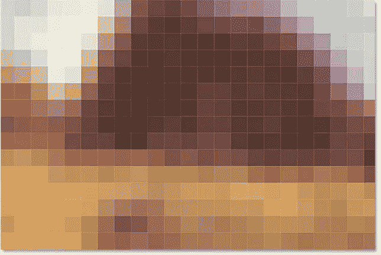

Images are made out of pixels arranged within a 2-D array. Image taken from [https://www.photoshopessentials.com/basics/pixels-image-size-resolution-photoshop/](https://www.photoshopessentials.com/basics/pixels-image-size-resolution-photoshop/)

现在每个像素存储一种颜色；一种颜色在计算机中用三个数字表示，分别对应该颜色中红、绿、蓝的数量，范围从 0 到 255(包括 0 和 255)。所以实际上，如果您将颜色通道视为另一个维度，图像可以表示为一个三维数组(前两个维度存储图像中出现的像素，最后一个维度有三个通道——红色、绿色和蓝色)。

这对我们的深度学习算法意味着什么？当我们把一幅图像作为输入时，我们实际上是在接受一个三维数组。每个数字都是我们通过神经网络传递的图像的一个特征。假设我们的图像尺寸是 256 * 256；然后，我们将总共 256 * 256 * 3 = 196，608 个特征输入到我们的神经网络中。(功能真多啊！)从这 196，608 个特征中，我们需要找到一些复杂的函数，将它转换成对图像代表什么对象的预测。一个简单的例子是——照片里有猫吗？

回想一下，拥有 196，908 个特征意味着我们在一个神经元中需要 196，908 + 1 = 196，909 个参数。请记住，在应用激活函数之前，我们的神经元输出首先采用输入特征的一些线性组合:

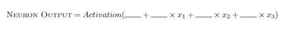

A formulation of the neuron output in terms of its input features x1, x2 and x3

在三个输入特征(x1、x2 和 x3)的情况下，我们有四个需要填充数字的空白，一个对应于每个特征和一个偏差项(不附属于任何特征)。如果我们有 196，908 个特征，我们还剩下 196，909 个空白，我们需要找到最好的数字。所有这些都发生在一个神经元上！现在，如果我们有一个神经网络，那就需要学习很多参数！

让事情变得更复杂的是，猫可以在照片中的任何地方。猫可以在图片的右上角，也可以在左下角——它们对应着一组非常不同的 196，608 个特征，但它们代表着同一个东西:一只猫。

**摘要**:图像是一个三维特征阵列:二维空间中的每个像素包含三个数字，从 0 到 255(包括 0 和 255 ),分别对应红、绿、蓝通道。通常，图像数据包含大量输入特征。

回想一下，图像的本质是这样的:

1.  有许多“输入特征”，每个特征对应于每个像素的 R、G 和 B 值，因此需要许多参数。
2.  图像左上角的一只猫或右下角的一只猫应该给出相似的输出。

此时，或许可以考虑以下方法。假设我们有一个想要测试的图像:

An image of size 256x256 we wish to test whether there is a cat or not

这是我们的算法:

步骤 1:将图像分成四个相等的象限。让我们把图像尺寸设为 256 * 256 * 3(通道)。然后，图像的每个象限将具有 128 * 128 * 3 个特征。

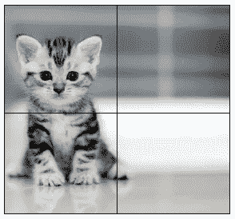

We cut our image into four equal quadrants of size 128x128 pixels. Remember that each pixel has 3 channels (R, G and B)

步骤 2:对左上角象限应用一个神经元，将 128 * 128 * 3 的特征转换成一个单一的数字。出于直觉(尽管这并不完全准确)，假设这个神经元负责识别 128 * 128 * 3 特征范围内的猫:

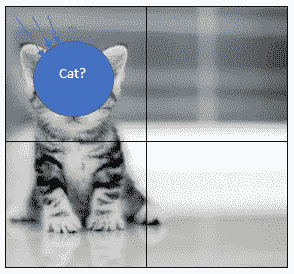

We apply the neuron which takes in the 128 * 128 * 3 features in the top-left quadrant

步骤 3:对右上象限、左下象限和右下象限应用完全相同的神经元。这被称为*参数共享*，因为我们对所有四个象限使用完全相同的神经元。

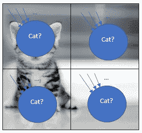

We apply the exact same neuron with the exact same parameters to all four quadrants of the image

第四步:对所有四个象限应用该神经元后，我们有四个不同的数字(直观地说，这些数字代表每个象限中是否有猫)。

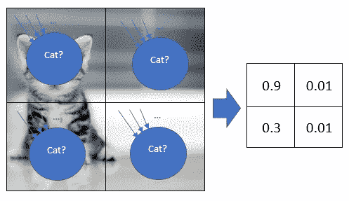

We get four different output numbers even though we apply the same neuron since the inputs are different (although the parameters are the same)

记住，我们得到四个不同的数字，因为我们输入了不同的输入特征，即使函数(和参数保持不变)。

A formulation of the neuron output in terms of its input features x1, x2 and x3

根据上面的公式，输入特征(x1、x2 和 x3)已经改变，即使填充空白的数字没有改变；因此，这些输入特性会产生不同的输出。

第五步:我们需要一个数字来告诉我们整张照片中是否有一只猫。所以我们只取这四个数字中的最大值来得到一个数字。

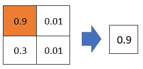

We take the maximum of the four numbers to get one number in the end

这个算法在解决我们之前的问题方面做了什么？

*   我们最初的担心是有太多的特性，因此有太多的参数。回想一下，即使我们只有一个神经元具有所有这些特征，我们也需要 256 * 256 * 3 + 1 = 196，609 个参数用于每个神经元。如果我们将其分成四个不同的象限，并对所有四个象限使用完全相同的参数，我们只需要 128 * 128 * 3 + 1 = 49，153 个参数，几乎减少了四倍！
*   猫在图像中的什么位置并不重要，重要的是图像中有一只猫。通过在所有四个象限中使用相同的神经元来识别猫，我们解决了这个问题，因为“识别猫的神经元”应该告诉我们哪个象限有猫！

恭喜你！你已经看到了你的第一个卷积神经网络！现在，这些不是我们在实践中建立的 CNN 的类型，但是概念只是我们已经覆盖的内容的一般扩展。

在接下来的几节中，我们将了解一个典型的 CNN 是由什么组成的。

CNN 拥有的第一个重要的层被称为卷积(Conv)层，它对应于上面算法中的步骤 1 到 4。Conv 层是一种特殊类型的神经网络层，它使用*参数共享*，并在图像中应用**相同的**较小的参数集，就像我们在步骤 1 到 4 中对猫识别神经元所做的那样。这不同于标准的神经网络层，其具有用于整个图像的参数。

卷积层有几个我们可以指定的超参数:

*   ***滤镜大小。*** 这对应于一个神经元在宽度和高度维度上接受多少输入特征。在我们之前的例子中，过滤器的大小是 128 * 128，因为每个神经元在空间上看起来是 128 * 128 像素(宽度和高度)。我们总是假设我们不按深度(或通道)分割图像，只按宽度和高度。所以如果我们指定滤波器大小，我们神经元中的参数个数就是 filter _ width * filter _ height * input _ depth+1。在我们的例子中，参数的数量是 128 * 128 * 3 + 1 = 49，153。不过，通常情况下，合理的过滤器尺寸可能更接近 3 * 3 或 5 * 5 的数量级。
*   ***泰然处之。有时一只猫并不出现在象限中，而是可能出现在两个(或更多)象限的中间。在这种情况下，也许我们不应该只在四个象限中应用我们的神经元，但我们也希望在重叠区域中应用神经元。Stride 就是当我们再次应用神经元时，我们想要移动(向右/向下)多少像素。在我们之前的例子中，我们以步幅 128 移动，因此我们立即进入下一个象限，而没有访问任何重叠区域。更常见的是，我们通常以步幅 1 或 2 移动。***

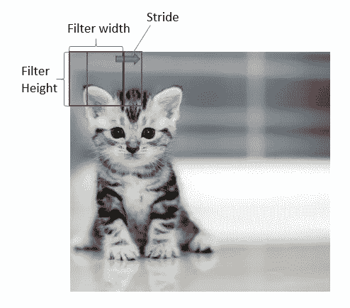

A convolution layer with filter width, filter height and stride. Note that while the red and blue boxes look at different areas, they use the same parameters.

*   ***深度。*** 在我们之前的例子中，我们只应用了一个神经元来识别是否有猫，并通过在每个象限中应用相同的神经元来共享参数。假设我们希望另一个神经元也能识别是否有狗。这种神经元的应用方式与识别猫的神经元相同，但具有不同的参数，因此每个象限的输出也不同。这将如何改变我们的参数和输出大小？嗯，如果我们有两个这样的神经元，我们就会有(128 * 128 * 3+1)* 2 = 98306 个参数。在第 4 步结束时，我们将得到 2 * 2 * 2 = 8 个输出数字。前两项 2 * 2 指的是(我们四个象限区域的)高度和宽度，最后一项 2 指的是每个象限应用了两个不同的神经元。这最后一项就是我们所说的深度。

我不想一口气介绍太多概念，所以我们来做一个小测验来巩固这些概念。

假设我们有一个输入尺寸为 256 * 256 * 3 的图像。我应用了一个过滤器大小为 3 * 3，跨度为 1，深度为 64 的 conv 层。

*   在我们的 conv 层中有多少参数？
*   这个 conv 层的输出尺寸是多少？

我鼓励你自己解决这个问题，不要向下滚动来看答案！

— —

好了，下面是答案！(希望你没出轨，反正我也没办法知道):

*   **参数数量**:我们计算出深度= 1 的情况，因为从头到尾只应用了一个神经元。这个神经元接受 3 * 3 * 3(滤波器大小*输入通道)个特征，因此这个神经元的参数数量是 3 * 3 * 3 + 1 = 28。我们知道深度= 64，意味着有 64 个这样的神经元。这为我们提供了总共 28 * 64 = 1，792 个参数。
*   **输出尺寸**:先从宽度的尺寸上来想。我们在原始输入图像中有一行 256 像素。开始时，我们的过滤器的中心(神经元的输入)将在像素 2，因为我们有一个 3 * 3 的过滤器。因此，由于过滤器的最左侧将在像素 1 处，所以过滤器的中心将在像素 2 处。此过滤器每次向右移动 1 个像素，以应用神经元。在所有步骤结束时，我们的滤镜的中心将位于像素 255，这也是因为我们有一个 3 * 3 的滤镜(因此像素 256 将被滤镜的最右侧占据)。因此，假设我们的过滤器的中心从像素 2 开始，在每一步移动 1 个像素时结束于 255，数学表明我们已经在宽度上应用了神经元 254 次。类似地，我们在高度上应用了神经元 254 次。由于我们有 64 个神经元在做这件事(深度= 64)，我们的输出尺寸是 254 * 254 * 64。

此时，您可能会想:那么，如果我希望输出尺寸为 256 * 256 * 64，那么输出的高度和宽度与输入尺寸保持不变呢？在这里，我将引入一个新的概念来处理这个问题:

*   **垫料。**回想一下，3×3 滤波器的中心开始于像素 2(而不是像素 1)，结束于像素 255(而不是像素 256)。为了使过滤器的中心从像素 1 开始，我们可以用“0”的边界填充图像，如下所示:

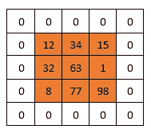

This is an example of padding a 3x3 image with a padding border of size 1\. This ensures that the center of a 3x3 filter will begin at pixel 1 of the original image.

至此，我们已经确切了解了许多尖端系统中使用的卷积层是什么！我们将介绍另一层，然后我们将所有层放在一个大的架构中，并讨论其背后的直觉！

**概要**:conv 层中 CNN 常见的一层，由*滤波器大小*、*步距*、*深度*和*填充*定义。Conv 层使用相同的参数，并在图像的不同区域应用相同的神经元，从而减少所需参数的数量。

我们将经历的下一层被称为池层，它大致对应于开始时布置的算法中的步骤 4 和 5。如果你还记得，我们有四个数字在我们的基本算法后，应用 conv 层，我们希望它减少到一个数字。我们简单地取四个输入数，输出最大值作为输出数。这是 max-pooling 的一个例子，顾名思义，取它所看到的数字的最大值。

更一般地说，池层具有过滤器大小和跨度，类似于卷积层。让我们以深度为 1 的输入为例(即它只有一个深度片)。如果我们应用一个最大池，过滤器大小为 2x2，跨距为 2，因此没有重叠区域，我们得到:

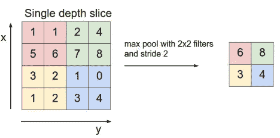

Max-pooling with filter 2 and stride 2\. Note that a max-pool layer of filter 2 and stride 2 is commonly seen in many models today. Image taken from CS231N notes: [http://cs231n.github.io/convolutional-networks/](http://cs231n.github.io/convolutional-networks/)

这个最大池似乎非常类似于 conv 层，除了没有参数(因为它只是取过滤器中看到的四个数字的最大值)。然而，当我们引入深度时，我们会看到池层和 conv 层之间的更多差异。

汇集层分别应用于每个单独的深度通道。也就是说，最大池化操作不在不同深度取最大值；它只在单一深度通道中取最大值。这与 conv 层不同，后者合并了来自所有深度通道的输入。这也意味着我们的输出图层的深度大小不会也不能改变，这与输出深度可能不同于输入深度的 conv 图层不同。

最终，汇集层的目的是减少层的空间尺寸(宽度和高度),并且它根本不触及深度。这减少了该池层之后的未来层中所需的参数数量(从而减少了计算)。

举个简单的例子，假设在我们的第一个 conv 层(有池)之后，我们有一个 256 * 256 * 64 的输出维度。我们现在对此应用最大池(过滤器大小为 2x2，步长为 2)操作，最大池层之后的输出尺寸是多少？

— —

答案:128 * 128 * 64，因为 max-pool 操作符将宽度和高度的维度减少了一半，而深度维度保持不变。

**总结**:CNN 中的另一个常见层是最大池层，由*过滤器大小*和*步幅*定义，通过取其过滤器内数字的最大值来减小空间大小。

CNN 中常见的最后一层是我们在前面的部分中见过的层，即全连接(FC)层。FC 层与我们的标准神经网络相同——下一层中的每个神经元都将前一层输出中的每个神经元作为输入。因此，命名为完全连接，因为下一层中的所有神经元总是连接到上一层中的所有神经元。展示一个我们在第 1a 部分中见过的熟悉的图表:

Image taken from CS231N Notes ([http://cs231n.github.io/neural-networks-1/](http://cs231n.github.io/neural-networks-1/))

我们通常在 CNN 的最末端使用 FC 层。所以当我们到达这个阶段时，我们可以将神经元展平成一维的特征阵列。如果前一个图层的输出是 7 * 7 * 5，我们可以将它们展平为一行 7*7*5 = 245 个要素，作为上图中的输入图层。然后，我们像往常一样应用隐藏层。

**总结**:我们通常还会在 CNN 的末端使用传统的全连接层。

现在让我们把它们放在一起。计算机视觉研究人员通常使用的一个重要基准是称为 ImageNet 大规模视觉识别挑战(ILSVRC)的挑战。ImageNet 指的是一个巨大的图像数据库，ILSVRC 的挑战是将一幅输入图像准确地分类到 1000 个独立的对象类别中。

在使用深度学习的转折点上受到欢呼的模型之一是 AlexNet，它在 2012 年赢得了 ILSVRC。在一篇题为“[历史始于 AlexNet:深度学习方法综合调查](https://arxiv.org/ftp/arxiv/papers/1803/1803.01164.pdf)”的论文中，我引用:

> 与所有传统的机器学习和计算机视觉方法相比，AlexNet 实现了最先进的识别准确性。这是机器学习和计算机视觉领域在视觉识别和分类任务方面的重大突破，也是历史上对深度学习兴趣迅速增加的一点。

AlexNet 表明，当我们深入时，精确度可以实现惊人的提高——即像我们看到的那样，将越来越多的层堆叠在一起。事实上，AlexNet 之后的架构决定继续深入，超过一百层！

AlexNet 的架构可以总结如下:

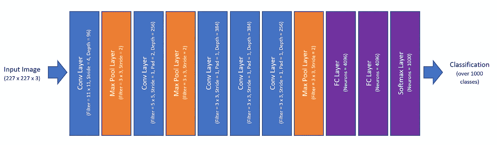

A simplistic view of the AlexNet Architecture, where some details have been omitted

如您所见，AlexNet 只是由以下构件组成:

*   Conv 层(有相关活动)
*   最大池层数
*   FC 层
*   Softmax 层

到目前为止，我们都以这样或那样的方式看到了这些层！正如你所看到的，我们已经涵盖了强大的深度学习模型的构建模块，我们需要做的就是将这些层堆叠在一起。为什么把这么多层堆在一起会起作用，每一层到底在做什么？

我们可以想象一些中间层。这是 AlexNet 的第一个 conv 层的可视化:

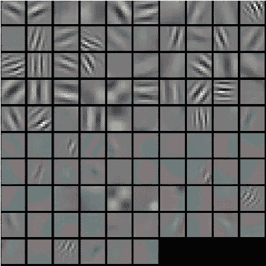

A visualization of the first conv layer in AlexNet. Image taken from CS231N notes: [http://cs231n.github.io/understanding-cnn/](http://cs231n.github.io/understanding-cnn/)

我们可以看到，在前几层，神经网络试图提取出一些底层特征。这些最初的几层然后在随后的几层中结合，形成越来越复杂的特征，最后，找出代表像猫、狗等物体的东西。

为什么神经网络会在第一层中特别挑出那些特征？它只是发现这些是表征前几层的最佳参数；他们只是制造了最小的损失。

**总结** : AlexNet 是一个革命性的深度学习领域的 CNN，由 conv 层、最大池层和 FC 层构建而成。当许多层放在一起时，前面的层学习低级特征，并在后面的层中组合它们用于更复杂的表示。

**综合摘要**:图像是一个三维的特征数组:二维空间中的每个像素包含 0-255(包括 0-255)三个数字，分别对应红、绿、蓝三个通道。通常，图像数据包含大量输入特征。Conv 层是 CNN 中常见的一层，由*滤镜尺寸*、*步距*、*深度*和*填充*定义。Conv 层使用相同的参数，并在图像的不同区域应用相同的神经元，从而减少所需参数的数量。CNN 中的另一个常见层是 max-pooling 层，由*过滤器大小*和*步幅*定义，它通过取其过滤器中数字的最大值来减小空间大小。我们还通常在 CNN 的末尾使用传统的全连接层。AlexNet 是一个革命性的深度学习领域的 CNN，由 conv 层、最大池层和 FC 层构建而成。当许多层放在一起时，前面的层学习低级特征，并在后面的层中组合它们用于更复杂的表示。

**下一步是什么**:深度学习不仅改变了我们看待图像识别的方式，还彻底改变了我们处理语言的方式。但是处理语言本身也有一系列的挑战。我们如何将单词表示为数字？此外，一个句子有不同的长度。在输入可能具有不同长度的情况下，我们如何使用神经网络来处理序列？如果你很好奇，[直觉深度学习第 3 部分](https://medium.com/intuitive-deep-learning/intuitive-deep-learning-part-3-rnns-for-natural-language-processing-4f4b0bcbee80)将神经网络应用于自然语言，解决了学习如何将英语句子翻译成法语句子的问题。

如果您对编写您的第一个图像识别模型感兴趣，这篇文章附带了一个编码伴侣:

 [## 建立你的第一个卷积神经网络来识别图像

### 一步一步的指南，建立自己的图像识别软件与卷积神经网络使用 Keras 上…

medium.com](https://medium.com/intuitive-deep-learning/build-your-first-convolutional-neural-network-to-recognize-images-84b9c78fe0ce) 

这篇帖子最初是作为[直觉深度学习](https://medium.com/intuitive-deep-learning)入门系列的第三篇帖子出现的。我的使命是用纯粹直观的方式解释深度学习概念！如果你是一个非技术初学者，我想为你提供深度学习内部工作原理背后的直觉，让你使用相同的语言和行话与技术工程师交流，即使你不知道背后的数学或代码。如果你是一名深度学习的学生，我相信获得坚实的直觉基础将有助于你更好地理解你正在学习的课程中的所有数学和代码，为你提供一种更少痛苦的方式来学习这些概念。

**关于作者:**

你好，我是[约瑟夫](http://ai.stanford.edu/~josephlee)！我最近从斯坦福大学毕业，在那里我和吴恩达一起在斯坦福机器学习小组工作。我想让深度学习的概念尽可能直观，尽可能容易被每个人理解，这激励了我的出版:[直观的深度学习](https://medium.com/intuitive-deep-learning)。