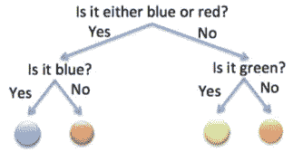
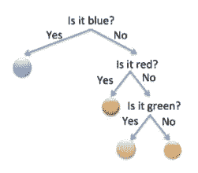
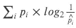
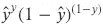
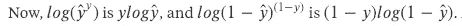
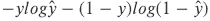
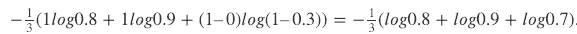

# 交叉熵的直观解释

> 原文：<https://towardsdatascience.com/intuitive-explanation-of-cross-entropy-5d45fc9fd240?source=collection_archive---------7----------------------->

首先，我们需要理解*熵*的概念(很大程度上借用了可汗学院优秀的[解释](https://www.khanacademy.org/computing/computer-science/informationtheory/moderninfotheory/v/information-entropy))。

让我们玩游戏。

## 游戏 1:

我将从一袋硬币中抽出一枚硬币:一枚蓝色硬币、一枚红色硬币、一枚绿色硬币和一枚橙色硬币。你的目标是用最少的问题猜出它是什么颜色。

最好的策略之一是:

每枚硬币有 1/4 的概率被选中，猜对两个问题。所以猜硬币的预期问题数是 2。

## 游戏 2:

现在，我将从一袋硬币中抽出一枚硬币:1/2 是蓝色的，1/4 是红色的，1/8 是绿色的，1/8 是橙色的。以前的策略不再是最好的；因为抽到蓝色硬币的机会很大，所以我们应该优先猜测最有可能的结果。你的最优策略现在看起来像这样:

1/2 的时候是蓝色的，要猜 1 题。1/4 的时候是红色的，要猜 2 题才能猜出来。按这个逻辑，猜一个硬币的期望题数是 1/2 × 1(蓝色)+ 1/4 × 2 题(红色)+1/8 × 3 题(绿色)+ 1/8 × 3 题(橙色)= 1.75。

## 游戏 3:

为了对比一个极端的例子，我从一袋蓝色硬币中抽取。很简单，猜我的硬币的颜色需要 0 个问题。或者… log(1) = 0 问题如果我们用搞笑的方式写的话。注意，只有当你*知道*这是一袋蓝色时，才需要 0 个问题。

有趣的是，出现了一种模式:一个概率为 p 的硬币需要 log (1/p)个问题才能答对。比如 p = 1/4 时，log(4) = 2 题(本帖所有对数均以 2 为基数)。所以总的来说，这个游戏的预期问题数是

。这就是熵的表达式。**直观来看，就是这个博弈的最优策略下猜色的预期题数。** **设定越不确定(游戏 1 >游戏 2 >游戏 3)，熵越高。**

现在，让我们从转移到*交叉熵* **。**

对于第二场比赛，如果我们仍然使用第一场比赛的策略，

然后，1/8 的时候，硬币是橙色的，要做对 2 道题。1/2 的时间，它是蓝色的，但仍然需要 2 个问题才能答对。平均下来，需要 1/8 × 2 + 1/8 × 2 + 1/4 × 2 + 1/2 × 2 = 2 个问题才能答对，而不是用我们之前讨论的最优策略的 1.75。所以在博弈 2 中使用博弈 1 策略是一个更差的策略，2 是在这个设置中使用这个策略的交叉熵。

因此，**给定策略的交叉熵就是在该策略下猜测颜色的预期问题数。对于给定的设置，策略越好，交叉熵越低。**交叉熵最低的是最优策略的交叉熵，也就是上面定义的熵。这就是为什么在机器学习的分类问题中，人们试图最小化交叉熵。

更正式地说，交叉熵是

，其中 p_i 是真实概率(例如，橙色和绿色为 1/8，红色为 1/4，蓝色为 1/2)，而{p_i}是错误假设的概率(例如，使用策略 1，我们假设所有颜色的 p = 1/4)。可能很容易混淆日志中是 p 还是{p}。在这个解释下，就很好记了:log 是用来计算*你*策略下的题数的，所以 log 下面的是*你*的预测概率，\hat{p}。

所以，在决策树中，如果你的树不是以最佳方式构建的，你基本上是错误地假设了结果的概率分布，交叉熵很高。

交叉熵不仅仅是关于决策树；它适用于所有分类问题。在二元分类问题中，标签 y 为 1 的可能性就是你预测的 y，\ hat { y }；y 为 0 的可能性是 1 -\hat{y}。所以我们可以用一种巧妙的方式写出我们想要最大化的可能性:

。当 y 为 1 时，乘积中的第二项为 1，我们希望最大化{ y }；当 y 为 0 时，乘积中的第一项为 1，我们希望最大化 1 — \hat{y}。**这仅在 y 取值为 0 或 1 时有效。**

最大化可能性的对数相当于最小化

这只是交叉熵的表达式。**这就是交叉熵被称为对数损失的原因。最小化交叉熵最大化对数似然。**举个例子，我的分类里有三个数据点，它们的真实标签是 1，1，0，我预测的 y 是 0.8，0.9，0.3。那么平均交叉熵就是

如果我完美预测为 1，1，0，那么交叉熵为 0。(从技术上讲，log 在 0 处没有很好的定义，但是我们可以忽略这个术语。)使用硬币游戏类比，在这里，对于样本 y 的每个预测是具有游戏 3 设置的单独的硬币猜测游戏。第一个样本 y=1 就像从一个只包含“y = 1”的袋子里抽出一枚硬币。现在，如果你是一个忍者猜测者(又名完美算法)，那么你也知道它必须是一个全 1 的包。所以你的\hat{p} = 1。第二个和第三个样本也是如此。因此，对于完美的算法，交叉熵是 0。

*原载于*[*www.quora.com*](https://www.quora.com/Whats-an-intuitive-way-to-think-of-cross-entropy/answer/Lili-Jiang)*。*