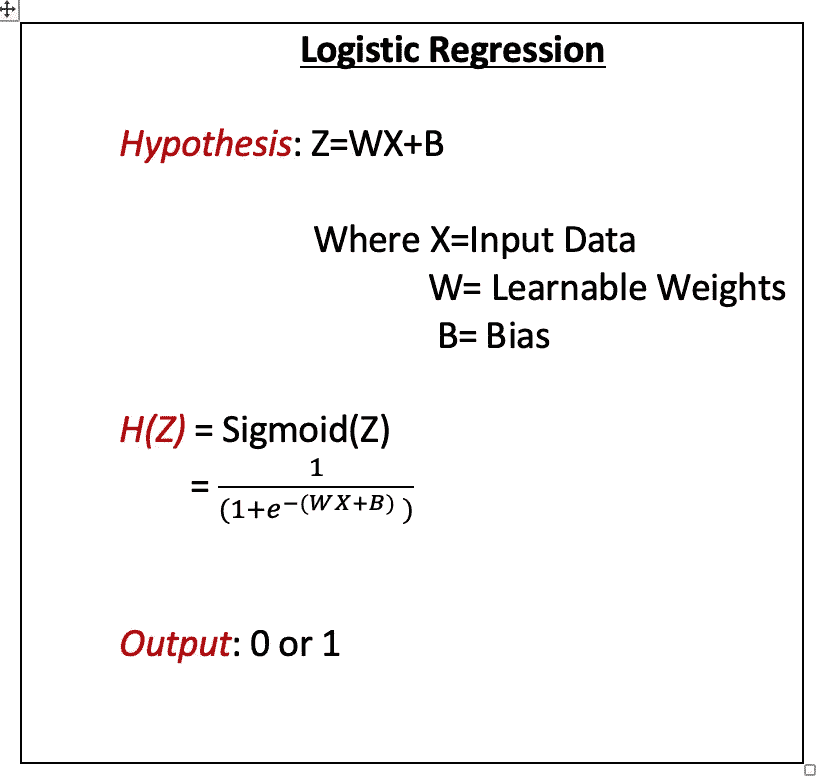
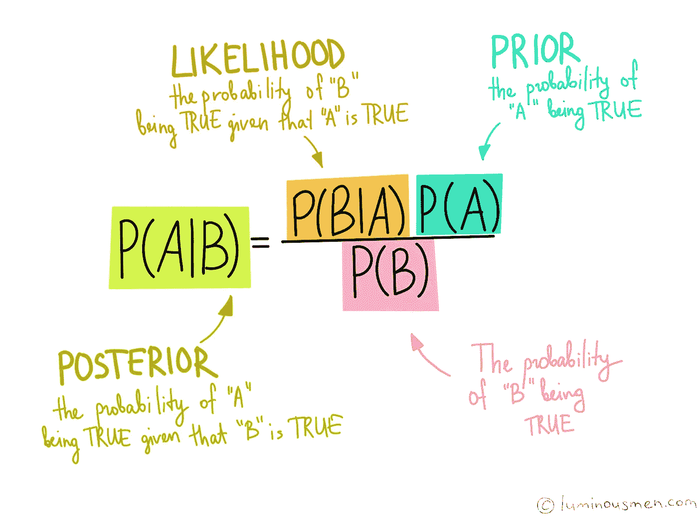

# 直观的超参数优化:网格搜索，随机搜索和贝叶斯搜索！

> 原文：<https://towardsdatascience.com/intuitive-hyperparameter-optimization-grid-search-random-search-and-bayesian-search-2102dbfaf5b?source=collection_archive---------16----------------------->

机器学习算法中的超参数就像煤气炉中的旋钮。就像我们调整煤气炉上的旋钮，直到我们达到正确的设置，让食物按照我们喜欢的方式烹饪。同样，我们调整机器学习算法的超参数，使其工作在最佳水平，并获得我们想要的性能水平。

在我开始讨论超参数优化的搜索算法之前，让我打破一些人们对超参数的常见误解！

> ***误区一:参数和超参数相同***

这种混乱背后的原因是，在机器学习算法中存在两种类型的可学习实体:参数和超参数。参数由模型在学习期间学习，而超参数由用户在学习之前设置。

> **流言终结者警报**
> 
> ***参数:*** 训练时学习到的机器学习模型的实体。
> 
> ***超参数*** :训练开始前设置的机器学习模型的实体。

例如，让我们考虑逻辑回归。逻辑回归是一种分类算法。

上图展示了逻辑回归模型。让我简单解释一下逻辑回归背后的思想。对于任何给定的输入数据 X，我们首先学习 Z=WX+B 形式的线性模型，其中 W 和 B 充当参数。然后我们计算 Z 的 sigmoid，结果是 0 和 1 之间的值。因此，为了决定给定数据点属于哪一类(类 0 或类 1)，我们通常设置阈值(例如阈值=0.5)，这有助于决定类。如果 sigmoid 输出的值大于阈值，则分类任务的输出为 1，即数据点属于类 1，否则属于类 0。诸如 W 和 B 的实体被认为是在给定数据 x 的训练期间学习的参数。而诸如优化算法的类型、正则化技术、α或学习速率、C(用于保持正则化强度的正则化参数的逆，即 C = 1/λ)的实体是超参数的例子。

让我们看看另一个关于超参数优化的常见误区。

> **误区 2** : **使用超参数的默认值就足够了。没有必要试着去调它们。**

超参数的默认值可以被各种机器学习库如 sklearn、Hyperopt 等选为默认值，因为它们对于学术文献中的某些测试问题是足够好的组合。但是，这样的值对于您的问题陈述可能并不理想。永远记住，运用这些价值观，看看什么最适合你。不相信我？开始在数据集上测试这些超参数的不同组合。你会自动看到不同之处！

> **流言终结者警报**
> 
> **默认值**仅针对选定的少数问题陈述进行测试，可能不是您的问题**的最佳超参数选择。所以，总是调整你的超参数！**

现在，我们已经打破了一些关于超参数优化的常见神话。让我来讨论一些最常见的超参数优化技术。即 ***网格搜索*** ， ***随机搜索*** 和 ***贝叶斯搜索*** 。

***网格搜索*** 是一种尝试超参数集所有可能组合的方法。超参数的每个组合代表一个机器学习模型。因此，N 个组合代表 N 个机器学习模型。通过网格搜索，我们确定了表现出最佳性能的模型。这使得网格搜索不仅在时间复杂度上非常昂贵，在空间复杂度上也是如此。

看下图。正则化类型(惩罚)和 C 是逻辑回归的超参数，如下所示。

> **逻辑回归的超参数**
> 
> **正则化类型(或惩罚)=** { l1，l2，None}
> 
> **= { 0.1，1}**

*网格搜索在给定数据上测试这些值的所有组合(所有可能的模型),并通过使用用户指定的评估度量(如准确度、精确度、召回率等)来找到最佳可能的模型。*

> ****组合*** *:**
> 
> **{penalty: l1，C=0.1} == >* 模型 1*
> 
> **{惩罚:l1，C=1}。== >* 型号 2*
> 
> **{惩罚:l2，C=0.1} == >* 模型 3*
> 
> **{penalty: l2，C=1} == >* 模型 4*
> 
> **{罚:无，C=0.1} == >* 模型 5*
> 
> **{惩罚:无，C=1} == >* 模型 6*

*换句话说，网格搜索将一次获取一个惩罚和 C 的组合(一次一个模型),并将其拟合到训练数据(或交叉验证折叠)上，并计算其表现如何。它将对所有可能的(如上所示)组合执行此操作，最终选择表现最佳的模型。请注意，存在更多的逻辑回归超参数，但为了简洁起见，我只选择了其中的两个来演示网格搜索是如何工作的。*

> ***网格搜索:**测试给定机器学习算法的超参数的所有可能排列组合。*

****随机搜索*** 另一方面*、* 是一种我们尝试随机选择超参数组合的方法。这通常在计算上非常便宜，并设法给我们提供足够好的超参数组合，从而实现所需的性能水平。*

*换句话说，随机搜索可能很快从所有可能性中选择惩罚和 C 的随机组合(如上所示),并且只测试那些选择的组合。*

> ***随机搜索**:从可搜索空间中随机选择超参数的组合(所有可能的组合)。*

*随机搜索的唯一问题是，它没有告诉我们如何选择超参数组合。这个过程完全是随机的，没有办法知道是否存在更好的组合。没有办法缩小搜索空间，因为我们实际上不知道在哪里可以找到更好的价值。*

****贝叶斯搜索*** 从另一方面解决了上述问题。这是另一种众所周知的超参数优化方法。顾名思义，该技术基于贝叶斯原理。贝叶斯原理基本上说，后验概率分布与赋予它的先验(先验概率分布)和似然函数成正比。*

**

*Source of Image: [https://luminousmen.com/post/data-science-bayes-theorem](https://luminousmen.com/post/data-science-bayes-theorem)*

*简而言之，先验概率分布可以被视为提供给模型的专家知识，以帮助增加机器学习模型通过查看训练数据掌握的知识。假设事件 A 已经发生，似然函数可以被视为对事件 B 有多可能发生(或为真)的理解。最后但并非最不重要的是，后验概率分布可以被认为是最终的学习模型，它包含专家领域知识并考虑给定输入数据的可能性。*

*因此，贝叶斯优化或贝叶斯搜索考虑了先前已知的知识(先验知识),并且仅搜索那些它认为将提高模型性能的超参数组合。*

> ****贝叶斯搜索*** :基于贝叶斯规则并考虑先前已知的知识，帮助缩小良好超参数组合的搜索空间。*

*贝叶斯搜索通常比随机搜索花费更多时间，但比网格搜索花费更少时间。*

> ***按时间复杂度排序***
> 
> *网格搜索>贝叶斯搜索>随机搜索*

*我希望这篇文章有助于澄清一些关于超参数优化的最常见的疑问。*

*感谢您的阅读！*

*继续学习！*

***资源:***

***sk learn/Scikit learn**:[https://scikit-learn.org/stable/](https://scikit-learn.org/stable/)*

***逻辑回归**:[https://sci kit-learn . org/stable/modules/generated/sk learn . linear _ model。LogisticRegression.html](https://scikit-learn.org/stable/modules/generated/sklearn.linear_model.LogisticRegression.html)*

***远视**:[https://github.com/hyperopt/hyperopt](https://github.com/hyperopt/hyperopt)*

*理解贝叶斯原理的一个很好的来源是:【https://luminousmen.com/post/data-science-bayes-theorem】*