# 对深度学习中注意机制的直观理解

> 原文：<https://towardsdatascience.com/intuitive-understanding-of-attention-mechanism-in-deep-learning-6c9482aecf4f?source=collection_archive---------0----------------------->

## 注意力神经机器翻译的张量流实现

# 警告

这是一个稍微高级的教程，需要对使用 RNNs 的序列到序列模型有基本的理解。请参考我早先的 [*博客这里*](/word-level-english-to-marathi-neural-machine-translation-using-seq2seq-encoder-decoder-lstm-model-1a913f2dc4a7) ，我在其中详细解释了 Seq2Seq 模型的概念。

# 目录

1.  介绍
2.  注意力背后的中心思想
3.  为什么叫注意？
4.  注意力是如何工作的？
5.  代码遍历
6.  可视化结果
7.  参考

# 1.介绍

注意力是深度学习社区中最有影响力的思想之一。尽管这种机制现在用于各种问题，如图像字幕等，但它最初是在使用 Seq2Seq 模型的神经机器翻译的上下文中设计的。在这篇博文中，我将考虑与运行示例相同的问题来说明这个概念。我们将利用注意力来设计一个系统，将一个给定的英语句子翻译成马拉地语，这个例子和我在早先的[博客](/word-level-english-to-marathi-neural-machine-translation-using-seq2seq-encoder-decoder-lstm-model-1a913f2dc4a7)中考虑的完全一样。

那么 seq2seq 车型有什么问题呢？

seq2seq 模型通常由编码器-解码器架构组成，其中编码器处理输入序列，并将信息编码/压缩/汇总到固定长度的上下文向量(也称为“思维向量”)中。这种表示应该是对整个输入序列的一个很好的总结。解码器然后用这个上下文向量初始化，使用它开始产生变换的输出。

这种固定长度上下文向量设计的一个关键且明显的缺点是系统不能记住更长的序列。一旦它处理了整个序列，经常会忘记序列的前面部分。注意力机制就是为了解决这个问题而诞生的。

让我们把它分解成更详细的细节。由于我已经在之前的 [*博客*](/word-level-english-to-marathi-neural-machine-translation-using-seq2seq-encoder-decoder-lstm-model-1a913f2dc4a7) 中解释了理解注意力所需的大部分基本概念，这里我将直接进入问题的实质，不再赘述。

# 2.注意力背后的中心思想

为了便于说明，我将借用我在之前的 [*博客*](/word-level-english-to-marathi-neural-machine-translation-using-seq2seq-encoder-decoder-lstm-model-1a913f2dc4a7) 中用来解释 Seq2Seq 模型的同一个例子。

输入(英语)句子:“拉胡尔是个好孩子”

目标(马拉地语)句子:“राहुल चांगला मुलगा आहे”

唯一的变化将是，而不是 LSTM 层，我用在我以前的解释，这里我将使用 GRU 层。原因是 LSTM 有两种内部状态(隐藏状态和单元状态)，而 GRU 只有一种内部状态(隐藏状态)。这将有助于简化概念和解释。

回想下图，其中我总结了 Seq2Seq 建模的整个过程。

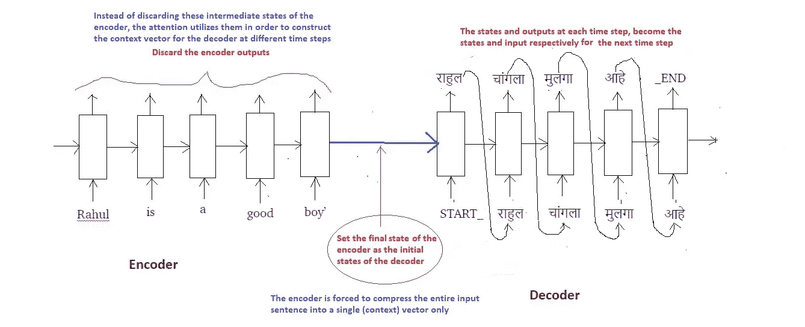

在传统的 Seq2Seq 模型中，我们丢弃编码器的所有中间状态，仅使用其最终状态(向量)来初始化解码器。这种技术适用于较小的序列，但是随着序列长度的增加，单个向量成为瓶颈，很难将长序列总结成单个向量。这种观察是凭经验得出的，因为注意到随着序列大小的增加，系统的性能急剧下降。

注意力背后的中心思想不是丢弃那些中间编码器状态，而是利用所有的状态来构建解码器生成输出序列所需的上下文向量。

# 3.为什么叫注意？

让我们将编码器的每个中间状态命名如下:

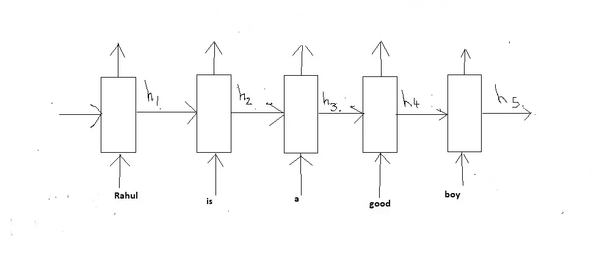

Encoder GRU

请注意，由于我们使用的是 GRU 而不是 LSTM，因此我们在每个时间步只有一个状态，而不是两个状态，这有助于简化图示。还要注意，注意力尤其在较长序列的情况下是有用的，但是为了简单起见，我们将考虑上述相同的示例进行说明。

回想一下，这些状态(h1 到 h5)只不过是固定长度的向量。为了发展一些直觉，把这些状态想象成在序列中存储局部信息的向量。比如说；

h1 存储出现在序列开头的信息(如“Rahul”和“is”)而 h5 存储出现在序列后面部分的信息(如“good”和“boy”)。

让我们用下面的简图来表示我们的编码器 GRU:

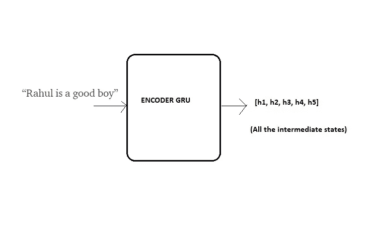

Compact Representation of Encoder GRU

现在的想法是共同利用所有这些局部信息，以便在解码目标句子时决定下一个序列。

想象你正在把“拉胡尔是个好孩子”翻译成“राहुल चांगला मुलगा आहे".”扪心自问，你在脑子里是怎么做到的？

当您预测“राहुल”时，很明显这个名字是单词“Rahul”出现在输入的英语句子中的结果，而不管句子的其余部分。我们说在预测“राहुल”***时，我们更关注*** 输入句子中的单词“Rahul”。

类似地，当预测单词“चांगला”时，我们更关注输入句子中的单词“好”。

类似地，在预测单词“मुलगा”时，我们更关注输入句子中的单词“男孩”。等等..

**由此得名*“立正”。***

作为人类，我们能够很快理解输入序列的不同部分和输出序列的相应部分之间的映射。然而，人工神经网络自动检测这些映射并不是那么简单。

这样注意力机制通过梯度下降和反向传播发展到 ***【学习】*** 这些映射。

# 4.注意力是如何工作的？

让我们从技术角度切入注意力机制的本质。

## 在时间步长 1 解码

继续上面的例子，假设我们现在想要我们的解码器开始预测目标序列的第一个字，即“राहुल”

在时间步骤 1，我们可以将整个过程分为**五个步骤**，如下所示:

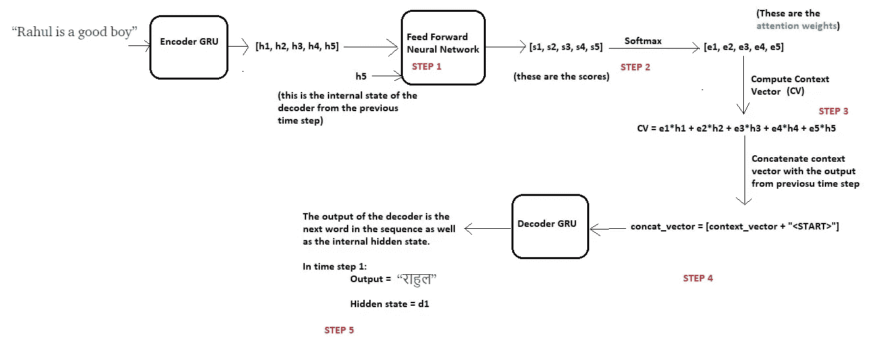

Decoding at time step 1

在开始解码之前，我们首先需要将输入序列编码成一组内部状态(在我们的例子中是 h1、h2、h3、h4 和 h5)。

现在的假设是，输出序列中的下一个字取决于解码器的当前状态(解码器也是 GRU)以及编码器的隐藏状态。因此，在每个时间步，我们考虑这两件事，并遵循以下步骤:

**步骤 1 —计算每个编码器状态的分数**

因为我们预测的是第一个字本身，所以解码器没有任何当前的内部状态。为此，我们将编码器的最后状态(即 h5)视为先前的解码器状态。

现在使用这两个组件(所有编码器状态和解码器的当前状态)，我们将训练一个简单的前馈神经网络。

为什么？

回想一下，我们试图预测目标序列中的第一个单词，即“राहुल".”按照 attention 背后的思想，我们不需要所有的编码器状态来预测这个单词，但是我们需要那些存储关于输入序列中单词“Rahul”的信息的编码器状态。

如前所述，这些中间编码器状态存储输入序列的本地信息。所以很有可能单词“Rahul”的信息会出现在状态中，比如说 h1 和 h2。

因此，我们希望解码器更多地关注状态 h1 和 h2，而较少关注编码器的其余状态。

为此，我们训练一个前馈神经网络，该网络将**学习**以通过为需要注意的状态生成高分而为需要忽略的状态生成低分来识别相关的编码器状态。

设 s1、s2、s3、s4 和 s5 是对应于状态 h1、h2、h3、h4 和 h5 生成的分数。因为我们假设我们需要更多地关注状态 h1 和 h2，而忽略 h3、h4 和 h5，以便预测“राहुल”，所以我们期望上述神经生成分数，使得 s1 和 s2 高，而 s3、s4 和 s5 相对低。

**第二步——计算注意力权重**

一旦生成这些分数，我们就对这些分数应用 softmax，以产生如上所示的注意力权重 e1、e2、e3、e4 和 e5。应用 softmax 的优势如下:

a)所有权重位于 0 和 1 之间，即 0 ≤ e1，e2，e3，e4，e5 ≤ 1

b)所有权重总和为 1，即 e1+e2+3+e4+e5 = 1

因此，我们得到了注意力权重的一个很好的概率解释。

在我们的例子中，我们期望如下的值:(只是出于直觉)

e1 = 0.75，e2 = 0.2，e3 = 0.02，e4 = 0.02，e5 = 0.01

这意味着在预测单词“राहुल”时，解码器需要更多地关注状态 h1 和 h2(因为 e1 和 e2 的值很高)，而忽略状态 h3、h4 和 h5(因为 e3、e4 和 e5 的值很小)。

**步骤 3——计算上下文向量**

一旦我们计算了注意力权重，我们需要计算解码器将使用的上下文向量(思维向量),以便预测序列中的下一个单词。计算如下:

context _ vector = E1 * h1+E2 * H2+E3 * H3+E4 * H4+E5 * H5

显然，如果 e1 和 e2 的值高，而 e3、e4 和 e5 的值低，则上下文向量将包含来自状态 h1 和 h2 的更多信息，以及来自状态 h3、h4 和 h5 的相对较少的信息。

**步骤 4——将上下文向量与先前时间步骤的输出连接起来**

最后，解码器使用以下两个输入向量来生成序列中的下一个字

a)上下文向量

b)从前一时间步生成的输出字。

我们简单地连接这两个向量，并将合并后的向量提供给解码器。**注意，对于第一个时间步，由于没有来自前一个时间步的输出，我们为此使用一个特殊的<开始>标记**。这个概念在我之前的 [*博客*](/word-level-english-to-marathi-neural-machine-translation-using-seq2seq-encoder-decoder-lstm-model-1a913f2dc4a7) 中已经详细讨论过了。

**步骤 5—解码器输出**

然后，解码器生成序列中的下一个字(在这种情况下，预计会生成“राहुल”)，随着输出，解码器还会生成一个内部隐藏状态，我们称之为“d1”。

## 在时间步长 2 解码

现在，为了生成下一个单词“चांगला”,解码器将重复相同的过程，该过程可在下图中总结:

这些变化在**绿色圆圈**中突出显示

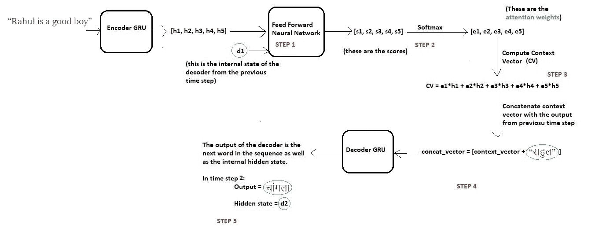

Decoding at time step 2

## 在时间步长 3 解码

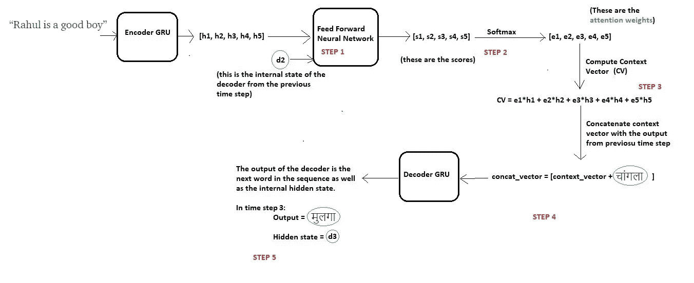

Decoding at time step 3

## 在时间步长 4 解码

Decoding at time step 4

## 在时间步长 5 解码

Decoding at time step 5

一旦解码器输出了<end>令牌，我们就停止生成过程。</end>

注意，与在传统 Seq2Seq 模型的情况下用于所有解码器时间步骤的固定上下文向量不同，在这里，在注意力的情况下，我们通过每次计算注意力权重来为每个时间步骤计算单独的上下文向量。

因此，使用这种机制，我们的模型能够发现输入序列的不同部分和输出序列的相应部分之间的有趣映射。

注意，在网络的训练期间，我们使用教师强制，以便输入实际单词，而不是来自前一时间步的预测单词。这个概念在我之前的 [*博客*](/word-level-english-to-marathi-neural-machine-translation-using-seq2seq-encoder-decoder-lstm-model-1a913f2dc4a7) 中也有解释。

# 5.代码遍历

与任何 NLP 任务一样，在读取输入文件后，我们执行基本的清理和预处理，如下所示:

对于任何给定的词汇表，创建一个类来将每个单词映射到一个索引，反之亦然:

我们使用 tf.data 输入管道来创建数据集，然后以小批量的方式加载它。要阅读更多关于 TensorFlow 中输入管道的信息，请阅读官方文档 [*此处*](https://www.tensorflow.org/guide/datasets) 和 [*此处*](https://www.tensorflow.org/api_docs/python/tf/data/Dataset) 。

现在使用 TensorFlow 的模型子类 API，我们将模型定义如下。要了解更多关于模型子类化的信息，请点击 阅读官方文档 [*。*](https://www.tensorflow.org/guide/keras#model_subclassing)

**注**:请阅读下面代码部分的注释，以便更好地理解我们上面讨论的概念。代码中大多数重要的行都指向上面给出的解释的相应部分。

定义优化器、损失函数和检查点

使用急切执行，我们为 10 个时期训练网络。要阅读更多关于渴望执行的内容，请参考官方文档 [*这里*](https://www.tensorflow.org/guide/eager) 。

推理设置和测试:

# 6.可视化结果

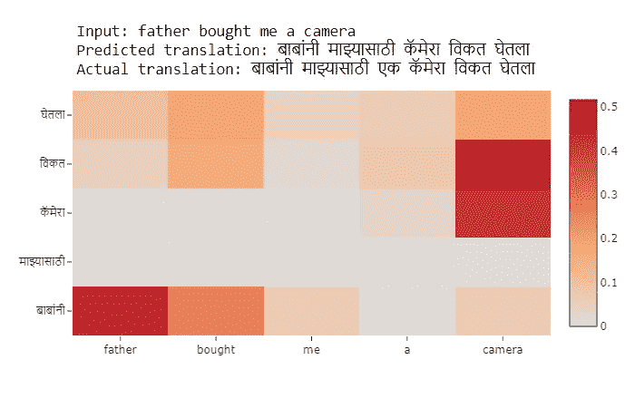

如果你不熟悉热图，你可以这样理解上面的图:

请注意，“父亲”和“बाबांनी”交叉处的单元格非常暗，这意味着当解码器预测单词“बाबांनी”时，它会更多地关注输入单词“父亲”(这正是我们想要的)。

类似地，在预测单词“कॅमेरा”时，解码器非常关注输入单词“照相机”。诸如此类。

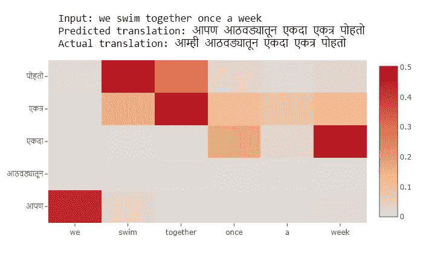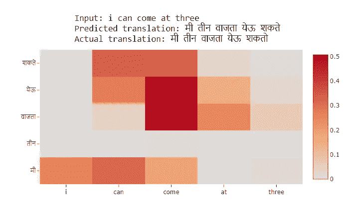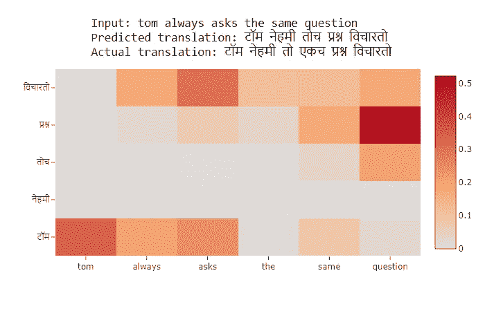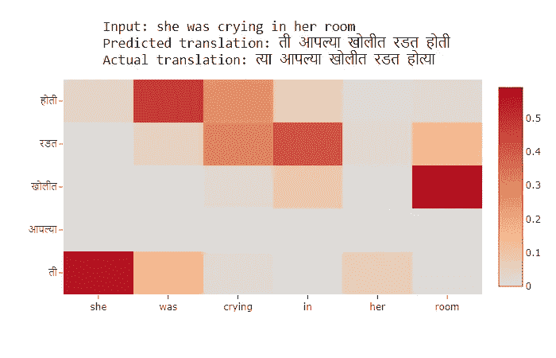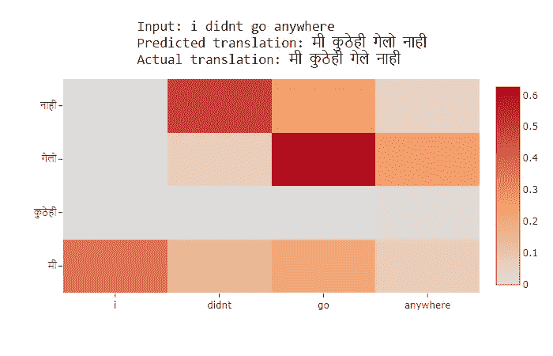

## 结论

首先要注意的是，翻译结果比我之前的 [*博客*](/word-level-english-to-marathi-neural-machine-translation-using-seq2seq-encoder-decoder-lstm-model-1a913f2dc4a7) 要好很多。其次，该模型能够在输入和输出序列之间找到正确的局部映射，这些映射与我们的直觉相匹配。

给定更多的数据和更多的超参数调整，结果和映射肯定会有很大的改进。

使用 LSTM 层代替 GRU 并在编码器上添加双向包装器也将有助于提高性能。

深度学习模型通常被认为是黑盒，这意味着它们不具备解释其输出的能力。然而，注意力是成功的方法之一，它有助于使我们的模型可解释，并解释为什么它会这样做。

注意机制的唯一缺点是非常耗时，并且难以并行化系统。为了解决这个问题，谷歌大脑提出了“变压器模型”，该模型仅使用注意力，并消除了所有卷积和递归层，从而使其高度并行化和计算高效。

# 7.参考

*   [https://arxiv.org/abs/1409.0473](https://arxiv.org/abs/1409.0473)(原文如此)
*   [https://github . com/tensor flow/tensor flow/blob/master/tensor flow/contrib/eager/python/examples/NMT _ with _ attention/NMT _ with _ attention . ipynb](https://github.com/tensorflow/tensorflow/blob/master/tensorflow/contrib/eager/python/examples/nmt_with_attention/nmt_with_attention.ipynb)(tensor flow 实现可在其官网上作为教程使用)
*   [https://www . coursera . org/lecture/NLP-sequence-models/Attention-model-lSwVa](https://www.coursera.org/lecture/nlp-sequence-models/attention-model-lSwVa)(吴恩达关于注意力的解释)
*   [https://jalammar . github . io/visualizing-neural-machine-translation-mechanics-of-seq 2 seq-models-with-attention/](https://jalammar.github.io/visualizing-neural-machine-translation-mechanics-of-seq2seq-models-with-attention/)
*   【https://www.tensorflow.org/xla/broadcasting (tensor flow 中的广播)
*   数据集:【http://www.manythings.org/anki/ (mar-eng . zip)

PS:完整实现，参考我的 GitHub 库 [*这里*](https://github.com/hlamba28/NMT-with-Attention-Mechanism) 。