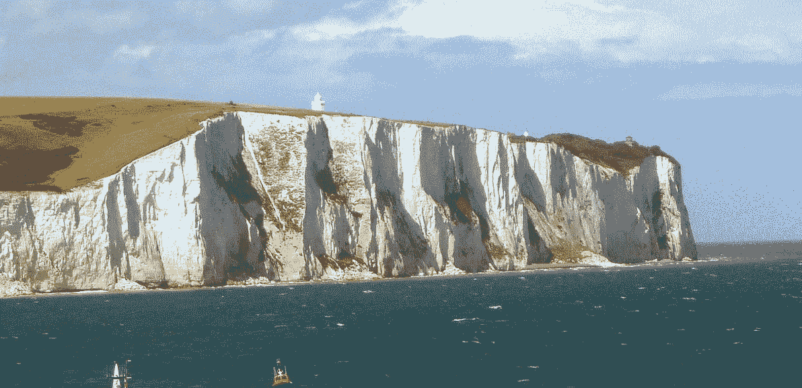
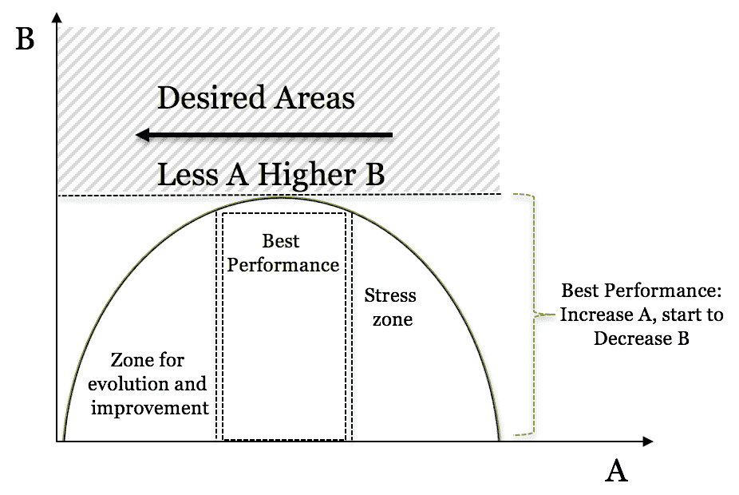
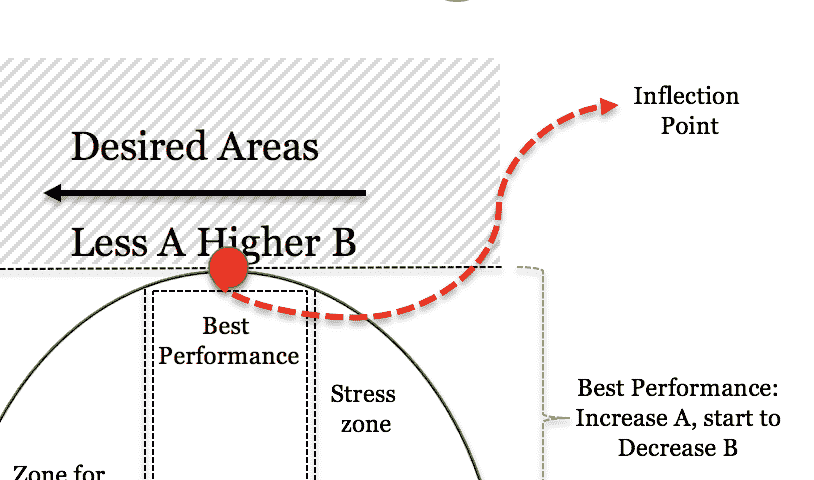

# 倒 U 型和云计算架构:进化也是学生和悬崖的事情！

> 原文：<https://towardsdatascience.com/inverted-u-and-cloud-computing-architectures-evolution-is-also-a-matter-of-students-and-cliffs-b264616fdba8?source=collection_archive---------32----------------------->

source: [https://en.wikipedia.org/wiki/White_Cliffs_of_Dover](https://en.wikipedia.org/wiki/White_Cliffs_of_Dover)

首先，什么是倒 U 型？

倒 U 形是一种图形，用于探索经济、社会和其他类型的事件，该图形由一条钟形线组成，可用于表示一个值(A)的增加将导致另一个值(B)增加的情况。

然而，在倒 U 型的情况下，当你增加 A 的比例没有增加 B 的时候，它实际上开始减少 A。

在这种情况下，当数量 A 开始降低 B 的值时，可以获得最佳性能。最佳结果是使用较低水平的 A 获得较高水平的 B。

让我们举个例子，[马尔科姆·格拉德威尔](https://www.newyorker.com/contributors/malcolm-gladwell)，在他最近的书[ [大卫和歌利亚](https://www.amazon.com/David-Goliath-Underdogs-Misfits-Battling/dp/0316204374) ]中探索了一个有趣的观点。

> 一个班有很多学生好还是只有几个学生好？

嗯，与常识所说的不同[我的教授会说越少越好]，有一点你可以取得更好的结果，这与班级的大小直接相关，如果你只有几个学生，比如说少于 12 个，班级太小，老师不会有在课堂上如此重要的多样化的观点[仅举一个例子]，但是， 假设你有超过 50 个，那么，你会有很多不同的意见，但老师会缺乏对具体案例的关注。

在这种情况下，很明显，如果你开始增加一个班级的学生人数，参与度，注意力或其他参数也会增加，至少直到班级过大的某一点，结果是相反的，你开始失去一些东西。格拉德威尔描绘了其他几个场景，这是一本值得一读的书。

> 这和云计算有什么关系？

我就要到了伙计[冷静！]，我们先找一个计算机科学中的倒 U 型场景，好吗？

嗯，你们都听说过线程吧？[如果你不记得了，看看这个[视频](https://www.youtube.com/watch?v=O3EyzlZxx3g)。

图像有大量数据要处理，但只有一个线程来处理，假设这个处理过程需要 100 分钟才能完成，如果线程数量增加一倍，处理时间将减少到 50 分钟。如果您启动第三个线程，处理时间也将减少，让我们到 37 分钟，使用第四个线程，处理时间将减少到 30 分钟，您可以看到**时间的减少与线程数量有直接关系吗？**【当然可以！].

常见的错误是假设“*好的，那么…我将增加到 1000 个线程，时间将接近 0[零]！*”。**不是这样的**，有一个极限，在某个时刻，无论你增加多少线程数，时间都不会减少，最有可能的是会增加

> **“好的，那么你是说没有办法把时间减少到接近 0[zero]？!"**

不，我不是那个意思！

我要说的是，你遇到了一个倒 U 型情景，为了打破拐点，无论你增加多少其他变量，你都开始失去一些东西，这就需要适应和改变你的方法，类似于我们在这里解释的，这正是云计算的用武之地。

就云而言，我们假设**轴 B** ，是性能、请求数量、数据量，以及与您的解决方案相关的东西。**轴 A** 是你使用多少服务来做这件事。如果您开始增加虚拟机的数量(在 AWS、EC2 机器的情况下),您的**轴 B** 也会增加，直到几乎无法管理数千台机器。然后你决定拿出一些机器，使用带有冗余、副本和其他东西的数据库服务( [RDS](https://aws.amazon.com/pt/rds/) )。现在你的 DB，会继续上升[耶！！】，但是【没有但是，加油！]，没有更大的数据库可以使用，它变得太慢太贵，解决方案是添加不同类型的存储，非 SQL 数据库( [Dynamo](https://aws.amazon.com/dynamodb/) )和对象存储(像 [S3](https://aws.amazon.com/s3/) )。

> 你能看出这将把我们引向何方吗？

你已经从几个服务[服务器]开始，你必须进化以避开倒 U 形图形的拐点，在云计算的情况下，你必须进化你的架构，以便进化你的应用。只有通过改变，而不仅仅是增加 a，才有可能达到更高的 B。

这就像爬悬崖一样，你从海滩开始，你走了一点点，突然你开始向山上走，然后再走几米[ **也许几公里** ]后，你仍然在向上走，你对海洋的看法越来越好，在某个时候你意识到这是线的尽头，你会继续走下去，掉到海里吗？还是需要适应，坐直升机，继续旅程？我打赌直升机听起来不错，对吧？！