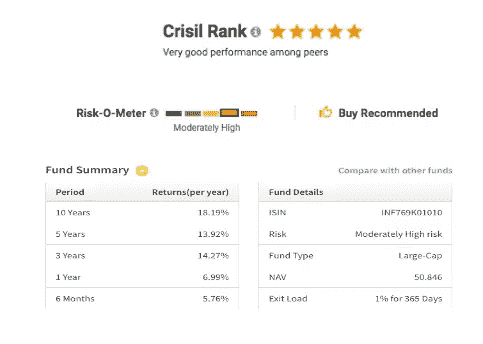
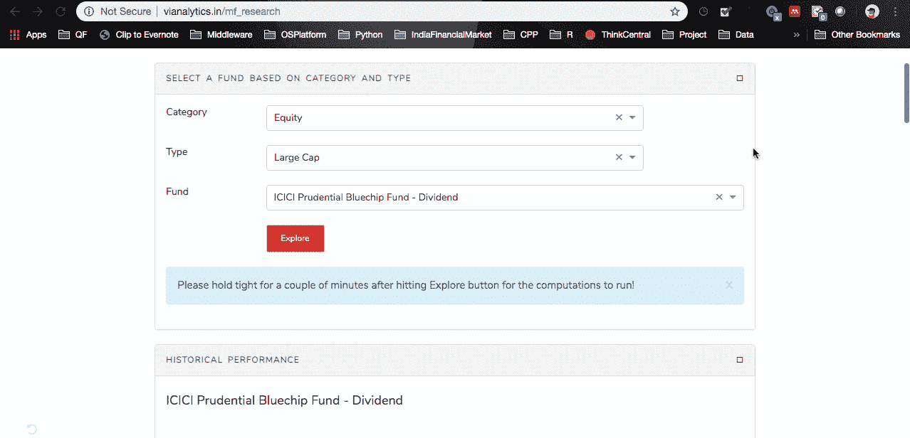
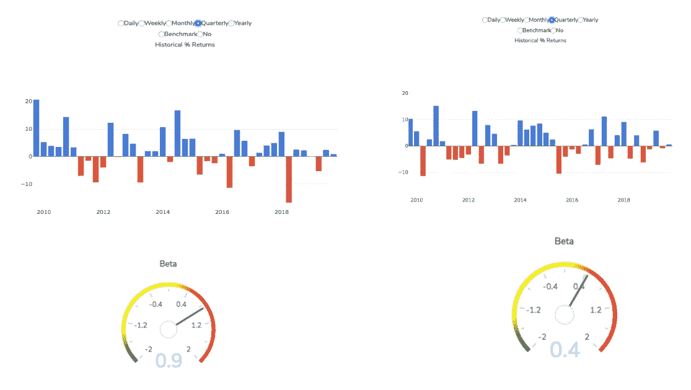
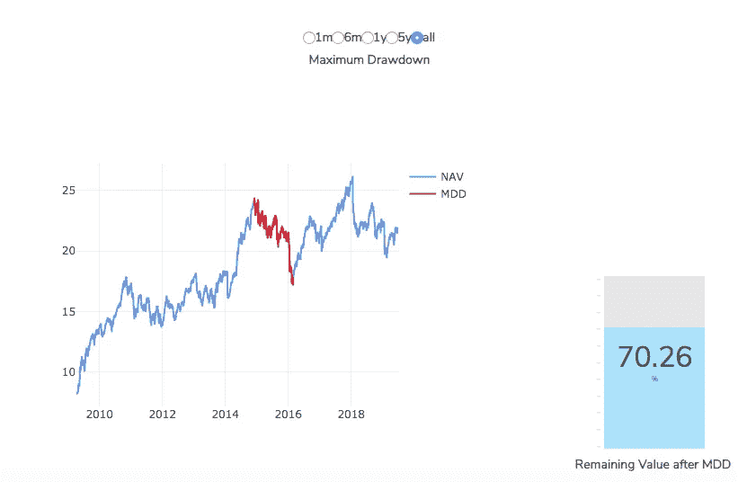
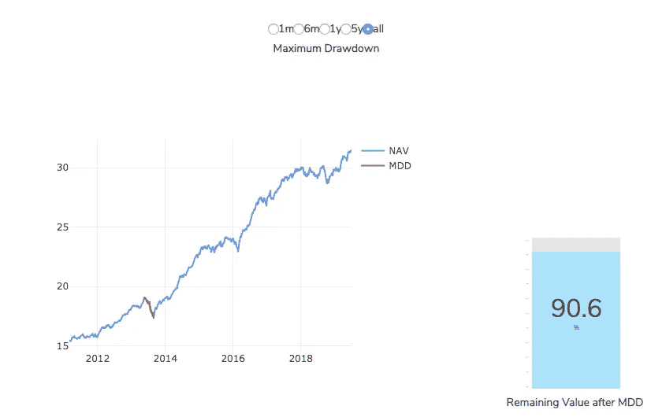
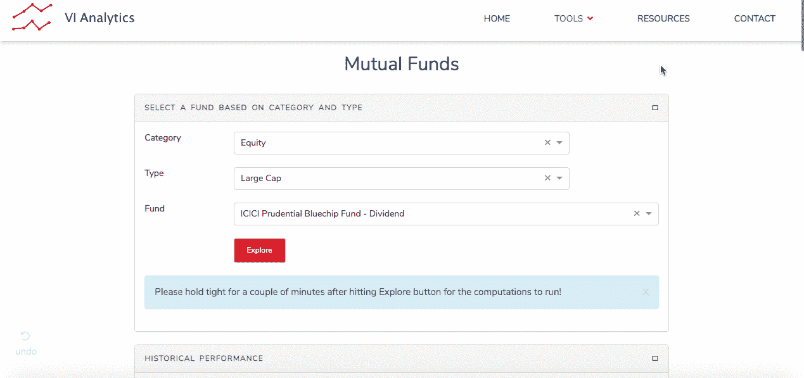
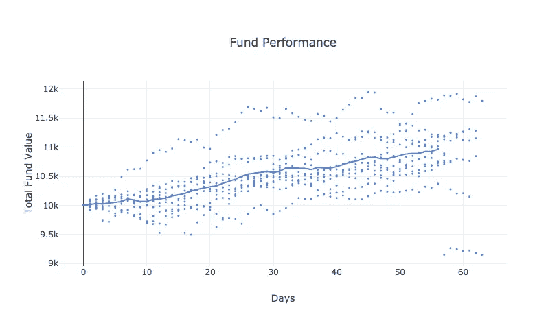
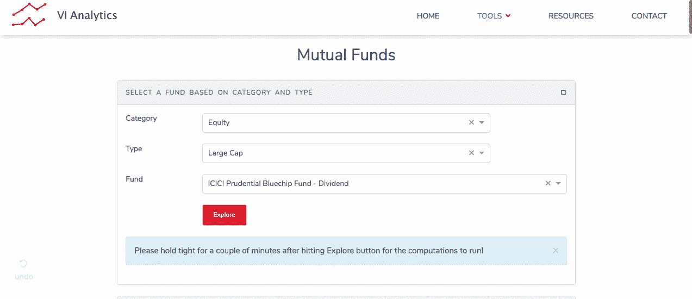
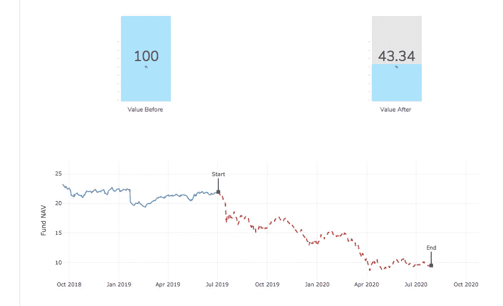

# 睁大眼睛，满怀信心地投资

> 原文：<https://towardsdatascience.com/invest-with-confidence-with-your-eyes-wide-open-1b5f0d846922?source=collection_archive---------29----------------------->

## 知道自己的风险。在做出投资决定之前，一种有意义的看待风险的方式。

当一个人在寻找共同基金或股票进行投资时，通常会看到评级、风险规模、绩效汇总统计数据，如下所示。

Taken from some popular Investment Portals

当试图比较不同的选择时，获得这种相对评级是非常好的。像“n”年的回报这样的汇总指标告诉我们一只基金在最近几年的表现如何，以及如果事情以同样的方式继续下去，人们可能期望获得什么样的回报。

但是，对于那些多年来一直关注金融市场和投资表现的人来说，很明显，事情很少以同样的方式继续下去！想想主要的市场变动事件或商业周期变化——衰退、繁荣期、政治变化、贸易战、真正的战争……你明白了！

考虑到所有这一切，人们可能想要以下问题的答案:

1.  如果明年市场经历长期低迷，我会损失多少？

2.如果我在这次衰退中继续投资，需要多长时间才能收回我的损失？

3.如果像 [2008 年次贷危机](https://en.wikipedia.org/wiki/Subprime_mortgage_crisis)这样的事件现在再次重演会怎样？与正在进行的[银行业](https://www.thehindu.com/opinion/lead/resolving-indias-banking-crisis/article27097047.ece)和 [NBFC 危机(及其对汽车行业可能的传染效应)](https://auto.ndtv.com/news/car-sales-june-2019-sales-of-passenger-vehicles-down-by-17-54-2067327)有一些相似之处，因为它与资产质量有关。我的投资会下跌 20%还是 50%?

4.如果[美联储可能宣布降息](https://www.business-standard.com/article/markets/markets-rebound-as-us-fed-signals-interest-rate-cut-sensex-rises-266-pts-119071101548_1.html)，会对我的投资有帮助吗？如果是，增加多少？

5.从短期来看，市场一周的糟糕表现会导致 2%或 10%的账面损失吗？我会因为这些动作失眠吗？

在本文的其余部分，让我们回顾一下看待风险的一种不同但有意义的方式，以及我们如何回答这些实际问题。

为[印度共同基金](http://vianalytics.in/mf_research)和[印度股票](http://vianalytics.in/stock_research)提供了直观的分析驱动工具。例如，请参见下图

# 短期的紧张

为了评估典型的周/月/季度表现，资产的历史回报分布可能非常有帮助。它们不仅帮助我们衡量预期的范围，还显示了真正糟糕的一周会是什么样子，以及这样的一周有多频繁。

下面让我们一起比较一下两只股票型共同基金的表现。如果我们仔细观察，左边的基金波动性更大，相对于右边的基金，它经历了更明显的季度收益和下跌。更高的 beta(对整体市场的敏感度)进一步验证了这一点。

因此，在其中一个季度，左侧基金在 2018 年经历了远超 16%的跌幅。对于上述提出的问题，如果有人选择了左侧基金，他们必须准备好忍受如此动荡的季度。

# 长期的市场萧条

经济衰退和市场低迷是投资金融市场不可避免的现实。最大提取额(MDD)是分析基金在此期间损失多少的好方法。

不同的资产类别经历不同程度的损失。因此，根据基金的构成，他们的 MDD 可能会有很大的不同。

上述基金在 2014 年 11 月至 2016 年 2 月期间经历了约 30%的提款。达到底部大约需要 1.5 年，再次回到同样的水平又需要 1.5 年。总的来说，大概花了 3 年时间才扯平。

其他一些市场低迷持续的时间比这更长。更接近 7-8 年。我想起了奥马哈先知沃伦·巴菲特关于长期投资的名言——*“只买那些如果市场关闭 10 年你也会非常乐意持有的东西”。*

如果一个人的投资时间范围不允许这么长的时间，一个更平衡的基金将是一个更好的选择。低于基金，经历了仅 10%的最大下降，甚至在短时间内恢复。

# 伪预测

现在，让我们进入一些假设，好吗？

比方说，如果我们决定在一只基金中投资 X 元。然后，我们忘记它，继续我们的主要业务。然后，我们会听到这样的新闻标题——油价在过去两个月上涨了 20%,或者印度市场指数 Sensex 在上个季度下跌了 10%。

这可能会促使我们去检查我们投资的现值，并想知道它的表现如何。如果我们能在决定购买之前提前分析这种情况会怎么样？

上图是针对 Sensex 指数在未来 3 个月上涨约 8.9%的情景。

使用历史数据、数学模拟和概率，我们可以估计初始投资为 10，000 卢比，最终在 9，300 卢比和 12，000 卢比之间，3 个月后的价值可能接近 10，960 卢比(上图中的天数是指交易日，不是日历日)。

# 一切都失控了！

继续假设，金融市场也有黑暗的一面。如果类似于 2007-2008 年美国次贷危机及其随后的全球蔓延现在突然发生，会怎样？

对印度市场而言，正在发生的 NBFC 违约及其基础资产质量问题似乎有些类似，但规模要小得多。

以“ICICI 保诚蓝筹基金-股息”为例，如果现在发生类似 2008 年全球市场崩盘的情况，其资产净值在未来一年内可能会降至 9.5(约为其当前价值的 43%)。

一种担忧可能是，如果在这样一场历史危机中，该基金从未存在过，那么如果这样的事件(或类似事件)现在发生，我们如何评估它的表现？事实上，上面的例子基金是 2009 年 4 月才开始的。

用于得出上述分析的方法允许我们为这种场景(压力事件)精确建模。适用于印度市场的[四因素模型](http://faculty.iima.ac.in/~iffm/Indian-Fama-French-Momentum/four-factors-India-90s-onwards-IIM-WP-Version.pdf)用于确定基金业绩对模型因素的敏感度。为基金生成的回归模型用于预测历史事件，即使该基金当时从未真正存在过。

# 包裹

果然，看待金融投资风险有多种方式。不同的性格和生活环境认为一种方式比其他方式更重要。但是，在我们睁大眼睛面对风险的情况下做出的投资决策应该会减轻很多焦虑和压力。

***来自《走向数据科学》编辑的提示:*** *虽然我们允许独立作者根据我们的* [*规则和指导方针*](/questions-96667b06af5) *发表文章，但我们不认可每个作者的贡献。你不应该在没有寻求专业建议的情况下依赖一个作者的作品。详见我们的* [*读者术语*](/readers-terms-b5d780a700a4) *。*