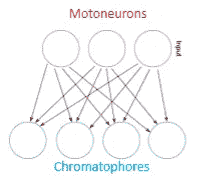

# 基于 ICA 和层次聚类的章鱼伪装研究

> 原文：<https://towardsdatascience.com/investigating-octopus-camouflage-with-ica-and-hierarchical-clustering-df0e9a4ffaf4?source=collection_archive---------18----------------------->

## 神经科学家如何用机器学习算法研究这种惊人的技能

头足类动物(章鱼、鱿鱼、乌贼)在**伪装**的技术上是天生的大师:它们可以在几秒钟内改变皮肤的颜色，以适应周围的环境，并完全消失在背景中。如果你从未看过这个，我邀请你花 5 分钟来欣赏这个 [Ted 演讲](https://www.ted.com/talks/david_gallo_shows_underwater_astonishments)。如果你真的赶时间，可以直接跳到最后一分钟，欣赏章鱼的以下表现:

Hey there (from David Gallo’s [Ted talk](https://www.ted.com/talks/david_gallo_shows_underwater_astonishments), at 4:19)

这种能力几十年来一直困扰着科学家和机器学习专家(没有必要坚持这种机制如果成功复制可能会对许多行业产生的结果……)。计算机视觉科学家目前需要在数千次试验中训练神经元网络，然后才能提取复制背景环境所需的特征。但是**头足类动物有能力在几秒钟内完成这个动作**。

A cuttlefish

出于这个原因，德国的一组神经科学家，在 Gilles Laurent 博士的带领下，对乌贼的伪装行为进行了录像研究。这篇文章描述了他们的一个发现。

*(原文可以在这里找到***但是需要订阅《自然》杂志才能免费阅读...想了解更多信息，你还可以观看科学家们在* [*这个视频*](https://www.youtube.com/watch?v=iC3lUzDeM0Y) *中讲述他们的工作。)**

*首先，一点生物学知识:头足类动物的皮肤怎么会变色？他们的皮肤一点也不像我们的皮肤。它们的皮肤表面覆盖着充满色素的小“袋子”，这些小“袋子”被称为 [**色素细胞**](https://en.wikipedia.org/wiki/Chromatophore) 。视内部的色素而定，色素细胞可以有不同的颜色。简单来说，一般有两种:深色的和浅色的(黄色的)。*

**

*a) Zoom on an adorable squid’s skin, with dark and light chromatophores. b) Muscle contraction streches the chromatophores and the pigment expands. Figure adapted from this [paper](https://www.nature.com/articles/ncomms5899) in Nature Communications.*

*诀窍在于**这些色素细胞的大小是由动物**控制的！每个袋子都由几块肌肉环绕着:如果肌肉放松，袋子就会变小。但是如果动物收缩这些肌肉，袋子就会膨胀，色素就会扩散。这些肌肉由一些被称为“运动神经元”的神经元控制。这项研究的全部目标是调查神经元，即使是间接的！*

*为了更好地理解伪装技巧，科学家们认为他们必须非常注意这些色素细胞的大小。因此，他们设计了一个分析管道，在动物皮肤上追踪它们。*

*开发一个工具箱来跟踪成千上万的色素细胞并提取它们的大小当动物在水箱中移动时，这本身就是一个巨大的成就。然而，我选择在这篇文章中关注另一个结果。因此，我邀请你快速浏览一下我的第一篇帖子[这里](/how-neuroscientists-analyze-data-from-transparent-fish-brains-part-1-pre-processing-63a09436ea93)，它描述了另一个例子(检测神经元并从一个透明的鱼大脑视频中提取它们的活动)的预处理管道的原理。我将其简单总结为 3 个步骤:*

1.  *首先，来自乌贼皮肤的每个图像被对齐(旋转或平移)以匹配参考图像的方向。*
2.  *然后，定位色素细胞。*
3.  *最后，提取每个色素细胞内的像素数量。*

**

*The (simplified) analysis pipeline to monitor the size of thousands of chromatophores in time. Have a look at [this post](/how-neuroscientists-analyze-data-from-transparent-fish-brains-part-1-pre-processing-63a09436ea93) for more detailed explanations. Image modified from Fig1 in the [original publication](https://www.nature.com/articles/s41586-018-0591-3).*

*这个预处理步骤从乌贼图像中创建了一个**可利用的数据集**:一个矩阵【色素细胞 x 时间】，其中每个元素是一个时间点上一个色素细胞的大小。然后，机器学习算法可以很容易地应用于深入了解这些成千上万个充满颜料的袋子的行为。*

**(例如，主成分分析可用于将该数据集的维度从几千个减少到 3 个，以便在 3D 中绘制该系统的时间演变。这将在另一篇文章中描述:“神经科学中的 PCA 和 tSNE:可视化的降维”)**

*让我们关注主要目标:通过研究色素细胞大小的进化，神经科学家实际上想评估控制肌肉的**运动神经元**的活动。尺寸只是一个间接的测量。然而，事情并非如此简单(总是在研究中)，因为人们很快意识到:*

**

1.  *一个运动神经元可以控制几个色素细胞。*
2.  *一个色素细胞可以由几个神经元控制。*

*这需要首先解决。这里的问题是**在不知道源信号或混合过程的情况下，从混合信号(色素细胞活性)**中推断源信号的值(运动神经元活性)。这是[盲源分离](https://en.wikipedia.org/wiki/Blind_signal_separation)的一种情况，在这种情况下使用的好算法是 ICA : [独立分量分析](https://en.wikipedia.org/wiki/Independent_component_analysis)。ICA 的假设如下:*

1.  *源信号在统计上是独立的*
2.  *源信号是非高斯的*

*根据[中心极限定理](https://en.wikipedia.org/wiki/Central_limit_theorem)、**如果源信号是独立的(hyp1)，那么它们的混合将趋向于高斯分布**，即使源信号本身不是高斯*(在维基百科页面* [*这里*](https://commons.wikimedia.org/w/index.php?curid=60066898) *)* 很好的图解了这个定理。如果加上假设 2，这意味着**混合信号的分布将总是比源信号的分布更加高斯**。目标是找到一个新的空间，使分布尽可能远离高斯分布，如下图所示:*

**

*If the source signals are independent and non-gaussian : a) the ICA algorithm can recover them from the mixed signals. Adapted from an image found [here](https://www.researchgate.net/figure/Illustration-of-Independent-Component-Analysis-ICA-using-the-popular-cocktail-party_fig1_326199223). and b) a new space can be found where the distributions are as far away from gaussian as possible. Adapted from images found [here](http://arnauddelorme.com/ica_for_dummies/).*

*实现 ICA 的方法有很多种，因此，在这篇文章中，我更愿意把直觉留给你，并邀请你查阅我们在 web 上可以找到的许多资源*(比如来自法国神经科学家的这个* [*网站*](http://arnauddelorme.com/ica_for_dummies/) *或者来自赫尔辛基大学的这个* [*网站*](https://www.cs.helsinki.fi/u/ahyvarin/whatisica.shtml)*)。**

**让我们回到我们的乌贼:**根据色素细胞的活动，ICA 允许我们评估运动神经元的活动**。Hyp 2 很容易满足，因为我们在生物学中记录的大多数东西都没有高斯分布。但是 Hyp1 有点棘手:我们不能假设每个运动神经元都是相互独立的，但是我们可以接受 ICA 将几个不独立的运动神经元组合在一起)。因此，色素细胞将被归入“运动元件”: **同一“运动元件”中的所有色素细胞基本上由同一运动神经元** *(或运动神经元群)*控制。**

****

**Reprinted by permission from Springer Nature : Nature, Elucidating the control and development of skin patterning in cuttlefish, Reiter et al (2018), License nb 4486000735048.**

**结果可以用这个图来说明(来自原始出版物):红色圆圈内的色素细胞被发现由同一个运动神经元控制(我们可以注意到它们都是黑色的)，蓝色圆圈内的由另一个控制(它们都是黄色的，除了一个)。第一个定义是，一个运动神经元本质上控制**几个相同颜色的色素细胞**！左边的痕迹代表每个色素细胞在时间上的大小，我们称之为“活动”。**在同一个运动元素内，活动看起来是同步的**。然后使用平均活动来表征运动元素。**

**基于这一结果，科学家们使用**层次聚类将具有相似活动** *的运动元素分组在一起(一个运动元素=一组代表一个运动神经元的色素细胞。)*。在另一篇“迈向数据科学”的文章中已经很好地描述了分层聚类，我邀请您在这里 阅读 [*。(你也可以观看*](/the-5-clustering-algorithms-data-scientists-need-to-know-a36d136ef68) *[*这段视频*](https://www.youtube.com/watch?v=7xHsRkOdVwo) 来了解在生物学中如何使用等级聚类来对具有相似表达的基因进行分组。)***

*简而言之，**该算法计算每个运动元素之间的相似性，并创建一个** [**树状图**](https://en.wikipedia.org/wiki/Dendrogram) 。然后，选择一个阈值，该阈值将创建聚类。在这里，研究人员使用“相关距离”作为相似性度量: *d = 1 — r* (r 为相关系数)。*

*   *如果 2 个电机元件完全相关，r = 1，d = 0。它们之间的距离为零:它们在空间上非常接近，因为它们是相似的。*
*   *如果没有相关性，r = 0，d = 1。它们之间的距离增加了。*
*   *如果两个运动元素是反相关的，r = -1，d = 2。*

*结果可以在下图中看到:左上方是一张乌贼皮的照片。我们将重点关注由矩形界定的白色斑块。*

**

*Reprinted by permission from Springer Nature : Nature, Elucidating the control and development of skin patterning in cuttlefish, Reiter et al (2018), License nb 4486000735048.*

*右上方的图像显示了由 ICA 确定的在运动元素中分组的**色素细胞，它们在彩色圆圈中，空的或填充的。这对应于阈值为 **d = 0** (最大相关性 r = 1)的分层聚类。如果阈值取在 **d = 0.4** (绿色箭头，下图)左右，我们可以看到一些运动元素被分组在十几个簇中。如果在 **d = 2** 附近取阈值(红色箭头，中间图片)，我们可以清楚地看到 **2 个反相关的簇**:白色斑块和黑色边缘。***

*这表明*

*   *黑色和黄色的色素细胞由不同的运动神经元控制。*
*   *这些运动神经元的活动在时间上是反相关的。*

*这是有道理的:**如果动物想要在黑暗的背景中消失，黑色的色素细胞需要扩散，而黄色的需要收缩**。所以“黑色控制”的运动神经元会发出收缩肌肉的信息，而“黄色控制”的运动神经元会保持沉默。(如果你对肌肉收缩背后的生理学感到好奇，你可以看看[这个视频](https://www.youtube.com/watch?v=uJTdx1GbEqU)来了解一下)。*

*当然，如果动物想要匹配浅色背景，反之亦然，如下图所示:*

**

*总之，利用独立分量分析和层次聚类，科学家们能够描述头足类动物如何在背景中伪装。这很鼓舞人心！*

**本研究由* [*萨姆·赖特*](https://www.nature.com/articles/s41586-018-0591-3#auth-1)*[*菲利普·胡斯敦*](https://www.nature.com/articles/s41586-018-0591-3#auth-2)*[*西奥多西娅·吴*](https://www.nature.com/articles/s41586-018-0591-3#auth-3)*[*马塞尔·劳特巴赫*](https://www.nature.com/articles/s41586-018-0591-3#auth-4)*[*杰西卡·s·埃伯勒*](https://www.nature.com/articles/s41586-018-0591-3#auth-5) [*雅各布·迈耶-克雷多*](https://www.nature.com/articles/s41586-018-0591-3#auth-8) *，* [*弗里德里希·克雷奇默*](https://www.nature.com/articles/s41586-018-0591-3#auth-9) *，* [*朱利安·朗格*](https://www.nature.com/articles/s41586-018-0591-3#auth-10) *，* [*马蒂亚斯·卡舒贝*](https://www.nature.com/articles/s41586-018-0591-3#auth-11) *在*的监督下 所有数字均经 Springer Nature 许可复制，许可证号 nb 4486000735048，来自原始出版物“阐明乌贼皮肤图案的控制和发展”，Nature，Reiter 等人(2018)。*****