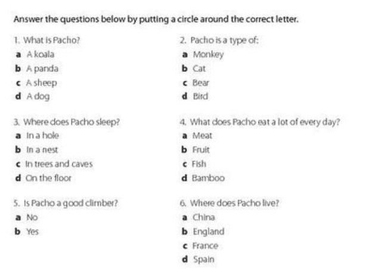
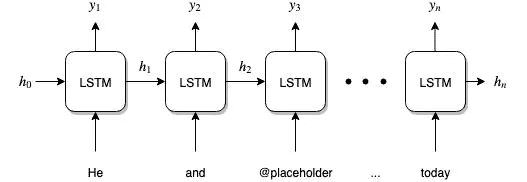
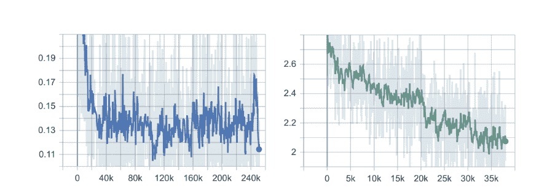
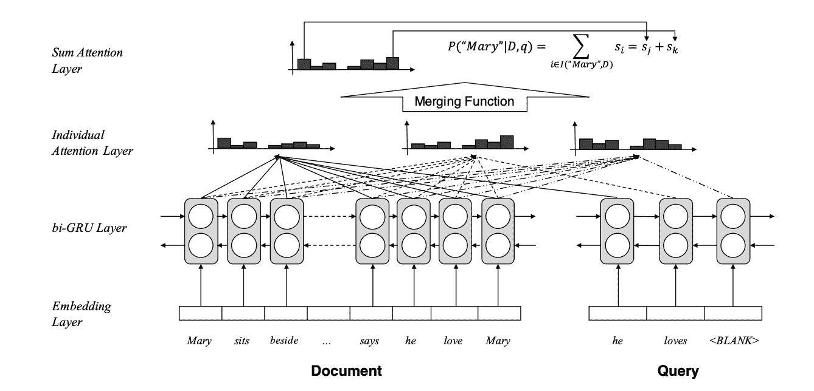
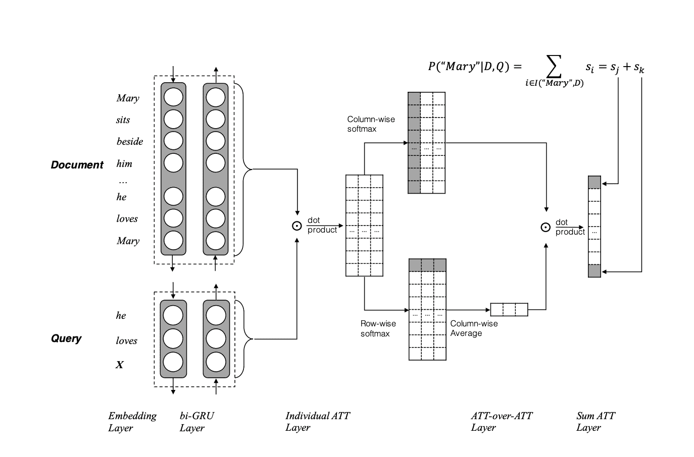

# 用深度学习研究机器阅读理解问题

> 原文：<https://towardsdatascience.com/investigating-the-machine-reading-comprehension-problem-with-deep-learning-af850dbec4c0?source=collection_archive---------6----------------------->

## 教机器如何做标准化的类似考试的阅读题。

*这个项目和文章是由* [*约纳曼*](https://www.linkedin.com/in/yonah-mann/)*[*罗汉梅内塞斯*](https://www.linkedin.com/in/rohan-menezes-91a138108/) *和我共同完成的。**

**

*仔细想想，阅读理解是人类思维的奇迹。我们可以拿一段文字，在几乎没有上下文的情况下，深入理解文字的目的，甚至推断出文字中没有的事实，这真的很难，也令人印象深刻。在人工智能和机器学习的世界里，研究人员花费了数年甚至数十年的时间试图教会机器阅读和理解。在过去的几周里，我们的团队致力于解决“阅读理解难题”中的一小部分。*

# *这个任务是如何建模的？*

*为了有效地测量机器“理解文本”的程度，让我们回想一下人类是如何测试他们的理解能力的:通过标准化的阅读考试！*

*还记得这些看起来无害，但是非常难的考试题目吗？*

**

*A reading comprehension worksheet.*

*好吧，这些问题看起来很简单。但是，情况并不总是这样！任何参加过更高水平标准化考试的人都知道，阅读理解题会变得很难。现在，我们将重点转向“填空”式问题:给一台机器一篇阅读文章，以及一个多项选择填空问题，它所要做的就是选择最能填补空白的正确选项！听起来很简单，对吧？*

*事实证明，这个问题对机器来说很难学习。我们称这种“填空”式的问题为**完形填空式**阅读理解任务。这里面临着许多困难:*

*   *首先，机器必须首先学习语言的结构和意义。不像人类那样，已经熟悉单词在句子中是如何组合在一起的，并且能够“理解”一个单词背后的真正含义，机器需要以某种方式被教会这一点。*
*   *第二，在文章中寻找问题的答案可能并不明显。一个人可能会花很长时间在一段文字中寻找答案，而答案可能就在那一页上。对于机器来说，甚至更难；因为语言是高度灵活的，你要找的一系列单词可能不会在文章中逐字出现。*

*阅读理解如此困难，没有单一的方法可以让机器来解决这个问题。那么，现在我们该怎么办？*

# *再补充一点……机器学习！*

*为什么我们不利用机器学习的力量来帮助我们解决这个问题呢？*

*机器学习已经成为阅读文本并从中提取重要概念的一种极其强大的技术；过去几年来，这一直是大多数计算语言学家的困扰。*

*所以让我们把这种困扰变成一种好的困扰，并把它用在我们的问题上！*

*首先，简单绕一下:我们将在这个项目中使用 CNN/Daily Mail 数据集。请看一个示例文档/查询:*

> *(@entity1)就是那种你在电影里看到的，像@entity6 在“@entity7”或者@entity9 的“@entity8”里的角色但是，在现实生活中，很难接受一个人被困在海上几天，几周，甚至几个月，还能活着谈论这件事。然而，奇迹确实会发生，而且不仅仅发生在@entity17…*
> 
> ***查询**:一个@entity156 的人说他从@entity103 漂到@placeholder 一年多了*

*每个文档和查询都已经经历了实体识别和标记化。目标是猜测应该将哪个实体替换到“@placeholder”中，以使查询有意义。*

*我们现在的目标是将这个问题公式化为一个合适的机器学习问题，我们可以训练一个模型，并用它来正确预测单词。本着这种精神，我们实际上可以将我们的问题形成为一个**二元分类问题**；也就是说，给定一个新的文档和查询对，我们可以将其转换成一组新的“文档-查询”对，使得它们的某个子集对应于正确地猜测一个实体符合空白，而另一个子集对应于否定的例子，即正确地猜测一个实体不应该填充空白。*

*对于每个文档-查询对，我们还创建一些特征来与该对相关联，因为此时将整个对输入到机器学习模型中是不可行的。*

*我们采用了一个**逻辑回归**模型来实现这个问题。在训练模型之后，我们达到了 29%的准确率，这意味着 29%的文档正确地填写了空白。对于上下文，数据集中的大多数文档包含大约 25 个实体，因此为每个文档随机猜测一个单词的准确率大约为 4%。所以这个模型表现得相当不错！*

*逻辑回归模型表现不错，但如果我们诚实地说，29%的准确性并不完全“像人类一样”。那么，如何才能让我们的模型更有效地学习呢？*

*这就是深度学习发挥作用的地方。当人们阅读文本时，他们不只是学习一些关于文本的启发，然后根据这些启发进行猜测。相反，他们学会理解文本的潜在含义，并根据他们的理解做出有意义的推论。这也是我们在这个问题上的目标！深度学习将为我们提供真正教会机器阅读所需的工具。*

*新方法带来新目标。从现在开始，我们不想将这个问题局限于二元分类问题，而是更全面地看待这个问题——我们的模型将被允许选择文档中的任何单词作为正确的实体来“填充空白”。这比我们以前的公式更能代表实际的学习。*

# *看…深度学习*

*使用这些机器学习技术很棒，但我们能做得比这更好吗？一方面，逻辑回归是使用的有效机器学习模型，并且是获得基线准确性的快速方法，但是它在几个方面存在不足。逻辑回归决定一个词是否应该填空的方式过于死板；也就是说，逻辑回归只能学习**线性函数**，不适用于大范围的问题。*

*这就是我们现在可以转向深度学习和**神经网络**的力量来解决我们的问题的地方。神经网络是机器学习中最近的一个热门发展，它允许我们学习比逻辑回归等正常模型更复杂的函数。*

*在本文中，我们将考虑一种特殊的神经网络，称为**长短期记忆**，或简称为 **LSTM** 。这是 LSTM 的样子:*

**

*看似复杂，但如果我们一点一点分解，就能明白这个网络在做什么。想象阅读一个句子:当你阅读的时候，你的大脑一个字一个字地思考这个句子，一点一点地形成想法。LSTM 也是如此；它会取一个句子的每个单词，看到一个单词后生成一个**隐藏状态**。你可以把这种隐藏状态想象成 LSTM 在读到下一个单词时传递给下一个时间步骤的思想。*

*在我们的问题的上下文中，我们可以将问题后面的段落输入到我们的 LSTM 中，最后根据 LSTM 的最终输出猜测哪个单词最适合查询中的空白。(如果您想知道如何获得最终单词，我们获得的方法是从我们的 LSTM 中获取输出，并为每个可能填充空白单词的可能单词创建一个概率列表。然后我们选择概率最高的单词。)*

*LSTM 的特别之处(与其他具有类似结构的网络相比)在于，LSTM 能够“记住”句子中较长范围内的单词信息，并能够在必要时快速“忘记”信息。这使得 LSTM 人能够确定在看某个单词时什么是重要的，以及对于之前的单词需要记住什么。*

*你可能会问:“我们如何将单词输入网络？”我们可以将实际的字符串输入到网络中，但是神经网络很难解析原始的数据字符串。相反，我们使用**嵌入**来表示每个单词。这包括使用固定长度的向量来表示每个单词，这样 LSTM 就可以很容易地对单词进行计算。理想情况下，我们希望相互关联的单词在嵌入方面更加“接近”。*

*幸运的是，斯坦福大学 NLP 的优秀人才已经为我们完成了这项任务；他们有一个[可下载的嵌入集](https://nlp.stanford.edu/projects/glove/)，名为 GloVe(单词表示的全局向量)，已经被证明在自然语言处理任务中非常有效。我们在我们的模型中使用这些，并实现了惊人的准确性提高:39%！这种对基础非深度模型的改进标志着深度学习在能够对这项任务进行建模方面的能力，以及 LSTM 的能力。*

**

*线性回归和 BiLSTM 损耗曲线。请注意 BiLSTM 损失率是如何下降的，这是奇妙学习的标志！*

# *我们能做得更好吗？*

*但是现在我们再次问:我们能做得更好吗？对此的回答也是一个强有力的是！在高层次上，我们想要做的是让我们的模型更像人类一样思考。作为人类，当我们执行阅读理解任务时，我们不只是阅读文本，然后猜测应该在空白处写什么；相反，我们喜欢查看查询，寻找文档中哪些单词更相关，应该更仔细考虑的线索。同样，对于我们的模型，我们引入了**注意力**的概念。注意力的目标是生成一个矩阵，该矩阵的值表示模型应该给予每个文档单词的相对“注意力”。*

***为什么关注？***

*对注意力的直觉来自人类的思维方式。例如，当我们执行阅读理解任务时，我们使用查询来指导我们对文本的阅读。我们关注文本中与查询更相关的特定部分，忽略文本中不相关的部分。我们想对我们的模型做同样的事情。我们希望机器能够理解文本的哪些部分与查询相关，并关注这些部分。下面描述的架构试图做到这一点。*

***我们的架构:***

**

*An example model architecture using attention ([Cui et al., 2016](https://aclweb.org/anthology/C16-1167)). GRUs are basically just fancy LSTMs.*

*有许多方法可以实现注意力，但是我们选择了上面描述的“注意力总和”模型的一个变体。如上图所示，我们开始将我们的文档和查询放入单独的 GRU 模块中(gru 是带有一些附加功能的 LSTMs)。然后每个 GRU 的输出被如下处理(这是模型的注意力部分！).我们首先计算一下什么叫做“对文档注意力的查询”。这意味着该模型试图理解给定查询中的一个单词，哪些文档单词是最重要的。但是这为每个查询词返回不同的值，所以问题变成了:如果每个查询词对不同的文档词赋予不同的重要性，我们如何决定我们实际上应该听哪个查询词？*

*为此，我们的模型现在提出这样一个问题:给定一个特定的文档单词，这些查询单词中的每一个有多重要？这给了我们一个衡量每个查询词重要性的标准。然后，我们对每个查询词的重要性进行平均，以获得最终的重要性。然后，将该最终重要性与先前计算的不同文档单词的重要性相结合，以计算每个文档单词的最终加权平均关注度。*

**

*The original “Attention over Attention” architecture. We want to improve the process by which the document and query are initially combined.*

*最后，我们实施了自己的创新，试图进一步改进这个模型。这个模型假设，如果一个文档单词和一个查询单词彼此非常重要，那么它们的表示将非常相似。然而，我们试图通过让模型学习文档和查询之间的重要性关系来改进这一点。类似于我们人类如何计算我们对文本的理解的权重以及文本与查询的联系的权重，我们也希望让机器学习这种关系。我们希望这能让机器对文本和所提问题有更细致的了解。*

*在撰写本文时，我们还没有设法为我们当前的架构获得好的结果。我们不认为这是因为我们的模型存在缺陷，而是因为一般情况下训练复杂的深度学习模型存在困难。我们从这个项目中得到的最重要的教训是，构建这些模型是极其困难的，测试和修复错误可能非常耗时。我们希望能够在未来进一步完善这个模型，并作为基础模型实现更好的准确性。*

*最后，我们从这个项目中获得的最重要的教训是深度学习教会机器解决复杂问题的有效性。我们用来建模我们的架构的最初的注意力超过注意力模型具有超过 70% 的最终测试准确性**。与 29%的非深度基线相比，这是一个巨大的进步！深度学习在这类问题上大放异彩，我们希望继续并支持这项任务的未来工作，以进一步推进机器理解领域。***

**关于我们论文的链接，该论文讨论了更多的技术细节，参见* [*该链接*](http://brandonlin.com/cis700project.pdf) *。**

**非常感谢*[*Jeffrey Cheng*](https://medium.com/@jeff.s.cheng)*、*[*David Rolnick*](http://www.davidrolnick.com)*和*[*Konrad Kording*](http://koerding.com)*在宾夕法尼亚大学 2019 年春季推出 CIS 700(深度学习)，以及他们在整个项目中不断的教学和指导。**