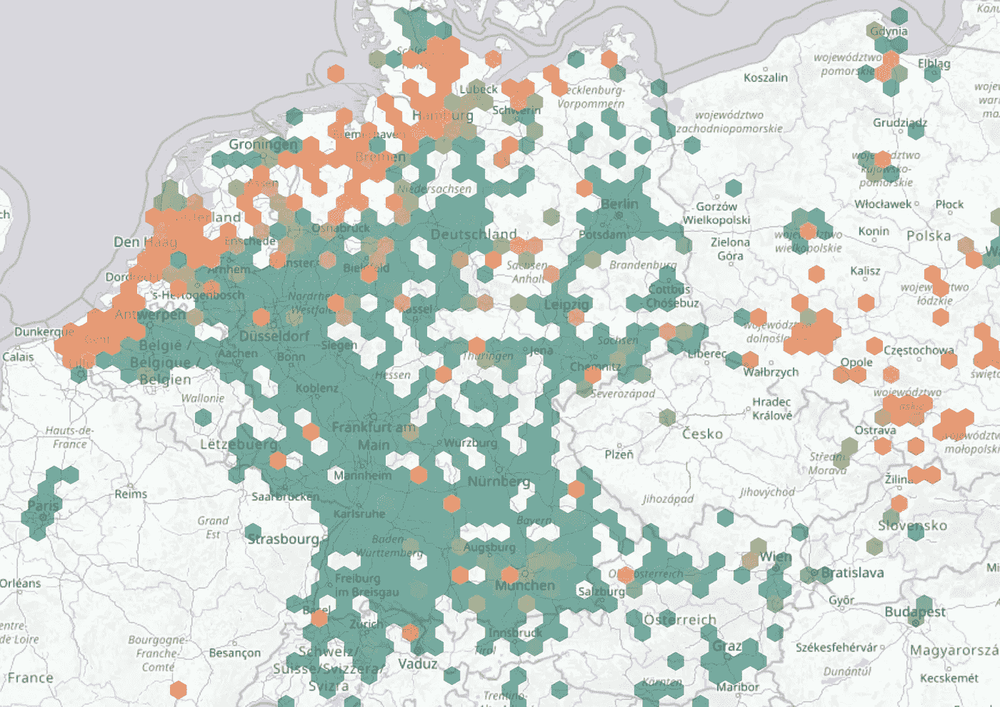

# 看不见的颗粒物质云穿越欧洲

> 原文：<https://towardsdatascience.com/invisible-clouds-of-particulate-matter-move-across-europe-6b39e2d57511?source=collection_archive---------21----------------------->

## 这些 PM10 和 PM2.5 的云是从哪里来的？

在之前的帖子中，我解释了我如何设置我的室外空气质量传感器，以及它如何产生作为公民科学项目一部分的开放数据。([https://medium . com/@ ignazw/air-quality-measurements-FCC 32d 59 DCA 7](https://medium.com/@ignazw/air-quality-measurements-fcc32d59dca7))

这是公开数据，任何人都可以分析。在这篇文章中，我将向你展示如何使用 Luftdaten.info 网站来寻找大规模的空气污染模式。

## 情况

Luftdaten.info 在地图上显示了世界各地所有传感器测量的快照(【http://deutschland.maps.luftdaten.info/#6/51.165/10.455】T2)。大多数传感器在欧洲，所以我将限制我对欧洲的看法。



Sample image from Luftdaten.info

大约每五分钟拍摄一次快照，并更新地图。我想知道如果我们把这些快照拍成延时电影会是什么样子。我们能找到什么模式吗？

## 获取数据

为了制作延时电影，我们需要捕捉每个快照。Luftdaten.info 上没有维护旧地图，所以我们必须自己收集。

捕获快照需要每五分钟向 web 服务器执行一次 HTTP 请求。我在运行于 raspberry pi 3 上的一个小脚本的帮助下做到了这一点。我想为每张快照拍摄两张照片:一张是欧洲大部分地区的概览，另一张是我居住的比利时的更详细的照片。

在 raspberry pi 上，我在无头模式下使用 chromium web 浏览器，即没有显示。

```
#!/bin/bash
chromium-browser --headless --disable-gpu \
  --screenshot --window-size=1920x1080 \
  http://deutschland.maps.luftdaten.info/#7/50.958/8.218
mv screenshot.png ./data/new/de`date +”%Y%m%d%H%M%S”`.png
```

您可能需要在您的系统上安装或升级 chromium 浏览器。我用的是 72 版的浏览器。确保您运行它是无头的，并禁用 gpu 使用(以避免不必要的库加载到内存中)。

luftdaten.info 网站使用 javascript 呈现地图，但 chromium 浏览器默认执行 javascript。你截取一张截图，然后定义图片的大小。默认的图片名为“screenshot.png ”,因此可以将其重命名为一个独特的名称，比如拍摄的时间。

然后编辑 crontab 以每五分钟运行一次该脚本。

这种大小的一个图像的大小超过 3 MB，因此您需要确保它不会填满您的磁盘。我每天运行一个脚本，将所有图像复制到外部存储空间，我可以从那里提取图像以备将来使用。

我在 MacOS X 上做进一步的处理，包括给截图加注释，并把它变成电影。

我在每个截图上标注了拍摄的时间和数据。我用的是 ImageMagick 包，通过自制软件安装。

```
#!/bin/bash
for f in $(ls ./images/raw/*.png)
do
fn=${f##*/}
anno=${fn%.png}
magick ./images/raw/$fn -pointsize 72 -gravity southwest \
  -annotate +150+50 $anno ./images/annotated/$fn
mv ./images/raw/$fn ./images/tmp/$fn
done
```

这个脚本读取我在一个目录中准备的所有文件名，并且是 Pi 上收集的图像的副本。它在文件名中包含截图的日期和时间。

对于每个文件，我从文件名中获取日期和时间，并将其设置为图像上的注释。+150+50 定义了距离边缘的像素数。在这个位置，它非常易读。

我将注释后的原始图像移动到一个临时目录，在确定处理正常后，我可以删除它。

下一步是用带注释的图像制作一部电影。为此，我使用 ffmpeg 包，您可能需要像安装 ImageMagick 一样安装它。

以下脚本创建了电影。

```
#! /bin/bash
# create movie for Germany
ffmpeg -f image2 -pattern_type glob -framerate 5 \
  -i ‘images/annotated/de*.png’ -s 1920x1080 -f mp4 
  -vcodec libx264 -pix_fmt yuv420p germany.mp4
```

f 标志定义了图像格式。如果您想使用 globbing 来收集图像列表，您需要定义 globbing。你需要在 fps 中设置帧率，然后是实际的输入文件。接下来是输出电影的大小、格式和编解码器。像素格式定义是为了确保 quicktime 也可以播放电影。最后，您命名输出文件。

就这么简单。一旦准备好一些脚本，就很容易多次重新运行。

## 延时电影

这里有两部时间跨度为 2019 年 3 月 25 日至 31 日的延时电影。一个片段展示了欧洲的大部分，另一个片段放大了比利时。

PM clouds over Europe

PM clouds over Belgium

## 对结果的讨论

欧洲电影表明，高水平的 PM 是由于大规模的 PM 云在欧洲移动。毫无疑问和天气有关系，但是这些颗粒都是从哪里来的呢？

比利时电影聚焦布鲁塞尔。你可能会认为 PM 水平与交通高峰时间相关，但这在电影中并不清楚，需要进一步研究。也没有显示出与乡村露天壁炉的相关性。如果这种相关性存在，它们也远低于整个欧洲 PM 云的宏观运动水平。

没想到这种行为*先验*。我们似乎都把责任归咎于交通，毫无疑问，这是原因之一，但更重要的事情正在发生。我们将在以后的文章中深入探讨这个问题。

公民科学很酷！