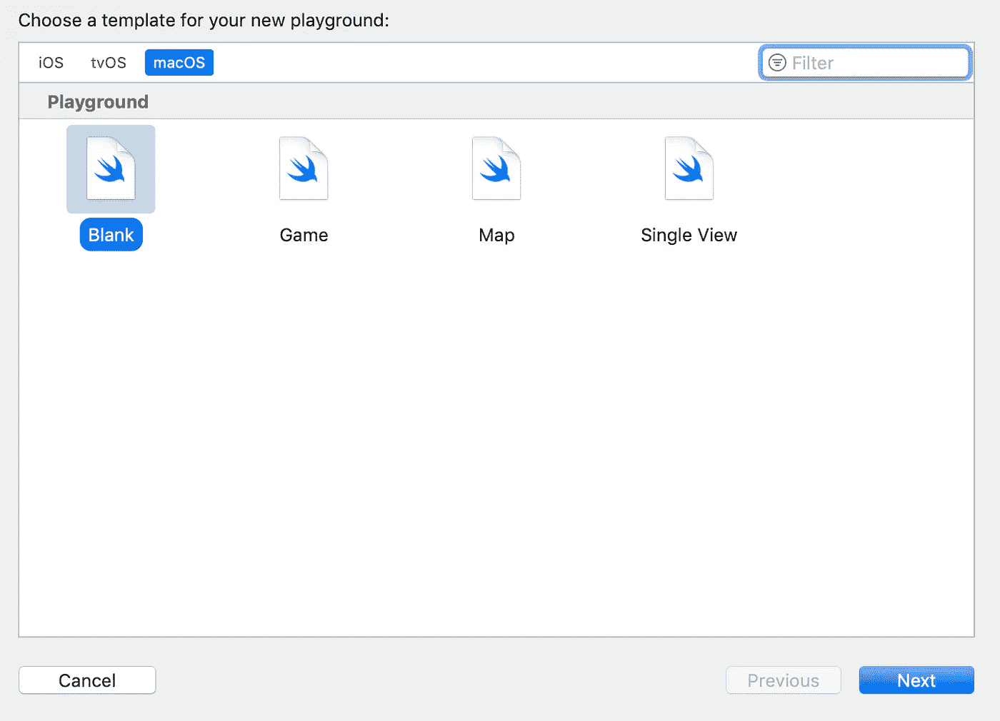
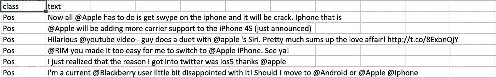
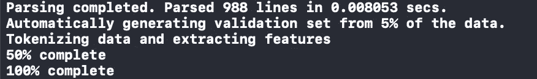
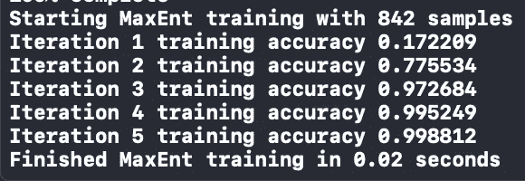
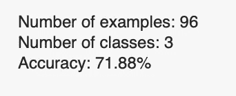
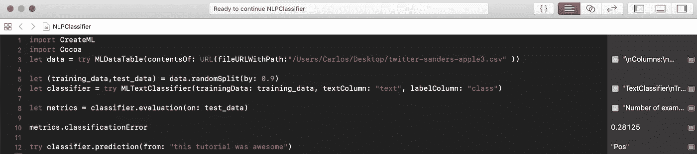

# 6 行代码中的 iOS 自然语言处理

> 原文：<https://towardsdatascience.com/ios-natural-language-processing-in-6-lines-of-code-36b08af7f440?source=collection_archive---------14----------------------->

## 从真实的推文中判断人们的感受

Photo by [Hannes Wolf](https://unsplash.com/@hannes_wolf?utm_source=medium&utm_medium=referral) on [Unsplash](https://unsplash.com?utm_source=medium&utm_medium=referral)

使用苹果的 CreateML 库和人们过去的推文中的文本，可以非常容易地实现和导出一个用于确定人们感受的 iOS 和 MacOS 自然语言处理模型。让我们[下载数据](http://boston.lti.cs.cmu.edu/classes/95-865-K/HW/HW3/twitter-sanders-apple3.zip)并进行测试！

从上面的链接中解压数据后，拖放。csv 文件放在方便的地方。接下来，在 Xcode 上打开一个游乐场，选择 MacOS，选择一个空白文件。

Make sure to select Mac OS

完成后，导入所需的库:

接下来，从。csv 文件，请确保将文件 URL 路径更改为您下载数据的位置

接下来，我们需要将数据分成训练和测试两部分，可以随意试验分割比例

如果您想要设置种子以便以后跟踪随机分割，请将上面的行更改为:

如果你看一下数据，你会看到它分为两列:一列是标签(正面、负面或中性)，另一列包含推文的文本

A look at the csv data

现在我们可以用我们的训练数据来训练模型，

您的 Xcode 控制台现在应该开始解析数据了，

然后它开始训练，

最后，我们可以测试一下它的表现。这超过了我们的 6 线限制，但模型已经完成，所以这不算😏

我把误差降低到了 28%，

如果你能进一步降低错误，让我知道你是怎么做的。就是这样！你做到了！如果您想使用该模型来测试一个随机的文本字符串，以查看它是正面的、负面的还是中性的，这里有一个示例:

当我运行时，我的模型能够正确地预测“pos”。

Correctly identified “pos” on last line

最后，如果您想要导出模型，

像所有 CreateML 模型一样，它将保存为. mlmodel

# 结论和完整的源代码

所以我们学到了三件事:

1.  如果我们有正确的数据，从人们的推文中判断他们的情绪是可能的
2.  苹果的 CreateML 库让这变得超级简单
3.  整个训练和测试可以在六行代码中完成

既然你知道了这个，你打算用它做什么？你要向你的朋友炫耀吗？你会试着让它更精确吗？或者，你是不是很大胆，打算建立一个股票预测器，利用人们在推特上的情绪来决定价格波动？最后一个可能很难，但我说你要去争取！祝你好运！完整的源代码如下。

有问题吗？你可以在 www.cggonzalez.com 的[找到我](http://www.cggonzalez.com)