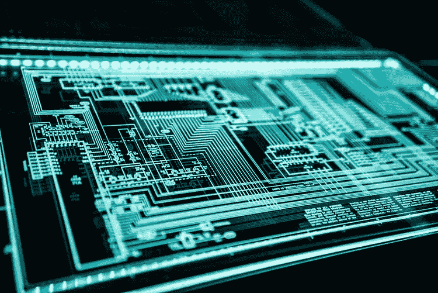

# 物联网在行动

> 原文：<https://towardsdatascience.com/iot-in-action-a8b7fac83619?source=collection_archive---------14----------------------->

## **什么是物联网，物联网是如何工作的？**

> 它是我们经常听到谈论的一个术语。物联网是一个有点抽象的概念，但在最近几个月越来越受欢迎。他的名字“连接到互联网的日常事物”很好地说明了它试图表达的思想，但实际上，它远不止于此。

要了解物联网是什么，我们还必须了解它的基础一点也不新。大约 30 年来，它一直致力于让所有日常物品变得更具互动性。在我们意识到互联家庭进入物联网之前，智能家庭(也被称为明日之家)等想法已经发展起来。物联网为以前通过闭合电路连接的对象供电，如通信器、相机、传感器等，并允许它们通过使用网络的网络进行全球通信。

> 如果我们要给物联网下一个定义，可能最好的说法是它是一个使用互联网将物理对象相互连接的网络。所提到的对象使用嵌入式系统，或者相同的专用硬件，其不仅允许互联网连接，而且还基于远程指示的任务来调度特定事件。
> 
> 来源 hipertextual.com

## **为什么是物联网？**

物联网为组织提供了管理和监控远程操作的创新方法。它允许在遥远的地方拥有眼睛和耳朵，不断地向应用程序和数据存储提供信息。“东西”的低成本允许观察和管理以前遥不可及的活动。借助物联网，还可以收集曾经不可见的事件信息，例如将天气模式与工业生产相关联。

简而言之，物联网是一个基于任何产品与其周围任何其他产品互联的概念。从一本书到你自己家里的冰箱。目标是让所有这些设备相互通信，因此更加智能和独立。为此，有必要使用 IPv6 协议并开发该领域主要公司目前正在设计的众多技术。

> 其意义在经济和社会领域都至关重要。甚至比数字时代还要古老。那就是物联网允许计算机与现实生活中的元素进行交互，并从人类那里获得独立性，让我们掌握真正重要的东西。
> 
> 来源 expressvpn.com

source unsplash.com

> 物联网**家庭自动化**是物联网的主要应用领域之一。
> 一个实际的例子:由于物联网，我们的冰箱将能够测量里面剩余的食物，并指示指定的供应商提供用过的物品。因此，我们将永远不用担心买牛奶，鸡蛋或我们最喜欢的酸奶。冰箱将持续测量库存，并相应地独立行动。

## **可穿戴设备是另一个例子。**

由于这一概念的应用，t 恤、手表或手镯等日常用品变得智能。现在，时钟不仅为我们提供时间，还连接到互联网，与外部服务器交换数据，并根据从传感器和服务器收集的信息采取相应的行动。

物联网可穿戴设备是日常物品连接到互联网的一个明显例子。它们也可以更深入地应用于家庭。通过分布一系列传感器和处理器，我们可以自动控制窗户、室内温度、灯光等。而且，由于整个系统都连接到互联网上，也有可能无线控制我们想要的东西。

## **智慧城市。**

物联网的另一个主要应用领域是城市，使城市更加智能和高效。例如，很多时候我们以一种完全荒谬的方式等待红灯，因为我们周围没有车或任何人。由于物联网，这些交通灯可以连接到分布在整个城市的摄像头电路，这些摄像头可以识别交通和群众运动的水平，从而避免在限制运动的区域进行荒谬的等待。

> 物联网的标准化将产生巨大的经济和社会影响

source unsplash.com

## **自动驾驶汽车。**

物联网物联网也将打开自动驾驶汽车的大门。

物联网应用于城市的另一个例子是交通标志。应用物联网，如果我们以高于允许的速度行驶，我们的汽车将在接收到我们周围任何信号的数据后自动降低速度。与此同时，这将促进自动驾驶汽车在我们生活中的到来和扩展。

如果把物联网带到国家安全或者商业等更广泛的领域，意义和可能性就更大了。例如，自动化果园、智能照明、机器监控……这类项目的经济影响将是惊人的，因为它将取代许多现有的工作，最重要的是，它将节省大量的长期成本。这几乎是第二次工业革命。

正如我们所看到的，物联网显然是科技行业的下一个重大进步。它开启了一个无限可能的世界，甚至比当时开启数字时代的世界还要大。一切都将基于上下文，实现更大的独立性，从人类，因此，更大的效率和舒适。第一步已经开始了(标准、第一个原型和项目等)。)，但是，根据各种分析师的说法，直到 2020 年，物联网才会开始在人类中变得更加成熟和普遍。

## **物联网中的隐私和安全问题**

source unsplash.com

> 最近的一项研究表明，许多公司拥有数以千计的物联网设备(物联网)，这些设备与业务没有直接关系，但每天都连接到他们的网络。
> 
> 来源 universidadviu.com

随着个人财产物联网产品在工作场所的使用越来越多，管理企业网络上未经授权的设备的任务在许多组织中变得越来越困难。

最近，Infoblox 委托对美国 1000 名 IT 主管进行了调查。UU。美国、英国、德国和阿拉伯联合酋长国了解个人用户拥有的物联网设备的安全影响，而不是组织网络中的企业。结果令人震惊:

在前三个国家中，35%的受访者报告说，他们平均每天有超过 5000 台非商业物联网设备连接到他们的商业网络。

在美国、英国和德国，三分之一的受访者表示，在正常工作日，可以发现超过 1，000 台物联网设备连接到他们的网络。

39%的美国 UU 受访者。英国表示，他们在连接到公司网络时使用个人物联网设备来访问社交网络，24%的人承认使用这些类型的设备来下载应用程序，而 13%的人这样做是为了访问他们喜欢的游戏。

**商业网络中最常见的未经授权的物联网设备如下:**

*   身体活动跟踪器，如 Fitbit 和 Gear Fit。
*   数字助理，比如 Google Home 和亚马逊 Alexa。
*   智能电视
*   智能厨房设备，如微波炉和水壶连接。

这类物联网设备的激增显著增加了组织的安全负担，并提高了风险阈值。由于这种技术的使用增加及其在日常生活中的正常化，安全管理员有一个巨大的任务，只需管理公司网络中受制裁的设备。

> L 笔记本电脑和平板电脑正在与另一类物联网设备共享公司网络，其中许多设备的连接不受组织的任何控制，组织甚至不知道它的存在。

添加到公司网络中的不安全和未经授权的物联网设备数量呈指数级增长，这使公司、其用户、客户及其整个网络处于风险之中，因为由于许多这些消费设备的安全级别较低，因此需要应对真正的威胁。

这些类型的不安全和易受攻击的物联网设备为网络中的网络犯罪分子提供了一个薄弱的切入点，并为公司带来了严重的安全风险，可以通过培训、信息和评估来检测它们在网络上的存在，以便及时采取措施。

您是否知道安全性不足的物联网设备可以为网络犯罪分子提供进入公司网络的入口？您是否知道他们会通过 **DNS 隧道**等方法来帮助窃取数据？

## 总结一下…

**物联网**为我们的社会带来了下一次工业革命的无数可能性，即将到来的设备将足够自主，来执行我们今天所做的重复任务，并有可能通过技术将城市、社区和人们相互连接起来。

感谢阅读，如果你喜欢这个故事，请分享！: )