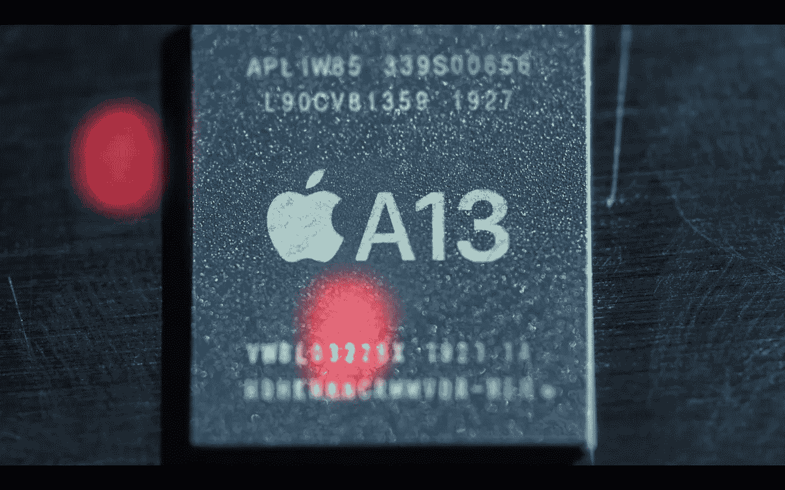
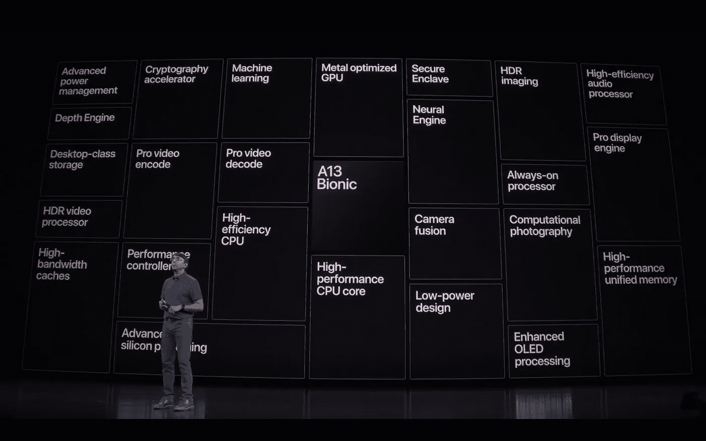
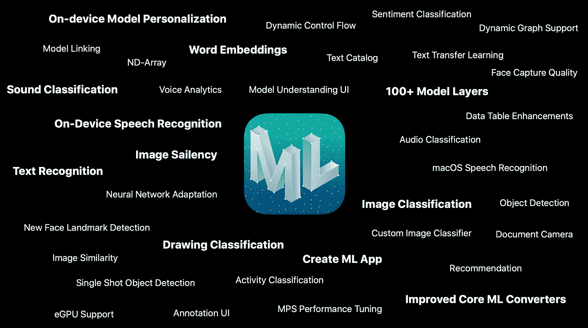

# iPhone 的进化并没有受阻，它正处于(机器)学习曲线上

> 原文：<https://towardsdatascience.com/iphone-evolution-hasnt-stunted-it-s-on-a-machine-learning-curve-b29237c0adbe?source=collection_archive---------17----------------------->

## 苹果在 ML 上的进步正在改变 iOS 的一切

The new A13 Bionic chip announced for the new iPhone 11 Line-up. Screenshot taken from Apple’s iPhone 11 Pro Announcement.

从各种媒体的角度来看，智能手机的发展似乎非常缓慢。这十年的早些时候，当我们对高清显示屏、3G“移动宽带”的飞跃、前置摄像头的增加以及更小(然后，最终更大)的手机尺寸感到兴奋时，很难没有这种感觉。这些有形的硬件特征是巨大技术进步的视觉标志。我们变得习惯于设定很高的期望并让他们被超越。

我们活着就是为了，我喜欢称之为，即时满足的特征。苹果(和他们的竞争对手)知道这一点，在这个时代，这种功能是少而薄的。这就是为什么我们现在获得了像素数量增加(一般消费者的眼睛几乎注意不到)、额外的相机镜头和更长的电池寿命(等等)的年度展示。

如果你去 [iPhone 11 Pro 产品页面](https://www.apple.com/iphone-11-pro/)，页面的四分之三都在专门展示摄像头和显示屏的增强功能。没什么可轻视的，但由于所有的新功能，它们已经成为通常的怀疑对象，这些功能仍然会引起普通消费者的轻微上升。

面对现实吧。近年来，iPhone 最大的轰动不是*而是*其中之一是凹口设计和价格上涨。

# (某种)无名英雄

在同一个 iPhone 11 Pro 产品页面上，在相机和显示器营销之后的第三个季度，是关于新 A13 仿生芯片的信息。苹果肯定对其下一代芯片感到兴奋，并且从未保守秘密。但我认为普通消费者会这样看待这一部分:

听起来是不是很花哨？它有“仿生”这个词，所以是的。背景中“A13”的高科技图形看起来酷吗？检查。对我这个普通消费者来说意味着什么？更快，更快，核心，增强现实，更快…哦，优化的电池寿命！下一部分是关于更好的电池寿命！太棒了，我们继续吧！

结束场景。

## 只是一个模子刻出来的？

这可能是一种过度的描述，但它离现实并不远。我们都坐着看完了演示的这一部分，但我无法告诉你有多少次人们和我一起看(请注意，是在技术方面！)开始看他们的手表，说“已经开始吃好东西了！”。

我们期望我们设备的内部性能逐年提高。这种主要的技术已经在个人电脑市场上出现了。可以理解的是，普通消费者并不完全了解这些改进与他们所了解的功能之间的关系，这也于事无补。在我看来，不能将点点滴滴联系起来，就是为什么我们对这些年来的进步以及它如何影响我们今天手机的每一个功能几乎都变得麻木了。

这就像当一名运动员花了整个休赛期的训练比以往任何时候都更加努力，一个新的养生法，几乎在球员的每个方面都有要求。我们的期望是他们会训练，所以我们不会欣赏他们的任何进步，直到我们，球迷，看到了在行动中证明的结果，在胜利中，当然，还有幻想的分数。

Think of a swimmer who trains, focuses on areas of their technique to tweak, and adopts new practices into their daily regimen. All of that just to optimize power, performance, and efficiency, ultimately shaving off crucial seconds on their time.

这可能就是为什么两年前大多数消费者只是点头通过 A 系列仿生介绍。它为 iPhone 的工作方式引入了一个全新的优化架构。但不仅如此，它给了我们一个神经引擎，一个机器学习和人工智能的移动发电站。这就是为什么 Face-ID 可以同时推出的原因(这意味着它也启用了凹槽设计)。

## 仿生成就

以下是 A 系列仿生进化的一些公认的第一方成就:

Sribalan Santhanam, Apple’s VP of Silicon Engineering, introduced some of A13 Bionic’s improvements and new capabilities at the September event

*   摄像头:苹果在其网站上声明，A 系列的神经引擎是三摄像头系统背后的“驱动力”。虽然镜头有所增加和改进，但大脑使人像模式、夜间模式和 SmartHDR 等功能工作得如此出色。
*   视频和游戏:随着更高分辨率的显示器，4K 流成为一种规范，以及移动游戏图形接近上一代游戏机的水平，无疑需要更多的马力。然而，A13 中的 GPU 速度提高了 20%，而功耗却降低了 40%。也许 iOS 上的 Skyrim 终究不是太遥远…
*   速度和电池寿命:仿生机器人内部的架构很复杂(CPU、GPU、神经引擎等)，这是有道理的。还记得在学校的小组项目吗？如果在团队中分配工作，特别是当任务分配给那些有天赋的人时，整个事情会进行得更快。然而，当团队将它留给一个不幸的人时，这个人不得不管理项目的所有方面，有时不得不牺牲他们擅长的方面的质量，因为他们需要在他们不擅长的领域花费更多的时间和精力。这个概念适用于这里。

# 未来是学习

这个行业总是在寻找“下一件大事”。iPhone 本身是智能手机和应用程序革命的催化剂，这场革命改变了科技领域的一切，并为那些投身其中的人赚了很多钱。那么下一步是什么？

机器学习是佼佼者。现在它无处不在，从 [Alexa](https://developer.amazon.com/alexa) ，到 [IBM Watson](https://www.ibm.com/watson) ，到你手机上的纵向模式。潜在的应用是无限的，可以跨越金融、医药、建筑和安全。

## 为什么是现在

今天，传媒业发展更快，因为它所依靠的技术更容易获得，更强大，更省时，也更便宜。进化把我们从房间大小的大型计算机带到了网络上的远程云机器，现在有一个完整的神经引擎内置在你的口袋里的手机里。

对于 iOS 和 ML/数据科学开发者来说，这是一个异常激动人心的时刻(或者至少应该是)。苹果通过两种重要的方式让开发者可以使用 ML。首先，他们提供了[开发者工具包和工具](https://developer.apple.com/machine-learning/)，简化了在我们的应用程序中使用 ML 的流程(T2 的核心 ML 和 T4 的创建 ML 是其中的几个)。第二，他们已经把所需的硬件放进了用户的口袋。以前，如果在移动设备上运行，开发人员要么不得不缩小他们的人工智能能力，要么他们需要在一些远程服务器上运行工作，他们要么支付租金，要么拥有和维护并发回结果。苹果本质上是通过弥补差距为开发者进入 ML 进行投资。

Just some of the new and enhanced features introduced to developers at Apple’s WWDC 2019\. Screenshot taken from WWDC presentation.

随着越来越多的开发人员意识到，即使是最小的 ML 集成也可以转化为他们应用程序中令人难以置信的新功能和增强功能，这种投资将会得到回报。随着第三方和第一方应用集成越来越多的 ML 功能，苹果可以为其用户吹嘘一个更强大、更稳健的应用商店目录。这可能会给[开发者](https://fortune.com/2019/01/28/apple-app-store-developer-earnings-2018/)和[苹果应用商店](https://www.cultofmac.com/601492/app-store-google-play-revenue-2018/)带来更大的创纪录利润和收入。

# 从内到外设定期望

智能手机新功能的未来像老鹰一样盯着它，这是一件好事也是一件坏事。虽然它促使手机制造商首先尝试并提出新的创新，但有时最终结果可能是噱头或不完整的(比如:某种折叠手机)。

消费者不应该把他们的注意力从这上面移开，而是应该把更多的注意力放在引擎盖下取得的进步和它给他们带来的价值上。我建议每个人都学习人工智能和人工智能是愚蠢的，但同时，它甚至不再是指日可待的了。就在此时此地。