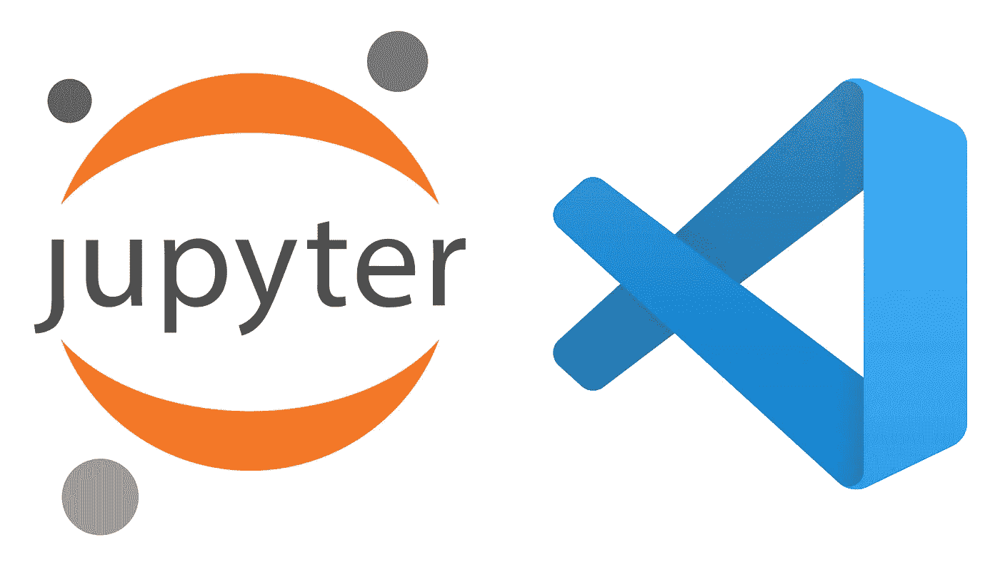
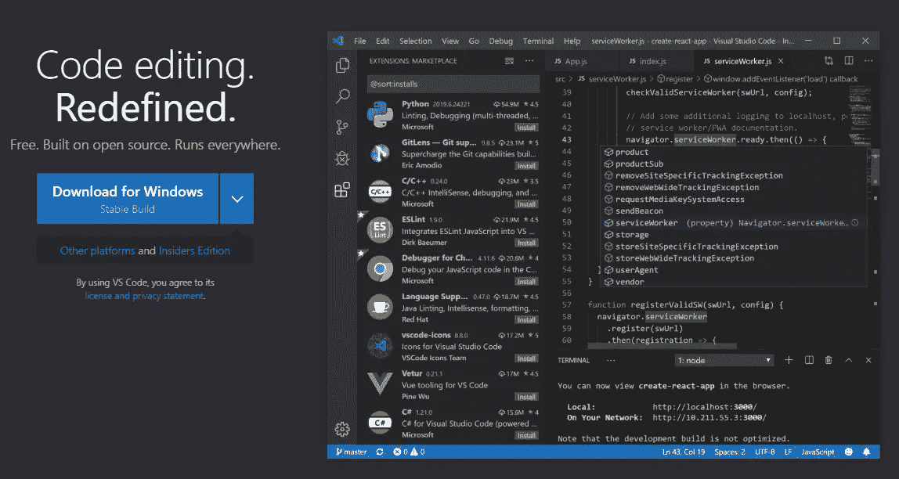
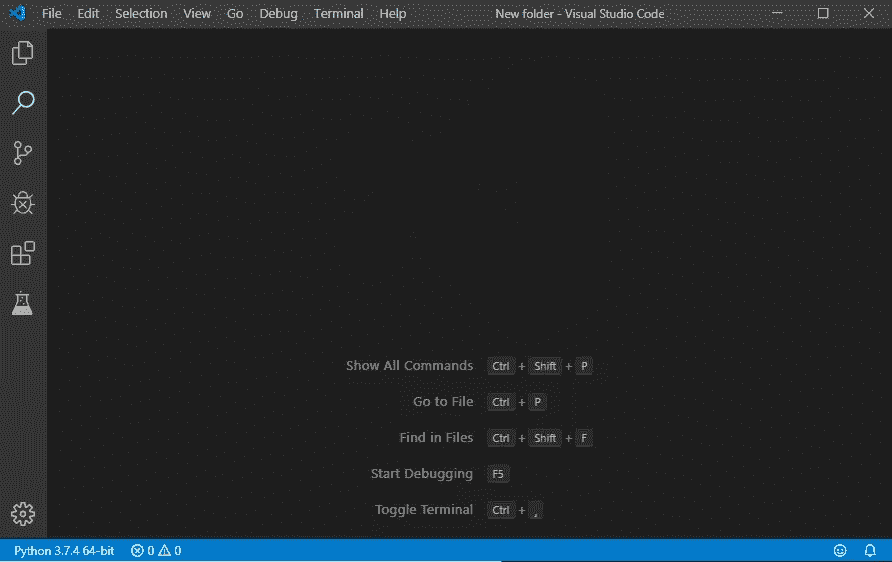
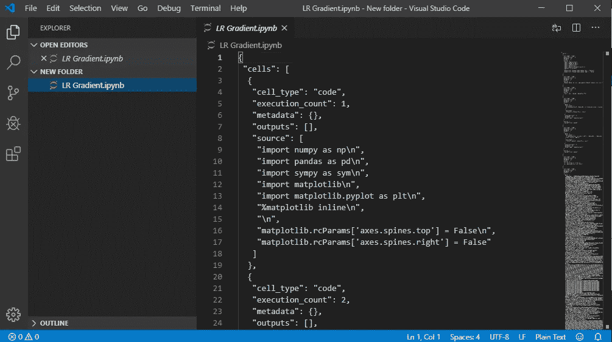
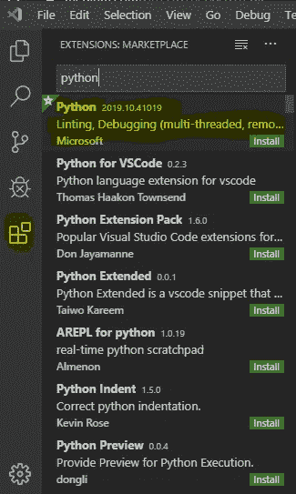
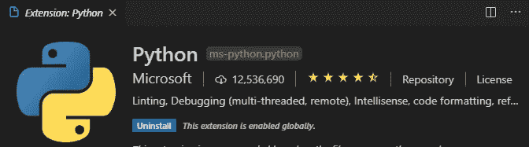
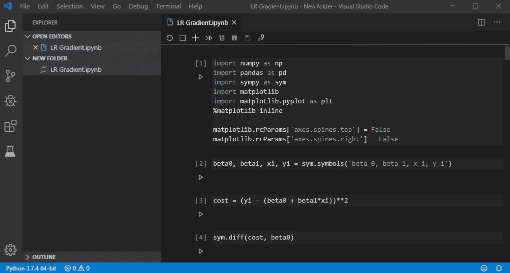
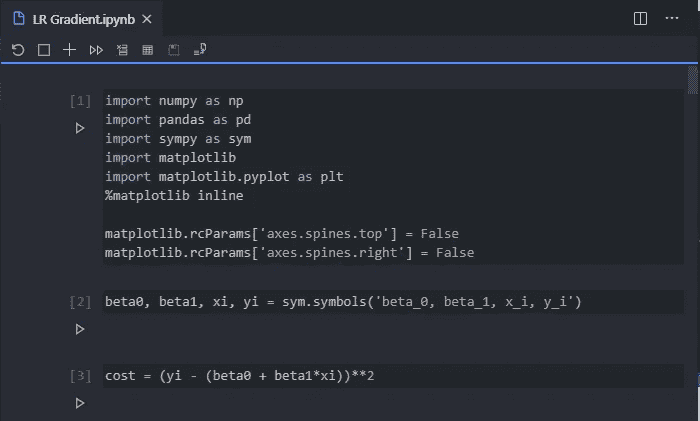
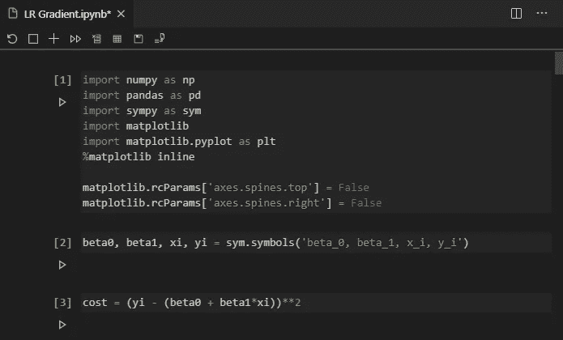
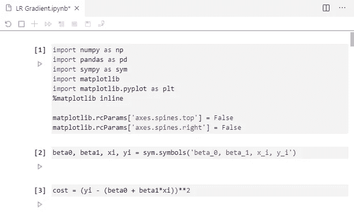

# IPython 笔记本对 Visual Studio 代码的支持终于来了

> 原文：<https://towardsdatascience.com/ipython-notebook-support-is-finally-here-for-visual-studio-code-b578abe0361c?source=collection_archive---------7----------------------->

这个月 [Visual Studio Code](https://code.visualstudio.com/) code 得到了一些意想不到的，有点酷的特性。直到现在，除了在浏览器内的笔记本环境(据我所知是*)之外，在任何地方编辑 IPython 笔记本都是不可能的，但现在不再是这样了。*

**

*在本文中，我将向您展示如何在您最喜欢的代码编辑器(*可能是*)中直接编辑笔记本，并且我们将讨论是否值得进行转换。几年来，Visual Studio 代码一直是我的首选代码编辑器，主要是因为有大量的插件。此外，主题是整洁的。*

*在过去一年左右的时间里，我的工作主要是面向数据科学，这意味着我可以通过使用**笔记本环境**而不是大多数开发人员认为最佳的经典文本编辑器方法，在更短的时间内完成更多工作。不能像我想的那样使用我最喜欢的代码编辑器是一件非常令人失望的事情，但事实就是如此。至少到目前为止。*

*让我们快速浏览一下本文将涉及的主题:*

1.  *如何下载 Visual Studio 代码*
2.  *下载插件和编辑笔记本*
3.  *选择正确的主题*
4.  *结束语*

*事不宜迟，让我们进入第一个话题。*

# *如何下载 Visual Studio 代码*

*根据您的操作系统，安装过程会有所不同。我在 Windows 上，所以这就是我要覆盖的。我怀疑在 Mac 或 Linux 上安装会更困难。首先要做的是打开[这个页面](https://code.visualstudio.com/)，点击那个蓝色的大粗体按钮，上面写着***Windows***下载:*

**

*下载完成后，你只需要打开 ***。exe*** 文件，并点击下一步几次。大约一分钟后，你就可以开始摇滚了。*

*一旦 VS 代码第一次被打开，它看起来就不会那么神奇了。这是它在我的机器上的样子:*

**

*我们将很快解决这个有点难看的外观。*

# *下载插件和编辑笔记本*

*如果你马上打开 IPython 笔记本，你不会得到你想要的:*

**

*你得到一些看起来像 JSON 的代码，这不是你应该编辑的。我的意思是如果你想的话，你可以，但是为什么呢？*

*首先，你需要安装由微软**开发的对 Python 的支持。点击我在下图中时髦地高亮显示的按钮，输入 ***python*** 。安装您看到的第一个:***

**

*该扩展将在几秒钟内安装完毕，您可以开始使用了:*

**

*如果您现在打开某个 IPython 笔记本，结果会更令人满意(*记住，在这里打开笔记本比在 Jupyter 环境中打开要花更长的时间*):*

**

*瞧啊。很简单，对吧？好吧，让我们现在做点什么，让一切看起来像是 2019 年。*

# *选择正确的主题*

*在开始之前，我只想声明，这部分是有偏见的，我所说的一切只是我的观点。您应该以任何您认为理想的方式来设计编辑器的样式。你可以像几分钟前安装 Python 插件一样安装主题。简单。*

*以下是我发现非常适合笔记本的主题列表:*

1.  ***原子一暗***

**

***2。Monokai 变暗***

**

***3。灯光(Visual Studio)***

**

*尽管我是**材质主题**的超级粉丝，但我真的不推荐它们用于笔记本设置，因为它们移除了单元格边界——最终结果看起来有点奇怪。*

*这就是了，一切都和 Jupyter 中的一样。你通过按 SHIFT + ENTER 来运行单元格，一切都感觉像它应该感觉的那样。*

****但是开关值得吗？*** 下一节找出我的看法。*

# *结束语*

*到目前为止一切顺利。*

*问题仍然是，你真的应该做出改变吗？*

*此时此刻，我的答案是否定的，原因有二*

1.  *代码执行比在 Jupyter 环境中要慢一些。不至于影响到你偶尔的数据分析项目，但是如果你每天都这样做，那么 Jupyter 仍然是一个不错的选择。*
2.  *打开笔记本需要更多的时间*

*像 Jupyter Lab 这样的环境，看起来已经有点像一个复杂的代码编辑器，我发现缺少 Visual Studio 代码。至少现在，谁知道未来会带来什么。你至少应该尝试一下，我不建议你只依靠我的意见。也就是说，我希望插件在未来得到优化。*

****你有什么想法？你换了吗？让我知道。****

**喜欢这篇文章吗？成为* [*中等会员*](https://medium.com/@radecicdario/membership) *继续无限制学习。如果你使用下面的链接，我会收到你的一部分会员费，不需要你额外付费。**

* [## 通过我的推荐链接加入 Medium-Dario rade ci

### 作为一个媒体会员，你的会员费的一部分会给你阅读的作家，你可以完全接触到每一个故事…

medium.com](https://medium.com/@radecicdario/membership)*