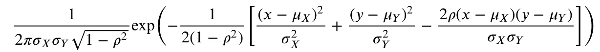
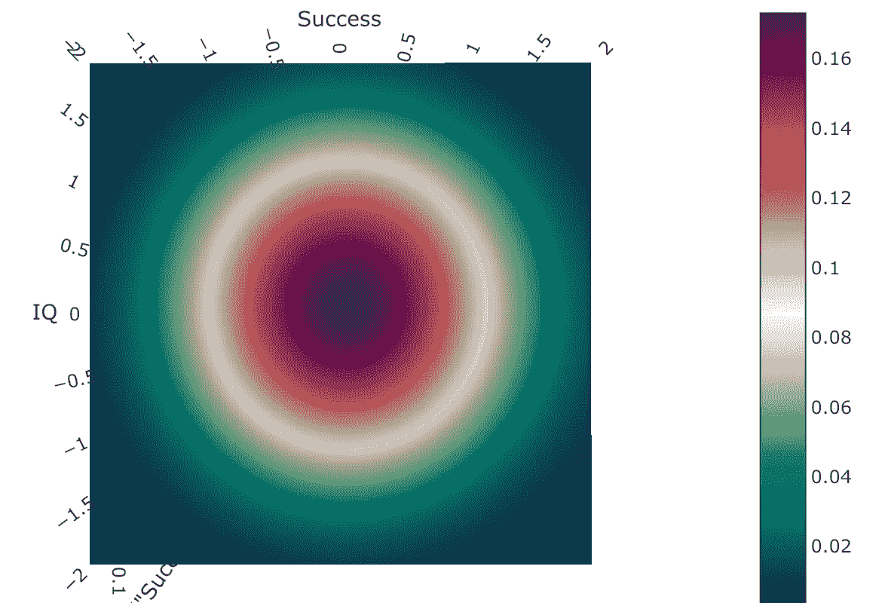
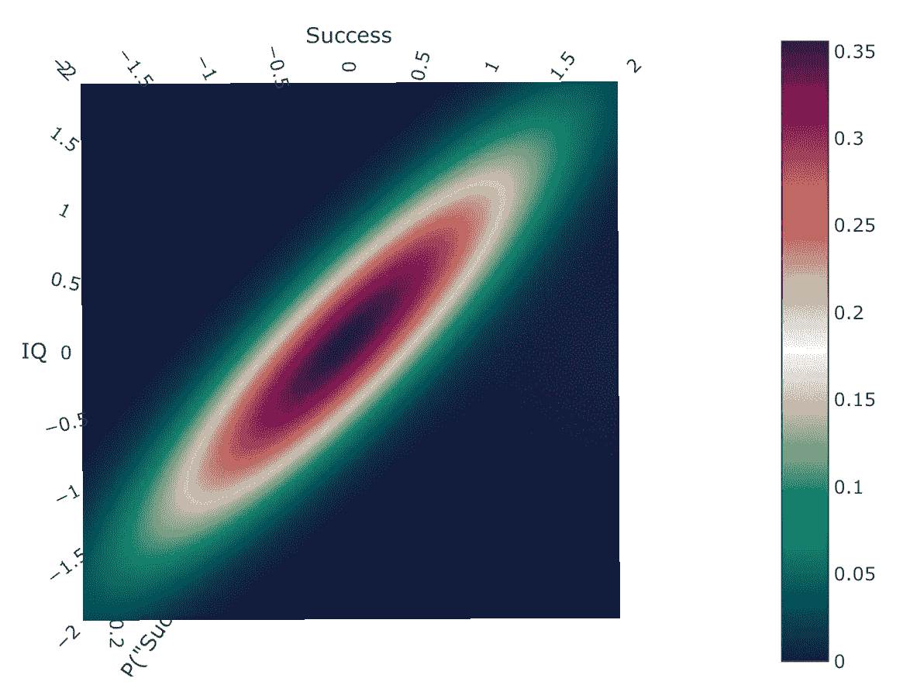
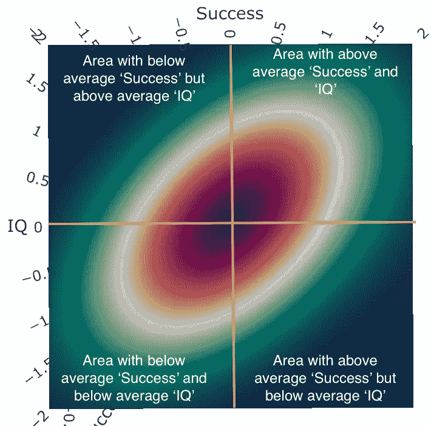

# 智商与成功——在双变量分布中使用蒙特卡罗模拟

> 原文：<https://towardsdatascience.com/iq-vs-success-using-monte-carlo-simulations-in-bi-variate-distributions-a19b32ef8882?source=collection_archive---------20----------------------->

塔勒布关于智商的推特帖子，今天在办公室引发了一场有趣的讨论。智力(用智商来衡量)能有效预测工作成功吗？

**对于一个智商高于平均水平的员工，他/她的表现高于平均水平的概率是多少。研究表明智商和成功的相关系数为 0.5。成绩和智商都是正态分布。**

在本帖中，我们将使用蒙特卡洛模拟来回答这个问题。我们将探讨联合概率分布、相关性和双变量正态分布的概念。

# 联合概率分布

解决这个问题的最重要的想法是理解联合概率分布的概念。特别是在这种情况下，我们想要计算“成功”和“智商”的联合概率分布函数(PDF)。为了理解联合 PDF，让我们举一个最简单的抛硬币的例子。比方说，我们有两个硬币，我们把它们一个接一个地扔出去。每次翻转都是具有伯努利分布的伯努利轨迹。掷硬币的联合概率密度函数定义了每对结果的概率，如下所示。

Joint probability distribution for coin toss

计算“成功”和“智商”的联合 PDF 有点复杂，因为这些变量是连续的。但是你可以想象一种情况，你想计算“成功”在一个特定范围内而“智商”在另一个范围内的概率。作为一个例子，你可以用下面的表格来计算“成功”和“智商”(附加说明:两个变量的比例是任意的)。

如果我们能够生成上面的表格，我们就能够计算出一个智商高于平均水平的人会有多成功。但在此之前，我们必须理解相关性和/或协方差的概念。

# 相关性和协方差

在上面掷硬币的例子中，投掷是独立的**。第二次投掷和第一次投掷没有联系。因此，当我们看到一个头作为结果 1 时，我们同样有可能得到头或尾作为结果 2。在这种情况下,“成功”和“智商”这两个变量是相互关联的。有许多关于成功和智商之间关系的研究。快速的互联网搜索会产生多个结果。一些研究表明相关性很高，一些研究表明相关性很低。这里让我们坚持 0.5 的较高相关性，一些研究已经将相关性降低到 0.3。**

**此外，我们假设“成功”和“智商”都是正态分布的。根据定义，智商是正态分布的。成功不一定。许多组织使用正态曲线来评定员工，但在现实世界中，成功可能不是正态分布的。对于我们这里的例子，我们假设成功也是正常的。由于两个输出变量都是正态分布，已知联合概率分布是**二元正态分布**或**二元高斯分布**。**

# **二元正态分布**

**如果 X 和 Y 是两个正态分布的随机变量。二元正态分布的联合概率密度函数由下式给出**

****

**Expression to compute the joint normal PDF given X & Y**

**其中 *𝜌* 是相关系数。方程式的推导超出了本笔记的范围。但是，我们将尝试使用 plotly 中的一些可视化工具来探索这种分布的特性。**

# **相互关系**

**让我们探讨一下“成功”和“智商”是独立的情况。在这种情况下，相关性为零。在下图中，观察 PDF 在 x-y、x-z 和 y-z 平面上的投影。x 投影、Y 投影呈正态分布。而 Z 投影是圆形等高线图。**

**PDF with *𝜌 = 0***

**Z 的投影非常清楚地显示了 X 和 y 的独立性。轮廓椭圆是圆形的，并且沿 X 轴和 y 轴对称。**

****

**Projection of the PDF along XY plane**

**如果“成功”和“智商”高度相关——比如说 *𝜌 =* 0.9，我们应该观察到一个轴倾斜 45 度的拉长的椭圆。下面的两幅图展示了“成功”和“智商”高度相关的情况。**

**PDF with *𝜌 = .9***

****

**Projection of the PDF along XY plane**

# **使用蒙特卡罗模拟计算概率**

**最后，下图的相关性为 0.5，显示了我们感兴趣的区域。为了计算概率，我们需要计算我们感兴趣区域的 PDF 下的体积。**

****

**使用 Python 中的 numpy 计算新员工的成功概率实际上非常简单。我们将使用函数[numpy . random . multivariate _ normal](https://docs.scipy.org/doc/numpy/reference/generated/numpy.random.multivariate_normal.html)()。由于该函数接受协方差作为参数，我们必须将相关性转换为协方差矩阵。如果我们假设智商和成功的方差都是 1(任何其他关于方差的假设都会给出相同的结果)。协方差矩阵与相关矩阵相同。我们用函数画出 10000 个‘成功’和‘智商’的值。假设两个变量平均值为零，相关性为 0.5。**

**下面的代码应该给出大约 0.67 的结果。我们的新员工表现优于平均水平的可能性比我们从随机选择过程中对“智商”的预期高出约 17%。**

```
# Mean for both success and IQ is zero
mean = (0, 0) # covarinance matrix with assumption of sd =1 (any other sd gives the same result)cov = [[1, .5], [.5, 1]]# we draw from both IQ and Success from a Multivariate
x = np.random.multivariate_normal(mean, cov, 10000) count_both = 0
count_pos_iq = 0
for i in range(len(x)):
    if (x[i, 0] > 0):
        count_pos_iq += 1
        if (x[i, 1] > 0):
            count_both += 1# ratio of values where Succuess > 0, IQ >0 to those where IQ > 0
print(count_both/count_pos_iq) 
```

# **密码**

**该代码可在[本](https://github.com/saurav2608/bivariate)回购中获得。**