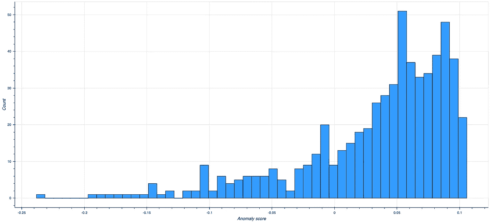

# 可能利用伊拉克的美元拍卖

> 原文：<https://towardsdatascience.com/iranian-exploitation-of-iraqs-dollar-auction-3391af5032e0?source=collection_archive---------22----------------------->

## 将隔离森林应用于伊拉克中央银行的数据。

## 背景

2019 年 9 月 4 日，美国国务院宣布了一项正义奖励计划，为导致伊朗革命卫队圣城部队金融网络中断的信息提供高达 1500 万美元的奖励。对此，我最喜欢的中东粉丝之一尼布拉斯·卡希米在推特上写道:

作为背景，萨达姆政权倒台后，美元对伊拉克经济变得至关重要。为了获得这些美元，伊拉克在美联储银行有一个账户，该账户可以动用伊拉克的石油储备。一叠叠 100 美元钞票被空运到巴格达，存放在伊拉克中央银行。然后，伊拉克中央银行在每日拍卖中将这些美元卖给伊拉克和地区银行以及较大的汇款公司，以换取伊拉克第纳尔。

因此，多年来的拍卖已经成熟，从伊朗到伊斯兰国的每个人都可以利用，CBI 实际上已经将几家伊朗银行和较小的货币服务企业列入“黑名单”或禁止参与。

## 假设

据推测，根据 JCPOA 核协议，伊朗不再需要这次拍卖提供的美元，因此伊朗的开采减少了。然而，美国宣布将于 2018 年 5 月 8 日退出 JCPOA，JCPOA 之前的制裁制度将“迅速恢复”原状。第一轮骤回制裁于 2018 年 8 月 6 日生效，全面重新实施发生在 11 月 4 日。Nibras 在上述推文中所说的是，随着美国对伊朗重新实施制裁，该政权已经回到伊拉克拍卖作为美元的来源。

因此，我想看看我是否能证明 Nibras 的说法，首先从伊拉克中央银行的网站上收集每日拍卖数据，然后对数据应用隔离森林异常检测算法，以揭示异常的拍卖会话。

## 数据收集

每次拍卖后，英国工业联合会的网站都会提供一些信息。第一个数字(190，058，455)是用于覆盖国外账户的卖出总额。第二个数字(35，900，000)是现金销售总额，第三个数字(225，958，455)是销售总额，即前两个数字的总和。所以我想收集的就是这三个数字。

令人欣慰的是，CBI 的网站将这些结果发布在连续的 URL 上，这意味着我只需要找到 URL 的范围并遍历它。为了刮，我使用了 BeautifulSoup，并将数据存储在 [CSV 文件](https://github.com/mpky/CBI_Project/tree/master/data/raw)中。页面的 HTML 格式变化相当频繁，尽管在 web 浏览器中查看页面时不会特别明显。这需要修改脚本来考虑页面布局的每一个变化。

为了限制不同剧本的数量，也因为我最关注 2018 年美国对伊朗重新实施制裁后的事件，我从 2017 年 9 月 18 日举行的拍卖开始(https://CBI . IQ/currency _ auction/view/124)。该页面的 HTML 布局一直持续到 2018 年 9 月 18 日的拍卖。2018 年 9 月 18 日拍卖结果的页面格式(大部分)一直延续到最近的拍卖(撰写本文时为 2020 年 2 月 9 日)。

在抓取之后，我在可视化之前进行了一些基本的数据清理和类型转换。

## 肉眼观察

我用散景来绘制一段时间内的数量。给定刮出的“总计”字段中缺失的数据量，我通过对前两个量求和来虚构一个。7 天滚动平均值提供了更平滑的结果图。

## 隔离森林

虽然看起来拍卖金额普遍增加了，但我希望隔离森林能够识别特定的异常拍卖时段。

隔离林的工作方式是通过随机选择一个要素来隔离数据点，然后在所选要素的最大值和最小值之间划分分割值。因为这种递归划分可以用树结构来表示，所以分离给定样本所需的分裂次数等于从根节点到终端节点的路径长度。这种路径长度，在这种树的森林中平均，构成了常态的度量。

最反常的观察将具有来自这种随机划分的最短路径，因为它们将首先“分裂”。因此，当一片树林为特定的观察产生较短的路径长度时，这些观察很可能是异常的。对于一个优秀的，可视化的概述，我推荐[这个视频](https://www.youtube.com/watch?v=RyFQXQf4w4w&t=1s)。

假设我在这个实例中没有标记数据，我以无人监管的方式使用隔离森林来为每个数据点生成异常分数。异常分数的最终分布:

因为我只在两个特征上训练模型，所以关于哪些点获得最低异常分数(即，最异常的那些点)是相当简单的。

## 检查大多数异常点

该模型评分为最异常的许多时段是因为现金销售总额或国外销售总额或两者都很低。此外，这些“轻松”的会议似乎都是由于他们发生在伊拉克的假期。

最反常的一届，得分为-0.232，发生在 2020 年 1 月 6 日；1 月 6 日是建军节，是伊拉克的公共假日。同样，2019 年 7 月 14 日的会议是第二大异常会议；7 月 14 日是共和国日，纪念 1958 年推翻君主制。

另一方面，大额现金销售交易和海外交易的大额总额也被评为高度异常。2018 年 4 月 16 日，数据集中最大的总现金拍卖是第八大异常观察。看来高额现金主要来自拉希德银行和国家伊斯兰银行的大额采购。拉希德银行是一家伊拉克国有银行，但没有显著的新闻事件可能推动这一大笔收购。

另一个异常大额现金时段是 2018 年 5 月 15 日。[看来伊拉克中东投资银行是那天最大的买家。](https://cbi.iq/static/uploads/up/file-152688338864784.jpg) ⁵:我迅速浏览了那一天与银行相关的新闻，但一无所获。

同样有趣的是，外国拍卖总额最大的那一个交易日只是第 18 个最反常的一天。正如散点图所示，大额现金交易似乎比大额外国账户交易更不正常。

## ***结论***

虽然拍卖总额似乎有所上升，但我们应该谨慎，不要得出太多结论。

首先，这是整个拍卖的总额，这意味着即使流向伊朗的美元大幅增加，也可能被其他参与者购买量的减少所抵消。

这里的样本量并不大(只有 611 个观察值)，而且只有重新实施制裁前一年的数据。所有这一切让我不敢假设自己有一个好的基线，可以据此判断拍卖金额的任何变化。

Isolation Forest 合理地将特别小和特别大的拍卖会议确定为最不正常的。很多金额最低的时段可以用国定假日来解释；最大规模拍卖的背后是什么还远不清楚。不管怎样，这并没有帮助揭露任何表面上潜在的伊朗对拍卖的利用。

***未来方向***

1.  收集更多的历史数据，以更好地定义零假设。
2.  使用 CBI 更详细的报告来监控每个参与者的拍卖金额并进行分析。掌握每个拍卖参与者的信息将使我能够更好地评估拍卖金额变化的原因。
3.  使用时间序列预测来检测异常。这将考虑到拍卖的顺序，并给出金额的背景。

*本项目静态网站住* [*这里*](https://iraqauction.herokuapp.com/)*；此处的* *为项目生命* [*的回购。*](https://github.com/mpky/CBI_Project)

[1][https://cbi.iq/currency_auction/view/**124**](https://cbi.iq/currency_auction/view/124)有 2017 年 9 月 18 日的拍卖结果，[https://cbi.iq/currency_auction/view/**125**](https://cbi.iq/currency_auction/view/125)**有 2017 年 9 月 19 日的拍卖结果。**