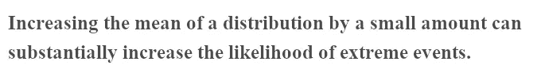
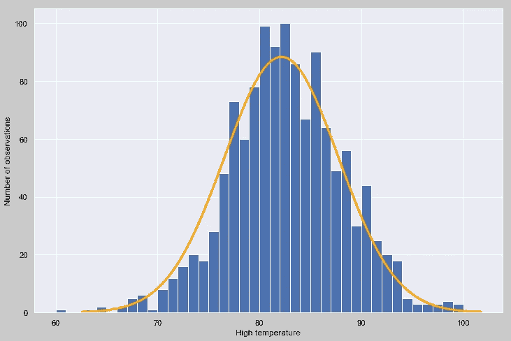
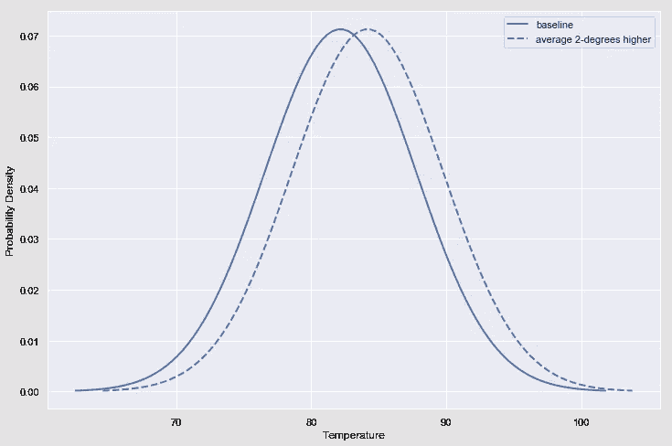
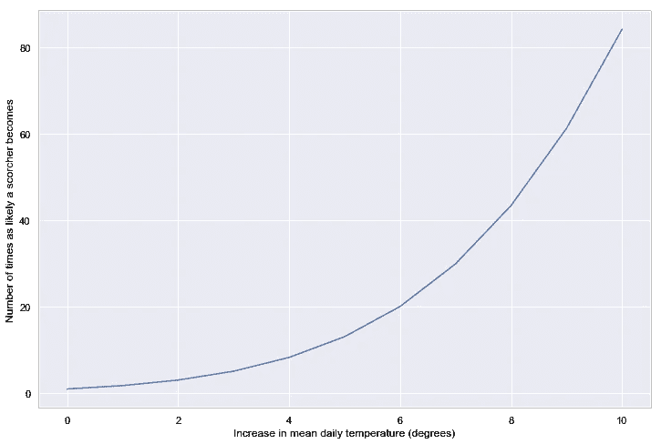
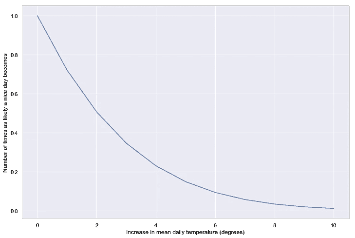
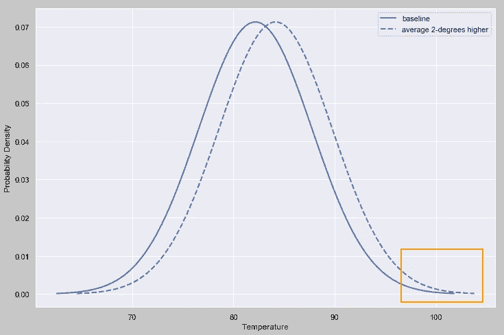
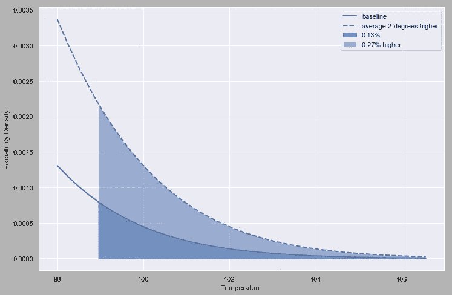
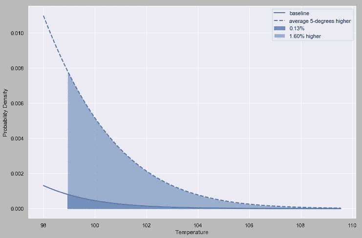
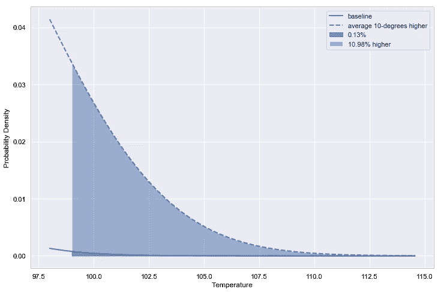

# 全球气温上升 2 度是一件大事吗？

> 原文：<https://towardsdatascience.com/is-a-2-degree-increase-in-global-temperatures-such-a-big-deal-72f18c528d29?source=collection_archive---------17----------------------->

## 分布均值的微小变化会极大地增加尾部事件的概率。

Photo by [Marcelo Novais](https://unsplash.com/@marnovais?utm_source=unsplash&utm_medium=referral&utm_content=creditCopyText) on [Unsplash](https://unsplash.com/search/photos/heat?utm_source=unsplash&utm_medium=referral&utm_content=creditCopyText)

现在是七月中旬，我正坐在里面写中型文章，而不是骑自行车或在后院烧烤晚餐，因为外面气温高达 99 度！

当然，我不知道这是否是气候变化造成的。我都不知道这是不是个有意义的问题。但是，它让我思考…和写作。

最近，我有幸参加了总统科技顾问委员会(以前存在的机构)前联合主席[约翰·霍尔德伦](https://en.wikipedia.org/wiki/John_Holdren)的演讲。除了他展示的所有伟大的科学之外，他还分享了一个让我拍脑门的统计洞见，因为这其实有点显而易见，但我没想过。所以，冒着阐述这种显而易见的事实的风险，我想我应该分享一下。

老实说，我从来没有完全理解为什么平均气温上升 2 度是一件大事。我相信这是一件大事，因为我相信有些事情科学家知道而我不知道。但是，从本质上来说，如果今年每天都比往年热 2 度，这并不是什么值得庆祝的事情，但也不会让人无法忍受。坦白地说，我怀疑大多数人都是这样想的。

在霍尔德伦的演讲中，当他做了一个简单的陈述时，他的额头被拍了一下:

换句话说，平均每天可能只热 2 度，但我们将会看到更多非常热的日子。

为了证明这是真的以及为什么，我从[国家海洋和大气管理局(NOAA)](https://www.noaa.gov/) 的网站上下载了 1970 年到 2010 年 8 月份纽约市每天的高温读数。这是一个直方图:

覆盖的橙色线是最接近数据的正态分布:平均值 82.2 度，标准偏差 5.6 度。实际分布看起来不太正常。例如，左尾巴比右尾巴长很多。但是，它足够接近，我们可以安全地使用正态分布来理解霍尔德伦的观点。

气候变化科学的一个重要论断是，天气模式变得越来越不稳定。但是，为了隔离均值漂移的影响，让我们采取更保守的假设，即当平均温度升高时，标准差保持不变。

与原始分布(上图中的分布)相比，新分布的平均值为 84.2，而不是 82.2:

看起来是个小变化。例如，82 度天气的概率*从大约 7.2%下降到大约 7.0%。农民或气候科学家会注意到这一点，但我不会。

然而，在温度非常高的日子里，这种影响更加明显。让我们把和今天一样热或比今天更热的一天，即 99 度或更热的一天，称为“大热天”。炙热天气的概率很低。但是，在相对基础上，这种可能性急剧增加，从 0.13%增加到 0.40%，这意味着平均气温上升 2 度，酷热的可能性增加两倍以上！

平均温度再升高几度，这种影响就会变得更强:

相反的情况发生在分布的左侧。随着平均温度的上升，凉爽天气(比如 75 度及以下)的可能性急剧下降:

要了解为什么会发生这种情况，让我们重新看看这两个发行版:

放大橙色框突出显示的区域，即右侧尾部:

观察到 99 度或更高的高温(炙热)的总概率是分布下阴影区域的面积。对于由蓝色实线表示的原始分布，该区域(深蓝色阴影)为 0.13%。高 2 度均值分布包括最初的 0.13%，加上额外的 0.27%。还是那句话，绝对数字小，但相对涨幅超过 200%。

你可能已经注意到，随着平均值的上升，炙热天气的概率呈指数增长。在+2 度，酷热的可能性增加了两倍。上升了+5 度，大约高了 15 倍。并且，在+10 度时，它高出 80 多倍。

为了理解这种影响，下面的阴影图比较了基线和+5 度分布的右侧尾部:

比较基线和+10 度分布:

注意事项:

*   *为了让这篇文章易于理解，我偶尔会对概率和概率密度之间的区别有所马虎。因为我通常以完整的度数说话，特定的温度实际上是范围的代理，所以这是一个相当小的错误。
*   这是一篇关于统计的文章，不是关于气候变化的。我的方法有很多可以批评的地方。请不要因为经验或政治上的顾虑而错过了不可否认的数学观点。
*   尾部事件和均值之间的关系取决于分布。举例来说，如果高温的分布是均匀的(显然不是)，那么这种效应就会消失。
*   您可以在这里找到用于创建图表[的数据和代码。](https://github.com/alipeles/blog_articles)