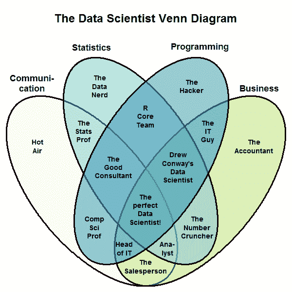

# 数据分析师是数据科学家吗？

> 原文：<https://towardsdatascience.com/is-a-data-analyst-a-data-scientist-890e24087737?source=collection_archive---------13----------------------->

## 有什么区别？

世界上有许多职业，每一个都是这个世界这个错综复杂的机器中的一个齿轮——按照他们的步伐前进，发挥他们的潜力，让这个世界变得更美好。然而，运行这台机器并为整个系统提供动力所需的燃料是“技术”
技术一直处于人类所知的几乎每一个职业的最前沿。自世界诞生以来，人类已经从手中拥有长矛和剑发展到拥有数字笔和移动设备。这种技术的发展帮助人类以指数速度进步。

今天，世界继续探索新的方法来减轻人类背上的负担，提供创新的机会来了解这个世界、它的地平线和其他地方。因此，新的职业不断涌现，管理和运作社会的现有发展。

在这个时代的一些新兴职业中，已经观察到对能够利用每天产生的大量数据的人的需求。这些人被期望一点一点地收集、分析和解释数据集，以揭示其中有意义的模式。
**【大数据】**是指每天淹没业务的大量结构化或非结构化数据，因此无法通过传统的数据处理技术进行处理。

> 解释这些大量的数据并不是一件轻而易举的事情，因此需要一个严肃的专业人士来处理和解释这些数据。然后，他/她可以通过从中发现有意义的趋势和阐释，为企业提供可行的解决方案来实施。

处理大数据的两个主要专业定义相当模糊，有时可以互换使用，显然破坏了它们之间的明确区别。这两种职业是“数据分析师”和“数据科学家”这两种职业都要求拥有不同的技能。以下是这两种职业在他们做什么以及哪里需要他们方面的一些区别。

# 他们是谁，做什么的？

在沟通、统计、商业和数学领域，职业需要的技能和知识量有很大的不同。

## 数据分析师

数据分析师仔细阅读大量数据，并从中得出真知灼见。他们负责收集数据，组织数据，并从中获得统计解释。这些解释通过可视化和报告给出，因此企业可以从中做出战略决策。

## 数据科学家

与数据分析师不同，数据科学家可以做出预测，帮助企业做出准确的决策。他们几乎可以做数据分析师能做的所有工作，因为他们也精通数学、统计学和计算机应用技能。他们能够有效地挑选和解决正确的问题，帮助企业脱颖而出。

The Data Scientist Venn Diagram shows the difference between different professions in the Big Data world ([Stack Exchange](https://datascience.stackexchange.com/questions/2403/data-science-without-knowledge-of-a-specific-topic-is-it-worth-pursuing-as-a-ca))

# 他们需要什么技能？

数据科学家和数据分析师在专业知识方面有许多相似之处；然而，有一些主要的特征使数据科学家优于数据分析师。

## 数据分析师

他们需要对算法、数学、统计学有一个基本的了解，如果他们有很好的沟通技巧和相当多的计算机科学知识，这是最好的。数据分析师是 SQL 方面的大师，使用通用表达式可以轻松地剖析数据并从中找出意义。此外，他们需要通过理解数据集中发现的模式和趋势来帮助组织做出决策。

除了数据存储和检索技能，他们还应该了解基于 Hadoop 的分析，如 HBase、Hive、Impala、Cascading 和一个非常著名的工具 *Google Analytics* 。此外，他们需要熟悉各种 ETL 工具，用于将不同来源的数据转换为分析数据存储。

## 数据科学家

数据科学家拥有数据分析师的所有技能，对建模、统计、数学和计算机科学有深刻的了解。拥有数学、统计和数据挖掘方面的超级技能，数据科学家是预测建模和机器学习方面的专家。因此，他们可以创建复杂的预测模型，根据历史数据给出有效的建议。

然而，与众不同的因素是强大的商业敏锐性，这使他们有别于分析师。数据科学家必须能够以故事的形式将研究结果传达给 It 专业人员和业务经理，以便他们能够根据数据科学家提供的信息承担预计的风险并做出可行的决策。

# 哪里需要他们？

如今，医疗保健、旅游和 IT 行业对数据分析师的需求很大。他们还积极参与各种业务的数据处理和分析工作。

A demand trend for Data Analysts (Courtesy: Google)

另一方面，数据科学家通常在电子商务、搜索引擎优化(SEO)和公司金融服务中需要。
此外，企业需要它们根据现有数据预测行业的未来趋势，并根据这些未来趋势做出合理的决策。

The demand for Data Scientists soared after 2012 as shown by the graph (Courtesy: Google)

# 他们挣多少钱？

对于每一个职业来说，工资是一个人追求职业兴趣的主要关注点。毫无疑问，提供给数据分析师和数据科学家的薪水在数据行业是有竞争力的；然而，由于数据科学家在各自领域的专业水平，他们比数据分析师挣得多。

> 根据 indeed.com 的数据，美国数据分析师的平均年薪为 65，245 美元，数据科学家的平均年薪为 120，655 美元。

这种差异是由于两种职业所需的知识基础、专业知识和经验。

# 最后的想法

不管有何异同，这两个职业都在各自的位置上发挥着举足轻重的作用，任何一个都不会错。

普华永道 2018 年的一项研究预测，

> “到 2020 年，数据分析师和数据科学职位将有 270 万个职位空缺”。

该研究进一步阐述了理想的候选人必须是 ***T 型*** ，这意味着除了具备分析和技术技能，他/她还必须具备“软技能”，如出色的沟通、团队合作和创造力。因此，明智的做法是，潜在的候选人应该发展强大的分析、技术和软技能，向那些拼命为公司寻找数据处理人员的企业证明自己的价值。