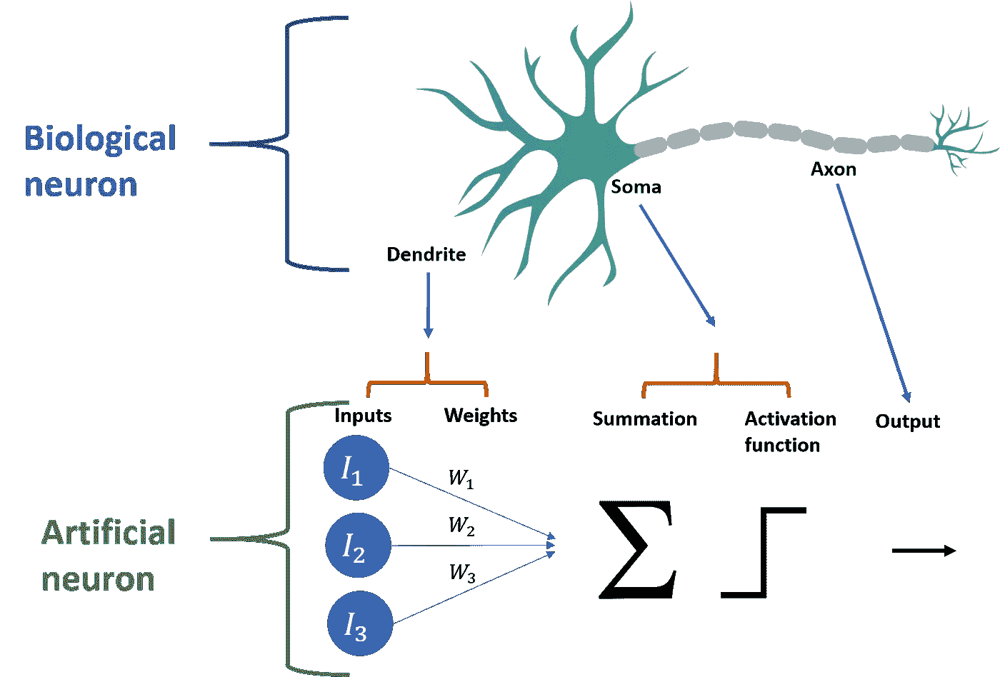
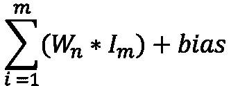
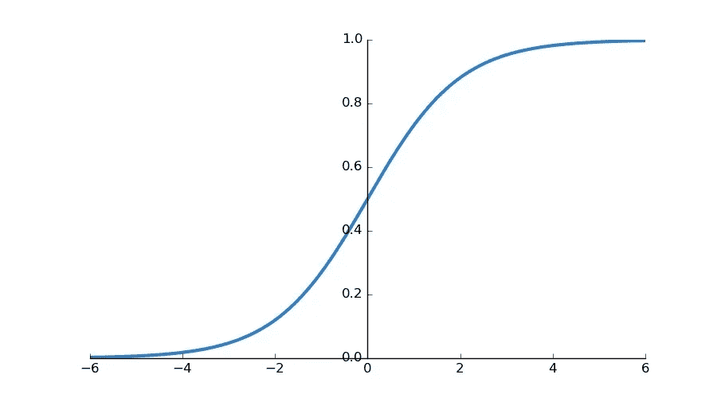
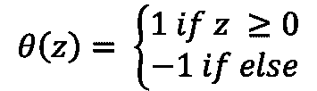
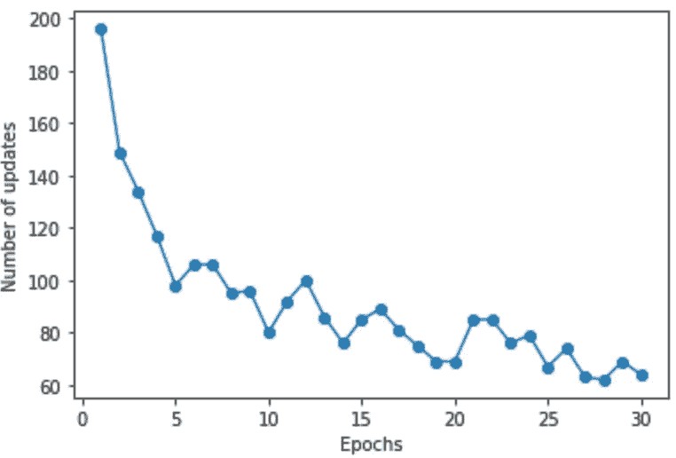

# 药物是储存的还是排泄的？编写并训练一个简单的感知器来找出答案

> 原文：<https://towardsdatascience.com/is-a-drug-stored-or-excreted-writing-and-training-a-simple-perceptron-to-classify-bioconcentration-bc2112239ce8?source=collection_archive---------34----------------------->

## *我进军 DL*

## 简单感知器学习算法的简单实用介绍及其在生物浓缩分类中的应用

Image by Ahmed Gad from Pixabay

## 简单来说，什么是感知器？

一个神经元是大脑的基本功能单位，类似地，感知器是神经网络的基本功能单位。在这篇文章中，我将简要介绍人工神经网络和生物神经网络之间的相似之处，感知机如何工作背后的理论，以及如何在 python 中实现算法，以在生物浓度数据集上训练它。

在动物中，一个神经元在其树突处接收来自其他神经元突触的输入。这些树状结构接收输入信号，并在细胞体(也称为细胞体)中进行融合。一旦信号在胞体中发生叠加，门控离子通道将根据信号是否突破阈值而打开或保持关闭——导致神经元沿着轴突放电或保持静止。神经元要么激活，要么不激活。

Biological and artificial neuron similarities

为了更好地理解这个模型，我们应该回顾一下上面我整理的图片中的几个组件:

**输入&偏置:**生物神经元的树突接受来自连接突触的神经递质输入。感知器模型中的对应物是输入(用于分类的特征)乘以其各自的权重。权重是在训练模型时随时间变化的值，因为当训练期间发生错误时，它们在“学习”阶段更新。添加偏差作为特殊输入，通过向左或向右平移点来移动决策边界。下面的求和公式显示了输入、权重和偏差是如何结合在一起的。

Summation equation

下图是一条 sigmoid 曲线，如果我们要改变权重，我们可以改变斜率的陡度，但实际上要向左或向右移动曲线，您需要添加一个偏差。使用 bias 在某个方向上平移所有点可以通过帮助分离超平面来增加精度。

Basic sigmoid curve

**激活功能**:神经元胞体中兴奋性离子和抑制性离子的总和产生动作电位。如果动作电位是兴奋性的，并且超过阈值，就会发出信号。在人工神经元中，激活函数计算总输入的净输出。感知器实际上是模型的决策者，并使用 [heaviside 函数](https://www.wikiwand.com/en/Heaviside_step_function)，也称为阶跃函数，来计算预测的二进制输出。下面是最常用的阶跃函数:

Unit step function

*   θ是激活函数
*   z 是输入的总和乘以它们的权重(和偏差，如果包括的话)

**输出:**生物神经元沿着它的轴突传播信号，如果达到阈值，这就是它的输出。感知器的输出也是在全有或全无的基础上触发，并导致 1 或-1 的二进制分类。

**注:**关于这份材料的更深入的文章可以在[这里](/perceptron-the-artificial-neuron-4d8c70d5cc8d)找到。

## 逐步算法

以下是该算法进行预测和学习的步骤纲要。

1.  将权重设置为较小的初始值
2.  将输入向量和权重向量相乘，然后求和
3.  如果总和值大于阈值，则将计算二进制输出
4.  检查预测的结果是否正确，然后相应地更新权重
5.  重复该过程以提高精确度

**注意:**另一篇伟大的文章解释了为什么算法[会起作用](/perceptron-learning-algorithm-d5db0deab975)。

## 编码感知器

**注意:**我将剖析和解释《Python 机器学习》一书中的代码示例，同时加入我自己的代码。我会检查我们感知机的每一行代码。

第一行代码将导入 numpy，因为我们需要执行向量乘法并绘制随机数。然后我们创建感知器类，初始化它，并为“epochs”、“learning_rate”和 randomState 设置参数值。

*   时期-所有训练数据向前和向后传递的次数
*   学习率——通常指η (eta)和步长。该值更新权重。当训练数据时，权重将根据它们对多少误差负责来更新，但是学习率用这个误差的一部分来更新权重。因此权重更新为——权重+ η(误差)。
*   randomState—用于为实例绘制伪随机数的类。我建议不要使用 random.seed()，因为它会影响全局 numpy 环境。

这里我们定义了接受 x 和 y 参数的 **fit** 函数。

*   权重-该参数用于将权重设置为一个随机数，而不是零。以零作为起始权重会导致对称性问题。如果所有输入值的权重为零，则误差也将为零，并且它们都将以相同的幅度更新。我们生成一个平均值为 0、标准偏差为 0.01、抽取样本数量为 1 的正态分布。
*   errors —是一个空列表，我们将在其中添加我们在培训过程中捕获的错误

下一段代码是我们刚刚定义的 fit 函数中的一个循环。然而，由于它有许多部分，我们将逐行单独查看。

1.  我们将循环设置为遍历每个时期
2.  将每次迭代的误差变量设置为 0
3.  这里，xi 和目标是 x 和 y 值元组中的两个数字，我们将它们作为数据输入
4.  我们将更新变量设置为我们需要用来更新权重的值，即学习率*误差
5.  用下面的公式更新输入的权重:
    权重=权重+(更新* xi)
6.  这里我们将偏差输入更新为:权重=权重+更新
7.  我们现在将 errors 变量的值设置为更新值
8.  最后，我们追加前面创建的错误列表

感知器代码的最后一块将定义求和及预测功能。

*   求和-我们将特征输入定义为 x，并返回权重和输入的矢量点积，以及偏差单位。
*   预测-使用 x(要素输入)作为函数参数，如果总和(x)大于 0，则函数返回 1；-1 否则。

## 清理和准备数据

我没有选择像 Fisher 的 iris 数据集这样的经典数据集，而是选择寻找一个与我目前正在做的工作相关的数据集。这让我找到了由米兰-比科卡大学主办的生物浓缩数据集，可以在这里找到[。](http://www.michem.unimib.it/download/data/mechanisms-of-bioconcentration/)

这些数据只需稍加润色就可以使用了。在下面的代码块中，我做了些什么来使数据可用于感知器模型。原始数据有 3 种不同的分类:(1)主要储存在脂质组织中，(2)有额外的储存位点(如蛋白质)，或(3)被代谢/消除[1]。因为我们的模型将使用两个预测类，所以我们可以去掉(2)类标签。

我们现在可以创建训练数据集来训练感知器学习模型:

## 训练感知器

下面是我们的感知器学习模型的完整代码块

这个数据集是心血来潮选择的，为了使分类器尽可能准确，预测特征应该能够沿着一个平面将各组分开。我们可以执行 PCA 或其他形式的降维来找出最重要的特征，但这不是本教程的重点。重点是看看我们是否可以在给定的一组分类数据上编写和训练一个感知器，以及它在这些数据上的表现如何。下面的代码块绘制了我们的训练结果，并查看了各个时期的更新次数——我们必须对整个训练数据集的传递执行多少调整。

## 结论:不是很棒，但是很管用！

Number of updates over epoch (entire data set passes)

我们看到，虽然更新的数量在波动，但在迭代过程中有一个总体下降的趋势，也就是说，我们的感知器算法在训练数据的每次传递中变得越来越准确。我们不能说它会达到零(像 Fisher's Iris 这样不太复杂的数据集一样)，但我们可以说我们从 20 世纪 60 年代开始的简单感知机学习算法确实“学习”了。

## **参考文献**

[1] F. Grisoni，V.Consonni，M.Vighi，S.Villa，R.Todeschini，[通过 QSAR 分类树调查生物浓缩机制](http://F. Grisoni, V.Consonni, M.Vighi, S.Villa, R.Todeschini (2016). Investigating the mechanisms of bioconcentration through QSAR classification trees, Environment International, 88, 198-205) (2016)，国际环境组织