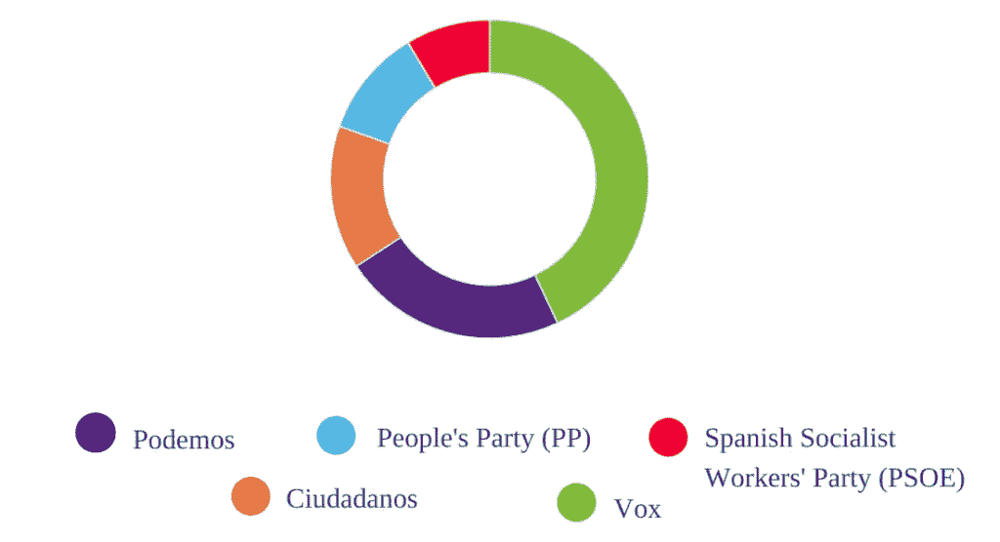
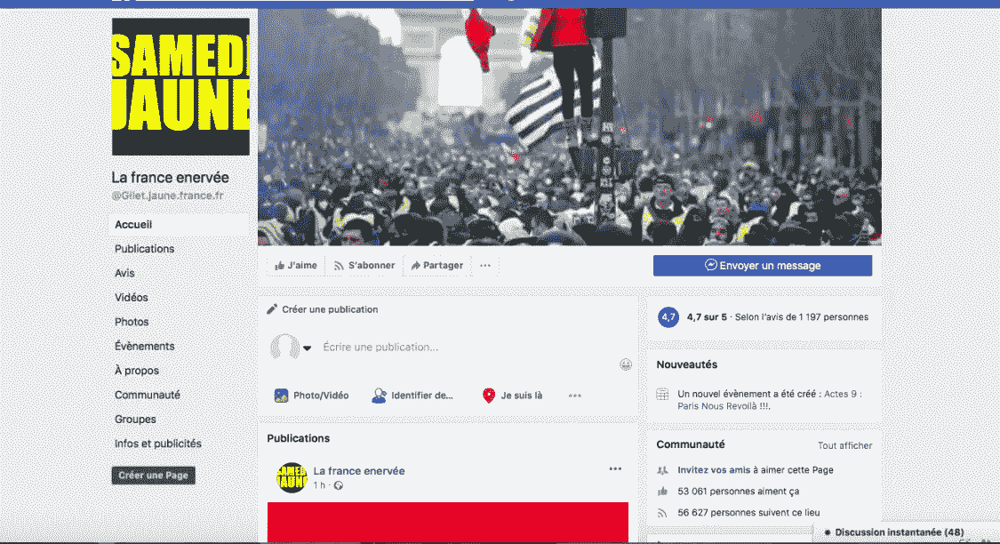

# 人工智能是对民主的威胁吗？

> 原文：<https://towardsdatascience.com/is-ai-a-threat-to-democracy-4bef3e5fcfdd?source=collection_archive---------13----------------------->

Photo by [Randy Colas](https://unsplash.com/@randycolasbe?utm_source=medium&utm_medium=referral) on [Unsplash](https://unsplash.com?utm_source=medium&utm_medium=referral)

比较 Web 2.0 前后发生的深刻变化，非常有趣的是——至少不能说令人失望——注意到我们如何从一个共享、合作和自由交流占主导地位的数字乌托邦转向一个我们开始怀疑计算机和互联网的善意的时代。Web 2.0 黄金时代确实离我们还很远。在阅读一些文章时,“算法”这个词的使用方式似乎与我们谈论病毒的方式相同，而另一方面，公司却被法规和约束的丛林所纠缠。

如果我们想在之前和之后的*中脱颖而出，我们只能同意社交网络已经完全颠覆了数字世界——不可逆转。我们不必忘记自从社交网络进入我们生活的那一天起，它是如何以及为什么如此受欢迎的——人们终于有机会被倾听。这个工具本身无可指责，但网民用它做什么更令人担忧。崛起几年后，促进民主的最佳工具也是传播错误信息和操纵公众舆论的最佳方式。*

**GAFA 的角色**

脸书有 20 亿用户，谷歌占全球搜索量的 90%，苹果的市值达到 1 万亿美元。这些巨人不仅拥有巨大的经济实力，还拥有无与伦比的社会力量。主要由 GAFA 构建的人工智能和算法已经将信息控制中心从政府转移到他们的平台上，没有任何战斗。国家已经完全失去了对信息管道的控制——除了独裁统治，在独裁统治下，网络浏览被高度控制或者干脆禁止。

主要担心的是，算法在如何过滤和显示信息方面发挥着至关重要的作用。当我说*过滤的时候，*我完全排除了平台所有者的任何审查或操纵的意图——希望我是对的——但是一旦数据必须被简单地简化以便阅读，社交网络和搜索引擎就不得不应用过滤器以便粗略地切割数据块，因为简单性、人体工程学和流动性对任何用户界面都是必不可少的。以相关性的名义采取的行动可能会受到质疑，因为根据定义，我们不能依赖未经上游第三方抗衡力量审查和平衡的来源。因此，质疑权力如此集中在同一个人手中的数字代议制民主是合乎逻辑的，甚至是理智的。

我们必须记住民主应该阻止什么。民主应该防止权力的巩固。与独裁者不同，一个正常运转的民主国家的领导人知道选民可能会在下一次选举中罢免他们，而正是这种不安全感被认为会让政府对人民负责。

法国政治哲学家孟德斯鸠阐述了三权分立学说，旨在明确区分立法、行政和司法权力。问题是社交网络变得太大，无法被中立的第三方或政府监管。看起来，我们唯一的选择是相信马克·扎克伯格、拉里·佩奇和谢尔盖·布林，相信他们为我们处理和过滤信息的诚意和意图——但鉴于这一参数，人们似乎不同意也是可以理解的。如果你读到最恶毒的评论，GAFA 的政策和行动被认为是极权主义公司。

我想对这种说法做一点细微的补充，即*极权主义*可以被定义为一种制度，在这种制度中，公共和私人生活的每个方面都是指所有权力都掌握在国家手中的政治制度——这一定义可以证实批评者的说法——但*极权主义*也定义为国家承认其权力不受限制，并努力进行监管。第二个定义不适用于 GAFA 的垄断情况。

社交网络现在是任何社交聚会和互动的节点。

在最近的事件中，有两个重要的例子显示了社交网络是如何成为孵化器的肉汤，其中一切都变得活跃、成长、爆炸或死亡。在 2019 年 4 月举行的西班牙大选期间，我们再次看到社交网络是政党竞选活动的重要工具，没有人能够想象没有社交网络。

然而，当通过所有不同的社交网络来分析每个政党的受欢迎程度时，有一件令人惊叹的事情。在马克·扎克伯格的平台上，左翼的 Podemos 是赢家，而极右翼的 Vox 是 Instagram 上的领导者，拥有超过 25 万名粉丝。

以下是所有平台的社交媒体表现:

胡里奥·塞萨尔·赫雷罗(记者和社交媒体专家)认为，主要问题是社交网络不能正确地翻译和显示真实的投票意向及其分布。正如他在这篇[文章](https://www.euronews.com/2019/04/26/weekend-long-read-social-media-use-in-spain-s-election-campaign-the-good-the-bad-and-the-u)中所说，社交网络“有利于动员、识别和创建群体”，但“我们不应该忘记，它们产生了一种平行宇宙”。

**法国黄背心背后的算法**

他们只有三个人:两个卡车司机和一个有机化妆品的网上销售员。在没有真正相互协商的情况下，他们得出了相同的结论:他们再也无法忍受燃料价格的上涨。10 月 15 日，脸书的一个活动贴出呼吁一个月后封锁道路。正是在社交网络上，运动诞生了。

多亏了在网络上拍摄和播放的视频，其他人物(比如神秘的 Jacline Mouraud)出现了，并最终成为前所未有的混杂运动的第一批代表。

这就是为什么法国记者文森特·格拉德称马克·扎克伯格为黄背心的“最佳盟友”。Glad 最近写道:“毫无疑问，这场运动得到了新脸书算法的帮助，该算法过分强调来自群体的内容，而损害了页面(以及媒体渠道)发布的内容”。事实上，名为 *Edge Rank* 的新脸书算法促进了社区和运动的构建。先前的算法已经被修改，以便产生地理上分散的效果。这样一来，这场运动没有任何领导人的事实——这一事实本可以遏制这场运动，或至少将其最小化——已经被多个地方集会严重抵消，这些集会一度在全国范围内聚集，成为自 1968 年 5 月以来法国最暴力的抗议活动。

**社交网络不知不觉地支持民粹主义吗？**

互联网营销和社交媒体专家与政治家(以前是喜剧演员和演员)的第一次知名合作经历显然是 Giuseppe Piero“Beppe”Grillo 的博客，他与意大利五星运动政党的 Gianroberto Casaleggio 共同创始人。一些分析人士，比如意大利和瑞士记者兼作家、米兰智库沃尔特(Volta)的创始人兼董事长朱利亚诺·达·恩波利，甚至没有将五星运动定性为一个政党，而是一种后意识形态算法。

这个意大利的例子特别有趣，因为它有助于辨别和理解社交网络——以及更广泛的网络——的基本机制之一，即参与营销。在市场营销中，参与是使用战略性和足智多谋的内容来吸引人们，并随着时间的推移创造有意义的互动，以便用户尽可能长时间地停留在网站上。一次点击(即使是随机的)总是会导致更多的信息向同一个方向移动。社交媒体网站的定制化解释了为什么我们不再能在中立和多样化的数字社交环境中浏览。我们会偏离最初的话题，但有必要提及的是，不幸的是，这种机制正是不断增长的*阴谋论的根源。*

Web 2.0 之前的政治时代的机制——其向心效应是向大众媒体收集意见的唯一方式——已经变成一种机制，在这种机制中，即使是很小的行动(并不明显相似)也会影响可能有不同意见、利益和愿景的多个泡沫(社区)。但是在这个过程的下一个阶段，内容的聚合在于*汇总*用户的流量，并定义一个共同的目标——完全由*源源不断的网络愤怒所驱动。*

**走向 CICD 民主？**

在这场震撼社会的数字革命中，政治还有什么位置？谈到寻找解决方案，我们可以看到非常多样的倡议，例如脸书首席执行官的前室友在《纽约时报》上发表了一篇长文，呼吁解散该公司并对其进行监管。他补充说，也有必要制定一部联邦法律和一个专门负责监管科技行业的机构，以平息谷歌、亚马逊或任何想追随脸书脚步的人的热情。其他倡议；2019 年 4 月斯里兰卡发生袭击事件后，政府担心假新闻传播导致骚乱，因此封锁了社交网络，这可能很快成为一个螺旋地狱。

让我们用一个能让开发者社区微笑的眨眼来结束吧。政府能够采取的唯一明智举措是以最佳方式使用和开发人工智能。政治家们需要意识到人工智能生成的双速系统的滞后(这种滞后正在呈指数级恶化)。它打破了政治信任，使其变得无用和不充分，并使人们越来越不满意——而且越来越不满意。

如果政府想要收回和夺回控制权，就必须迅速做出反应(如果还不算太晚的话……)。想象一下我们古老而过时的政治体系中的一些新管道，比如持续的倾听导致快速而持续的行动，怎么样？如果政府还想在不久的将来生存下去，就必须适应这种剧变，而不是在一场提前失败的战争中与技术作战。

*参考文献*

Natalia Oelsner & Marta Rodriguez 和 Cristina Abellan-Matamoros，[https://www . euro news . com/2019/04/26/weekend-long-read-social-media-use-in-Spain-s-election-campaign-the-good-the-bad-and-the-u](https://www.euronews.com/2019/04/26/weekend-long-read-social-media-use-in-spain-s-election-campaign-the-good-the-bad-and-the-u)，2019 年 4 月 26 日，euronews.com。

[桑杰·奈尔](https://medium.com/@nirespire)，[https://medium . com/@ nire spire/what-is-cicd-concepts-in-continuously-integration-and-deployment-4 Fe 3 f 6625007](https://medium.com/@nirespire/what-is-cicd-concepts-in-continuous-integration-and-deployment-4fe3f6625007)，2018 年 5 月 6 日，medium.com

【nytimes.com】https://www . nytimes . com/2019/05/09/opinion/Sunday/Chris-Hughes-Facebook-Zuckerberg . html2019 年 5 月 9 日