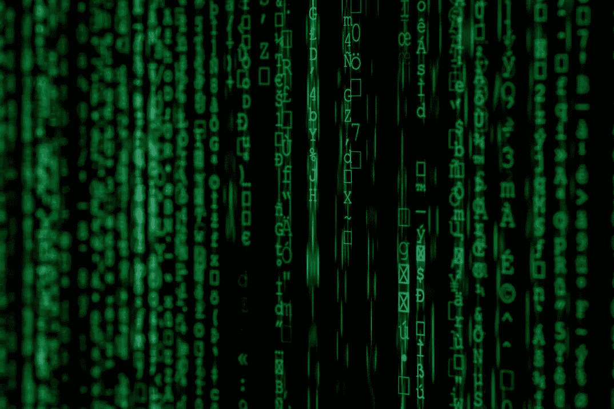

# 人工智能是我们大颠覆的最后希望吗？还是最新的？

> 原文：<https://towardsdatascience.com/is-ai-our-last-hope-for-a-big-disruption-or-just-the-newest-one-357f9c3db618?source=collection_archive---------32----------------------->

## 大数据未能兑现其承诺，这给人工智能带来了越来越大的压力和期望

AI 是我们最后的希望吗？让我们放松一下。AI 和 ML 等行业的一个固有问题是现实与幻想之间的斗争。它是什么和它可能是什么。

这些年来，有很多关于现代技术下一次大发展的承诺。因此，各行业已经向它们投入了数十亿美元。如果不是 AI 和 ML，就是 cloud。如果不是云，那就是“大数据”

问题是，承诺和兑现之间的差距往往比我们愿意承认的要大。以大数据为例。大数据可能是突然出现的“最后的新希望”。大量地。

# 我们在这上面花了几十亿

并且继续这样做下去！[根据一些统计，](https://www.marketwatch.com/press-release/big-data-market-2018-global-analysis-industry-demand-trends-size-opportunities-forecast-2023-2018-08-31)大数据产业价值约 1000 亿美元。这实际上可能是一个保守的估计，但对我们来说是一个大概的数字。

如果大数据每年价值 1000 亿美元，我们估计其中约 40%在专业服务领域。尽管有强烈的关注和投资，但当你得知有多少人失败时，你可能会感到震惊。[根据一些统计数据，](http://www.digitaljournal.com/tech-and-science/technology/big-data-strategies-disappoint-with-85-percent-failure-rate/article/508325)大约 85%的大数据项目令人失望。

不管怎么说，那都是一大笔钱。那么，AI 是我们最后的希望吗？让我们记住以前的“最后希望”和重大承诺。

# 但是失败不是风险的一部分吗？

诚然，今天开始的大多数公司都会失败。人工智能、人工智能和大数据也不能幸免于同样的市场力量，这些市场力量决定了哪个流媒体视频应用将超越其他应用，或者哪个订阅盒服务将占据主导地位。

在任何空间，都有失败。很多都是。的确，他们并不总是坏的。失败也有价值。知识是可以获得的。流程是可以改变的。正如托马斯·爱迪生经常被引用的那样:

> *“我没有失败。我刚刚发现了一万种行不通的方法。”*
> 
> 托马斯·爱迪生，也许吧。

上述观点在咖啡杯或 t 恤上非常管用。在现实世界中，200 亿美元的失败没有什么值得高兴的。

与大数据相关的问题是，大部分数据本来是可以避免的。我们所看到的大数据的涌入本质上是这样的:一场受商业影响的运动，它对商业决策的制定产生了巨大的影响。

# 所以大数据不好？

远非如此。如果应用得当，大数据非常棒。然而，它真正的迅速崛起在很大程度上是由于两个因素:

从我们第一次知道什么是硬盘到今天，硬盘存储的成本是巨大的。现在存储数据是多么的便宜，这几乎是不可能夸大的。从 20 世纪 50 年代末的每兆几千美元；到今天的零头。

进入大数据，并融入相当大的商业压力，即“您是否充分利用了您的数据？”你有一个价值 1000 亿美元的产业，这个产业充满了希望。

*“难道您不想用您的数据做更多的事情吗？在现代，它的获取成本更低，存储成本更低，我们可以分析它，并利用它开发各种有利可图的计划。”*

当你告诉百万美元的公司，这里有更多的钱可以赚，并且释放这种潜力的成本很低，你会得到什么？

你会在一夜之间得到 1000 亿美元的产业。

这也不是低估大数据的价值。如果应用得当，大数据可以是所有这些东西。对所有用户来说，这并不是所有的事情。在最坏的情况下，这是一个虚假的承诺，基于商业化的压力，成为下一个大事件的一部分。

# AI 是我们最后的希望吗？

几乎没有。人工智能和人工智能相对于大数据难题的优势之一是有更多的机会来确定可以实际实施的解决方案。这些解决方案能够产生切实、显著的影响。

也就是说，所有这些概念的概念。人工智能、人工智能、大数据等提供无限价值或成为社会、人类的救世主，或者仅仅是商业被夸大了。我们认为，以这种方式定位这些技术是一个有根本缺陷的立场。

我们并不怀疑人工智能是否会成为救世主，而是有一点不同的看法。这更像是急于为大数据未能兑现其作为最后一个大救星的承诺提供答案。

# 想想淘金热

这种对人工智能和人工智能的无限可能性和能力的非理性希望是有缺陷的。我们会把它比作淘金热的心态。也就是说，成千上万的人涌向令人惊叹的承诺。此外，成千上万对潜在客户不感兴趣的人因为害怕错过机会而感到压力。

我们知道那里发生了什么。绝大多数*没有*一夜暴富。大多数在 T4 发大财的人并不是因为找到了黄金。相反，他们向那些希望暴富的人出售工具、住宿、供应品和其他辅助配件。

在这一点上提及愚者之金是懒惰的。不过需要强调的是，AI、ML、大数据是*而不是*天生的傻子金。*也不是真正的*黄金。

然而，虚假的承诺和超商业压力使这些系统成为他们不是的东西，有时会让它感觉如此。

追逐这个闪亮的物体有着巨大的社会和商业压力。无论是黄金还是大数据，甚至是人工智能。然而，我们应该有一个道德标准来衡量我们对这种冲动的反应速度。

随着新技术和新工艺的投入使用，采用它们的压力将会持续存在。从务实的角度来看，我们应该抵制为了收养而收养的冲动。相反，我们应该关注这些工具的实际应用，以及它们如何最好地服务于我们的个人和商业需求。

# 这对人工智能意味着什么？

大数据虽然有用，但确实无法兑现其崇高的承诺。永无止境的存储，广泛的实际应用，不可估量的盈利分析，不胜枚举。

为了避免陷入同样的陷阱，应该注意的是，AI 和 ML 都已经在各种应用中实现了这些目标中的一些目标。他们将继续创新和探索。

人工智能和人工智能可能会给一个或多个行业带来巨大的破坏。然而，准确地知道这将在哪里、何时或如何形成是很难预测的。

就目前而言，我们这些在这个领域的人应该谨记一句道德箴言，不要过度宣传、过度销售和交付不足。这些技术有足够惊人的可能性，我们不必向世界承诺。

AI 是我们最后的希望吗？大概不会。只是最近的一个。而是为了拥有真正的、开创性的、甚至是颠覆性的力量；它不一定是技术创新的全部。

它必须工作。更重要的是，为你需要它做的事情而工作。

*原载于 2019 年 5 月 14 日*[*【https://introspectdata.com*](https://introspectdata.com/is-ai-our-last-hope-for-a-big-disruption-or-just-the-newest-one/)*。*