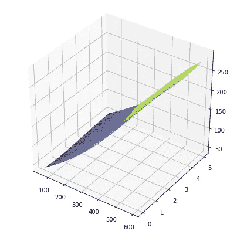
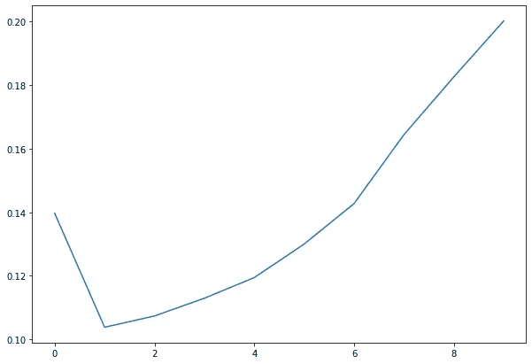

# 从长远来看，贵的车更便宜吗？

> 原文：<https://towardsdatascience.com/is-an-expensive-car-cheaper-in-the-long-run-52b2875b0eaa?source=collection_archive---------22----------------------->

dumsnlhet 与二手车价格下降


Image from unsplash.com

有一个瑞典语单词“Dumsnå”，意思是“吝啬到最后会赔钱”。这是一个有趣的概念，与[康德的绝对命令](https://www.wikiwand.com/en/Categorical_imperative)有关，因为它们都是关于自我挫败的行为，而且它在日常生活中出人意料地频繁出现。它可以是这样的东西:

*   开了很长一段路，用了很多汽油去买一个稍微打折的产品
*   通过不打车来省钱，但却在面试时迟到了
*   购买廉价的不健康食品，却不得不为健康问题付出代价。
*   使用少量牙膏，但不得不支付昂贵的牙医
*   还有，或许，这篇文章的主题，买一辆便宜的车。

我经常想，事实上，买一辆便宜的车是否更贵，我也听到其他人提出这个问题。

一辆汽车的成本是一个复杂的问题，涉及到燃料价格、零部件、机械和长期价值损失等因素。在这篇文章中，我将只看最后一个，价值的损失。

## 价值损失

在瑞典，几年后卖掉你的汽车是很常见的，因此汽车的实际成本可以更好地描述为(买价-卖价)/拥有汽车的时间。人们普遍认为越贵的车质量越高，保值能力也比便宜的车强，但到底强多少呢？

## 资料组

为了研究这个问题，我决定使用瑞典公共汽车网站 bilpriser.se (carprices.se)的数据。这是一个主要被人们用来评估他们自己的车或者他们想买的车的网站。该统计是基于 kvarndammens 公司自己的汽车销售数据。价格以千瑞典克朗为单位，在撰写本文时兑换成美元非常容易，因为 10 克朗= 1 美元。欧元的兑换率是 10 克朗= 0.93€。

数据点代表某一汽车型号的平均价格损失。

## 看着这些数据

让我们画出 10 年后的价值损失。


Value loss after 10 years vs Initial price

单看，初始价格和价值损失之间似乎存在线性关系。但为了以防万一，让我们测试 scikit learn 中的几个回归变量(线性回归、2、3 和 6 次多项式回归、随机森林回归变量)。


为了评估不同的模型，我们将使用 R 分数。R 分数是我们将我们的模型与一个简单得多的模型进行比较的地方:所有数据点平均值的水平线。[更多详情点击此处](https://www.wikiwand.com/en/Coefficient_of_determination)。

将数据分成训练集和测试集(多次)并计算 R 值得出:

```
Linear regression: 0.824,
Polynomial regression of degree 2: 0.816,
Polynomial regression of degree 3: 0.812,
Polynomial regression of degree 6: -8.27,
Random forest regressor: 0.784
```

可以看出，线性回归确实是该数据最准确的模型。


根据我们的模型，我们有以下关系:

```
loss = 0.61*initial_value+33.6
```

这可以解释为:10 年后，所有的车都损失了 3.36 万 kr + 61%的价值。这意味着平均而言，拥有一辆昂贵的汽车比拥有一辆便宜的汽车更昂贵。这并不意味着所有便宜的汽车都比所有昂贵的汽车便宜，这只是总的趋势。通过查看价格和价值损失之间的相关性也证实了这一点，该相关性为正 92.5%。


5 年和 2 年的回归线是:

```
loss_5 = 0.41*init+7.9
loss_2 = 0.54*init+23.8
```

## 比较不同年代的汽车

到目前为止，我们只研究了全新汽车的价值损失。但是如果我们对比不同年代的车呢。


Buying price and age vs value loss after 5 years

在这个 3D 散点图中很难看到，让我们做一些回归并绘制结果。

在这种情况下，最适合的回归模型是 3 次多项式回归，R 值为 0.865。看起来是这样的。



就像以前一样，总的趋势是越贵的车损失越大，但也有可能看到廉价车中老款车和高价车中新款车增加的迹象。为了看得更清楚，我们将画出上面区域的等高线。那它，恒值损失线。


可以看出，一辆价值约 180 tkr 的新车与一辆使用 5 年、价值约 170 tkr 的旧车价值损失相同。这表明，一辆 5 年车龄、价值约为 175 tkr 的旧车比价值约为 180 tkr 的新车损失更大。这是，在这种情况下购买 175 tkr 汽车有点愚蠢。对于更贵的汽车来说，这种关系正好相反。

## 结论

如果只比较新车，买一辆便宜的车并不愚蠢，事实上它更便宜。但是，由于固定成本，相对价值损失实际上对于一辆昂贵的汽车来说更小。所以，如果一辆两倍贵的车对你来说价值是两倍，就舒适性或其他功能而言，更贵的车实际上是更好的交易。让我们画出相对价值损失。根据线性回归模型，这当然遵循曲线(0.61x+33.6)/x。


对于二手车和比较不同车龄的车来说，实际上有这样的例子，从长远来看，买便宜的车更贵，尽管影响很小。

# 额外收获:来自数据的其他见解

## 每年平均价格损失



Price loss in percent per year

由此可见，买一辆 1 年的车，只用几年就卖掉是最有利的。

作为方框图:


有趣的是，车龄越长，不同车型之间的价格损失就越大。

## 每个品牌的价格损失


一些汽车品牌更擅长保值。按“价格损失绝对正常”排序，这是根据线性回归线标准化的。

我认为值得注意的是，价格损失率并不一定反映车辆的质量，而是人们对质量的看法，这可能是知情的，也可能是不知情的。

## 每个国家的价格损失


在瑞典，德国汽车被视为高质量/高地位，日本和瑞典汽车被视为可靠，所以这个结果并不令人惊讶。

对汽车价格损失的分析到此结束。