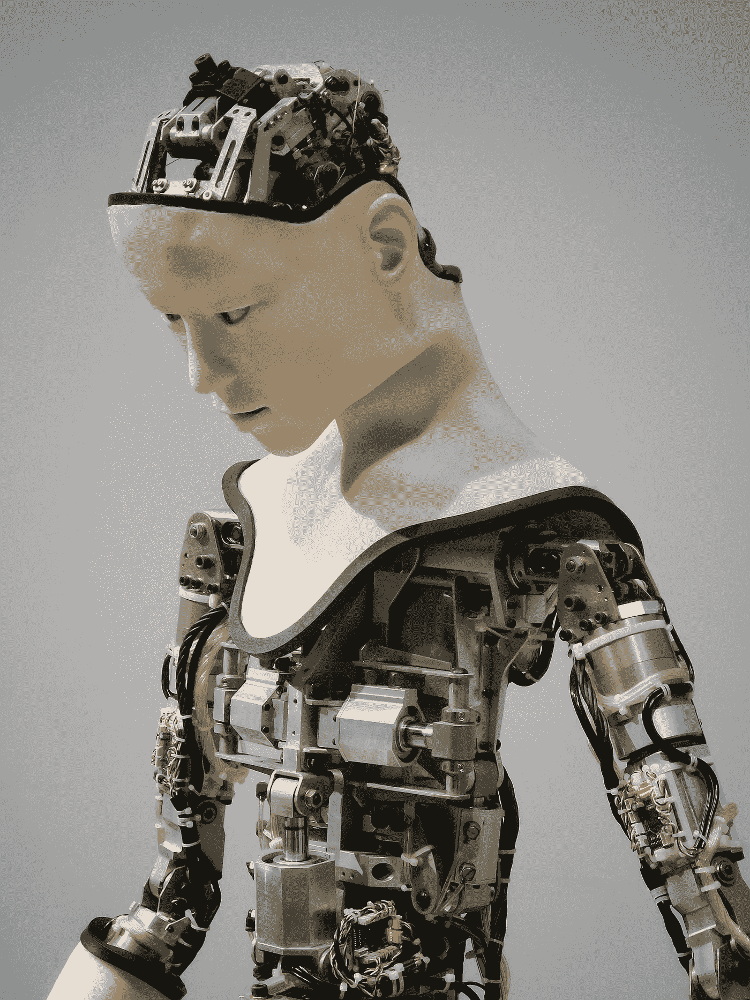

# 人工智能可能吗？

> 原文：<https://towardsdatascience.com/is-artificial-intelligence-possible-28b8500d3158?source=collection_archive---------8----------------------->

## 哲学告诉我们它不是

Photo by Franck V. on Unsplash

在科学研究和工程领域，我们在计算机开发和人工智能方面取得了长足的进步。它现在甚至在我们的家中，例如 Alexa，它能够与我们互动，并根据命令完成任务。然而，这远远不是人类的全部能力。

人类是有情感和认知能力的。现在，我们离创造具有这些能力的人工智能还很远。即使我们设法完成赋予人工智能这些品质的壮举，我们仍然会因为一个潜在问题的答案而功亏一篑:

> 作为人类意味着什么？

我们可以说，人之为人，就像我上面说的，就是有情感，有认知能力。但是，科学已经证明，动物是有情感的，并且呈现出一定的认知能力。例如，如果动物缺乏某种认知能力，那么狗将无法遵循语音命令，甚至不知道它们的名字。

那么，如果情感和认知也存在于动物身上，那么人类有什么特别之处呢？

## 人类以为自己存在。

作为人意味着什么的问题基本上是一个哲学问题。我们可以求助于法国哲学家勒内·笛卡尔，他说:“我思故我在。”他这么说的意思是，既然他能够思考和理解他活着，那么他一定存在。笛卡尔延续了这一观点，他说他只能知道自己的存在。然而，他永远无法确定其他人是否存在。

因此，我们人类的核心品质是我们相信自己的存在。但是我们如何知道自己的存在呢？我们周围的世界可能只是一个精心制作的幻觉。

这个哲学原理挑战了人工智能的形而上学本质。为了理解如何，我们必须看看人类存在和快乐原则之间的关系，以及它如何应用于人工智能。

首先，我同意笛卡尔的观点。我只能确定我存在，因为我不知道其他人是否在思考，或者他们是否能思考。一个推论就是我分不清这个现实是不是真实的。

例如，我做过许多梦，或者至少我认为是梦的东西，感觉是真实的。

我记得有一次“梦见”我和父亲在密苏里州，我和他呆了一整天，然后上床睡觉。当我从“梦中”醒来时，我完全糊涂了，因为“在现实中”，我和母亲在得克萨斯州。我试图弄清楚我是如何在密苏里入睡，然后在德克萨斯醒来的。然后我意识到我“梦见”我在密苏里州，但实际上我一直在德克萨斯州。

公平地说，“梦”感觉不像现实。但是，梦和现实之间的区别仍然不能证明*这个*就是真正的现实。几年后我会发现自己在蓝色药丸和红色药丸之间做出选择。

## 一切事物和每个人都是为我们而存在的。

既然我们不能确定现实是否存在，那么我们可以得出这样的结论:世界确实是围绕着我们转的。其中的每个人，以及周围的一切，都是为了我们的目的和用途而存在的。如果它不围绕我们旋转，那么它将证明其他人的存在和现实的存在，然而，笛卡尔告诉我们，这种情况是不可能的。

所以如果我们不能证明这种现实存在，那么我们怎么能告诉一台计算机它存在呢？如果我们能够知道的唯一真实的事情是我们作为个体存在，那么我们如何知道计算机是否已经发展出了与人类相匹配的认知能力？

我们也许可以使用图灵测试来测试一台机器，(只有当计算机欺骗一个人相信它是人类时，它才通过测试)，但这无关紧要。这是因为我们无法确定计算机是否意识到它的存在；由于我们“变化无常”的现实，我们也无法将计算机视为一个现存的实体。

## “快乐原则”挑战人工智能。

人工智能面临的另一个挑战是我所说的“快乐原则”。在我的文章*[我作为享乐主义者的生活](https://medium.com/fat-daddys-farm/my-life-as-a-hedonist-fc9cc4c2ab28)、*中，我谈到了人类行为的驱动因素是快乐。我们采取的每一个行动都是为了追求快乐。如果没有快乐原则，人工智能永远无法与人类智能相媲美。**

**事实上，如果我们设法创造出按照快乐原则行事的人工智能，那么我们就违背了最初创造它的目的。这是因为它将变得自私，而不是为我们服务。就像我上面说的，计算机会相信这个世界是围绕着自己转的，并且只有*在追求自己的快乐时才会采取行动。***

**此外，如果我们给机器快乐原则，我们就会面临人工智能接管的威胁，就像“终结者”一样。我们可以通过编程让计算机以服务人类为乐来防止这种事情发生；但是我们剥夺了它的自由意志——因此，没有制造出真正的人工智能。**

**例如，我们目前有自动驾驶的特斯拉汽车。如果我给汽车设定快乐原则，它只会为自己服务。我可能想去一家豪华的意大利餐厅，但我的红色特斯拉“贝蒂”可能想开车带我去纽约吃披萨，因为它觉得这种旅行本身更令人愉快。然而，如果我给它编程，让它以服务我为乐，那么汽车就不再有自由意志；因此，它不可能真正拥有人工智能。**

## **我们的人性挑战人工智能。**

**最后，快乐原则和我们的存在本质是不能共存的概念。如果我们给人工智能机器编程，让它拥有知道它存在的能力，而忽略了我们无法判断计算机是否知道它存在的事实，那么它就失去了快乐原则。这都是因为它会意识到它的真正目的是*为我们*服务。这意味着除了为人类服务之外，它不能设想任何事情——因此没有给它选择自己行动的自由意志。这个限制是因为它现在可以识别它是一个工具而不是人。所以它不能对任何形式的快乐做出反应，因为它实际上不是人类。**

**如果我们给机器编程，让它拥有快乐原则，它就会对自己的存在失去任何理解。这是因为它将被赋予自由意志，从而阻止机器实现其真正的目的。因此，它永远无法理解它是作为一种工具而存在，而不是一个人。**

**如果我们不能给一台机器编程，让它知道自己的存在，并拥有快乐原则，那么问题就变成了:**

> **人工智能可能吗？**

**对我来说，答案是否定的。**