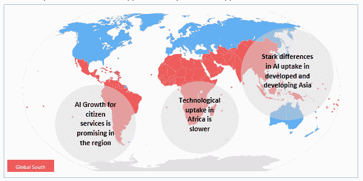

# 人工智能是解决全球南方邪恶发展挑战的前沿解决方案吗？

> 原文：<https://towardsdatascience.com/is-artificial-intelligence-the-frontier-solution-to-global-souths-wicked-development-challenges-4206221a3c78?source=collection_archive---------16----------------------->

与 Mohsen Gul(诺丁汉大学)合著。这是基于为开发署非洲创新股进行的研究。

*就本文而言，全球南部指的是非洲、拉丁美洲和包括中东在内的亚洲发展中国家。*

# 1 当前景观

迄今为止，几乎所有的研究工作都集中在人工智能(AI)、机器学习、自动化和物联网(IoT)等前沿技术对欧盟、英国和美国等高收入国家人民的影响上。本文的重点是确定人工智能作为一种前沿技术对中低收入国家公民参与的影响的关键例子，这些国家面临着与高收入国家相同的机遇和风险(通常程度更高)，以及这些国家特有的额外机遇和风险。

图 1 显示了全球南部(红色)的地图，并强调了当前的人工智能吸收情况。该地区的测绘工作确定了三大洲 50 多个人工智能应用程序，用于公民参与。这些应用从传统的聊天机器人到先进的机器人和机器学习过程。

根据普华永道(2017 年)的数据，中国将在未来几年获得最大的经济收益，人工智能将使 GDP 增长 14.5%，但它指出，由于人工智能技术的采用率预计将低得多，大多数其他发展中国家将经历更温和的增长。中国国务院最近发布了人工智能发展指导方针，目标是到 2030 年成为该领域的全球创新中心，人工智能产业的总产值预计为 1470 亿美元。中国人工智能产业创新联盟(CAIIIA)成立于 2017 年。新成立的联盟设定了一个目标，即在未来三年内孵化 50 个人工智能产品和 40 家公司，启动 20 个试点项目，并建立一个技术平台。新加坡最近宣布计划在未来五年内向人工智能投资超过 1 亿美元。从 2010 年到 2014 年，中国提交了 8410 项人工智能申请，位居第二。在此期间，日本和大韩民国分别提交了 2071 份和 1533 份。就提交的专利数量而言，印度也是全球十大国家之一。此外，中国和印度是人工智能公司数量排名前 10 位的国家(亚太经社会，2017)。

在中低收入国家，人工智能被用来改善公共服务和公共产品的交付，从试点项目到更大规模的推广，这样的例子不胜枚举。人工智能似乎特别适合简化政府网站上的交易。人工智能也被用于应对公共卫生问题，如预测寨卡和登革热等疾病的爆发。例如，巴西非政府组织 Viva Rio 与初创企业 AIME(医疗流行病学中的人工智能)合作，该公司结合卫星图像识别系统分析现有的地方政府数据集，以部署低成本预测，预测未来三个月内我们预计哪里的疾病发病率会更高。值得注意的是，这项技术是为马来西亚设计的，但它在巴西的试验中有 84%的诊断成功率。在巴西取得低成本成功后，AIME 已被部署到多米尼加共和国。

在其他情况下，人工智能被用于改善警察的覆盖范围，例如在处理交通问题时。在乌干达，人工智能被用于为个人或紧急车辆提供最佳路线建议，动态地重新部署有限数量的交通警察，并分析道路网络的可能重新配置以消除瓶颈。在其他情况下，它被用于环境目的。例如，在肯尼亚，世界自然基金会(WWF)支持无人机使用人工智能设备。9 个月后，超过 12 名猎人在马赛马拉被逮捕。世界自然基金会从 Google.org 获得了 500 万美元的资助，用于使用这种人工智能设备来保护野生动物。人工智能还被用于农业事务，包括用智能手机识别作物疾病。在乌干达开发的 Mcrops 是一种用于诊断木薯植物中病毒作物疾病的诊断工具。生病的植物被实时标记，这使得农民可以采取行动，阻止疾病的传播。在尼日利亚，人工智能正被用来帮助农民通过一个 bot 平台销售他们的产品和购买服务，该平台依赖于短信和其他渠道，如 USSD，Slack 等。

人工智能也被用于预防和预测自然灾害。红十字会/红新月会气候中心与多哥的 Nangbéto 大坝有一个正在进行的项目，该大坝经常溢出，对下游居民的生计造成极大干扰。过去的模型在预测溢出的可能性方面表现不佳，但使用众包信息(包括通过手机)和人工智能技术的组合，开发了一种改进的溢出预测模型。此外，荷兰红十字会的数据倡议利用以前自然灾害的数据开发了模型，以便更好地管理资源和确定援助的优先次序。它是在 2016 年菲律宾台风海马后使用的，经过与受损财产数据的比较，证明是准确的。

基于人工智能的自动翻译和语音识别系统也正在出现，这可能对使用多种语言的国家产生重大影响。包括印度、印度尼西亚和尼日利亚在内的许多中低收入国家就是这种情况。这些系统还可以在文盲率高的地方产生影响，使人们能够通过口头而不是书面方式与政府或公共服务提供者互动。这将特别有利于文盲率高得不成比例的边缘化群体。自动翻译和语音识别系统的一些例子包括由 Pulse Lab Jakarta(印度尼西亚)开发的“Translator Gator ”,用于邀请人们以鲜为人知的语言和方言创建分类法或关键词集合，以及由微软和新加坡政府开发的“Conversations as a Platform ”,用于代表一种根本性的转变，即人类语言的力量将被用来使聊天机器人对公民和选民更具预见性、可访问性、参与性和包容性。

下一节将详细讨论一些案例研究。对于每个案例研究，都提供了有关地理覆盖范围和经营规模的信息。

# 1.1 案例研究

# 1.1.1 亚洲

日本议会大赦国际(日本、亚洲；比例:试点)

日本政府正在测试人工智能，以帮助官员起草提交给议会的回应。这项技术将帮助官员起草用于决策的回应，通过挖掘过去对政策问题的意见和官员在议会期间提出的替代建议。政府将首先向该系统输入五年的议会议程总结，然后再做出回应。

根据试验结果，东京将在政府的其他部门扩大人工智能的使用。政府已经启动了一项广泛的计划，在公共服务中使用人工智能和机器人技术。被称为“社会 5.0”的政府设想利用科学和技术在应对老龄化、生产率增长缓慢和提高人类福祉等挑战方面发挥更重要的作用。

新加坡登革热风险地图(新加坡，亚洲；比例:可操作)

作为一个热带国家，新加坡面临着季节性登革热病例，在温暖的 6 月至 10 月达到高峰。该国的主要战略是对登革热热点进行预防性监测。然而，这是劳动密集型的，消耗了本已有限的熟练病媒控制官员。因此，政府决定使用数据来确定登革热风险最高的地区，并帮助该机构更有效地部署人员。

该团队使用机器学习模型创建了一个彩色编码的风险地图。该模型分析来自不同机构的数据，对整个国家的登革热总体风险进行排名。这些数据包括卫生部过去的登革热病例；新加坡统计局的人口估计数；新加坡国立大学遥感图像传感和处理中心的植被指数；来自未来城市实验室 ETH-NUS 的公共交通信息；和来自 NEA 监测方案的蚊子数量数据。

风险地图也有助于开展有针对性的宣传活动，例如，在高风险城镇的公共汽车站投放预防登革热的广告。该项目获得了 2017 年在创新实验室世界举办的 GovInsider 创新奖的最佳数据使用奖。

mAadhaar 应用程序(印度、亚洲；比例:可操作)

印度唯一身份认证机构(UIDAI)推出了 mAadhaar 应用程序，允许用户在手机上携带数字版的身份认证资料。据《经济时报》报道，该应用的用户可以在智能手机上下载他们的 Aadhaar 号码档案，因此不需要随身携带实体卡。Aadhaar 号码是由 UIDAI 向印度公民发放的 12 位随机识别号码，它与姓名和出生日期等基本人口统计信息以及指纹和虹膜扫描等生物特征信息相关联。这些数据存储在一个集中的生物特征 ID 数据库中。Aadhaar 系统有超过 11 亿公民注册，每年为当前政府节省约 20 亿美元。

2017 年 11 月，印度商业和工业部成立了人工智能工作组，启动人工智能在印度经济转型中的应用。

SAAD(迪拜)(阿联酋，亚洲；比例:可操作)

该市首个利用人工智能的政府服务，由 IBM Watson 提供支持。它旨在让企业家和投资者提出与在迪拜建立企业有关的问题，并获得关于各种主题的实时回复，包括企业许可要求和注册流程。“Saad”旨在理解自然语言，摄取和理解大量数据，从其交互中学习和推理，并提供响应，以帮助用户决定正确的行动路线。

吸血鬼工具(印度尼西亚，亚洲；比例:可操作)

印度尼西亚正面临粮食不安全和营养不良的威胁，并面临“高得惊人”的发育迟缓水平。Pulse Lab Jakarta 与世界粮食计划署(WFP)和联合国粮食及农业组织合作开发了一个平台，用于识别需要帮助的受影响社区。吸血鬼可视化工具结合了几个层次的数据:用户可以查看粮食不安全和依赖农业的社区生活在哪里；关于降雨量异常和植被健康的数据；以及这些地区主食的众包价格。安装在总统情况室的吸血鬼，是当局管理食品安全和更好地分配资源的“预警系统”。随着吸血鬼在印尼的成功，WFP 现在正与斯里兰卡政府讨论在印尼安装它。

Bindez(缅甸，亚洲；比例:可操作)

Bindez 的出现源于过去几十年许多国家上网时面临的一个挑战:如何让他们国家的语言与计算机对话。Bindez 是缅甸语索引的首字母缩写，该项目由两名缅甸技术人员 Yewint Ko 和 Htet Will 在 2013 年年中作为本地语言搜索引擎启动，当时该国刚刚对新技术开放，内容消费需求变得显而易见。它现在使用自然语言处理和文本分析来跟踪在线仇恨言论。

# 1.1.2 非洲

可持续发展和人工智能实验室(非洲；比例:可操作)

该实验室正在结合卫星图像和机器学习来预测贫困。使用根据调查数据训练的最终模型，它可以估计任何有白天卫星图像的地点的人均消费支出。该实验室受斯坦福大学全球发展和贫困项目的委托，并得到美国国家科学基金会的部分支持。

艾滋病毒患者的机器人药剂师(南非、非洲；比例:试点)

机器人药剂师正在南非街头向艾滋病毒携带者分发药物。该国感染艾滋病毒的人数最多——700 万。然而，根据南非卫生部的数据，330 万人没有服用他们应该服用的药物。过去，抗逆转录病毒药物只能通过昂贵的私人护理获得。

机器人不会透露病人的身份，有助于消除任何与疾病相关的社会耻辱。它还将为患有结核病等慢性疾病的其他患者分发药物。有了机器人配药器，患者可能不再需要在医院或诊所等几个小时才能拿到每月的剂量。该试点项目由约翰内斯堡海伦约瑟夫医院的“保健权利”项目管理，由卫生部和非营利的全球基金资助。

类似举措:尼日利亚初创公司 [Aajoh](https://www.aajoh.com/) 使用人工智能来帮助通过文本、音频和照片发送症状列表的个人，以诊断他们的医疗状况。

# 中美洲和南美洲

罗西(巴西，南美；比例:可操作)

在巴西，一组数据分析专家已经使用人工智能技术来监控政府官员。他们致力于限制国会议员寻求报销差旅费和伙食费的欺诈行为；在获得启动费用的众筹后，他们创造了 Rosie，这是一个人工智能机器人，它可以分析立法者的报销请求，并计算它们被证明有理的概率。不出所料，罗西发现代表们经常作弊。

*类似举措:*英国严重欺诈办公室在人工智能初创公司 RAVN 的帮助下开发了一个机器人，该机器人随后帮助政府执法部门筛选、索引和总结了 3000 万份与欺诈调查有关的文件。

CitymisVis(阿根廷，南美洲；比例:可操作)

阿根廷政府与微软拉丁美洲合作开发的一个交互式工具，允许公民报告和跟踪从街道基础设施差到城市卫生设施不足的各种问题。通过这一工具，市政当局听取并回应公民的请求和投诉。由于在几个城市成功采用了 Citymis 社区，每天都会产生大量数据，需要相应的服务部门进行分析。对公民请求和投诉的智能分析可以提高服务协调水平，并有助于相关当局的决策过程。

《我的世界》(墨西哥、中美洲；比例:可操作)

一项联合国倡议正在使用电脑游戏《我的世界》帮助超过 25 个发展中国家的公民设计公共空间，其中包括墨西哥。这个名为“一个街区接一个街区”的联合国项目将这个游戏变成了城市设计中的“社区参与工具”，重点是贫困社区。《《我的世界》》是有史以来世界上第二畅销的电子游戏。在游戏中，玩家使用有纹理的立方体来构建虚拟世界。根据微软研究院剑桥实验室的说法，人们在《我的世界》建造了令人惊叹的建筑，做了令人惊叹的事情，这使得实验者可以投入任务，将人工智能技术扩展到超出其现有能力。

Elefantes Blancos App(哥伦比亚，C. America 比例:可操作

公民使用智能手机应用程序 Elefantes Blancos(白象)发现了 1.63 亿美元的公共工程腐败和低效。这款智能手机应用于 2013 年由哥伦比亚透明秘书处(Transparency Secretariat)推出，自那以来，已经发现了 54 个“白象”项目——那些被公民视为日渐衰落、未完成或被放弃的公共工程。在透明度秘书处的压力下，价值超过 40 万美元的项目中有 15 个已经完成，27 个正在起诉中，12 个项目目前正在调查中( [Guay，2017](https://apolitical.co/solution_article/colombias-anti-corruption-app-identifies-163m-neglected-projects/) )。

市民可以将该应用下载到他们的智能手机上，然后上传未完成的公共项目的照片。用户可以对最有问题的项目进行投票，该应用程序决定每个项目的位置和报告频率。透明度秘书处随后开始评估项目的腐败情况。虽然透明度秘书处不能起诉案件，但 Elefantes Blancos 应用程序已经证明了它的价值，该应用程序的控制权将移交给当地审计员——审计员拥有起诉腐败的法律权力。

# 1.1.4 挑战

必须指出，这一地理区域的国家在政治、经济和社会方面各不相同。因此，人工智能技术在国家和地区层面提出了几个挑战。已查明的一些主要障碍包括:

*   随着新加坡和印度尼西亚等发达经济体以惊人的速度投资于技术飞跃，一个可能的前沿技术鸿沟正在出现，这使该地区的其他国家面临被抛在后面的风险
*   在使用和滥用此类技术和相关数据方面，国家、私营部门和发展部门之间普遍缺乏信任
*   政府和决策者在开发技术先进的治理解决方案方面的技术能力有限，导致过度依赖捐助机构和其他发达国家
*   有限的研究和基线数据可用于优先考虑国家和区域决策支持系统的基础设施要素
*   由于技术改造的激增，对技术失业的潜在担忧持续存在。

这篇文章承认，全球南部的一些国家正处于领先地位，预计将成为未来的主要市场。这一突出地位意味着，政府应谨慎考虑本文提出的政策优先事项和问题，以解决道德问题，确保为未来培养适应性强的劳动力，并建立区域层面的体系，以实现可持续的技术创新。