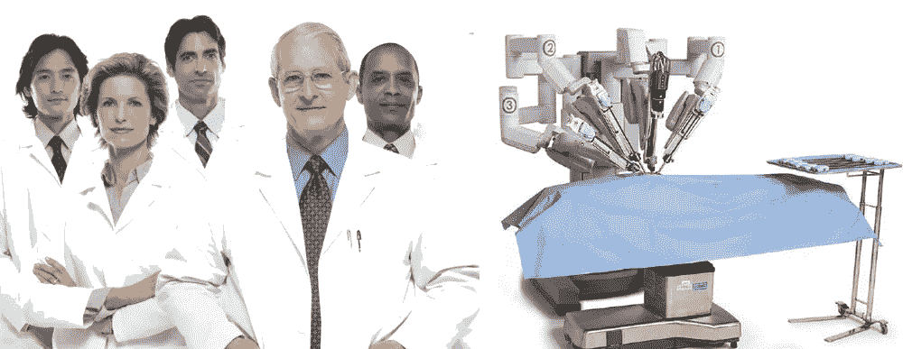

# AI 会预测医疗保健的未来吗？*

> 原文：<https://towardsdatascience.com/is-artificial-intelligence-the-future-of-health-analytics-3d54c11e2fe6?source=collection_archive---------27----------------------->

随着医疗保健行业关注人工智能、医学生和从业者的好处，我们不应忽视技术如何塑造该行业的未来。

如果人工智能的目标是创造一种超越最有天赋的研究人员和临床医生的超人智能，那么健康分析的发展将如何影响生命科学的手段、目标和伦理？人工智能是一场重大进化转变的核心，这场转变正在模糊生物学、技术和社会之间的区别。这种相互依赖挑战了死亡率、发病率和医疗保健的传统界限。在快速概述了当今健康分析的机遇之后，让我们回顾一下医疗从业者在不久的将来面临的一些挑战。

健康分析利用数据科学从医疗数据的模式和相关性中开发洞察力，以改进决策。如今，数据科学正被用于诊断医疗状况、提高显微外科手术的精确度、制定治疗计划以及开发更有效的药物。电子健康记录和虚拟助理的逐步引入简化了医疗流程，改善了患者的疗效和安全性。[【我】](http://file///C:/Users/Lee/Dropbox/Conferences/Is%20Artificial%20Intelligence%20the%20future%20of%20Health%20Analytics.docx#_edn1)目前的研究表明，机器学习将恶性肿瘤的误诊率降低了高达 85%。[【ii】](http://file///C:/Users/Lee/Dropbox/Conferences/Is%20Artificial%20Intelligence%20the%20future%20of%20Health%20Analytics.docx#_edn2)系统地使用算法可以显著减少医疗保险和支付计划中的欺诈行为，这些欺诈行为每年给该行业造成 800 亿美元的损失。[【iii】](http://file///C:/Users/Lee/Dropbox/Conferences/Is%20Artificial%20Intelligence%20the%20future%20of%20Health%20Analytics.docx#_edn3)*随着该学科的重点从预测转向处方，该行业的经济模式很可能从“成本保健”转变为“健康保健”*鼓励患者、家庭和社区改变生活方式，以确保他们未来的福祉。

健康分析的进步正在改变我们对死亡率和发病率的理解。未来学家似乎更乐于争论“超人类”是否会活到几个世纪，而不是探索对人类来说意味着什么。在我们看来，人类的一个决定性特征是自主性:我们做出明智的、不受胁迫的决定的能力。第二个特征是代理——个人独立行动的能力。第三是同理心——理解我们周围世界并与之相关的能力。第四是伦理——帮助人类区分对错的共同价值观。最后，智力唤起我们获取和应用知识和技能的能力。*健康分析将如何影响医学界对幸福的定义？*

健康分析改变了患者、医生和卫生机构之间的系统关系。量化的自我运动，或“通过数字了解自我”，表明个人对改善自己的身体、精神和情感健康负有主要责任。尽管自我跟踪的概念至少可以追溯到萨摩斯的毕达哥拉斯，但数据科学的发展在很大程度上促进了患者可以使用他们的个人数据来改善“自我护理”的想法。[【v】](http://file///C:/Users/Lee/Dropbox/Conferences/Is%20Artificial%20Intelligence%20the%20future%20of%20Health%20Analytics.docx#_edn5)最近，可穿戴设备(Fitbit、Apply Watch、UV Sense……)和环境技术(智能药丸、虚拟语音助手、嗅觉技术……)的广泛采用推动了这一趋势。将所得数据应用于线性回归模型、可视化技术和数据叙事，使患者能够在讨论自身福祉时发出自己的声音。*医疗行业应该只关注他们治疗的患者，还是应该为他们服务的人群的福祉而受到激励？*

尽管技术对医疗实践的影响从来都不是中性的，但人工智能的引入将严重考验该职业的资质。随着生命科学中机器学习应用的成熟，可用于描述性和规范性分析的算法的多样性和复杂性呈指数增长。医院和医生现在都可以利用人工智能诊断，而不必承担留住更多训练有素的专业人员的成本和时间限制。在标准化机器学习的使用中，从业者可能永远不会花时间研究模型、代码，也不会花时间研究用于建立诊断阈值的训练数据。更令人不安的是，该行业对数据的日益依赖已经微妙地改变了“幸福”、“保密”、“真实”和“信任”的传统定义。[【VIII】](http://file///C:/Users/Lee/Dropbox/Conferences/Is%20Artificial%20Intelligence%20the%20future%20of%20Health%20Analytics.docx#_edn8)*医学界需要了解 AI 如何改变医疗实践到什么程度？*

算法通过处理过去的经验来学习:这些基于规则的程序隐含地再现了制约人类决策的人类偏见。健康分析目前正在从帮助医疗专业人员做出决策的决策支持系统跨越到人工智能领域，在人工智能领域，算法将被设计来取代人类决策。机器学习算法在很大程度上依赖于使用个人数据聚合来评估和预测特定上下文和情况的分析。这些特征反映了几个人的偏见，包括功能固定、设计固定和类比盲目，这些偏见制约了机构、团队和从业者的医疗程序。[【IX】](http://file///C:/Users/Lee/Dropbox/Conferences/Is%20Artificial%20Intelligence%20the%20future%20of%20Health%20Analytics.docx#_edn9)如果可以让机构和个人为自己的行为负责，*最终谁会为人工智能的隐性偏见负责？*

“有限”人工智能的当前应用不会推动生命科学的未来创新。流程、产品或服务创新取决于在新环境和新条件下有效应用发明。AI 学习榜样；构建算法是为了测试可以凭经验测量的变量的特征。即使在病理被充分指定的情况下，AI 也无法探索所有可能的特征(模糊特征假设)，这些特征可能导致对手头挑战的创新解决方案。尽管人工智能模仿理性思维，但它在复制其他形式的人类智能方面几乎没有价值:情感(人际关系)、语言(文字智能)、内省(自知)或精神(存在主义)，这些都影响着医患关系。[【Xi】](http://file///C:/Users/Lee/Dropbox/Conferences/Is%20Artificial%20Intelligence%20the%20future%20of%20Health%20Analytics.docx#_edn11)*哪些类型的智能将对医疗保健的未来创新至关重要？*

总之，人工智能本身很难照亮健康分析的未来。数据科学已经证明了其在改善医学影像、确定治疗计划和加速新药开发方面的价值。此外，人工智能的严格使用可能有助于从业者和研究人员认识到导致诊断错误和不适应医疗实践的隐性偏见。这意味着医疗行业需要了解数据科学如何改变医疗保健的本质。未来的创新将取决于混合和匹配人类和机器的专业知识，以认识到多种形式的智能的贡献。医疗行业必须超越人工智能的限制，鼓励从业者在发展我们未来的福祉方面做得更多，而不是更少。

李·施伦克

*本文将为我们 5 月 15 日在圣塞瓦斯蒂安举行的德乌斯托会议“通过创新管理创造医疗保健价值”的主题讨论提供框架

Lee Schlenker 是商业分析和社区管理教授，也是 http://baieurope.com 商业分析研究所的负责人。他的 LinkedIn 个人资料可以在[查看](http://www.linkedin.com/in/leeschlenker.)你可以在[的 Twitter 上关注白](https://twitter.com/DSign4Analytics)

[【I】](http://file///C:/Users/Lee/Dropbox/Conferences/Is%20Artificial%20Intelligence%20the%20future%20of%20Health%20Analytics.docx#_ednref1)Evans，r . s .(2016)[电子健康档案:那时、现在、未来](https://www.ncbi.nlm.nih.gov/pmc/articles/PMC5171496/)

[【ii】](http://file///C:/Users/Lee/Dropbox/Conferences/Is%20Artificial%20Intelligence%20the%20future%20of%20Health%20Analytics.docx#_ednref2)t . Kontzer，(2016)，[深度学习将乳腺癌诊断的错误率降低了 85%](https://blogs.nvidia.com/blog/2016/09/19/deep-learning-breast-cancer-diagnosis/)

[【iii】](http://file///C:/Users/Lee/Dropbox/Conferences/Is%20Artificial%20Intelligence%20the%20future%20of%20Health%20Analytics.docx#_ednref3)senna ar，k .(2019)，[美国四大保险公司如何使用机器学习](https://emerj.com/ai-sector-overviews/machine-learning-at-insurance-companies/)

[【iv】](http://file///C:/Users/Lee/Dropbox/Conferences/Is%20Artificial%20Intelligence%20the%20future%20of%20Health%20Analytics.docx#_ednref4)gold hill，D. (2018)，[为什么我们比以往活得更长？](https://www.independent.co.uk/news/long_reads/live-longer-longevity-stem-cells-ageing-a8332701.html)。

[【v】](http://file///C:/Users/Lee/Dropbox/Conferences/Is%20Artificial%20Intelligence%20the%20future%20of%20Health%20Analytics.docx#_ednref5)波尔，r .(2014)[福柯的关怀](https://politicaltheology.com/foucaults-care/)

[【VI】](http://file///C:/Users/Lee/Dropbox/Conferences/Is%20Artificial%20Intelligence%20the%20future%20of%20Health%20Analytics.docx#_ednref6)Lee，j .等(2018)[增强人的整体量化自我框架](https://link.springer.com/chapter/10.1007/978-3-319-91131-1_15)

[【VII】](http://file///C:/Users/Lee/Dropbox/Conferences/Is%20Artificial%20Intelligence%20the%20future%20of%20Health%20Analytics.docx#_ednref7)…(2018)[医疗保健中的深度学习](https://missinglink.ai/guides/neural-network-concepts/deep-learning-healthcare/)

[【VIII】](http://file///C:/Users/Lee/Dropbox/Conferences/Is%20Artificial%20Intelligence%20the%20future%20of%20Health%20Analytics.docx#_ednref8)Mittelstadt，b .和 Fioridi，L .(2016)，[大数据的伦理，生物医学背景下当前和可预见的问题](https://www.researchgate.net/publication/305813620_The_Ethics_of_Big_Data_Current_and_Foreseeable_Issues_in_Biomedical_Contexts)

[【IX】](http://file///C:/Users/Lee/Dropbox/Conferences/Is%20Artificial%20Intelligence%20the%20future%20of%20Health%20Analytics.docx#_ednref9)sapsnik，g .等人(2016)，[与医疗决策相关的认知偏差:一项系统综述](https://www.ncbi.nlm.nih.gov/pmc/articles/PMC5093937/)

[【x】](http://file///C:/Users/Lee/Dropbox/Conferences/Is%20Artificial%20Intelligence%20the%20future%20of%20Health%20Analytics.docx#_ednref10)McCaffrey，t .和 Spector，L. (2012)，[每个创新解决方案的背后都隐藏着一个不为人知的特征](http://citeseerx.ist.psu.edu/viewdoc/download?doi=10.1.1.698.9145&rep=rep1&type=pdf)

[【Xi】](http://file///C:/Users/Lee/Dropbox/Conferences/Is%20Artificial%20Intelligence%20the%20future%20of%20Health%20Analytics.docx#_ednref11)马丁，(2017)，[智力类型以及如何找到自己最适合的那个](https://www.cleverism.com/types-of-intelligence/)