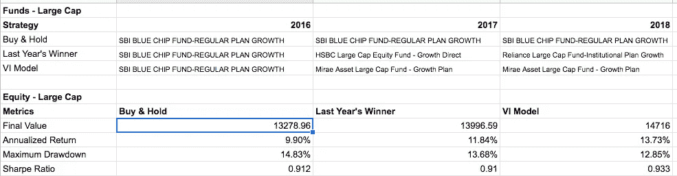
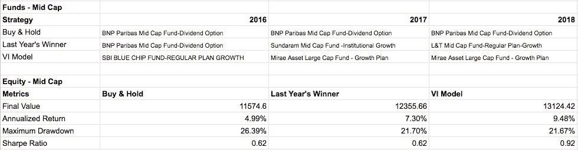
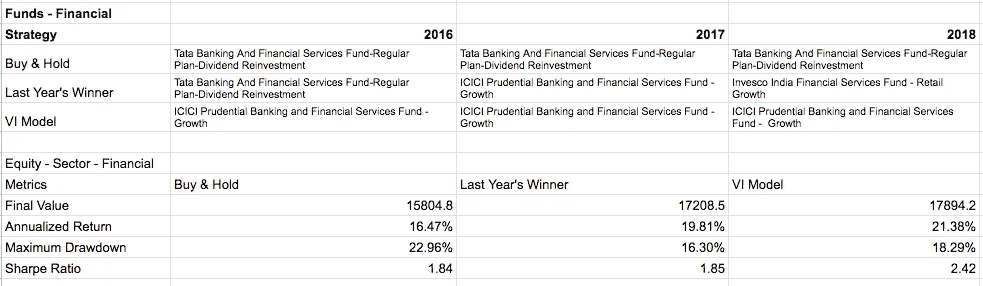

# 追逐表现最佳的共同基金是徒劳的吗？

> 原文：<https://towardsdatascience.com/is-chasing-top-performing-mutual-fund-a-fools-errand-b5e16f59f381?source=collection_archive---------23----------------------->

## 停止追逐资金，转而以系统的方式选择它们

Photo by Flo Maderebner on Pexels

正如这里的和这里的所示，追逐去年表现最佳的共同基金今年进行投资被证明是难以实现的，这种策略更有可能导致长期表现不佳。

例如，下图显示，在 2016 年至 2018 年的样本期内，大型印度共同基金类别中没有持续的最佳表现者。

Top performing funds for years 2016, 2017 & 2018 in India Large Cap category

**因此，采取“买入并持有”的策略，而不是年复一年地在去年回报率最高的基金之间跳来跳去，是不是更好？**

但是，在较长时期内进行的研究表明(参考上述参考文章)，一年内表现最佳的基金在接下来的几年内保持或恢复为表现最佳的基金之一，这种可能性在统计上并不显著。因此，尽管我们可能会节省一些交易成本(通过不定期买卖基金)，但总的来说，这种方法也可能导致长期表现不佳。

嗯……印度有如此多的基金产品，未来选择一只表现最好的基金的机会似乎非常渺茫。有没有更好的方法来持续选择一只表现最好的基金，以提高我们的长期投资组合表现？

本文的其余部分将介绍一种这样的方法。

不要以同样的方式评估不同的基金类别，这一点很重要。例如，仅仅是顶线年化回报率并不是评估债务市场基金表现的好方法。还必须考虑一些与风险相关的措施。

人们可能希望考虑一系列绩效指标来评估基金绩效，根据基金类别和类型，这些指标具有不同的相对重要性。

此外，在评估表现优异者时，不要将不同类别和类型的基金混在一起，这是一个谨慎的想法。例如:在股票类别下，不得将大型基金与小型基金进行比较。这类似于拿苹果和橘子做比较。

采取的总体方法是首先确定一套业绩衡量标准，然后根据要评估的基金类别和类型对其进行不同的加权。最后，一个类别和类型中表现最佳的基金是根据这些不同业绩指标的累积分数来确定的。

# 使用了以下措施:

1.  过去 3 年的年化回报率
2.  今年迄今的年化回报率
3.  过去 3 年[夏普比率](https://www.investopedia.com/terms/s/sharperatio.asp)
4.  [过去 3 年经历的最大水位下降](https://www.investopedia.com/terms/m/maximum-drawdown-mdd.asp) (MDD)
5.  最近一年内经历的最大提款
6.  [95%置信水平下的风险值](https://www.investopedia.com/terms/v/var.asp) (VaR)
7.  [95%置信水平下的风险条件值](https://www.investopedia.com/terms/c/conditional_value_at_risk.asp) (cVaR)
8.  99%置信水平下的风险值
9.  99%置信水平下的风险条件值

选择这些指标的原因是为了确保我们不仅着眼于不久前的顶线年化回报，还考虑了前几年的表现。除了考虑与回报相关的措施，我们还需要考虑与这些回报相关的风险。风险可以从不同的角度来看，VaR 和 cVaR 的措施集中在最坏的情况下(短期尾部风险措施)，而 MDD 是一个很好的指标，损失发生在一个较长的时期(想想衰退！).

不同类别和类型的基金对这些措施有不同的重视程度。例如，进取型股票型大盘股基金通过对回报指标赋予更大的权重来进行评估，而风险相关指标在评估保守型债券市场流动性基金时变得更加突出。

为了测试这种方法，开发了一个模型，并根据 15 年的可用历史数据进行了测试。注意避免不同种类的偏见，如前瞻偏见，选择偏见。目标是确定每个基金类别和类型在不久的将来可能的最佳表现者。

举例来说，让我们用 3 年时间**2016–2018**，尝试在每年年初从以下三个基金类别和类型中选出可能的最佳表现者

1.  **股票大盘股**
2.  **权益中盘**
3.  **股票主题/板块——金融**

从 2016 年 1 月 1 日起，开始投资 10，000 卢比。为了比较业绩，我们根据以下三种策略在每个类别中挑选最好的基金

1.  **买入&持有** —挑选 2015 年回报最好的基金，并在未来三年继续投资
2.  **去年的赢家** —挑选上一年回报最好的基金。如果一年后，一只不同的基金出现了最佳回报，那么第二年就把投资转向那只基金
3.  **VI 模型** —每年年初，根据上述模型选择得分最高的基金。在接下来的两年开始时，我们会遵循同样的流程，如果一只不同的基金成为领头羊，我们就会将投资转向这只基金

注意避免任何前瞻性偏见，为了简单起见，我们忽略交易成本的差异。

# 结果

**大盘股基金**

**中型基金**

**部门基金——金融**

# 总结

可以看出，与其他两种方法相比，上述方法能够始终挑选表现更好的基金。尽管我们可能无法每次都在每个类别中选出最佳表现者，但从长远来看，平均而言，这可能有助于我们做出更好的决策。

您可以在[http://vianalytics.in/mf_top](http://vianalytics.in/mf_top)查看当前表现最佳的员工