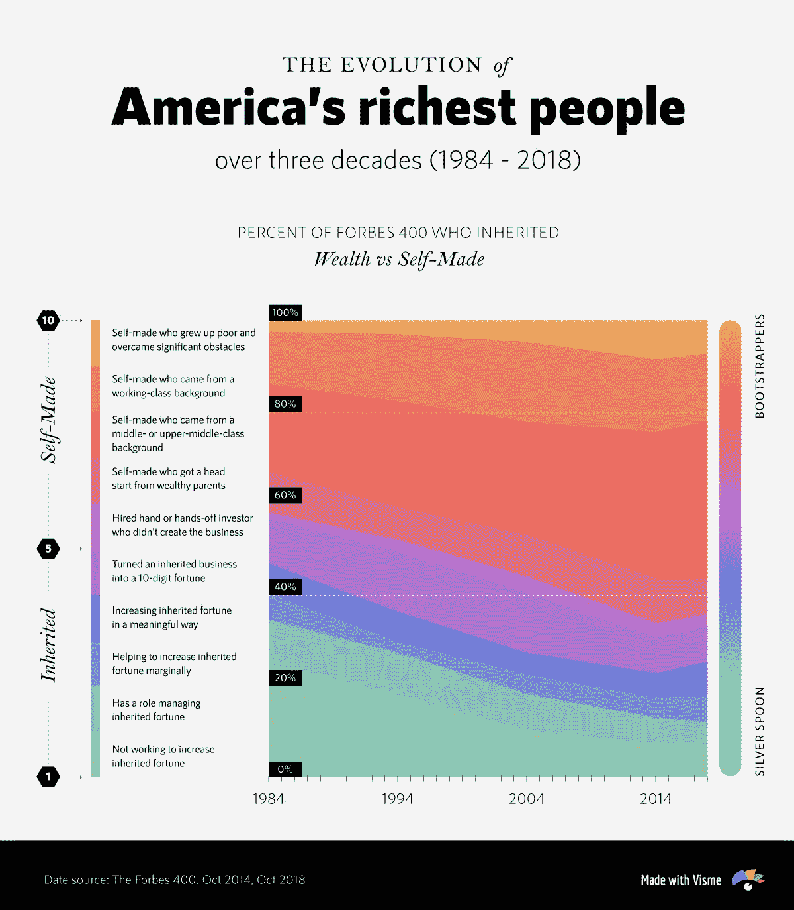
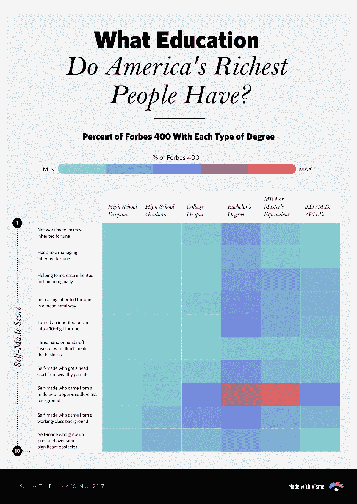
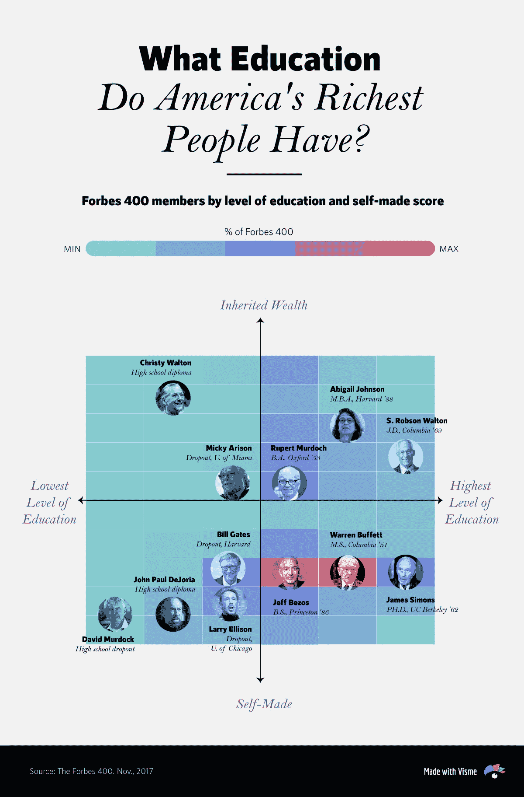
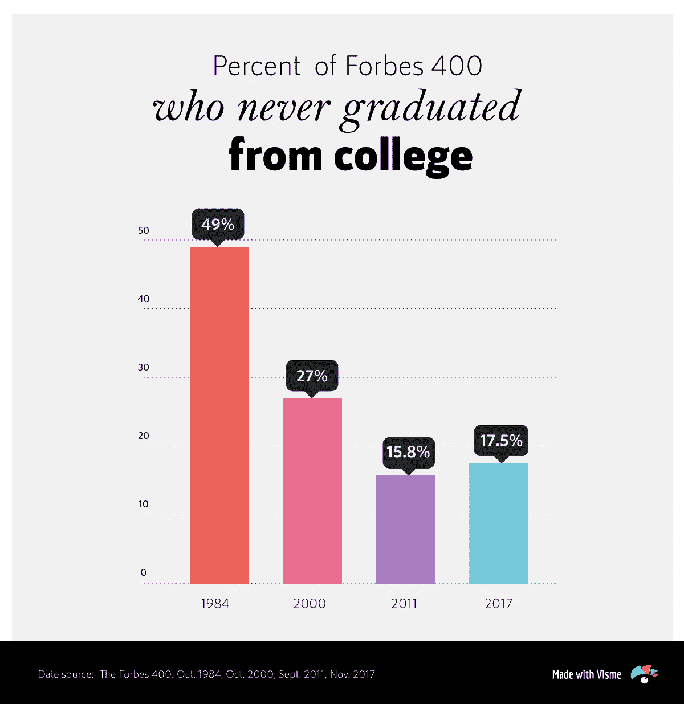
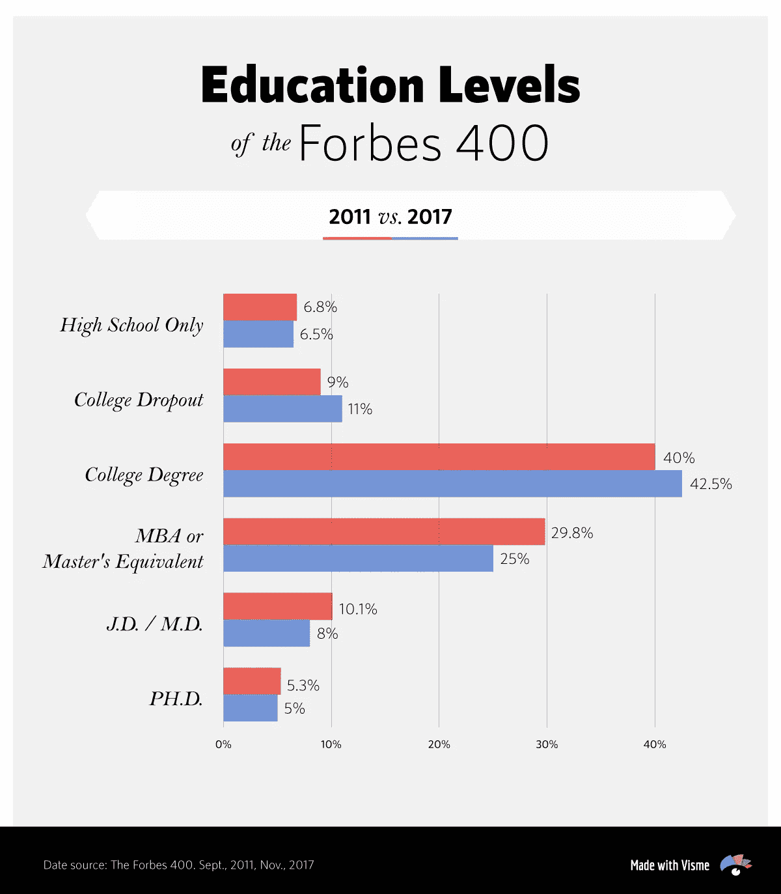
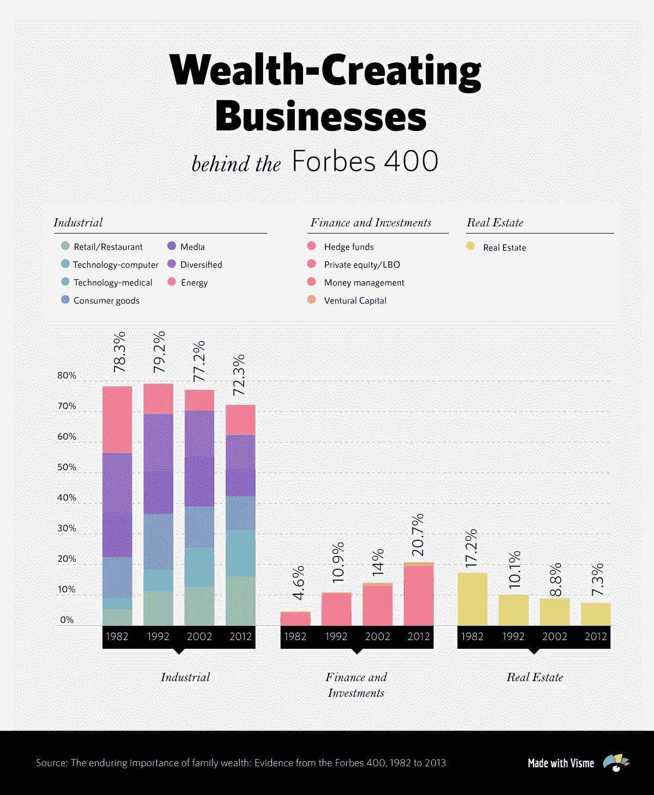

# 大学还值得吗？美国最富有人群的教育

> 原文：<https://towardsdatascience.com/is-college-still-worth-it-the-education-of-americas-richest-people-33e0999e51ef?source=collection_archive---------31----------------------->

随着美国学生贷款总额达到 1.5 万亿美元的历史新高，全国许多高中毕业生和家长都在问自己:上大学还值得吗？

虽然该主题得出的结论是受过大学教育的人一生平均比只有高中文凭的人多挣 90 万美元，但事实是学费增长速度[是工资增长速度的八倍](https://www.forbes.com/sites/camilomaldonado/2018/07/24/price-of-college-increasing-almost-8-times-faster-than-wages/#72f5333e66c1)和[大学债务自 2006 年以来增长了两倍](https://www.nbcnews.com/politics/2020-election/massive-student-debt-piling-so-are-candidates-solutions-n987741)，这使得许多政治家和媒体宣布这是一场全国性危机。

事实上，谷歌、IBM、网飞和苹果等几家顶级公司最近已经从许多招聘信息中取消了四年制学位要求，以重新评估正规教育项目的需求，这些项目往往无法培养出具备在现实世界中成功所需技能的毕业生。

这场运动是否会在全国其他公司中获得动力还有待观察，但这回避了一个问题:这个国家最成功的人怎么办？他们走的是什么职业道路，又是如何走到今天的？

# 旧货币对新货币

我们深入研究了 30 年的数据来寻找答案。利用美国最富有居民的权威名单《福布斯》400 强的数据和排名，我们直观地展示了从 1984 年到现在美国最富有的人的构成。

我们发现，白手起家的企业家远远超过那些继承了财富并逐年增长的人。

从上面的画面可以清楚地看到，最大比例的“成功”人士——如果财富被认为是成功的主要衡量标准的话——已经为自己铺平了道路，尽管他们中的大多数人来自中产阶级或中上阶级背景。

虽然我们可以得出结论，美国梦确实还活着，而且很好，但下一个需要回答的问题是:这些雄心勃勃的人受过什么教育？

# 大多数亿万富翁都上过大学

尽管许多人指出马克·扎克伯格(Mark Zuckerberg)和比尔·盖茨(Bill Gates)等富有而成功的大学辍学生为他们跳过大学转而去工作的决定提供了理由，但数据表明，2017 年福布斯 400 强中只有 11%是大学辍学生。

同时，42%的人拥有学士学位；25%拥有工商管理硕士或硕士学位；8%为法学博士或医学博士；还有 5%是博士

不出所料，大多数冒险者——那些没有受过大学教育就冒险发迹的人——属于白手起家，而不是继承财富的人。

为了让这一趋势更加清晰，我们按照教育水平和他们的自我得分绘制了福布斯 400 富豪榜:

在这里，你可以看到大多数名单成员可以在以下象限内找到，从最高百分比到最低百分比:1)受教育程度高和自我得分高的人；2)受教育程度高、继承财富的人；(3)文化程度低、自创分数高者。

这意味着，与流行的观点相反，大多数亿万富翁，包括白手起家的冒险家，都上过大学并获得了学位，即使他们从未运用他们在学校学到的知识积累了巨额财富。

事实上，自 1984 年以来，即《福布斯》首次发布权威富豪榜的几年后，没有大学学历的亿万富翁的比例似乎大幅下降。

诚然，从 2011 年到 2017 年，大学辍学人数似乎略有增加，但更详细的细分显示，福布斯 400 强的教育水平大致保持不变:

顺便提一句，有趣的是，自 1982 年以来，福布斯 400 强创立的零售/餐饮、金融、投资和技术相关业务大幅增长，而房地产业却有所下降。

# 大学值得吗？

你同意在这个国家获得大学学位是成功的必要条件吗？还是有正规教育被高估了？让我们知道你的想法…

*本帖* [*原版*](https://visme.co/blog/is-college-worth-it/) *最早出现在 Visme 的* [*视觉学习中心*](http://blog.visme.co/) *。*