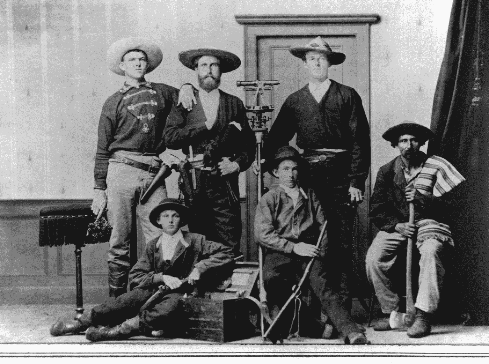

# 数据科学已经是职业了吗？

> 原文：<https://towardsdatascience.com/is-data-science-a-profession-yet-c08e8d6cca20?source=collection_archive---------27----------------------->

Proficient use of an axe or rifle was as important to the data scientists of yesteryear as knowledge of ggplot2 is to the data scientists of today

数据科学被称为 21 世纪最酷的工作——击败了包括游戏开发人员和职业运动员在内的艰难领域——但数据科学甚至是一种职业吗？

显然，数据科学家这一职业是新生事物之一，这是一些酷的原因之一，但五年或二十年后可能不会那么好。数据科学作为一种职业发展到什么程度了？什么时候我们可以恰当地称自己为职业，并期待外科医生和律师所期待的那种认可(远远超过酷)？

## 商定的技术技能标准

在数据科学领域，人们已经开始理解哪些技能应该被视为核心技能，但还远未达到在其他职业中被共享的程度。

问题在于，用“比计算机科学家更懂统计学，比统计学家更懂编程”这样的俏皮话来定义自己，会有相当大的模糊性，尤其是当那些制造和重复这句俏皮话的人通常不知道计算机科学家接受了多少统计学培训，或者统计学家接受了多少编程培训。

当然，缺乏整体共识说明了一个更大的问题，那就是缺乏一个关于数据科学家做什么和是什么，以及为什么数据科学有价值的通用且可用的定义。有方便的妙语定义，但这些从来不是用来定义一个职业或其技能集的。

## 非技术技能的商定标准

对于展示掌握数据科学所需的技术技能，可能没有足够的共识，但至少有一些讨论和一些共享的概念。至于非技术技能，这往往是成功的更大障碍，几乎没有这些东西。

不同职业中常见的一种模式是在职业生涯的早期阶段教授技术基础知识，然后在人们开始工作生活时使用学徒模式教授非技术技能。

众所周知的例子包括这样一种模式:医学实习医生完成医学学位，然后在医院开始作为内科医生工作，然后进入更高级的阶段。同样地，刚开始职业生涯的律师，尤其是那些希望成为法庭辩护律师的律师，会去当更资深律师的学徒，学习更高级的非技术性技能。

在这种情况下，有一种理解是，尽管对法律的理解是先决条件，但对于律师最熟悉的一些活动，如辩护和合同谈判，非技术性技能是核心。

对于数据科学来说也是如此。此外，这些非技术性技能是数据科学家对抗自动化的最佳防御手段。与错综复杂的支持向量机相比，支持理解客户需求或解释数据科学产品如何支持业务战略等活动的非技术技能更能确保数据科学家的长期成功。然而，它们几乎没有得到承认，更不用说在数据科学专业中进行编纂了。

## 识别师傅和徒弟

其他职业中非技术技能的例子凸显了数据科学的另一个方面，表明它作为一种职业还不成熟——缺乏对如何区分处于数据科学职业生涯不同阶段的人的理解。没有任何里程碑可以表明数据科学学徒和数据科学硕士之间的区别，就像律师获得律师资格或精算师获得研究员资格一样。

这应该被视为一个很好的机会，因为有人(或者更有可能是一群人)有机会定义这个里程碑是什么。它不需要像医学或精算专业那样冗长——它只需要定义仍然需要监督的人和能够独立工作并监督他人的人之间的区别。

## 对职业的共同理解。

很难就数据科学是什么，以及更重要的是，它如何有用达成一致，这是将数据科学定义为一种职业的障碍，也是所有其他障碍的原因。

宽松的定义对于试图进入数据科学领域的人来说非常好，因为几乎没有办法告诉别人他们不是数据科学家。对于已经在该领域工作的人来说，它们就没那么好了，尤其是那些花了大量时间学习技能，但后来却没有得到认可的人。

尽管有些人可能觉得定义数据科学的限制会束缚他们的个人风格，但对数据科学家所需的基本核心技能的理解将使人们朝着有用的方向发展，而不是追求完全不同的技能，往往收效甚微。

## 数据科学的危险

可以说，定义数据科学以及如何作为数据科学家取得进展降低了数据科学家的民主性质，在这种情况下，没有看门人，任何人都可以宣布自己是数据科学家，并看看是否有人相信他们。

问题是，如果数据科学的“品牌”不够强大，其他职业很容易窃取市场份额。精算职业是一个明显的职业重叠的例子，但有一个更强的方法来定义他们的职业和人们如何在职业中发展。甚至其他一些经典的数据科学用例，如营销分析，也有不一定把自己视为数据科学家的专业人士。这些专业分析师有自己的专业机构，只需要将现有技能适度扩展到应用机器学习中，就可以在不涉及数据科学家的情况下获得数据科学结果。

这些分析师在他们工作的商业环境中接受过正式培训，因为在任何人使用这个表达之前，数据科学应该是最熟悉的领域，如果他们选择将他们的技能扩展到机器学习等领域，他们比数据科学家有很多优势。

相比之下，由于对技术培训的重视，业务背景的具体知识是数据科学家的一个致命弱点。一方面，没有定义何时他们已经达到足够的技术知识来配得上这个头衔，数据科学家陷入了对工具和技术的更多杂项知识的追逐中。另一边

如果数据科学家不小心翼翼地确保他们能够证明自己的价值，一方面连贯地解释他们如何带来价值，另一方面开发一种标准化的方法并评估他们的能力，他们就面临着将最令人兴奋的项目输给其他类型的分析师的真正风险，这些分析师拥有更强的品牌和更强的特定背景知识。

*罗伯特·德格拉夫的书* [*管理你的数据科学项目*](https://www.amazon.com.au/Managing-Your-Data-Science-Projects-ebook/dp/B07SWV54LR/ref=sr_1_1?crid=1IJIWKNHFBHOY&keywords=robert+de+graaf&qid=1561334793&s=gateway&sprefix=robert+de%2Caps%2C332&sr=8-1) *，已经通过出版社出版。*

[*在 Twitter 上关注罗伯特*](https://twitter.com/RobertdeGraaf2)