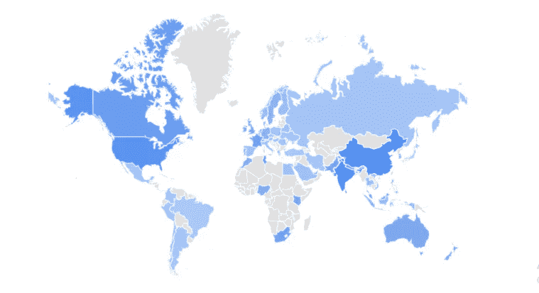
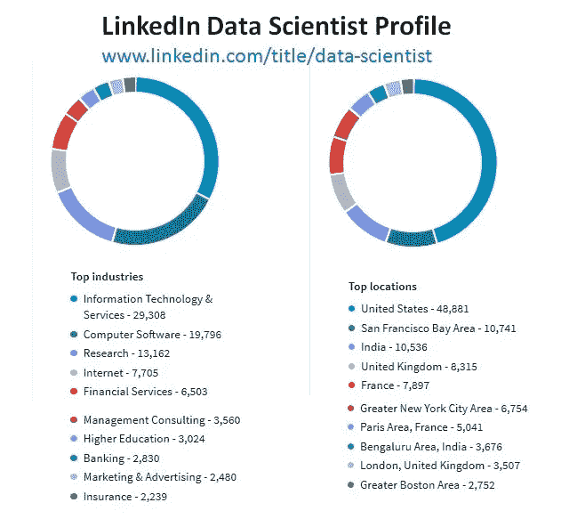

# 数据科学正在消亡吗？

> 原文：<https://towardsdatascience.com/is-data-science-dying-110ea995c66?source=collection_archive---------4----------------------->

## 对数据科学炒作的现实核查

# 开始于

在这个行业呆久了的人会联想到这一点。许多年前，这个行业为一种被称为商业分析的类似技能而疯狂。如今，数据科学家一词在互联网上迅速流行，这是一份看起来很有前途的现代工作。

这张图片显示了人们在谷歌上搜索数据科学术语的强度。

## [是时候将你的数据科学梦想变成现实了](https://data-flair.training/blogs/learn-r-programming/)

# **数据科学会成为 2020 年的热点吗？**

是的，当然。为什么？让我们看看。

## **大机构支持**

所有大型甚至小型组织都在向数据驱动型企业发展。如今产生的数据太大，无法人工处理。我们需要智能的自动化技术来分析和收集有助于组织改善业务的见解。

竞争是一个主要因素，不在业务中实践数据科学的人很快就会过时。

## **巨大的工作机会**

LinkedIn statistics 分析了这些数据，并将数据科学家排在“2019 年最有前途的工作”的首位。缺少大量熟练的数据科学家，这方面的工作数量正在迅速增加。

## **各种工作简介**

数据科学是一个广阔的领域，不同组织对数据科学家的定义略有不同。一名数据科学家可以申请多个职位，如数据分析师、机器学习工程师、数据分析顾问、大数据工程师等。

## **摇钱树**

由于对数据科学家的需求很高，而供应很低，因此组织支付了大量的金钱。一个经验丰富、才华横溢的数据科学家的薪水高得惊人。

## **竞争减少**

尽管每个人都在谈论数据科学，但真正有技能的人很少。这就是为什么数据科学工作很容易获得。德勤预测将需要 100 万个数据科学家职位。

## [***成为数据科学英雄、拯救生命的时刻***](https://data-flair.training/blogs/project-in-python-breast-cancer-classification/)

炒作仍将存在，但现在让我们谈谈故事的另一面。你认为数据科学家对他们的工作满意吗？

许多数据科学家正在离开有史以来最性感的工作。

# **人们放弃数据科学职业的原因**

## **管理者曲解**

非技术管理人员并不真正理解数据科学的工作，他们经常曲解工作。开发人员没有被给予正确的问题来回答，并且由于沟通的差距，组织不能从他们的数据中获得最大的收益。许多开发人员发现解释问题的复杂性具有挑战性。

## **不合适的基础设施**

一些公司甚至在没有合适的基础设施的情况下就雇佣数据科学家来解决问题。数据科学完全依赖于海量数据，对于组织混乱或效率低下的数据，你无能为力。

## **不确定性**

有时你可能做对了每件事，但解决方案仍然没有实现。是的，这可能发生，原因是统计数据！

你必须接受这一点。一个软件开发人员可以根据计划实现一些东西，但这在数据科学中是不正确的。

# **总结一下！！**

人们对数据科学太感兴趣了，因此每个人都想转向数据科学。当然，它有许多优势和领域，您可以利用这些优势，但是您应该了解该技术及其工作原理，以便首先在组织流程中实施它。这对每个人来说都会更容易。

希望你喜欢阅读！！

## [这是通往数据科学目的地的门票](https://data-flair.training/blogs/data-science-interview-questions/)