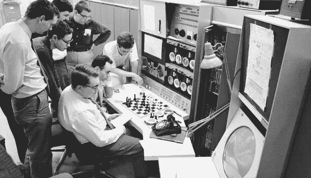

# 深度学习已经达到极限了吗？

> 原文：<https://towardsdatascience.com/is-deep-learning-already-hitting-its-limitations-c81826082ac3?source=collection_archive---------2----------------------->

The breakthrough “[MAC Hack VI](https://www.chess.com/blog/BenRedic/retro-computer-chess-part-2-first-blodd)” chess program in 1965.

## 又一个人工智能的冬天来了吗？

许多人认为，算法将超越人类的认知意识。机器将在没有人类干预的情况下识别和学习任务，并成群结队地取代工人。他们真的能够“思考”。许多人甚至提出了这样一个问题:我们是否可以让机器人成为我们的配偶。

但我说的不是今天。如果我告诉你这个想法在 20 世纪 60 年代被广泛推广，人工智能先驱杰罗姆·威斯纳、奥利弗·塞尔弗里奇和克劳德·香农坚持认为这可能在不久的将来发生，会怎么样？如果你觉得这很令人惊讶，看看这个视频，你会惊讶地发现这些观点是如此的熟悉。

时间快进到 1973 年，艾的炒作和夸张适得其反。英国议会派詹姆斯·莱特希尔爵士去[拿一份英国人工智能研究的现状报告](https://en.wikipedia.org/wiki/Lighthill_report)该报告批评人工智能研究未能实现其耸人听闻的说法。有趣的是，莱特希尔还指出了专门的程序(或人)如何比它们的“人工智能”同行表现得更好，并且在现实世界环境中没有前景。因此，人工智能研究经费被英国政府大幅削减。

在池塘的另一边，美国国防部在人工智能研究上投入了大量资金，但后来因为同样的挫折取消了几乎所有的资助:夸大人工智能的能力，高成本而无回报，以及在现实世界中的可疑价值。

20 世纪 80 年代，日本狂热地试图用第五代项目 ( *编辑* : [托比·沃什](https://en.wikipedia.org/wiki/Toby_Walsh)本人[在评论中纠正了我](https://link.medium.com/D2jXf16dqT)。英国的研究在 20 世纪 80 年代随着 Alvey 项目对日本的回应而重新开始。然而，这最终也是一场耗资 8 . 5 亿美元的失败。

**第一个艾冬天**

20 世纪 80 年代末带来了一个人工智能冬天，这是计算机科学的黑暗时期，在这一时期，“人工智能”研究让组织和政府遭受交付失败和沉没成本的损失。这样的失败将会终止几十年的人工智能研究。

> 通常，这些公司是由 FOMO 而不是实际用例驱动的，担心他们会被自动化竞争对手甩在后面。

到了 20 世纪 90 年代，“人工智能”变成了一个肮脏的词，并持续到 21 世纪初。人们普遍认为“人工智能就是不起作用”。编写看似智能程序的软件公司会使用“搜索算法”、“商业规则引擎”、“约束求解器”和“运筹学”这样的术语。值得一提的是，这些无价的工具确实来自人工智能研究，但它们被重新命名，因为它们未能实现它们更宏伟的目标。

但在 2010 年左右，一些事情开始发生变化。人们对人工智能的兴趣再次迅速增长，图像分类比赛吸引了媒体的眼球。硅谷坐拥海量数据，第一次有足够的数据让神经网络变得有用。

到 2015 年，“人工智能”研究占据了许多财富 500 强公司的巨额预算。通常，这些公司是由 FOMO 而不是实际用例驱动的，担心他们会被自动化竞争对手甩在后面。毕竟，让一个神经网络[识别图像中的物体](https://youtu.be/vIci3C4JkL0)绝对令人印象深刻！对于外行人来说，天网能力肯定是下一个。

但这真的是迈向真正 AI 的一步吗？还是历史在重演，只是这一次被少数成功的使用案例所鼓舞？

**人工智能到底是什么？**

长期以来，我一直不喜欢“人工智能”这个词。它模糊而深远，更多是由营销人员而不是科学家来定义的。当然，营销和流行语可以说是刺激积极变化的必要手段。然而，流行语运动不可避免地导致混乱。我的新华硕智能手机有一个“人工智能铃声”功能，它可以动态调整铃声音量，使其刚好超过环境噪音。我想可以用一系列“如果”条件或一个简单的线性函数编程的东西叫做“人工智能”。那好吧。

有鉴于此,“人工智能”的定义广受争议也就不足为奇了。我喜欢杰佛瑞·德·斯梅特的定义，它指出人工智能的解决方案是针对具有不确定答案和/或不可避免的误差的问题。这将包括从机器学习到概率和搜索算法的各种工具。

也可以说，AI 的定义不断演变，只包括开创性的发展，而昨天的成功(像光学字符识别或语言翻译器)不再被认为是“AI”。所以“人工智能”可以是一个相对的术语，很难说是绝对的。

近年来，“人工智能”经常与“神经网络”联系在一起，这也是本文的重点。还有其他“人工智能”解决方案，从其他机器学习模型(朴素贝叶斯，支持向量机，XGBoost)到搜索算法。然而，神经网络可以说是目前最热门和最炒作的技术。如果你想了解更多关于神经网络的知识，我在下面发布了我的视频。

如果你想要更全面的解释，请点击这里查看格兰特·桑德森关于神经网络的精彩视频系列:

**安 AI 复兴？**

2010 年后人工智能炒作的复苏仅仅是因为掌握了一类新的任务:分类。更具体地说，由于神经网络，科学家们已经开发出对大多数类型的数据进行分类的有效方法，包括图像和自然语言。甚至自动驾驶汽车也是分类任务，周围道路的每幅图像都转化为一组离散的动作(加油、刹车、左转、右转等)。为了简单了解这是如何工作的，请看[这篇展示如何制作视频游戏 AI](https://youtu.be/ZX2Hyu5WoFg) 的教程。

在我看来，自然语言处理比纯粹的分类更令人印象深刻。很容易相信这些算法是有意识的，但如果你仔细研究它们，你会发现它们依赖于语言模式，而不是有意识构建的思想。这可能会导致一些有趣的结果，比如这些机器人会为你搜索骗子。更新:这项服务[自 2017 年 12 月因“改进”](https://twitter.com/rescambot/status/942600534610948096)被奇怪地下线，我倾向于认为该机器人并没有像承诺的那样工作，因此它处于非活动状态。

可能自然语言处理最令人印象深刻的壮举是谷歌双工，它允许你的 Android 手机代表你打电话，特别是约会。然而，你必须考虑到，谷歌训练、构建甚至硬编码的“人工智能”就是为了完成这项任务。当然，假打电话的人听起来很自然，有停顿，“啊啊”和“嗯啊”…但同样，这是通过对语音模式的操作完成的，而不是实际的推理和思考。更新:这种技术似乎已经被夸大了，因为许多谷歌双工电话是由人工呼叫中心处理的。

这一切都令人印象深刻，肯定有一些有用的应用。但我们真的需要降低我们的期望，停止炒作“深度学习”能力。如果我们不这样做，我们可能会发现自己在另一个人工智能的冬天。

**历史重演**

NYU 大学的 Gary Marcus 写了一篇关于深度学习的局限性的[有趣的文章](https://arxiv.org/abs/1801.00631)，并提出了几个发人深省的观点(在文章走红后，他还写了一篇[同样有趣的后续文章)。罗德尼·布鲁克斯正在整理](https://medium.com/@GaryMarcus/in-defense-of-skepticism-about-deep-learning-6e8bfd5ae0f1)[时间表，并跟踪他的人工智能炒作周期预测，](http://rodneybrooks.com/predictions-scorecard-2019-january-01/)并预测我们将在 2020 年看到“深度学习的时代已经结束”的头条新闻。

怀疑论者普遍认同几个关键点。神经网络需要大量数据，即使在今天，数据也是有限的。这也是为什么你在 YouTube 上看到的“游戏”人工智能例子(像[这一个](https://youtu.be/SO7FFteErWs)以及[这一个](https://youtu.be/ZX2Hyu5WoFg))经常需要几天不断输掉游戏，直到神经网络找到允许它获胜的模式。

> 我们真的需要降低我们的期望，停止炒作“深度学习”能力。如果我们不这样做，我们可能会发现自己在另一个人工智能的冬天。

神经网络是“深”的，因为它们在技术上有几层节点，而不是因为它对问题有深刻的理解。这些层也使得神经网络难以理解，甚至对于它的开发者来说也是如此。最重要的是，当神经网络冒险进入其他问题空间时，它们正在经历回报递减，例如[旅行推销员问题](https://en.m.wikipedia.org/wiki/Traveling_salesman_problem)。这是有道理的。当一种搜索算法会更加简单、有效、可扩展、*和*经济(如下图所示)时，我为什么要用神经网络来解决[旅行推销员问题呢？](https://multithreaded.stitchfix.com/blog/2016/07/21/skynet-salesman/)

Using search algorithms like simulated annealing for the Traveling Salesman Problem

我也不会使用深度学习来解决其他日常“人工智能”问题，比如解决数独或把事件打包到日程表中，我会在另一篇文章中讨论如何做到这一点:

 [## 数独和时间表

### 用树搜索解决调度问题

towardsdatascience.com](/sudokus-and-schedules-60f3de5dfe0d) 

当然，有人[希望将更多的问题空间推广到神经网络](http://www.iro.umontreal.ca/~dift6751/paper_potvin_nn_tsp.pdf)中，尽管这很有趣，但它似乎很少胜过任何专门的算法。

麻省理工学院的卢克·休伊特在本文中对[做了最好的阐述:](http://thinkingmachines.mit.edu/blog/unreasonable-reputation-neural-networks)

> 仅凭一项任务就凭直觉判断一台机器有多聪明，或者有多大能力，这不是一个好主意。20 世纪 50 年代的跳棋游戏机器让研究人员感到惊讶，许多人认为这是人类推理水平的巨大飞跃，但我们现在意识到，在这场游戏中实现人类或超人的表现远比实现人类水平的一般智能容易。事实上，即使是最优秀的人类也很容易被简单启发式搜索算法击败。人类或超人在一项任务中的表现不一定是在大多数任务中接近人类表现的垫脚石。
> 
> —卢克·休伊特

我认为同样值得指出的是，神经网络需要大量的硬件和能量来训练。对我来说，这是不可持续的。当然，神经网络的预测效率要比训练效率高得多。然而，我确实认为人们对神经网络的雄心需要不断的训练，因此需要指数级的能量和成本。当然，计算机的速度越来越快[，但是芯片制造商能克服摩尔定律的失败吗？](https://www.cnet.com/google-amp/news/moores-law-is-dead-nvidias-ceo-jensen-huang-says-at-ces-2019/)

要考虑的最后一点是 [P 对 NP 问题](https://en.wikipedia.org/wiki/P_versus_NP_problem)。用最简单的术语来描述这一点，证明 P = NP 意味着我们可以计算非常困难的问题(如机器学习、密码学和最优化)的解决方案，就像我们可以验证它们一样快。这样的突破将极大地扩展人工智能算法的能力，也许会让我们的世界面目全非(有趣的事实:2012 年有一部名为 [*《旅行推销员》*](https://www.youtube.com/watch?v=6ybd5rbQ5rU) 的智力惊悚电影探索了这一想法)。

这里有一个很棒的视频，解释了 P 与 NP 的问题，值得花 10 分钟观看:

An explanation of P versus NP

可悲的是，在这个问题正式提出 50 年后，越来越多的计算机科学家开始相信 P 不等于 NP。在我看来，这是人工智能研究的一个巨大障碍，我们可能永远无法克服，因为这意味着复杂性将永远限制我们所能做的事情。

> 这是有道理的。当搜索算法更有效、可伸缩、更经济时，我为什么要用神经网络来解决旅行推销员问题呢？

正是因为这些原因，我认为另一个人工智能的冬天即将到来。2018 年，越来越多的[专家](https://warontherocks.com/2018/05/its-either-a-panda-or-a-gibbon-ai-winters-and-the-limits-of-deep-learning/)、[文章](https://www.ft.com/content/4367e34e-db72-11e7-9504-59efdb70e12f)、[论坛帖子](https://www.quora.com/Is-Deep-Learning-fundamentally-flawed-and-hitting-a-wall-Was-Gary-Marcus-correct-in-pointing-out-Deep-Learnings-flaws)、[博主](https://blog.piekniewski.info/2018/05/28/ai-winter-is-well-on-its-way/)站出来呼吁这些限制。我认为这种怀疑主义趋势将在 2019 年加剧，并将在 2020 年成为主流。公司仍在不惜重金获得最好的“深度学习”和“人工智能”人才，但我认为，许多公司意识到深度学习不是他们所需要的只是时间问题。更糟糕的是，如果你的公司没有谷歌的研究预算、博士人才或从用户那里收集的海量数据，你会很快发现你的实际“深度学习”前景非常有限。这在 HBO 节目*硅谷*的这个场景中得到了最好的捕捉(警告:语言):

每个人工智能的冬天之前都有科学家夸大和宣传他们创造的潜力。仅仅说他们的算法能很好地完成一项任务是不够的。他们希望它能雄心勃勃地适应任何任务，或者至少给人以它能胜任的印象。例如， [AlphaZero 做了一个更好的下棋算法](https://news.yahoo.com/deepmind-apos-alphazero-now-showing-190000147.html)。媒体的反应是“天哪，艾将军来了。所有人找掩护！机器人来了！”然后，科学家们不再费心去纠正它们，而是用巧妙的选词来鼓励它们。降低预期终究无助于风险投资。但是，尽管人工智能研究人员有机器人的局限性，但他们将算法拟人化可能还有其他原因[,这更多的是哲学而不是科学。我将把它留到文章的结尾。](https://www.quantamagazine.org/why-alphazeros-artificial-intelligence-has-trouble-with-the-real-world-20180221/)

那么下一步是什么？

当然，并不是每一家使用“机器学习”或“AI”的公司实际上都在使用“深度学习”。一个优秀的数据科学家可能被雇佣来建立一个神经网络，但是当她实际研究问题时，她反而更适合建立一个[朴素贝叶斯分类器](https://youtu.be/JLSdW60t898)。对于那些成功使用图像识别和语言处理的公司来说，他们会很高兴地继续这样做。但我确实认为神经网络不会远离这些问题空间。

> 降低预期终究无助于风险投资。

过去的人工智能冬天在推动计算机科学的边界方面是毁灭性的。值得指出的是，这种研究产生了有用的东西，比如搜索算法可以让[有效地赢得象棋](https://medium.freecodecamp.org/simple-chess-ai-step-by-step-1d55a9266977?gi=ae75ee1a23eb)或者[最小化运输问题的成本](https://www.youtube.com/watch?v=j1s69yf4a9Y)。简而言之，创新的算法出现了，它们通常擅长于某一特定的任务。

我想说的是，对于许多类型的问题，有许多行之有效的解决方案。为了避免被人工智能的冬天拒之门外，你能做的最好的事情就是明确你试图解决的问题，并理解其本质。之后，找到为特定问题提供直观解决方案的方法。如果你想对短信进行分类，你可能想使用[朴素贝叶斯](https://youtu.be/JLSdW60t898)。如果你试图优化你的运输网络，你可能应该使用[离散优化](https://www.coursera.org/learn/discrete-optimization/home/welcome)。不管来自同行的压力如何，你都被允许带着健康的怀疑态度接近复杂的模型，并质疑这是否是正确的方法。

希望这篇文章非常清楚地表明，深度学习不是解决大多数问题的正确方法。没有免费的午餐。不要为你所有的问题寻找一个通用的人工智能解决方案，因为你不会找到一个。

**我们的思想真的是点积吗？哲学 vs 科学**

我想在这篇文章中抛出的最后一点是，它更多的是哲学而不是科学。我们的每一个想法和感觉仅仅是一堆数字以线性代数的方式相乘和相加吗？事实上，我们的大脑仅仅是一个整天做点积的神经网络吗？这听起来几乎像毕达哥拉斯哲学，将我们的意识简化为一个数字矩阵。也许这就是为什么如此多的科学家相信通用人工智能是可能的，因为人类和计算机没有什么不同。(我只是指出这一点，不评论这个世界观是对是错)。

> 不管来自同行的压力如何，你都被允许带着健康的怀疑态度接近复杂的模型，并质疑这是否是正确的方法。

如果你不接受这种毕达哥拉斯哲学，那么你能争取的最好结果就是让人工智能“模拟”动作，给人一种它有情感和思想的错觉。一个翻译程序不懂中文。[它通过寻找概率模式来“模拟”理解中文的错觉。](https://en.wikipedia.org/wiki/Chinese_room)当你的智能手机“识别”一张狗的照片时，它真的能识别一只狗吗？还是它看到了之前看到的数字网格？

**相关文章:**

 [## 2019 年学数据科学的感受

### 透过(决策树)看到(随机)森林

towardsdatascience.com](/how-it-feels-to-learn-data-science-in-2019-6ee688498029)  [## 游戏 AI 的实用价值

### 我们通过自动化消遣获得了什么？

towardsdatascience.com=](/ai-research-and-the-video-game-fetish-71cb62ffd6b3)  [## 我们的思想真的是点积吗？

### 人工智能研究如何复兴毕达哥拉斯主义并混淆科学与哲学

towardsdatascience.com](/are-our-thoughts-really-dot-products-ede6049cbd92)