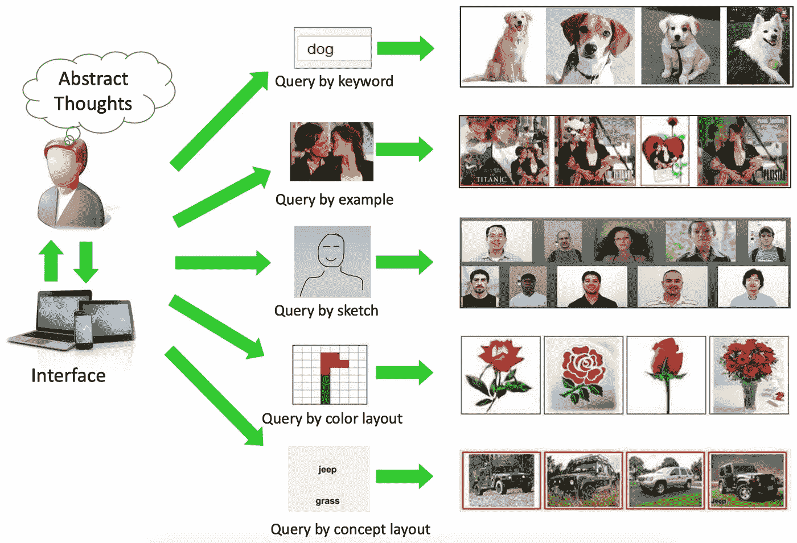
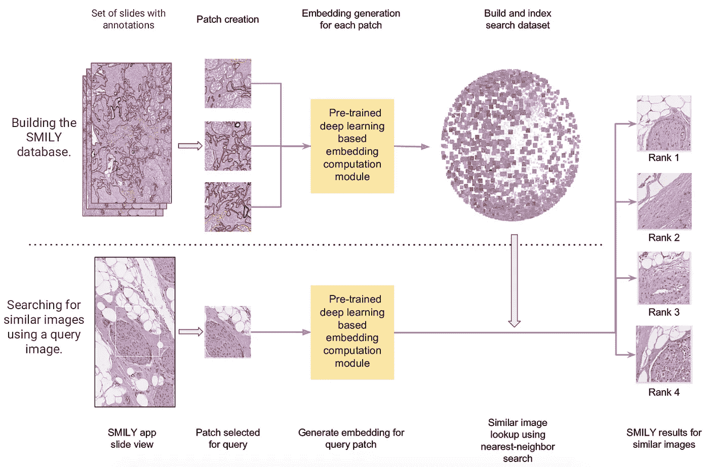
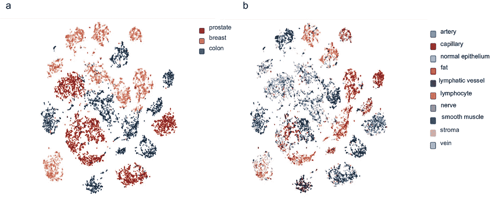

# 深度学习是医疗决策的未来吗？

> 原文：<https://towardsdatascience.com/is-deep-learning-the-future-of-medical-decision-making-b36ba17ddbf7?source=collection_archive---------35----------------------->

Photo by [Christian Bowen](https://unsplash.com/@chrishcush?utm_source=medium&utm_medium=referral) on [Unsplash](https://unsplash.com?utm_source=medium&utm_medium=referral)

医疗保健经常被认为是一个处于人工智能革命边缘的领域。人工智能领域的知名人士，如谷歌 [DeepMind](https://deepmind.com/applied/deepmind-health/)) ，宣传他们在医疗保健领域的努力，声称“[人工智能将改变医学。](https://ai.google/healthcare/)

但是到目前为止，人工智能的影响力有多大呢？我们真的确定了医疗保健领域将受益于新技术吗？

在今年 5 月举行的关于“计算系统中的人的因素”的 ACM CHI 会议上，谷歌的[Carrie j . Cai](https://arxiv.org/pdf/1902.02960.pdf)展示了她关于[以人为中心的工具的获奖作品，该工具用于处理医疗决策过程中的不完善算法](https://arxiv.org/pdf/1902.02960.pdf)，讨论了机器学习算法在医疗决策中越来越多的使用。她的工作提出了一种新的系统，使医生能够实时改进和修改病理图像的搜索，不断增强系统的可用性。

[从过去的患者中检索视觉上相似的医学图像](https://www.sciencedirect.com/science/article/pii/S1386505603002119)作为对新患者做出医疗决策时的参考，这是一种非常有前途的途径，其中最先进的深度学习视觉模型可以高度适用。然而，在特定诊断过程中捕获用户所需的相似性的确切概念对现有系统提出了巨大的挑战，因为存在一种被称为**意图差距**的现象，这指的是捕获用户的确切意图的困难。我们稍后将更详细地讨论这一点。

蔡的研究展示了他们在医学图像检索系统上开发的优化工具如何提高图像的诊断效用，最重要的是，提高了用户对用于医学决策的机器学习算法的信任。此外，研究结果显示了用户如何能够理解潜在算法的优点和缺点，并从他们自己的错误中消除歧义。总的来说，这项工作对医疗保健专家决策中人-人工智能协作系统的未来提出了乐观的看法。

在这篇文章中，我们希望了解三个主要领域，即(1)基于内容的图像检索系统的状态，(2)深度学习在这些系统中的作用，以及(3)关于它们在医疗保健中的应用和影响的讨论。

**基于内容的图像检索系统的现状**

在过去的二十年左右，基于内容的图像检索(CBIR)已经成为计算机视觉中一个活跃的研究领域，这主要是由于 web 上可视数据的可访问性不断增长。基于文本的图像搜索技术由于与视觉内容的不匹配而遭受许多不一致，因此在许多情况下，将视觉内容视为相似性的排序线索是重要的。

[周文刚等人](https://arxiv.org/pdf/1706.06064.pdf)指出了 CBIR 系统中的两个关键挑战，他们称之为**意图鸿沟**和**语义鸿沟**。

Figure 1 — Taken from the paper “Recent Advance in Content-based Image Retrieval: A Literature Survey” by [Wengang Zhou et al.](https://arxiv.org/pdf/1706.06064.pdf)

意图差距，顾名思义，指的是通过手边的一个查询，比如一个示例图片或者一个关键词，来捕捉用户的**确切意图的难度。这是 Carrie J. Cai 等人利用他们在用户界面中的改进工具提出的挑战。纵观[以往的研究](https://www.sciencedirect.com/science/article/pii/S1047320315001327)，通过示例图像形成查询似乎是探索最广泛的领域，直观上是由于通过图像获取丰富查询信息的便利性。这需要从图像中提取精确的特征，这就引出了下一点，语义鸿沟。**

语义鸿沟处理用低级视觉特征描述高级语义概念的困难。现在，这个主题已经吸引了多年来大量的研究，取得了一些显著的突破，如[不变局部视觉特征 SIFT](https://www.cs.ubc.ca/~lowe/papers/ijcv04.pdf) 的引入和[视觉词袋(BoW)模型](https://www.robots.ox.ac.uk/~vgg/publications/2003/Sivic03/)的引入。

图 1 显示了 CBIR 系统的两个主要功能。匹配查询理解和图像特征之间的相似性也可能是重要的一步，但这完全取决于系统表达查询和图像的程度。

最近基于学习的特征提取器的激增，如[深度卷积神经网络(CNN)](https://papers.nips.cc/paper/4824-imagenet-classification-with-deep-convolutional-neural-networks.pdf) 开辟了许多研究途径，可以直接应用于处理我们在 CBIR 系统中讨论的语义差距。这些技术比手工制作的特征提取器有了显著的改进，并且已经证明了[在语义感知检索应用中的潜力](https://dl.acm.org/citation.cfm?id=1459449)。

**深度学习的作用**

[Carrie J. Cai 等人](https://arxiv.org/pdf/1902.02960.pdf)分析的 CBIR 系统的基本细节由 [Narayan Hedge 等人](https://arxiv.org/pdf/1901.11112.pdf)在其研究“[组织病理学的相似图像搜索:SMILY](https://arxiv.org/pdf/1901.11112.pdf) ”中详细介绍。该系统的概况如图 2 所示。

卷积神经网络(CNN)算法用于图 2 所示的嵌入计算模块，该模块充当系统中的特征提取器。网络将图像信息压缩成数字特征向量，也称为嵌入向量。使用预先训练的 CNN 算法计算并存储图像数据库(在这种情况下为病理图像切片)及其数值向量。当选择查询图像进行搜索时，使用相同的 CNN 算法计算查询图像的嵌入，并与数据库中的向量进行比较，以检索最相似的图像。

Figure 2 — Taken from “[Similar Image Search for Histopathology: SMILY” by Narayan Hegde et al.](https://arxiv.org/pdf/1901.11112.pdf)

此外， [Narayan Hedge 等人](https://arxiv.org/pdf/1901.11112.pdf)解释说，CNN 架构基于由[王江等人](https://arxiv.org/pdf/1404.4661.pdf)提出的[深度排名网络](https://arxiv.org/pdf/1404.4661.pdf)，它由卷积层和池层以及级联操作组成。在网络的训练阶段，输入三组图像:某一类别的参考图像、同一类别的第二图像和完全不同类别的第三图像。对损失函数进行建模，使得网络在来自相同类别的图像的嵌入之间分配比不同类别的图像的嵌入更小的距离。因此，来自不同类别的图像有助于加强来自相同类别的图像的嵌入之间的相似性。

使用自然图像(例如，狗、猫、树等)的大数据集而不是病理学图像来训练网络。在学会区分相似的自然图像和不相似的自然图像之后，相同的训练架构被直接应用于病理图像的特征提取。这可以被视为神经网络在数据有限的应用中的优势，通常被称为[迁移学习](http://openaccess.thecvf.com/content_cvpr_2014/html/Oquab_Learning_and_Transferring_2014_CVPR_paper.html)。

CNN 特征提取器为每个图像计算 128 个大小的向量，并且选择 [L2 距离](https://en.wikipedia.org/wiki/Euclidean_distance)作为向量之间的比较函数。 [Narayan Hedge 等人](https://arxiv.org/pdf/1901.11112.pdf)使用 t-SNE 可视化了从病理图像切片数据集产生的所有嵌入，如图 3 所示。(a)显示由器官部位着色的嵌入物,( b)显示由组织学特征着色的嵌入物。

Figure 3 — Taken from “[Similar Image Search for Histopathology: SMILY” by Narayan Hegde et al](https://arxiv.org/pdf/1901.11112.pdf).

事实上，类似于深度排名网络的架构和训练技术在深度学习文献中可以广泛看到，如 S[ia messe 神经网络](https://www.cs.cmu.edu/~rsalakhu/papers/oneshot1.pdf)，甚至已经应用于[人脸检测应用](https://www.cs.toronto.edu/~ranzato/publications/taigman_cvpr14.pdf)。
现在，回到 CBIR 系统，我们看到深度学习可以帮助减少语义鸿沟(如上所述)，因为这些基于学习的方法被证明在识别重要特征方面令人印象深刻，即使是在有噪声的自然图像中。

**在医疗保健领域的应用和影响**

到目前为止，我们研究了什么进入了 CBIR 系统，以及深度学习在克服语义鸿沟这一关键挑战方面的潜力。**但是 CBIR 在医疗保健领域有多大的适用性呢？**我们能清楚地量化影响吗？

[Henning Müller 等人](https://www.sciencedirect.com/science/article/pii/S1386505603002119)指出，仅日内瓦大学医院的放射科在 2002 年一天就生成了超过 12，000 张图像，其中心脏科是第二大数字图像生成部门。[研究](https://www.sciencedirect.com/science/article/pii/S1386505603002119)进一步指出，医疗信息系统的目标应该是“在正确的时间、正确的地点将需要的信息传递给正确的人，以提高护理过程的质量和效率。”因此，在临床决策中，支持技术，如基于案例的推理或基于证据的医学，都希望从 CBIR 系统中受益。

无论技术多么完善，在实际临床实践中整合这些系统都需要大量的工作，特别是在系统和用户之间建立信任。这是 Carrie J. Cai 等人的研究的优势所在，因为它非常灵活地提供了用户的相关反馈，这为用户提供了对系统返回的结果进行评级的能力。 [Henning Müller 等人](https://www.sciencedirect.com/science/article/pii/S1386505603002119)还谈到了在交互环境中相关反馈对于改善系统结果以及提高 CBIR 系统适应性的重要性。

另一个要点是量化这些系统的影响，这对该研究领域的适应和发展至关重要。在对 12 名病理学家进行用户研究后， [Carrie J. Cai 等人](https://arxiv.org/pdf/1902.02960.pdf)声称，使用他们的 CBIR 系统，用户能够以更少的努力提高系统的诊断效用。此外，结果显示**增加了信任，增强了对用户的精神支持，并提高了**将来在实际临床实践中使用该系统的可能性。但是诊断的准确性(尽管经验表明保持不变)没有在这项研究中进行评估，因为它超出了范围。

展望未来，显然需要医学专家和人工智能系统开发人员的持续合作，以确定用例并评估人工智能应用在医疗保健中的影响。此外，研究社区应该关注开放测试数据集和查询标准的开发，以便为 CBIR 应用程序设定基准。这将极大地有助于通过对贡献的清晰认识推动研究向前发展。

本文原载于 [The Gradient](https://thegradient.pub/subscribe/) 。希望你喜欢阅读。

*特别感谢张休、史密斯和徐的真知灼见和评论。*