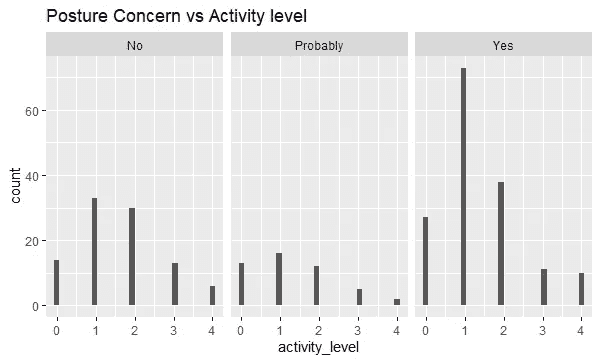

# 有可能预测不良姿势吗？

> 原文：<https://towardsdatascience.com/is-it-possible-to-predict-poor-posture-af309ead03e2?source=collection_archive---------44----------------------->

## 将数据科学应用于现代姿态问题


Photo by [Alejandro Escamilla](https://unsplash.com/@alejandroescamilla?utm_source=medium&utm_medium=referral) on [Unsplash](https://unsplash.com?utm_source=medium&utm_medium=referral)

你现在弯腰驼背吗？很有可能。无论你是俯身在笔记本电脑上，无精打采地躺在沙发上，还是只是把下巴微微缩向手机，我们大多数人都会以一种远非理想的阅读姿势打开这篇文章。

我们都知道姿势很重要。它传达自信(或缺乏自信)，影响我们的整体健康，并能改变我们的情绪。但是，我们当中很少有人采取必要的行动来纠正我们的数字时代带来的越来越糟糕的状况。

已经有很多关于姿势和背痛的研究，那么为什么我们仍然发现自己仍然如此弯腰驼背呢？当我创造了 PocketPosture.com，我开始学习为什么人们不改变他们的姿势习惯。是不是太复杂了？不良姿势是否与我们工作/学习/放松的方式交织在一起？我们是不是太忙而没有时间去担心它？或者也许我们都只是太懒了？

为了解决姿势问题，我首先提出了几个问题。

# 激励性问题:

1.  哪些因素与不良姿势和背痛相关？
2.  有没有办法预测不良姿势和腰疼？
3.  人们给出了哪些避免治疗和改善的理由？

我联系了 Y Combinator 的校友 Doug Hoang，他的公司专注于改善体态。BackAlerts 是一个传感器，它靠在你的背上，跟踪你的姿势，并在你无精打采的时候轻轻地提醒你。他们还提供有针对性的姿势锻炼计划，一定要去看看。

即使有像 Back Alerts 这样的好工具，普通人目前也没有做任何事情来改善他们的姿势。

为什么获得持久的正确姿势仍然如此困难？

# 数据收集:

我没有找到任何生活习惯与姿势相关的公开数据，所以我选择通过调查来制作自己的数据。要了解更多关于这种混乱的收集过程，请阅读我的另一篇文章，这里是详细的。

# 数据:先看

这项调查是通过谷歌表单进行的，它输出预先制作的图表，我们可以仔细阅读任何立即跳出来的东西。


Results for two of the daily routine questions


大多数人大部分时间都坐在办公室里，并且有各种不同的通勤时间。没什么特别令人惊讶的。


Responses to posture questions. [Scale 1=horrible posture]

看起来，对于人们如何评价自己的姿势，人们的反应几乎是完全对称的，与人们认为更糟糕的姿势略有偏差，许多受访者担心自己的姿势。大多数人也选择了 3 级姿势，这可能表明人们没有完全意识到自己的姿势或如何正确评价它(纯粹是猜测)。


Frequency scale [Never — Constant]


Severity scale [Barely perceivable — Severe]

看起来疼痛的频率和严重程度比反应分散了一些。幸运的是，与姿势不佳的人相比，有严重疼痛的人似乎更少。再说一次，这里没有什么激进的东西，但是有一点令人惊讶的是，许多受访者都是 20 岁出头。

我决定看同样的问题，但是将图表分成子集，看看是否有任何明显的模式。下面是一些 ggplot 图表。请记住，受访者从 1 到 5 对他们的姿势进行评级，1 是“可怕的姿势”，5 是“惊人的姿势”。


The higher the activity level [0–4] the more weekly exercise they have.


Sit Ratio is the percentage of their day spent sitting

我们再次看到越来越多的人白天坐着睡觉，但是我并没有马上想到什么模式。可能有一个轻微的模式，高度活跃的人有更好的姿势评级。

我还研究了锻炼频率(活动水平)和受访者是否关注自己的姿势之间的关系。



在这里，更积极和更担心你的姿势之间似乎有关系，但仍然不明显。

然后，我花了一些时间尝试了几种聚类方法(python 中的 k-means、k-modes 和 k-prototypes)。然而，分类变量、连续变量和顺序变量的混合使得结果不是很有帮助，因为很难充分评估聚类。【参见关于 k-modes/k-prototype 的讨论[这里](https://grid.cs.gsu.edu/~wkim/index_files/papers/kprototype.pdf)、[这里](https://medium.com/datadriveninvestor/k-prototype-in-clustering-mixed-attributes-e6907db91914)、[这里](https://arxiv.org/ftp/cs/papers/0603/0603120.pdf)、[这里](https://arxiv.org/ftp/cs/papers/0603/0603120.pdf)、[这里](https://stats.stackexchange.com/questions/251299/k-modes-clustering-how-to-choose-the-number-of-clusters)、[这里](https://datascience.stackexchange.com/questions/47373/k-modes-optimal-k)、[这里](https://www.researchgate.net/post/K_modes_clustering_how_to_choose_the_number_of_clusters)和[这里](https://github.com/nicodv/kmodes/blob/master/kmodes/kprototypes.py) …咳，我有一个 *lot* 选项卡打开了*长*时间】

无论哪种方式，我们都不能对这些数据做出任何明确的判断。所以我挖得更深一点…

# 数据处理/特征工程

幸运的是，数据不需要太多的处理。调查中只有几个自由形式的答案(国家和城市)。我创建了一个基本的正则表达式来标准化这些位置的响应。例如，“US”、“usa”、“united states”、“u.s.a .”等都变成了“USA”以便于分组。

接下来，我为可能有多个答案的分类特征创建了自定义虚拟变量，为有比例响应的问题创建了序号变量。然后，我使用 pd.get_dummies 为剩余的分类值创建虚拟变量。

# 统计分析

现在数据已经是友好的格式了，我终于准备好开始回答我的问题了:

问题 1:是否有可能预测一个人是否体态不佳？

问题 2:有可能预测某人是否有背痛吗？如果是这样的话，我们能预测他们哪里会痛吗？

问题 3:在做出这些预测时，什么因素是重要的？

我将它们分解为二进制分类问题，并在 70/30 的训练/测试分割中测试了 3 个不同的模型，以了解它们对该数据集的预测能力(逻辑回归、随机森林分类器和 KNN 分类器)。

> 有没有可能预测一个人是否体态不佳？

为了回答这个问题，我将人们的姿势等级(从 1 到 5，5 是很好的姿势)作为目标变量，并运行了多个模型。在我测试的早期，对于任何模型，结果都不是很好——只有不到 55%的测试集被正确分类。因此，我采用了序数特征，并把它变成二进制的。我假设那些把自己的姿势评为“3”或更低的人是“不良姿势”。使用自我报告的姿势水平存在固有的主观偏见；然而，我没有时间去研究 300 名参与者的每个人的姿势。更重要的是，我的潜在问题围绕着为什么人们不采取姿势矫正行动，这基本上是基于一个人对自己姿势的感知，而不一定是临床诊断。*注:* [*【测量】姿势*](https://www.spine-health.com/conditions/neck-pain/how-measure-and-fix-forward-head-posture) *有很多方法需要参与者端的多人和更多的努力。随着数据收集方法的发展，这可能会成为一种探索。*

有了重构的目标变量，我能够得到更有趣的结果！以下是参数调整后每个模型的一些最佳结果。


Metric comparison table for Logistic Regression, Random Forest, & KNN

所有这三个模型的精确度相似，约为 75%,但 logisitc 回归模型的精确度明显更高，ROC 更有利。*见* [*此处*](https://scholar.smu.edu/cgi/viewcontent.cgi?article=1041&context=datasciencereview) *研究为什么逻辑回归会胜过随机森林。*


ROC curve for reduced feature Logistic Regression, Random Forest, and KNN (n=4)

*哪些特征在预测中很重要？*

我从逻辑回归中使用 RFE 包提取了一个可变重要性的排名(见下文)。

```
*#take the fitted regression and extract the importance ranking of each variable and create a data frame* logreg = LogisticRegression(solver="liblinear")
rfe = RFE(logreg)
rfe = rfe.fit(X_m, y_m.values.ravel())importance=pd.DataFrame([rfe.support_,rfe.ranking_])
importance.columns=X_m.columns
importance
```

由于随机森林的表现相对接近逻辑回归，我很想知道哪些特征对逻辑回归和随机森林都很重要:

*   通勤持续时间
*   通勤类型[步行、自行车、驾车、公共交通]
*   性别
*   睡眠满意度[从 1 到 5 分]
*   拥有一个活动跟踪器(Fitbit、Pebble 等)
*   如果他们曾经因背痛而去看医生或接受治疗

查看简化逻辑回归模型的实际系数，我们可以将我们对特征重要性的解释延伸得更远一些。

*   随着通勤时间的增加，不良姿势的可能性也会增加。
*   乘坐公共交通工具的人不太可能报告不良姿势。
*   女性更有可能有不良姿势(大多数受访者是女性，所以这可能是有偏差的)。
*   对他/她的睡眠越满意，她被归类为不良姿势的可能性就越小。那些趴着睡觉的人认为他们的姿势更糟糕。
*   拥有一个 Fitbit 类型的设备增加了被归类为良好姿势的机会。然而，拥有一个类似 Fitbit 的设备而不使用它是一种不良姿态的标志(比根本没有设备更是如此)。
*   那些报告使用 CBD 药物和顺势疗法治疗疼痛的人比那些使用处方药治疗疼痛的人对自己的姿势评价更高。此外，那些看过医生的人更有可能被归类为不良姿势，而那些看过物理治疗师的人被归类为不良姿势的可能性要小得多。

> 有可能预测某人是否有背痛吗？如果是这样的话，我们能预测他们哪里会痛吗？

类似于预测不良姿势，我通过将目标变量从顺序变量调整为二进制变量找到了最佳结果。此外，我完全放弃了 KNN，因为它继续表现不佳。一旦我有了“背痛”和“无背痛”的二元分类，我就运行模型。调整参数后，每个参数的最佳结果如下:


同样，这两个模型在总体准确性方面表现相似，但在查看假阳性率时，逻辑回归模型再次优于随机森林。


ROC for Logistic Regression and Random Forest respectively predicting back pain

*在这次预测中，哪些特征是重要的？*

预测背痛的重要特征与预测不良姿势的特征几乎相同，对此我并不感到惊讶。除了年龄在预测背痛方面比不良姿势起着更有意义的作用，以及通勤时间在背痛方面起着较小的作用。

*   通勤类型
*   年龄
*   睡眠满意度
*   拥有一个活动跟踪器(Fitbit、Pebble 等)
*   如果他们曾经因背痛而去看医生或接受治疗

预测这个人哪里疼(下背部、肩部或颈部)更加困难，我的结果也不一致。

*来自数据的其他预测？*

看完主要问题后，我测试了预测睡姿、睡眠满意度、某人何时感到背痛(在移动、坐着、站着、睡觉等时)以及他们的活动水平。唯一接近有意义结果的是预测睡姿(仰卧、侧卧或俯卧)，准确率为 60%。然而，大多数参与者(65%)报告说他们侧睡，我们的分类器倾向于将几乎所有人都归类为侧睡。因此，这些其他预测模型没有有趣的发现。

# 使用结果

利用这些模型，我设计了一个测验，来帮助确定你是否有不良姿势和/或未来背痛的风险。它使用加权的特征重要性，并为您提供个性化的姿势推荐！

[**参加这里的竞猜**](https://form.jotform.com/193465084202152) **！**

# 结论

大多数接受调查的人对自己的姿势不满意，超过 50%的人经常背痛。此外，我们已经看到:

1.  在合理的准确度下，从一些关于一个人日常习惯的问题中预测不良姿势(或感知不良姿势)和背痛是可能的。
2.  睡眠满意度、每周活动水平和个人通勤都在姿势和疼痛的分类中发挥了重要作用。有趣的是，一个人每天坐着的时间并没有很大的影响。
3.  人们每周锻炼的频率似乎对预测姿势和背痛有最大的影响。此外，活跃的人往往对自己的姿势更关心或更有意识。

调查中我们尚未讨论的一个问题是:

> “关于寻找背痛/姿势缓解，你最不喜欢什么？”

37%的人说治疗很耗时，另外 30%的人不喜欢做伸展运动和锻炼。人们似乎“太忙了”，这是一个不太令人满意的答案。

虽然还没有明确的答案，但这一探索是理解姿势在我们生活中所起作用的第一步，也是理解为什么我们很多人都有糟糕的姿势，这对我们的身心有着根本性的影响。

# 走向

还有很多事情要做。收集更多的回答是一个开始，更详细的回答，包括关于“屏幕时间”和其他生活习惯的问题会更好。最终致力于为人们提供改善体态的最佳工具。

感谢您的阅读！

*查看我的 Jupyter 笔记本，查看我的* [*github*](https://github.com/jalague/posture) *。*

*关于评论和问题，请发电子邮件至 john@johnlague.com 给我*