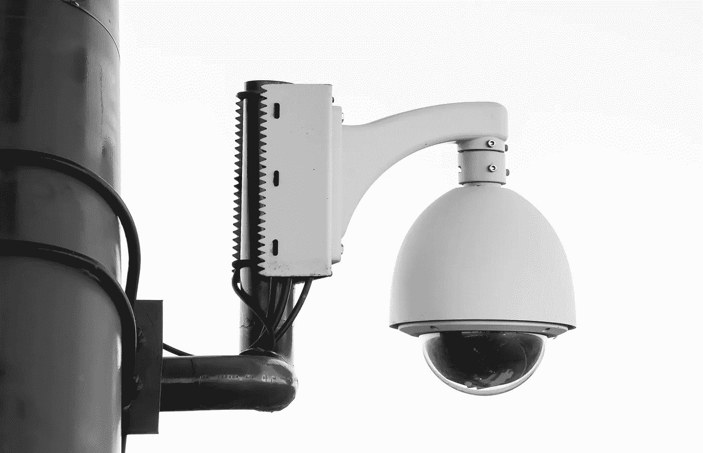

# 当我跟踪我的网站的使用情况时，是否应该受到谴责？

> 原文：<https://towardsdatascience.com/is-it-reprehensible-when-i-track-the-use-of-my-website-b3f4ad6d54b7?source=collection_archive---------38----------------------->

## 在遵守 GDPR 和保护用户隐私的同时，我能做些什么来改进我的网站？

What do you track? Photo by [Paweł Czerwiński](https://unsplash.com/@pawel_czerwinski?utm_source=unsplash&utm_medium=referral&utm_content=creditCopyText) on [Unsplash](https://unsplash.com/search/photos/security-camera?utm_source=unsplash&utm_medium=referral&utm_content=creditCopyText)

你经营一个网站，一个网店，你自己的博客，或者你的作家页面。

当然，你想知道你的页面表现如何。

*   有人来看我吗？
*   它能吸引访问者在页面上停留一段时间吗？还是游客马上就离开？在他们阅读我的内容之前？

当然，你想了解如何改进你的网页。

*   什么吸引了游客的注意力？
*   我需要做些什么来提高转化率？

答案是用户追踪。首先也是最重要的，是谷歌分析。还有其他跟踪工具。

你的意图没有错。问题是这些追踪工具是如何工作的。

首先。这些工具可以识别你的用户。他们存储他们的 IP 地址。它们在 cookies 中存储唯一的标识符。他们使用浏览器指纹识别。

第二。这些工具存储用户的每一次浏览量、每一个事件和每一个动作。他们把这些数据和标识符联系起来。

这些工具中的一些会在你的网站之外收集你的用户数据。他们将使用追踪工具的所有网站的数据连接起来。

他们可以全面了解你的用户。他们很快就会获得个人身份信息。他们得到了电子邮件地址。他们有一个社会安全号码。他们得到了电话号码。他们得到了邮政地址。

这些追踪工具知道你的用户是谁。他们知道她做什么。他们知道她的秘密。所有被访问的页面揭示了一切。

如果你使用这些工具，你就成了他们的助手。

一些开发这些追踪工具的公司承诺这些数据是你的。

但这就是错误！这不是你的数据。这也不是他们的数据。是你用户的数据！

It is my data. No, it is not. Give it to me! Photo by [Quino Al](https://unsplash.com/@quinoal?utm_source=unsplash&utm_medium=referral&utm_content=creditCopyText) on [Unsplash](https://unsplash.com/search/photos/fight?utm_source=unsplash&utm_medium=referral&utm_content=creditCopyText)

2018 年，欧盟发布了《通用数据保护条例》(GDPR)。它旨在保护用户的个人数据。

在你看来，大多数公司和网站所有者得出的后果是什么？

我的回答是:烦人的 cookie 同意弹出窗口。这些弹出式菜单大多遵循这样的态度:要么吃，要么死。如果您使用我们的网站，我们将收集您的个人数据。句号。

饼干本身并不是一件坏事。就我个人而言，我非常喜欢饼干🍪。说真的，cookies 有很多有效的用例。例如，登录机制。或者您可以在常用网站上指定的一些偏好设置。

但是如果侵犯用户隐私是使用 cookie 的唯一原因，那么这项技术就没有用了。

You have to be responsible with cookies.

这是否意味着，你不能再分析你的网站的性能了？你再也学不会如何改进你的网站了？

答案是:当然可以！

GDPR 并不禁止网站绩效评估。用户隐私和网站改进完全是两码事。

当你想知道你的网站运行得如何时，你不需要收集、存储和处理用户的个人数据。

例如，假设你想知道访问者的数量，以及他们是否点击了一个链接“我感兴趣”(又名转换)。当你只对两个数字感兴趣时，没有理由侵犯你的用户的隐私。两个简单的数字概括了你的网站的表现。

公平地说，您需要一些数据来计算这些性能指标。

但是您可以在不侵犯用户隐私的情况下收集所需的数据！我想提三个技巧。这些技术巧妙的结合在一起，让你在不侵犯用户隐私的情况下收集所有你需要的数据。因为您收集的数据不包含个人用户数据。

这些技术是:

*   概率差分隐私
*   同态加密
*   分散队列抽样

**概率差分隐私**是一种从一组人那里获得统计数据而不泄露每个人提供的数据的方法。

它的基本思想是给你收集的数据添加噪声。

例如，假设你收集用户的年龄。你增加或减少每个用户的价值一点点。随机地。你不使用或存储真实的年龄。

这种噪音对一个人来说是不可逆的。再也没有办法找出单个用户的真实年龄了。

但是一旦你收集了许多用户的年龄，噪音就平均了。你可以看到你的用户的平均年龄。你甚至可以把他们分成几组。但是你没有任何一个人的真实年龄。

你对每一个数据都这样做。

**同态加密**是一种允许直接对加密数据进行计算的加密形式。解密后，计算结果与运算结果相匹配，就像对未加密的值执行了运算一样。

所有数据都在用户的浏览器中加密。它不会被解密以供处理。它不会被解密以供存储。

您只解密计算出的指标。这些指标包含了你的网站的统计数据。它们不包含或披露任何个人用户信息。

您可以计算网站的性能指标，而无需使用甚至以不安全的方式存储您的用户数据。所有数据都是加密的。而且是加密的。

您的跟踪工具提供商无权访问加密数据。当他们故意尝试时不会，不是偶然，即使他们被黑了也不会。

**解体队列抽样**通过组合恢复防止个人数据被泄露。如果你有一个人的一些数据，你也许能从其他来源恢复个人数据。

例如，你的浏览器包含许多偏好。时区、语言、安装的插件等等。这些数据中的每一个都是无害的。因为许多其他人也有同样的偏好。

但是如果你把所有这些东西结合起来，你就会得到一个独特的浏览器指纹。因此，您获得了用户的个人标识符。

但是你可以用一种分解的方式存储所有这些数据。你的用户所说的语言可能对改善你的网站很重要。但是你不需要知道那个说某种语言的人的具体浏览器版本。所以，没有必要在你的数据中保留这种关系。

解体甚至帮助你摆脱个人身份信息。例如，如果你考虑一个用户的社会保险号。前三个数字代表地理位置。将位置分开存储，不与号码的其余部分链接。您可以在分析中使用该位置，而不会侵犯用户的隐私。

跟踪你网站的表现并不应该受到指责。利用对你的网站如何被使用的洞察力是无可指责的。因为这些东西与可识别的用户无关。

但是目的并不能证明手段是正当的。

如果你追踪单身人士。如果您收集个人身份信息。然后，你会侵犯你的用户的隐私。

你是否主动识别他人身份并为了自己的利益出售这些信息并不重要。

即使你只是存储个人数据，你也在拿用户的隐私冒险。服务器被黑了。如果你不想出售或使用这些数据，你为什么要存储它呢？

隐私保护是可能的。这不是问题。但这是一个机会！你可以将你的网页与竞争对手的区别开来。

跳过烦人的 cookie 通知。尤其是如果它说:“同意或不使用该网页”。跳过“吃(我的饼干)或死亡”的态度。

Eat my cookie!

用户越来越意识到并敏感于数据隐私问题。当大多数网站主根本不在乎的时候，就是你脱颖而出的机会了。