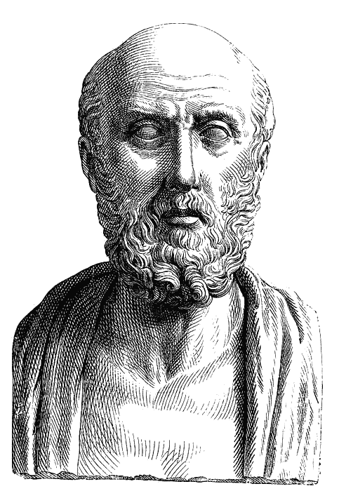

# 是时候制定数据科学家道德准则了吗？

> 原文：<https://towardsdatascience.com/is-it-time-for-a-data-scientist-code-of-ethics-210b4f987a8?source=collection_archive---------12----------------------->

## 医学有一套可以追溯到希腊希波克拉底誓言的道德准则，但是数据科学家的指导方针在哪里呢？

Photo by [Tim Gouw](https://unsplash.com/@punttim?utm_source=unsplash&utm_medium=referral&utm_content=creditCopyText) on [Unsplash](https://unsplash.com/?utm_source=unsplash&utm_medium=referral&utm_content=creditCopyText)

随着一款名为 DeepNude 的新应用程序的发布，它允许任何人修改女人的照片，使其看起来像裸体，我发现自己对 deepfakes 的发展速度深感不安。这样一个有形且可访问的工具凸显了 AI、计算机视觉和其他机器学习技术在错误手中的黑暗面。虽然有一些[令人难以置信的公开例子](https://www.cnn.com/interactive/2019/01/business/pentagons-race-against-deepfakes/)表明 deepfakes 如何被用来对个人视频、他们的外貌、他们的活动以及他们说的话进行篡改，但这项技术的可访问性主要掌握在少数懂技术的人手中。

即使有这些知识，生成令人信服的 deepfakes 所需的时间也是一个障碍。但 DeepNude 表明，改变图像可以在几秒钟内完成，而以前在普通公众无法接触到的强大机器上需要几天时间。

# 深度伪造工具的民主化

或许关于 DeepNude 最可怕的事情是这项技术如此迅速地大众化，以至于任何人都可以编造图像来伤害个人或群体。不幸的是，人工智能和机器学习的发展速度超过了我们的文化适应能力。我们正处于一个历史转折点，破坏性的图像和宣传可以迅速产生，然后通过社交媒体有机传播，这种方式是不可能阻止或识别真假的。

另一方面，同样的技术正在推动早期癌症检测、自动驾驶汽车、基因研究等领域的创新。因此，虽然像这样的事情是不可能被充分监管的，但是创造者自己有责任对他们所创造的东西的真正长期影响做出决定。

> “我不做，一年后别人会做。”

这就把我们带到了发布像 DeepNude 这样的东西的道德问题上。据 the Verge 报道，这位名叫 Alberto 的开发者说:“如果我不做，一年内就会有人做。”对于一个人的行为的含义，这是一个可怕的立场。虽然创作者[已经关闭了应用](https://www.theverge.com/2019/6/27/18761496/deepnude-shuts-down-deepfake-nude-ai-app-women)，但现在它就在那里，就像它可以生成的照片一样，那扇门现在是敞开的。它还邀请其他人做类似的工作。我们现在正处于一场虚拟的军备竞赛中，deepfakes 可能会演变成人类有史以来创造的最危险的武器之一。

现代文化已经让我们习惯于这样的想法，即人工智能将以某种方式带来我们的毁灭，但几乎没有集体恐惧，即这些工具背后的工具可能比一些想象的有知觉的人工智能更危险。AI 界有没有“疯狂科学家”的类比？

那么，在一个与机器学习的使用一样微妙的话题中，我们从哪里开始定义道德制高点呢？虽然 DeepNude 是一系列公开可用的机器学习技术的实现，但也许我们需要后退一步，看看数据科学家社区本身是如何进行这种技术的研究并使之成为可能的。

# 医学道德规范

从开始，作为一个参照点，医学有一个可以追溯到[希腊希波克拉底誓言](https://en.wikipedia.org/wiki/Hippocratic_Oath)的道德准则。

The Greek physician [Hippocrates](https://en.wikipedia.org/wiki/Hippocrates), [https://commons.wikimedia.org/w/index.php?curid=164808](https://commons.wikimedia.org/w/index.php?curid=164808)

对医学伦理体系更现代的解释是围绕着一套道德原则作为指导方针。根据维基百科关于医学伦理的页面，它们可以分为以下四种价值观:

*   尊重自主权——患者有权拒绝或选择他们的治疗。
*   慈善——从业者应该以患者的最佳利益为出发点。
*   无害——不成为伤害的原因。还有，“效用”——提倡利大于弊
*   公正——涉及稀缺卫生资源的分配，以及谁获得何种治疗的决定。

即使这些都是数据科学家道德准则的良好开端，但让我们花点时间来探索一些潜在的概念，这些概念可以为数据科学家定义一套专门的道德规范。

# 数据科学道德准则

大多数人脑海中最先想到的可能是用这样的准则来定义问责制。但是道德准则背后的真正概念不是责任本身，而是团队可以集体同意一套核心原则的想法。

这些原则在系统层面上推动行动，以帮助确保当个人的价值观或信仰受到质疑时，个人的道德指南针指向正确的方向。一些团体目前正在试图定义这些，例如[数据科学协会](https://www.datascienceassn.org/code-of-conduct.html)、[艾伦·弗里茨勒的数据科学造福社会](https://dssg.uchicago.edu/2015/09/18/an-ethical-checklist-for-data-science/)，以及[牛津-蒙钦行为准则](http://www.code-of-ethics.org/code-of-conduct/)等等。

虽然这些都是涵盖数据科学家的各种职责和工作的伟大而详细的尝试，但也许我们需要一组更小、更集中的价值观来达成一致:

## 无罪

这一条是直接从上面提起的，但数据科学家应该以一种不会故意造成伤害的方式为人类的最佳利益而努力。虽然将机器学习用于自动驾驶汽车是为了更大的利益，但当应用于军用车辆时，对话变得更加复杂。数据科学家需要思考他们行动的后果，以更好地了解最终的创造是否利大于弊。

## 法定的

不言而喻，数据科学家不仅应该遵守自己国家的法律，还应该遵守国际公认的法规。数据科学家应该直接意识到他们的创造的法律后果。以不可避免为借口，在其他人之前发布某些东西的行为是不可接受的。

## 更大的利益

并不是所有的创造都只有好坏之分。对于数据科学家来说，最具挑战性的职位之一可能是他们在很大程度上从事研究的现实。控制这类研究的实施并不总是可能的。但是作为一个团体，这项研究应该是为了更大的利益。

## 显著

因为害怕潜在的后果而隐藏在匿名背后的想法不应该是一种保护自己的方式。数据科学家的名字与研究联系在一起，反过来，与实施有着直接的联系。支持一个人的工作和它的衍生物可以帮助确保对它所激发的创作有一定程度的责任感。

> 有时，这类事件迫使我们去监管一些以前可能被认为无害或无关紧要的事情。

不需要道德准则来判断发布类似 DeepNude 的用例。如果应用程序的作者对发布它的合法性有信心，他们就不会匿名了。我甚至不知道这一行动会有什么后果。有时，这类事件迫使我们去监管一些以前可能被认为无害或无关紧要的事情。

上面的一组建议值只是我对一些令人担忧的事情的膝跳反应，我担心这只会变得更糟，因为在谦逊的数据科学家所做的良好研究的支持下，这个深度虚假的空间继续增长。围绕用于机器学习的数据的收集和使用，还有更大的对话要进行。与工作成果直接或间接相关的个人隐私呢？如何立法来保护数据科学家和那些受其行为影响的人？这是一个太大的主题，但我们现在需要开始一个对话。

# 下一步是什么？

关于数据科学家所做工作的真正责任，这里有一个更广泛的探索，因为监管和扼杀创新之间只有一线之隔。一个人可以使用任何工具好或坏，但一条清晰的界限是相信你构建的工具应该有更大的好处，远远超过坏处。

Photo by [Neil Rosenstech](https://unsplash.com/@neilrosenstech?utm_source=unsplash&utm_medium=referral&utm_content=creditCopyText) on [Unsplash](https://unsplash.com/?utm_source=unsplash&utm_medium=referral&utm_content=creditCopyText)

我担心情况在好转之前会变得更糟。如果我们现在不采取措施，向进入该领域的新一代数据科学家灌输责任感，我们作为一个社会可能很难克服正在造成的损害。虽然谷歌搜索“数据科学家道德准则”会返回结果，但事实上没有单一的真理，我们需要在为时已晚之前解决这个问题。