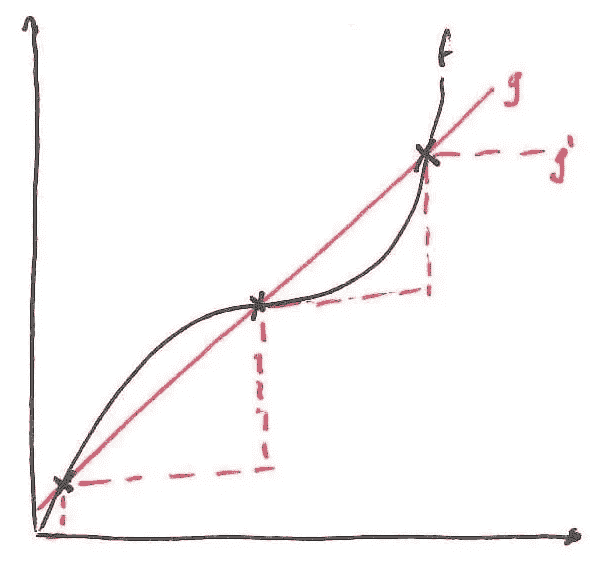
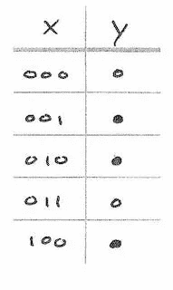
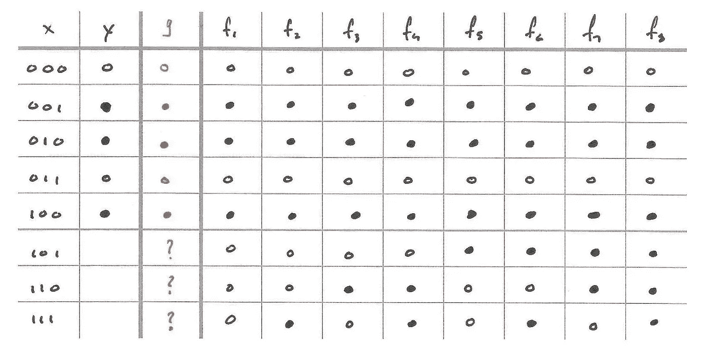
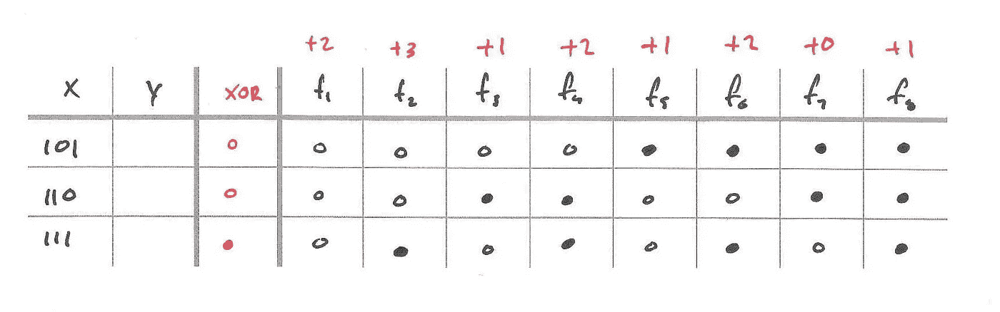
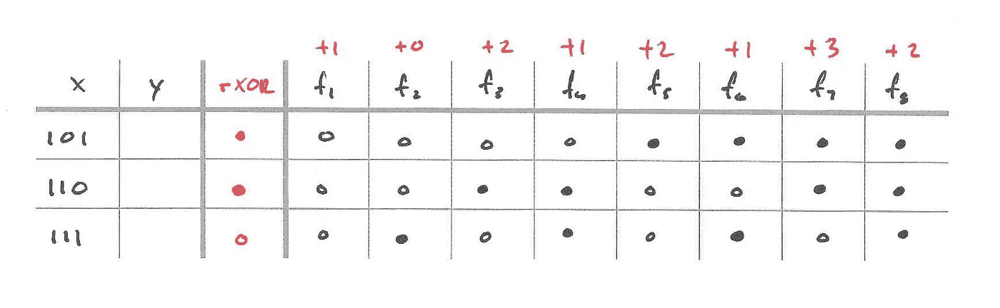
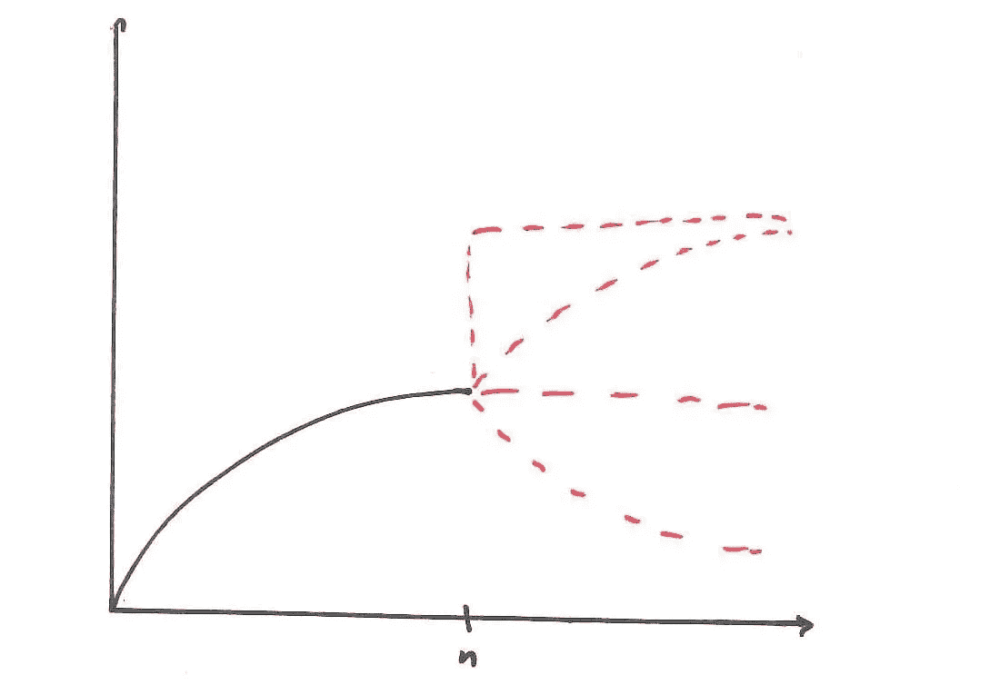

# 机器学习为什么可行？

> 原文：<https://towardsdatascience.com/is-learning-feasible-8e9c18b08a3c?source=collection_archive---------20----------------------->

Photo by [Rock’n Roll Monkey](https://unsplash.com/@rocknrollmonkey?utm_source=unsplash&utm_medium=referral&utm_content=creditCopyText) on [Unsplash](https://unsplash.com/s/photos/robot?utm_source=unsplash&utm_medium=referral&utm_content=creditCopyText)

## 对学习基础的快速探索

现在是 2019 年末，围绕机器学习的炒作已经发展到了不合理的程度。似乎每周都有新的艺术成果被报道，一个更光滑的深度学习库出现在 GitHub 上，OpenAI 发布了一个具有更多参数的 GPT-2 模型。迄今为止，我们已经看到了令人难以置信的结果，很难不被炒作所吸引。

然而，其他人警告说，机器学习承诺过多，交付不足。他们担心这种持续的行动可能会导致研究资金枯竭，导致另一个人工智能冬天。这确实是个坏消息。因此，为了遏制围绕机器学习的热情，并单枪匹马地阻止不可避免的 AI 寒冬，我将说服你**学习不可行**。

*本文改编自《从数据中学习》一书[1]。*

# T 何的学习问题

从根本上说，机器学习的目标是找到一个函数 *g* ，它最接近地逼近某个未知的目标函数 *f* 。

例如，在监督学习中，我们在某些点上被给定了 *f* 的值 *X* ，我们使用这些值来帮助我们找到 *g* 。更正式的说法是，给我们一个数据集 *D = {(x₁，y₁)，(x₂，y₂)，……，(xₙ，yₙ)}* 其中*yᵢ=f(xᵢ)*for*x∈x*。我们可以通过找到一个函数 *g* 使得 *g(x) ≈ f(x)* 在 *D* 上，使用这个数据集来近似 *f* 。然而，学习的目标不是简单地在 *D，*上很好地近似 *f* ，而是在任何地方都很好地近似 *f* 。也就是我们要*一般化*。为了说明这一点，请看下图。

Two different approximations to the function f.

*g* 和*g’*在训练数据上完全匹配 *f* (图中用“x”s 表示)。然而， *g* 显然是 *f* 比*g’*更好的近似值。我们要的是找到一个类似 *g* 的函数，而不是*g’。*

# 为什么学习不可行

既然我们已经设置了学习问题，值得强调的是目标函数 *f* 是*真正的* *未知的*。如果我们知道目标函数，我们根本不需要做任何学习，而是直接使用它。而且，由于我们不知道什么是 *f* ，不管我们最终选择什么 *g* ，我们都没有*方法*来验证它有多接近 *f* 。这看起来似乎是一个微不足道的观察，但是本文的其余部分将有望展示它的分支。

假设目标函数 *f* 是一个具有三维输入空间的布尔函数，即 *f: X → {0，1}，X = {0，1}* 。这是一个便于我们分析的设置，因为很容易列举出空间中所有可能的函数[2]。我们想利用下面的训练数据，用函数 *g* 来逼近 *f* 。

Training data available to approximate f. Here, x is the input and y = f(x). For clarity, we use ○ to indicate an output of 0 and ● to indicate an output of 1.

因为我们想要找到对 *f* 的最佳可能近似，所以让我们只保留与训练数据一致的空间中的函数，并去掉所有其他的。

All possible target functions which agree with the training data.

很好，现在我们只剩下 8 个可能的目标函数，在上图中标记为 *f₁* 到 *f₈* 。为了方便起见，我们还保留了训练数据的标签。请注意，我们无法访问样本外标签，因为我们不知道目标函数是什么。

现在问题变成了，我们选择哪个函数作为 *g？由于我们不知道哪个 *f* 是真正的目标函数，也许我们可以通过选择一个与最有可能的目标函数相一致的 *g* 来尝试对冲我们的赌注。我们甚至可以用训练数据来指导我们的选择(学习！).这听起来是一个有前途的方法。但是首先，让我们定义一下“符合最有潜力的目标函数”是什么意思*

## 学习最佳假设

为了确定一个假设(即选择 *g* )有多好，我们首先需要定义一个目标。一个直截了当的目标是，每当假设与样本外输入的 *fᵢ* 之一一致时，给假设一分。例如，如果假设在所有输入上与 *f₁* 一致，它得到 3 分，如果它在 2 个输入上一致，它得到 2 分，对于所有 *fᵢ* 以此类推。很容易看出，一个假设最多可以得 24 分。然而，要得到 24 分，假设必须与所有可能输入的所有可能目标函数一致。当然，这是不可能的，因为假设对于相同的输入必须输出 0 和 1。如果忽略不可能的场景，那么最多只能得 12 分。

现在唯一要做的就是选择一个假设并评估它。既然我们是聪明人，我们可以查看我们的训练数据，并“学习”是否有某种模式。XOR 函数似乎是一个很好的选择:如果输入有奇数个 1，则输出 1，否则输出 0。它与训练数据完全一致，所以让我们看看它在目标上做得有多好。

Computing the objective value for the XOR hypothesis.

如果我们进行练习，我们会看到，在样本数据外，XOR 与一个函数完全一致(+3 分)，与两个输入的三个函数一致(+6 分)，与一个输入的三个函数一致(+3 分)，与一个函数完全不一致(+0 分)，总共 12 分。完美！我们能够找到一个可能得分最高的假设。可能还有其他同样好的假设，但是我们保证没有比异或更好的假设。甚至可能有更差的假设，得到的分数少于 12 分。事实上，让我们找一个这样的坏假设，这样我们就可以检查 XOR 确实是目标函数的一个很好的候选。

## 最坏的假设？

如果 XOR 是最好的假设之一，那么一个很明显的坏假设的候选就是它的对立面，XOR。对于每个输入，如果 XOR 输出 1，则 XOR 输出 0，反之亦然。

Computing the objective value for the ¬XOR hypothesis.

再次回顾练习，我们现在看到，在样本数据外，XOR 与一个函数完全一致(+3 分)，与两个输入端的三个函数一致(+6 分)，与一个输入端的三个函数一致(+3 分)，与一个函数完全不一致(+0 分)，再次得到满分。事实上，*任何我们选择作为假设的*函数都会得到满分。这是因为任何函数*必须*与可能的目标函数中的一个——且仅一个——完全一致。从那里，很容易看出任何 *fᵢ* 将在两个输入上匹配其他 *fᵢ* 中的三个，三个在一个输入上，一个在没有输入上。

令人震惊的是，我们甚至可以不看训练数据就选择一个完美的假设。更糟糕的是，我们可以选择一个与训练数据完全不一致的假设，但它仍然可以获得满分。事实上，这正是 XOR 所做的。

> 这意味着所有函数在样本外数据上与目标函数一致的可能性是相等的，不管它们是否同意训练。

换句话说，函数与训练数据一致的事实没有给*任何关于它与样本外的目标函数一致程度的信息*。*既然我们真正关心的是样本外的表现，为什么我们还需要学习呢？*这不仅适用于布尔函数，也适用于任何可能的目标函数。这里有一张图可以更清楚地说明这一点。

Valid values the function f could take for input > n.

知道 *(-∞，n)* 上的 *f* 并不能告诉我们它在[n，∞)上的行为。任何虚线都可能是 *f* 的有效延续。

# 概率，可取之处

也许这是你希望我说的那部分，这一切都是一个巨大的笑话，并解释我如何欺骗你的眼睛。嗯，这不是开玩笑，但显然机器学习在实践中是可行的，所以我们肯定遗漏了什么。

学习“起作用”的原因是由于一个重要的基本假设，即所谓的[独立同分布假设](https://en.wikipedia.org/wiki/Independent_and_identically_distributed_random_variables) : *训练数据*和*样本外数据**和**是独立的，并且**和**是同分布的。这仅仅意味着我们的训练数据应该代表样本数据。这是一个合理的假设:如果样本外的数据差异很大，我们不可能期望我们从训练数据中学习到的东西能够推广到样本外。更简单的说，如果我们所有的训练数据都来自 *y = 2x* ，那么我们就不可能学到任何关于 *y = -9x + 5* 的东西。*

i.i.d .的假设在实践中也大致成立——或者至少不会被打破。例如，如果一家银行想要使用来自过去客户的信息(训练数据)建立一个模型，他们可以合理地假设他们的新客户(来自样本数据)不会太不同。我们在上面的布尔函数例子中没有做这个假设，所以我们不能排除任何 *fᵢ* 是真正的目标函数。然而，如果我们假设样本外数据的目标函数的输出类似于训练数据，那么显然 f₁或 f₂最有可能是目标函数。但是当然，我们永远无法确定😉。

欧根·霍塔吉
2019 年 11 月 29 日

如果你喜欢这篇文章，请在 Medium 上关注我，以获得关于新帖子的通知。

# 脚注

[1]阿布-穆斯塔法等人。al，[《从数据中学习》](https://amzn.com/1600490069)(2012)——如果你想深入学习理论的基础，这是一本很棒的书。它写得很好，作者有天赋用简单直观的方式解释复杂的话题。阿布-穆斯塔法教授也有一个免费的在线课程,随书而来，我*强烈推荐这个课程。*

[2]整个空间仅由 256 个函数组成。每个输入可以是 0 或 1，给出 2 = 8 种可能的输入组合。此外，对于每个输入组合，函数只能返回 0 或 1。因此，有 2⁸ = 256 个可能的函数。