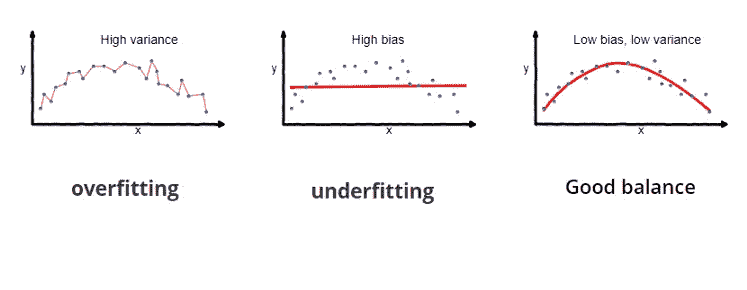
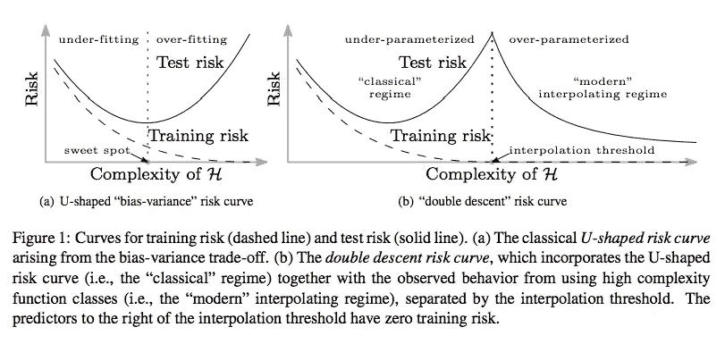

# 过度合身是一件坏事吗？

> 原文：<https://towardsdatascience.com/is-overfitting-really-bad-ddaabfc2f6b8?source=collection_archive---------32----------------------->

source & credit — [https://www.pexels.com/@brunoscramgnon](https://www.pexels.com/@brunoscramgnon)

经典统计学和机器学习中教授的一个基本原则是**“你不应该有一个过度拟合的模型”**！

“过度拟合”的意思是，你的神经网络已经学习了一个在训练数据上表现非常好的函数，但是当向它显示新数据(也称为测试数据)时，它不能提供正确的推断/预测。

通常，为了避免过度拟合的模型(或者换句话说，你渴望有一个通用的模型)，你应该利用一个叫做**偏差-方差权衡**的概念。

bias-variance tradeoff

> **偏差**这里实际上是**偏差-误差**反映了事实和预测之间的差异。预测越接近事实，误差越低！

这个概念的要点是

*   如果你有一个**高偏差**，这意味着即使在训练数据上，它也没有学习预期的功能
*   如果您有一个**高方差**，这意味着您学习的函数已经尝试考虑几乎所有的训练数据点，几十年的使用表明，当这种情况发生时，您的神经网络在测试数据上表现不佳

这里有一个链接，非常详细地介绍了**偏差-方差权衡**—[https://towards data science . com/understanding-the-bias-variance-trade-165 e 6942 b229](/understanding-the-bias-variance-tradeoff-165e6942b229)

很长一段时间以来，我一直把这个基本原则视为既定事实，直到我开始看到网络在训练数据上表现得非常好(几乎零训练误差)，但在没有任何正则化的情况下在测试数据上表现得也很好***。***

> *非常有趣的是，一个人在一次练习(在这里是训练)中获得零错误，却感到失望！*

*还有另一个不同的原理，叫做**奥卡姆剃刀。**奥卡姆的威廉用通俗的话给出的哲学是:一个人应该喜欢简单胜过复杂。我不敢反驳！*

*现在**奥卡姆剃刀**也被认为是统计学家应用的&，他们说——**最简单的假设(函数)应该永远是首选。同样，原则上我不能反对它，但我真的看不到的是，机器学习想要解决的大多数问题本质上都很复杂，因此这条原则真的适用于这里吗！。***

> *统计学家所提倡的奥卡姆剃刀有没有可能最终固定我们的思维，而我们没有考虑到最简单的解释并不总是最好的选择？*

*幸运的是，我在去年发表的一篇论文中找到了一些安慰——[调和现代机器学习和偏差-方差权衡](https://arxiv.org/abs/1812.11118)。*

*作者表明，现代神经网络往往在训练数据上实现零损失，但在测试数据上表现良好。他们认为，非常像经典统计学中的**【甜蜜点】**，其中有**低偏差，但假设(或学习函数)并不过分复杂，**还有另一个被称为**插值阈值**的“甜蜜点”，在此之后，即使 ***假设复杂性(以参数数量衡量)*** 增加，仍然可以有**低偏差和低方差。**他们阐释了下图所示的概念，并称之为**“双体面风险曲线”。***

**

*source — [https://arxiv.org/pdf/1812.11118.pdf](https://arxiv.org/pdf/1812.11118.pdf)*

*他们不仅展示了在神经网络环境中达到**插值阈值**的现象，还研究了其他机器学习算法，如**决策树&集成方法。**他们提供了一个经验证据，即通过使用决策树和随机森林进行 boosting 探索的函数族也显示出与神经网络相似的泛化行为，无论是在插值阈值之前还是之后。*

*那么为什么这个**插值阈值**在过去没有被观测到呢？该论文的作者提供了对它的见解，并引用了传统上特征具有固定大小的观点。我引用报纸上的话*

> *经典统计学中广泛研究的常用线性设置通常假设一组固定的特征，因此具有固定的拟合能力。各种形式的正则化既可以防止插值，也可以改变函数类的有效容量，从而衰减或掩盖插值峰值。*

*如果你训练了深层网络，你就能理解上面的观点；大多数情况下，如果我们开始发现测试误差没有减少，我们会提前停止执行**。在定义我们的网络层时，我们还系统地添加了**权重衰减&** 其他**正则化子**。作者建议(我也同意)的是，由于过早地关注正则化，我们经常无法实现**双体面风险**曲线中所示的**插值阈值/峰值**。***

**

*source — [https://www.pexels.com](https://www.pexels.com/)*

*相对于奥卡姆剃刀，我找到安慰的另一个地方是在[的拉德福德·尼尔博士](https://www.cs.toronto.edu/~radford/homepage.html)的精彩论文中，题目是 [***神经网络的贝叶斯学习***](https://www.cs.toronto.edu/~radford/ftp/thesis.pdf) ***。***Neal 博士是贝叶斯学习应用于工程应用领域的先驱，他介绍了马尔可夫链蒙特卡罗方法如何用于贝叶斯推理。*

*在他的论文(第 1.1.4 节)中，他提到奥卡姆剃刀原理通常被认为是归纳推理的一个基本组成部分，虽然它在科学背景下是没问题的，但它在精密、复杂且通常混乱的工程应用中的效用产生了合理的怀疑。*

*他进一步谈到，频繁统计学家所认为的过度拟合在贝叶斯观点中并没有找到同样的相关性。我很乐意分享这个观点，但这是以后的事了！*

# ***结束语***

*[对我来说，协调现代机器学习和 Belkin 等人的偏差-方差权衡](https://arxiv.org/pdf/1812.11118.pdf)非常有见地。首先，它帮助我消除了对零训练误差的担忧，其次，它表明挑战既定原则是可以的。*

> *在 stackexchange 上看到了下面这个帖子的同名主题—[https://ai . stack exchange . com/questions/4136/is-over fitting-always-a-bad-thing](https://ai.stackexchange.com/questions/4136/is-overfitting-always-a-bad-thing)……..当我读到作者说“响亮的是”的答案时，我笑了……这对你仍然适用吗？*

*不要害怕你的网络超载；我没有！*