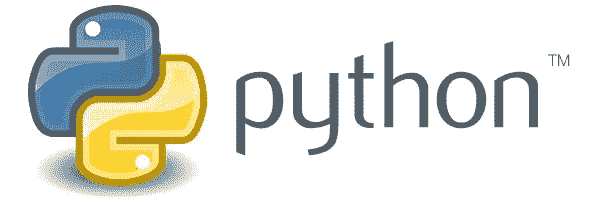

# Python 是面向对象的吗？

> 原文：<https://towardsdatascience.com/is-python-object-oriented-834d6c70cf54?source=collection_archive---------8----------------------->

本教程回答了 python 是否面向对象的问题？



Credits: [zo3.in](https://zo3.in/why-to-learn-python-programming-language/)

> Python 是一种面向对象的编程语言吗？是的，它是。除了控制流，Python 中的一切都是对象。由[麦克斯·菲舍尔](https://www.quora.com/profile/Max-Fischer-10)在 [Quora](https://www.quora.com/Is-Python-object-oriented) 中回答这个问题。

## 是时候用我的方式回答上面的问题了。

是的，python 是一种面向对象的编程语言。python 中的一切都是对象。使用 python 我们可以创建类和对象。在本教程中，我将只讨论类和对象。完整的源代码可以在下面我的 [GitHub 库](https://github.com/Tanu-N-Prabhu/Python/blob/master/Is_Python_object_oriented%3F.ipynb)中找到:

[](https://github.com/Tanu-N-Prabhu/Python/blob/master/Is_Python_object_oriented%3F.ipynb) [## 塔努-北帕布/Python

### 此时您不能执行该操作。您已使用另一个标签页或窗口登录。您已在另一个选项卡中注销，或者…

github.com](https://github.com/Tanu-N-Prabhu/Python/blob/master/Is_Python_object_oriented%3F.ipynb) 

类别:Cl**ss 就像帮助创建对象的蓝图。换句话说，一个类包含变量、方法和函数。或者您可以引用包含属性和行为的类。例如，考虑一个类“球”,球的属性可能是颜色、直径、价格，球的行为可能是滚动、弹跳。**

**对象:**对象是一个类的实例。借助于对象，我们可以访问一个类的方法和函数。

**现在让我们看看如何用 python 创建一个类和一个对象**

用 Python 创建一个类是很简单的，你所要做的就是使用一个名为“class”的关键字和一个通常被称为类名的名字。在类内部，我们可以声明函数或变量。

```
class python: def designer():
        print(“Guido van Rossum”) def first_appeared():
        print(“1990; 29 years ago”)
```

为了访问这个类中的函数，你只需要用类名和“.”来调用这个类点运算符调用它的函数。我们可以通过两种方式访问类:不创建对象和创建对象。

**不创建对象**

只需使用类名和点运算符来访问类中的函数。

```
python.designer()**Guido van Rossum**python.first_appeared()**1990; 29 years ago**
```

**创建一个对象**

```
p = pythonp.designer()**Guido van Rossum**p.first_appeared()**1990; 29 years ago**
```

现在，创建一个对象并不是一件困难的事情，你所要做的就是使用一个名为“p”的变量，并将它赋给类“python ”,然后在点运算符的帮助下，你就可以调用该类中的函数。

## 自身参数

> `self`参数是对该类的当前实例的引用，用于访问属于该类的变量。学分— [w3schools](https://www.w3schools.com/python/python_classes.asp)

你可以给 self 参数起任何你喜欢的名字，**不强制**称它为 self。

```
class Dog:
    def __init__(self, name, age):
        self.name = name
        self.age = age def func(a):
        print(“Hello my dog’s name is “ + a.name + “ and its age is        “ + a.age)p1 = Dog(“Danny”, “10”)p1.func()**Hello my dog's name is Danny and its age is 10**
```

在上面的例子中，我使用了初始化类时执行的 init()。这里每个类都包含 init()函数。如上所述，在 self 参数的帮助下，我们可以访问类内部的变量。

## 我们也可以在没有 self 参数的情况下访问和修改类内部的变量。

```
class Dog: breed = "Alaskan Malamute"
    age = 10d = Dog()
print(d.breed)
print("--------------------")
d.breed = "Labrador"
print(d.breed)**Alaskan Malamute 
-------------------- 
Labrador**
```

## 让我们看看如何使用“del”关键字删除对象。

您可以使用`del`关键字删除对象:

```
class Dog:
    print(“Alaskan Malamute”)
    print(“10”)**Alaskan Malamute 
10**d = Dog()print(d)**<__main__.Dog object at 0x7f1cb938ceb8>**del dprint(d)**--------------------------------------------------------------------****NameError                 Traceback (most recent call last)**[**<ipython-input-53-85549cb1de5f>**](/<ipython-input-53-85549cb1de5f>) **in <module>()
----> 1 print(d)****NameError: name 'd' is not defined**
```

## 让我们看看如何删除对象的属性

您可以使用`del`关键字删除对象的属性:

```
class Dog:
    name_of_the_dog = "Danny"d = Dog
del d.name_of_the_dogprint(d.name_of_the_dog)**--------------------------------------------------------------------****AttributeError       Traceback (most recent call last)**[**<ipython-input-38-e6d330ce7a18>**](/<ipython-input-38-e6d330ce7a18>) **in <module>()
----> 1 print(d.name_of_the_dog)****AttributeError: type object 'Dog' has no attribute 'name_of_the_dog'**
```

## 访问类中的对象变量和函数

要做到这一点，你所要做的就是创建一个类类型的对象，并使用点运算符访问变量的名称和类的函数。

```
class dog: age = 10 def name():
        print("Danny")d = dog
d.age**10**d.name()**Danny**
```

我想现在你们相信 python 是一种面向对象的编程语言。本教程到此结束，我知道这是一个很短的教程，但这足以作为一个好的开始来了解更多的类和对象。要阅读 python 类的官方文档，我建议大家阅读以下内容:

 [## 9.类- Python 3.8.0 文档

### 类提供了一种将数据和功能捆绑在一起的方法。创建一个新类会创建一个新类型的对象…

docs.python.org](https://docs.python.org/3/tutorial/classes.html) 

在接下来的教程中，我将提供关于继承、父类和子类等更多内容的文档。再见，祝你今天愉快。