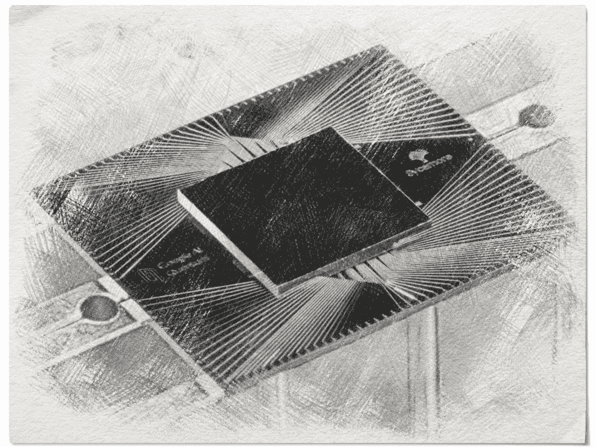

# 量子至上到底是不是一个东西？

> 原文：<https://towardsdatascience.com/is-quantum-supremacy-a-thing-or-not-33ef6a1b1cac?source=collection_archive---------22----------------------->

## 谷歌说他们做到了，量子计算机不仅是真实的，他们目前正在摧毁经典计算机，其他人不同意。

如果你沉浸在计算机世界，你可能听说过谷歌达到了所谓的“量子霸权”。那是什么？他们是这样说的:

> 我们开发了一种新的 54 量子位处理器，名为“Sycamore”，由快速、高保真[量子逻辑门](https://en.wikipedia.org/wiki/Quantum_logic_gate)组成，以执行基准测试。我们的机器在 200 秒内完成了目标计算，根据我们实验中的测量，我们确定世界上最快的超级计算机需要 10，000 年才能产生类似的输出。

因此，量子计算机在 200 秒(大约 3.3 分钟)内解决了这个问题，而传统的超级计算机需要 10，000 年才能完成同样的工作！这太惊人了。然后我看了这个视频:

我惊呆了！！我开始写这篇文章来展示这个结果是多么惊人。然后！流浪汉。！！我看到了这个:

 [## 关于“量子至上”| IBM 研究博客

### 量子计算的最新进展已经产生了两个 53 量子位的处理器

www.ibm.com](https://www.ibm.com/blogs/research/2019/10/on-quantum-supremacy/) 

让我在这里向你描述整个故事。今天 10 月 23 日发表在《自然》杂志上的谷歌[论文](https://www.nature.com/articles/s41586-019-1666-5.pdf)之前在[美国宇航局的 NTRS 网页](http://www.spaceref.com/news/viewsr.html?pid=52862)上泄露过，但它被删除了，没有任何解释。每个人都在问:鞋跟怎么了？？

然后 IBM 发表了那个博客，还有这篇文章:

 [## 利用二级存储模拟深度 54 量子位 Sycamore 电路

### 在最近的一篇论文中，我们展示了二级存储可以扩展量子电路的应用范围

arxiv.org](https://arxiv.org/abs/1910.09534) 

他们说:

> 我们认为，同样任务的理想模拟可以在传统系统上在 2.5 天内完成，而且保真度要高得多。事实上，这是一个保守的、最坏的估计，我们希望通过进一步的改进，模拟的传统成本可以进一步降低。

所以不是一万年？两天半？这是一个很大的区别。要理解这个讨论的技术部分，请阅读 Scott Aaronson 的博客:

 [## Shtetl 优化的

### 2019 年 9 月 9 日上周，我有幸在苏黎世联邦理工学院(ETH Zurich)举办了一年一度的保罗·伯奈斯(Paul Bernays)讲座。我的开场…

www.scottaaronson.com](https://www.scottaaronson.com/blog/) 

他解释并给出了他对这个问题的看法。但是斯科特的博客里有希望:

> 但 IBM 的分析是否意味着“量子至上”还没有实现？不，不是这样的——至少，在我用过的任何“量子至上”的定义下都不是这样。Sycamore 芯片花了大约 3 分钟时间来生成大约 500 万个样本，这些样本需要通过“线性交叉熵基准测试”——谷歌应用于其设备输出的统计测试。三分钟对两天半仍然是一个 1200 倍的量子加速。

所以好吧，我们还没到可以说量子计算机比经典计算机快 1752000 倍(我算出来的)的地步，但是 1200 倍就够了。

我们正处于量子计算时代的新起点。随之而来的是量子机器学习(在争议后写这些话很可怕)，以及人工智能和人类的一个新的可能性世界。

如果你想理解这篇短文，请按以下顺序阅读:

 [## 使用可编程超导处理器的量子优势

### 量子优势使用可编程超导处理器谷歌人工智能量子和合作者诱人的…

www.spaceref.com](http://www.spaceref.com/news/viewsr.html?pid=52862)  [## 关于“量子至上”| IBM 研究博客

### 量子计算的最新进展已经产生了两个 53 量子位的处理器

www.ibm.com](https://www.ibm.com/blogs/research/2019/10/on-quantum-supremacy/)  [## 利用二级存储模拟深度 54 量子位 Sycamore 电路

### 在最近的一篇论文中，我们展示了二级存储可以扩展量子电路的应用范围

arxiv.org](https://arxiv.org/abs/1910.09534)  [## 使用可编程超导处理器的量子优势

### 30 多年来，物理学家一直在谈论量子计算的威力，但问题总是…

ai.googleblog.com](https://ai.googleblog.com/2019/10/quantum-supremacy-using-programmable.html)  [## 使用可编程超导处理器的量子优势

### 量子计算机的前景是，某些计算任务可能会在一台计算机上以指数级的速度执行

www.nature.com](https://www.nature.com/articles/s41586-019-1666-5)  [## Shtetl 优化的

### 2019 年 9 月 9 日上周，我有幸在苏黎世联邦理工学院(ETH Zurich)举办了一年一度的保罗·伯奈斯(Paul Bernays)讲座。我的开场…

www.scottaaronson.com](https://www.scottaaronson.com/blog/) 

感谢阅读并一直保持学习:)