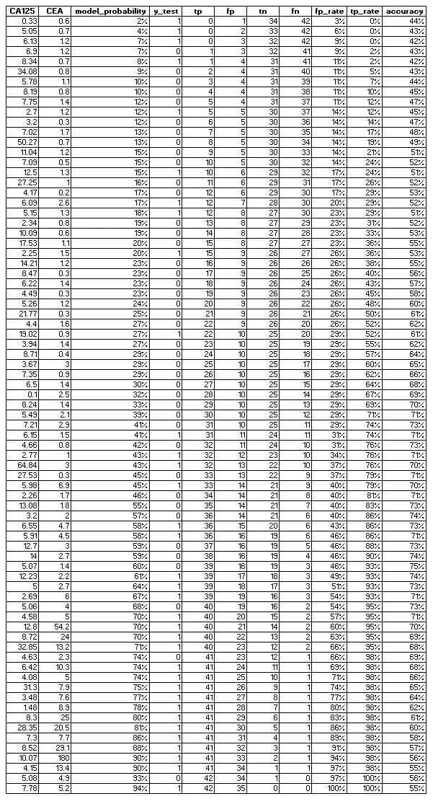

# 随机森林比逻辑回归好吗？(比较)

> 原文：<https://towardsdatascience.com/is-random-forest-better-than-logistic-regression-a-comparison-7a0f068963e4?source=collection_archive---------2----------------------->

## 深入研究随机森林的本质，遍历一个示例，并将其与逻辑回归进行比较。


[Source](https://unsplash.com/photos/sp-p7uuT0tw)

# 简介:

随机森林是从一组数据中提取信息的另一种方式。这种模式的吸引力在于:

*   它强调功能选择——将某些功能看得比其他功能更重要。
*   它不像回归模型那样假设模型具有线性关系。
*   它利用集成学习。如果我们只使用一个决策树，我们就不会使用集成学习。一个随机森林随机抽取样本，形成很多决策树，然后平均掉叶子节点，得到一个更清晰的模型。

在此分析中，我们将使用随机森林对数据进行分类，[使用逻辑回归对结果进行比较](https://www.ncbi.nlm.nih.gov/pmc/articles/PMC6050737/)，并讨论差异。*看一看前面的* [*逻辑回归分析*](/predicting-cancer-with-logistic-regression-in-python-7b203ace16bc) *看看我们将把它与什么进行比较。*

# 目录:

1.数据理解(摘要)

2.数据探索/可视化(摘要)

4.构建模型

5.测试模型

6.结论

# 数据背景:

我们有一个 255 名患者的样本，想要测量 4 种蛋白质水平和癌症生长之间的关系。

**我们知道:**

*   每位患者测得的每种蛋白质的浓度。
*   每个患者是否已经被诊断患有癌症(0 =没有癌症；1=癌症)。

> **我们的目标是:**
> 
> 通过从我们样本中的蛋白质水平和癌症之间的关系中提取信息来预测未来的患者是否患有癌症。

**我们将关注的 4 种蛋白质:**

甲胎蛋白

癌胚抗原

癌抗原 125

癌抗原 50

我从 UAB 的 MBA 项目那里得到了这套用于教育目的的数据。

# 数据探索/可视化

再来看一下[逻辑回归分析](/predicting-cancer-with-logistic-regression-in-python-7b203ace16bc)得到更深入的了解。以下是要点:

```
import numpy as np
import pandas as pd
from sklearn import tree
from sklearn.ensemble import RandomForestClassifier
import matplotlib.pyplot as plt
inputdata= r”C:\Users\Andrew\Desktop\cea.xlsx”
df = pd.read_excel(inputdata)
**df**.describe()
```


Figure 1

## 目标变量(Y)

```
yhist = plt.hist('class (Y)', data = df, color='g')
plt.xlabel('Diagnosis (1) vs no diagnosis (0)')
plt.ylabel('Quantity')
plt.title('Class (Y) Distribution')
```


Figure 2

# 构建模型

要刷新逻辑回归输出:


CEA 和 CA125 是最有预测性的，它们的 pvalues 低于 alpha 5 %,它们的系数比其他的高。由于 AFP 和 CA50 具有较高的 p 值，我们将其从逻辑回归中剔除。

> 但是，我们会将它们保留在随机森林模型中。这个练习的全部目的是比较这两个模型，而不是将它们结合起来。

我们将构建决策树，并想象它的样子:

```
#Defining variables and building the model
features = list(df.columns[1:5])
y = df['class (Y)']
X = df[features]
clf = tree.DecisionTreeClassifier()
clf = clf.fit(X,y)#Visualizing the tree
from sklearn.externals.six import StringIO  
from IPython.display import Image  
from sklearn.tree import export_graphviz
import pydotplus
dot_data = StringIO()
export_graphviz(clf, out_file=dot_data,  
                filled=True, rounded=True,
                special_characters=True)
graph = pydotplus.graph_from_dot_data(dot_data.getvalue())  
Image(graph.create_png())
```

## 决策树:


Figure 3

对于新来的人来说，这是一棵令人生畏的树。让我们把它分解一下:

> ***特色:*** *X0(法新社)。X1 (CEA)。X2 (CA125)。X3 (CA50)*
> 
> ***第一层:*** *CEA ≤ 3.25，基尼 0.492，利差= 144，111*

根节点显示了分支之前整个数据集的基尼指数。基尼系数越低，数据越纯净。最糟糕的混合数据给出的基尼指数为 0.5。


更新一下，我们的数据中有 144 名非癌症患者和 111 名癌症患者。这方面的基尼指数将是 0.492，这意味着它非常混杂。但不用担心，随着新的分支和节点的形成，这棵树会降低基尼指数。

> 基尼指数= 1−((144/255)^2)+((111/255)^2)= 0.4916

回归模型告诉我们 CEA 是最具预测性的特征，具有最高的系数和最低的 p 值。决策树通过将 CEA 放在根节点上来同意这一点。每隔一个节点都是根节点 split 的衍生物。该算法选择在 CEA 水平 3.25 处分割，因为该点将目标变量分割成癌性和非癌性，比任何其他属性中的任何其他点更纯粹。CEA 值低于 3.25 (180 个样本)的情况更可能是非癌性的；高于 3.25 (75 个样本)的实例更有可能是癌性的。参考根下面的连接内部节点，查看实例是如何进一步划分的。

树的第二层分析两个新的数据桶(CEA 3.25 以下的 180 个样本和以上的 75 个样本)的方式与分析根节点的方式相同:

> 它运行 ID3 算法，找到将目标变量分割为其最大纯度的属性，确定最佳分界点，然后进行分割。

CEA 级别 3.25 以上拆分的第二层节点是基于 CA125 级别 38.6 以上。这种分割产生了 72 个样本的另一个内部节点和 3 个样本的第一个叶节点。该叶节点的基尼指数为 0，因为该节点中的所有 3 个样本都被分类为非癌。该算法考虑基于该特定叶节点对未来数据进行分类的方式是:

> **如果:** CEA ≥ 3.25 **且:** CA125 ≥ 38.65 **→** 患者=非癌(0)

该过程继续，直到树在所有叶节点结束，并且对于每一系列分裂都有一个决策。

## 随机森林

我们将实现一个随机森林，而不是停留在那里，将我们的模型建立在树叶的基础上:获取随机样本，形成许多决策树，并取这些决策的平均值来形成一个更精确的模型。在这个模型中，我们取 1000 个树木样本的平均值。

```
#Importing
from sklearn import metrics
from sklearn.model_selection import train_test_split as tts#Dividing into training(70%) and testing(30%)X_train, X_test, y_train, y_test = tts(X, y, test_size=0.3, random_state=None)#Running new regression on training data
treeclass = RandomForestClassifier(n_estimators=1000)
treeclass.fit(X_train, y_train)#Calculating the accuracy of the training model on the testing data
y_pred = treeclass.predict(X_test)
y_pred_prob = treeclass.predict_proba(X_test)
accuracy = treeclass.score(X_test, y_test)
print(‘The accuracy is: ‘ + str(accuracy *100) + ‘%’)
```


与逻辑斯蒂模型 74%的准确率相比，这一准确率为 71%。

# 测试模型

## 混淆矩阵

> *编辑:我正在和生物状态的一个朋友谈论我的分析，这个领域的惯例是这种疾病被认为是阳性的。我武断地将癌症设为阴性，因为当时我并不知道。*


Figure 4

```
#Confusion Matrix
from sklearn.metrics import confusion_matrix
confusion_matrix = confusion_matrix(y_test, y_pred)
print(confusion_matrix)
```


将上面的矩阵与图 4 相匹配，了解它的意思:

*   **34 我们模型的**猜测为**真阳性**:模型认为患者没有癌症，他们确实没有癌症。
*   **21 我们模型的**猜测为**真阴性**:模型认为患者有癌症，他们确实有癌症。
*   **14 我们的模型**的猜测是**假阴性**:模型认为患者有癌症，但实际上他们没有癌症
*   **8 本模型**猜测为**假阳性**:本模型认为患者无癌症，但实际确实有癌症。

我们总数据的 30%进入了测试组，剩下 255 个(. 3) = 77 个实例被测试。矩阵的和是 77。将“真”数除以总数，就可以得出我们模型的准确度:55/77 = 71%。

形成准确度图和 ROC 曲线的新数据框架:

```
#Formatting for ROC curve
y_pred_prob = pd.DataFrame(y_pred_prob)
y_1_prob = y_pred_prob[1]
y_test_1 = y_test.reset_index()
y_test_1 = y_test_1['class (Y)']
X_test = X_test.reset_index()
CEA = X_test['CEA']
CA125 = X_test['CA125']#Forming new df for ROC Curve and Accuracy curve
df = pd.DataFrame({ 'CEA': CEA, 'CA125': CA125, 'y_test': y_test_1, 'model_probability': y_1_prob})
df = df.sort_values('model_probability')#Creating 'True Positive', 'False Positive', 'True Negative' and 'False Negative' columns 
df['tp'] = (df['y_test'] == int(0)).cumsum()
df['fp'] = (df['y_test'] == int(1)).cumsum()
total_0s = df['y_test'].sum()
total_1s = abs(total_0s - len(df))
df['total_1s'] = total_1s
df['total_0s']= total_0s
df['total_instances'] = df['total_1s'] + df['total_0s']
df['tn'] = df['total_0s'] - df['fp']
df['fn'] = df['total_1s'] - df['tp']
df['fp_rate'] = df['fp'] / df['total_0s']
df['tp_rate'] = df['tp'] / df['total_1s']#Calculating accuracy column
df['accuracy'] = (df['tp'] + df['tn']) / (df['total_1s'] + df['total_0s'])#Deleting unnecessary columns
df.reset_index(inplace = True)
del df['total_1s']
del df['total_0s']
del df['total_instances']
del df['index']#Export the log into excel to show your friends
export_excel = df.to_excel (r"C:\Users\Andrew\Desktop\df1.xlsx", index = None, header=True)
```

为了理解下面数据框架中发生的事情，让我们一行一行地分析它。

*   **索引**:该数据框架按 model_probability 排序，为方便起见，我重新进行了索引。
*   **CA125 与 CEA** :蛋白水平原始检测数据。
*   **model_probability** :该列来自我们的训练数据的 logistic 模型，输出它基于输入的测试蛋白水平被分类为“1”(癌变)的概率预测。第一行是分类为癌性的可能性最小的实例，其 CA125 水平高，CEA 水平低。
*   **y_test** :我们用来检验模型性能的测试数据的实际分类。

> 其余的列完全基于“y_test”，而不是我们模型的预测。将这些值视为它们自己的混淆矩阵。这将有助于我们确定最佳截止点的位置。

*   **tp(真阳性)**:此列从 0 开始。如果 y_test 为“0”(良性)，则该值增加 1。它是所有潜在的真正积极因素的累积追踪器。第一行就是一个例子。
*   **fp(假阳性)**:本列从 0 开始。如果 y_test 为“1”(癌变)，则该值增加 1。它是所有潜在假阳性的累积跟踪器。第四行就是一个例子。
*   **tn(真阴性)**:该列从 32 开始(测试集中 1 的总数)。如果 y_test 为‘1’(癌变)，则该值减少 1。它是所有潜在真阴性的累积追踪器。第四行就是一个例子。
*   **fn(假阴性)**:该列从 45 开始(测试集中 0 的总数)。如果 y_test 为‘0’(良性)，则该值减少 1。它是所有潜在假阴性的累积跟踪器。第四行就是一个例子。
*   **fp_rate(假阳性率)**:这是通过计算行的假阳性计数并除以阳性总数(在我们的例子中是 45)得到的。它让我们知道我们可以通过在该行设置分界点来分类的假阳性的数量。我们希望尽可能降低成本。
*   **TP _ Rate(True Positive Rate)**:也称为 sensitivity，计算方法是取该行的真阳性计数，然后除以阳性总数。它让我们知道我们可以通过在那一行设置分界点来分类的真阳性的数量。**我们希望保持尽可能高的价格。**
*   **准确性**:真阳性和真阴性的总和除以总实例数(在我们的例子中是 77)。我们一行一行地计算潜在的精确度，基于我们混淆矩阵的可能性。



Figure 5

查看数据帧中的混淆矩阵后，尝试找到最高的**准确率**。如果您可以找到它，您可以将其与相应的 **model_probability** 进行匹配，以发现分类的最佳分界点。

```
#Plot
plt.plot(df[‘model_probability’],df[‘accuracy’], color = ‘c’)
plt.xlabel(‘Model Probability’)
plt.ylabel(‘Accuracy’)
plt.title(‘Optimal Cutoff’)
```


Figure 6

随机森林模型将截止点设置为 60%的模型概率，即 75%的准确度。

> 这可能看起来违背直觉，但这意味着如果我们在将患者归类为癌症患者时使用 60%而不是 50%，那么使用这一特定模型实际上会更准确。

作为比较，逻辑模型将它的最佳截止点设置为 54%的概率，同样的准确度为 75%。

最后，让我们绘制 ROC 曲线并找出 AUC:

```
#Calculating AUC
AUC = 1-(np.trapz(df[‘fp_rate’], df[‘tp_rate’]))
#Plotting ROC/AUC graph
plt.plot(df[‘fp_rate’], df[‘tp_rate’], color = ‘k’, label=’ROC Curve (AUC = %0.2f)’ % AUC)
#Plotting AUC=0.5 red line
plt.plot([0, 1], [0, 1],’r — ‘)
plt.xlabel(‘False Positive Rate’)
plt.ylabel(‘True Positive Rate (Sensitivity)’)
plt.title(‘Receiver operating characteristic’)
plt.legend(loc=”lower right”)
plt.show()
```


Figure 7

黑色的 ROC 曲线显示了我们的测试数据的真阳性率和假阳性率之间的权衡。穿过图表中心的红色虚线是为了提供一种最坏可能模型看起来像 ROC 曲线的感觉。

> ROC 线越靠近左上方，我们的模型越有预测性。它越像红色虚线，预测性就越低。

这就是曲线下面积(AUC)的由来。AUC 是位于 ROC 曲线下的空间面积。直观上，这个值越接近 1，我们的分类模型就越好。虚线的 AUC 是 0.5。完美模型的 AUC 应该是 1。我们的随机森林的 AUC 为 0.71。

为了比较，提供了 AUC 为 0.82 的 logistic ROC 曲线:


Figure 8

# 结论

比较模型之间的准确率和 AUC，这次是 logistic 回归胜出。这两种模式都各有利弊。

如果你觉得这有帮助，请订阅。如果你喜欢我的内容，请查看其他几个项目:

[*简单线性 vs 多项式回归*](/linear-vs-polynomial-regression-walk-through-83ca4f2363a3)

[*用 Python 中的逻辑回归预测癌症*](/predicting-cancer-with-logistic-regression-in-python-7b203ace16bc)

[二元逻辑回归示例(python)](/univariate-logistic-regression-example-in-python-acbefde8cc14)

[*从头开始计算 R 平方(使用 python)*](/r-squared-recipe-5814995fa39a)

[*风险棋盘游戏战斗自动化*](https://medium.com/better-programming/risk-board-game-battle-automation-5e2d955cc9b3)

[*风险棋盘游戏——战斗概率网格程序*](https://medium.com/better-programming/risk-board-game-battle-probability-grid-program-f3073fb34e5c)

# 延伸阅读:

随机森林回归:何时失败，为什么？