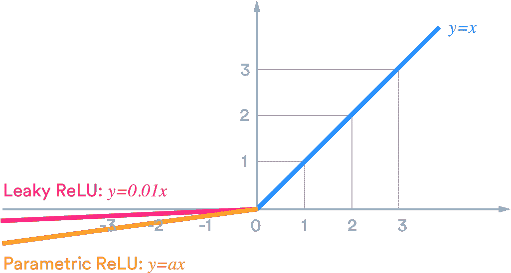
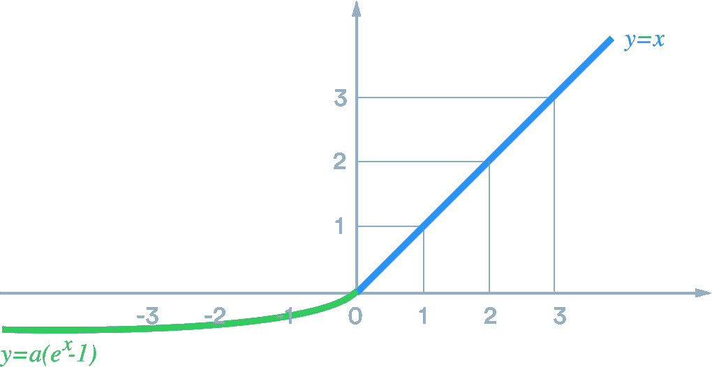
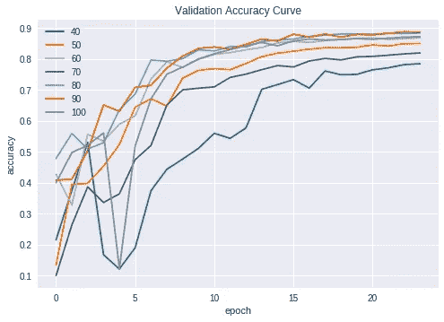
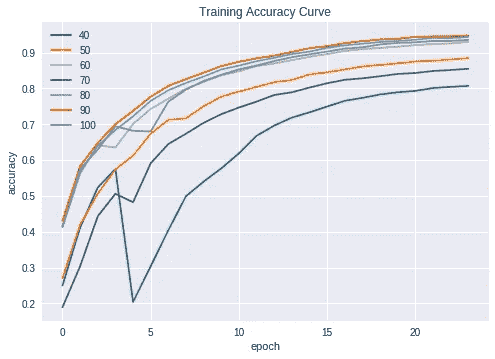
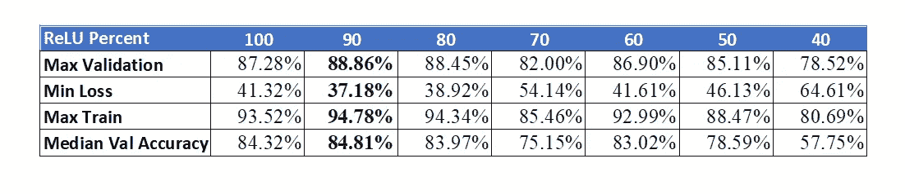
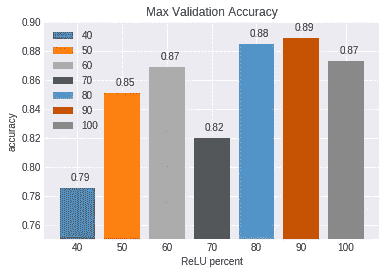

# ReLU 是 ReLUvant 吗？

> 原文：<https://towardsdatascience.com/is-relu-reluvant-52b03bc48daa?source=collection_archive---------33----------------------->

## 质疑深层神经网络中非常基本的元素


Photo by: [Nur Lan](https://twitter.com/nurikolan?lang=en)

近年来，深度神经网络被广泛应用于不同的领域。即使在今天，我们也在尝试构建更广泛、更深入的架构来解决现实世界的问题。深度神经网络的关键方面是它的非线性，这通过激活函数来实现。在 CNN 中，用于对象识别的大多数现有技术模型在网络架构内的卷积层之前或之后具有激活函数。但是有激活功能有多重要呢？我们真的需要为执行的每个卷积设置一个激活函数吗？我们将在本文中讨论其中的一些问题。

# 激活有各种形式

近年来，已经设计了不同的激活函数。随着大量实验集中于确定 CNN 的“最佳”激活，每篇论文都声称比同行的表现更好。一些广为人知的激活有:

**ReLU**


```
ReLU(x) = max(0, x)
```

**漏 ReLU 和 P ReLU**



泄漏 ReLU 和参数 ReLU 与正值 x 的 ReLU 相似，但负值的斜率较小。在泄漏 ReLU 中，该斜率常数为 0.01。

```
*Leaky ReLU = 0.01x* ∀ *x < 0
Parametric ReLU = ax & 0<a<1* ∀ *x< 0*
```

**ELU 和 SELU**



```
Exponential Linear Unit = α.(e^x –1) ∀ x<=0 
*Scaled Exponential Linear Units =* λx ∀ x>0 *=* λ(α.(e^x –1)) ∀ x<=0
```

与 ReLU 相比，ELU 和 SELU 在 x=0 时具有更平滑的曲线。

尽管有如此花哨的激活功能可用，但最近大多数 CNN 模型都只采用了 ReLU，这可能意味着，如果不是最好的，它的性能与任何其他激活功能一样好。可能的原因是:这很简单，使得反向传播更容易校正权重和保持更少的参数。因此，它有助于模型更快地训练和收敛。

这在很大程度上证明了 ReLU 的优势，但是我们还没有得到第二个问题的答案:在网络中的每个卷积层之后是否需要使用激活函数？为了回答这个问题，让我们开始我们的实验。

# 实验

让我们从具有完全预激活的 ResNet 块的 ResNet18 模型开始。在这个实验中，我们将随机丢弃一些 ReLU 激活函数，从 100%开始，在每个后续实验中丢弃 10%，保持所有其他参数一致。

> 在本实验中，我们将使用 CIFAR10 数据集。

## **超参数**

```
BATCH_SIZE = 512
MOMENTUM = 0.9
WEIGHT_DECAY = 5e-4
LEARNING_RATE = 0.4
EPOCHS = 24
ReLUPercent =100
```

## **图像增强**

```
Height and Width shift range = 0.15625,
Rotation range = 12
Random LR Flip
```

## **优化器**

使用动量为 0.9，重量衰减为 5e-4 的 SGD。一个周期的学习率策略，在第 5 个时期具有 0.4 的最大 LR，并向后面的时期逐渐下降。

## 体系结构

该模型有 4 个 ResNet 块。与传统的 ResNet 不同，在 ResNet 块的末尾，我们连接输入和残差路径，然后进行逐点卷积，以过滤前面获取的信息。
该模型有 25 个激活层(24 个 ReLUs 和 1 个 softMax)。

## 基准

在 CIFAR10 数据集上，该模型在 Google Colab 上 800 秒下的 24 个历元中给出了约 88%的验证准确率。该模型有大约 27M 个参数。

## **训练**



Plot 1: a)Validation Accuracy Curve, b) Training Accuracy Curve

**结果**



Table1: Accuracy Comparision

令人惊讶的是，当随机丢弃 10%的 ReLUs 时，获得了最佳的精度。第二好的准确度是当模型使用原始网络中总 ReLUs 的 80%时。对于一个卷积 100%次，我们有一个 ReLU 的精度是在最佳精度之后的 **1.58%** 。



Plot 2: Max Validation Accuracy

有了这些结果，我们可以部分回答我们的问题

> 在每个卷积后盲目添加 ReLU 是构建 CNN 架构的正确方式吗？
> 大概不会！
> 有没有更好的办法？
> 肯定是的！
> 如何决定是否需要添加 ReLU？
> 网格搜索可以是一种方式，但我想不出任何其他最优方式来决定是否在一次卷积后添加 ReLU。

虽然我们仍然不知道卷积层是否具有 ReLU 的适当方法，但希望这确实有助于我们理解，在设计深度神经网络时，仍然需要质疑非常基本的元素的使用。

实验可以在这个 [Colab 笔记本](https://colab.research.google.com/drive/1F6MZPmOyMmZfXuVVuUC_AuRBfimKwHH2)里找到。

**感谢您的阅读！请在评论中告诉我你的想法。再次感谢，继续学习！**

[1]:何、、张、向宇、任、、孙、简。(2016).[用于图像识别的深度残差学习](https://arxiv.org/pdf/1512.03385.pdf)。770–778.10.1109/cvpr . 2016.90 .
【2】:克日涅夫斯基，亚历克斯。(2012).[从微小图像中学习多层特征](https://www.cs.toronto.edu/~kriz/learning-features-2009-TR.pdf)。多伦多大学。