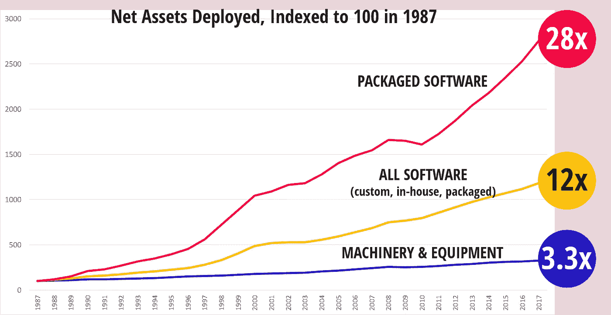
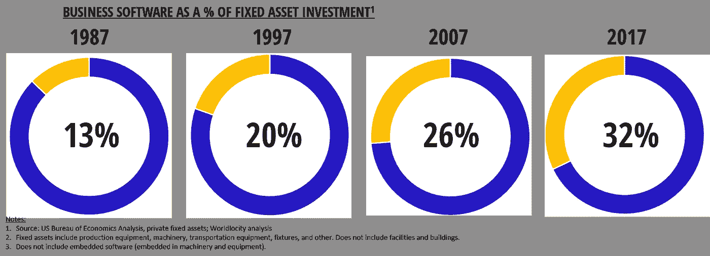
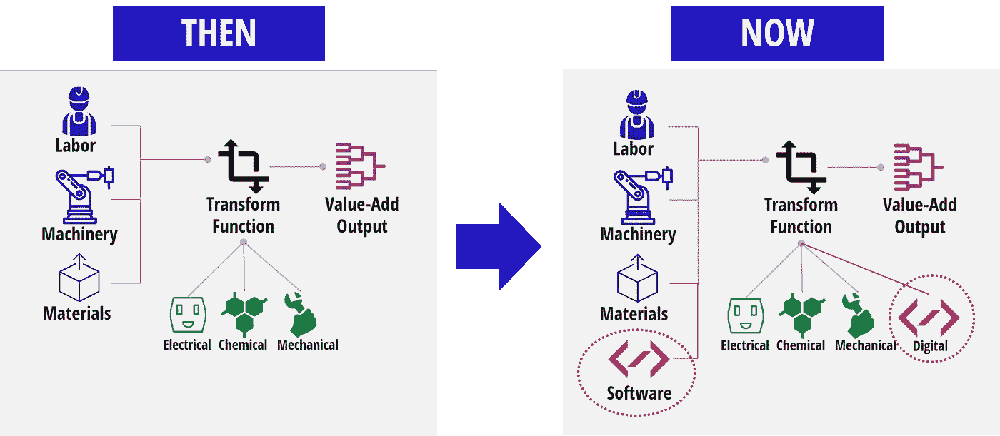

# 软件真的在蚕食世界吗？

> 原文：<https://towardsdatascience.com/is-software-really-eating-the-world-9e9182bf6400?source=collection_archive---------30----------------------->

## 证据就在数字中

Source: Pixabay

软件公司都是**。市值超过 3 亿美元的公共软件公司的平均市值收入比现在徘徊在 7.5 左右。很多这一切不仅仅是基于最近的高增长率，也是基于这样一种观点，即这些增长率将在未来很长一段时间内持续下去。这就是马克·安德森的论断， [**软件正在吞噬世界。**](https://a16z.com/2011/08/20/why-software-is-eating-the-world/)**

**安德森在七年多前写下了这篇现在被广泛引用的文章；在文章中，他以以软件为中心的公司的形式提供了强有力的证据，包括我们非常熟悉的常见嫌疑人，他们甚至不需要在这里重复。对于我们这些长期从事软件工作的人来说，这个论点似乎是不言自明的。证据就在我们周围，如果它走路像鸭子，叫起来像鸭子，那么它一定是一只鸭子。**

**我经常在各种场合引用“软件正在吞噬世界”这句话。这与我的信仰和我的所作所为是一致的。但我有时会遇到来自密苏里州的人，他们说“给我看看。”有没有一种实证的方法来检验这是不是真的，有多真实？**相对于资产、劳动力和材料驱动，企业和经济向软件驱动转变的速度有多快？****

# **直接经验**

**我对软件吞噬世界的直接体验来自于设计、销售和实现供应链软件。购买该软件和其他企业软件的价值主张通常基于增加销售额、降低成本和减少资本投资需求。**

**例如，当一家公司购买生产调度软件时，它这样做是为了增加产量或减少库存。该公司减少了对有形资产的需求，无论是生产设备还是库存。如果没有软件投资，公司将不得不投资更多的生产机器、库存和劳动力。**

**在这个例子中，公司可以购买价值 100 美元的软件，以避免在额外的机器上投资 1000 美元。机器投资也是典型的阶跃函数——你必须购买全部产能，不管你是否使用它。**

**通过进行软件投资而不是机器投资，数字密集度—或软件密集度—变得更大。软件成为资产基础中越来越重要的一部分，或者换句话说，软件已经吃掉了物理世界的这一部分。**

**从这个角度来看，我们已经走上了一条软件蚕食世界的道路。例如，低级穿孔卡嵌入了数字信息，充当了人、规则和机器之间的翻译接口。它帮助实现了各种劳动密集型记账、会计、工程和其他计算相关功能的自动化(当然，在这样做的过程中，它以打字员的形式创造了一支体力劳动大军)。**

# **证明它**

**事实证明，我们备受指责的政府有一整套设备来捕捉这些趋势的数据。据我所知，中国在这方面做得更好，比世界上任何其他国家都更透明、更开放。我利用这些数据已经有一段时间了；我发现宏观经济数据与行业或公司层面的微观数据如此接近很有意思。**

**下面的图表(使用经济分析局的数据构建)比较了过去三十年美国经济中软件和机械设备的增长率。**从这一点你可以很快推断出，安德森不仅在轶事上是正确的，而且就整个美国经济而言，他是正确的。**可以肯定地说，美国经济是全球经济状况的合理代表。**

****

**图表上需要注意的另一件事是，自 2010 年以来，打包软件曲线的斜率明显比前十年更陡，但仍未达到 1995 年至 2000 年互联网泡沫时期的增长率。这可能证明这不是泡沫，当前的增长率是可持续的。**

# ****吃豆人图表****

**下面的图表可能更能说明问题，我称之为吃豆人图表。它以十年为增量，显示了过去三十年中机器和设备相对于软件的投资百分比。Pacman(在这种情况下是软件)正在消耗越来越多的投资。**

****

**以上两个图表都有一些警示:**

1.  **软件数量不包括嵌入式软件——换句话说，与机器和设备一起携带的软件显然也在增长。同样，它们也不包括大量嵌入终端产品的软件。显然，这些数据很难获取。**
2.  **这些数据不包括建筑物等物理结构；它们只包括建筑物内的设备。对物理结构的投资是一个巨大的数字。话虽如此，软件也开始侵蚀物理结构，如下所述。**
3.  **与机器和设备相比，BEA 使用的软件折旧时间框架要短得多。这就产生了这样的效果:软件积累的程度不如物理资产；公司投资于它，然后它迅速贬值，至少与实物资产相比是如此。**

# ****数字混乱****

**与“数字化转型”相关的噪音震耳欲聋。每一个主要的咨询公司和企业软件公司都承诺带你去乐土。对于许多公司来说，短期的乐土只是为了另一天而战。**

****但数字化转型不一定会令人困惑。这只是另一种方式来提高产品和流程，改善制造产品所需的劳动力、材料和资产。**我们的目标始终如一——如何长期拥有您的客户并从中获利。**

**下图是观察数字化转型的一种简单方式。每个业务流程都有一组输入。这些投入转化为增值产出。不同的是，软件在输入中的比重越来越大，转换功能不再仅仅是电气、机械或化学。**

****

**当公司在所有流程中都这样做时，他们本质上就变成了数字公司。**

# ****机械、车辆和建筑****

**之前显示的图表不包括建筑物、构筑物和房屋。这是全球已部署资产基础的一大部分。建筑物在接受数字内容方面明显落后于消费产品，因此代表了竞争的沃土。见证亚马逊和谷歌争夺软件家庭主导地位的竞争。建筑物是长期资产；因此，添加数字内容主要是一个改造问题(机械行业也是如此，目前 IOT 的大部分工作都是改造工作)。**

**1977 年，当第一个拥有 50K 行代码的微处理器出现在一辆奥兹莫比尔汽车上时，家庭就是汽车所在的地方。在过去的 15 年里，几乎所有的新车增值都来自电子产品，其中大部分是由软件驱动的。这是一个很好理解的软件吃实体产品的例子。**

**今天的现代高端汽车有 50 到 100 个微处理器和 1 亿行代码。而且，这些功能已经从豪华车快速转移到经济型车，因为好车变成了必备品。**

**不难想象 2040 年的家也会有同样的装备。当然，房屋是长期资产，不像汽车，不会定期更换。因此，虽然新房子将越来越多地配备微处理器和嵌入式软件，但软件侵蚀建筑物的过程将是一个持续的翻新过程。**

**包括汽车供应商和工业设备制造商在内的工业企业，正竭尽全力向投资者展示它们实际上是软件公司，因为它们继续用软件来扩充产品。今天，典型的工业公司投资者演示文稿充斥着统计数据，显示他们拥有的软件工程师数量、开发流程的成熟度，以及他们产品组合中嵌入的大量先进技术。当你的公司的股价是销售额的 0.5 倍，而软件公司的股价是销售额的 7.5 倍时，你想要分一杯羹。**

# ****你还没看到什么呢****

**有人说数据是新的石油。如果数据是新的石油，那么软件就是生产设备、劳动力、材料、运输以及处理数据并使其有用的最终产品。当然，软件和数据之间的关系类似于石油和内燃机之间的关系——没有一个就无法运行。更进一步来说，每种组合都会产生很多好处，但也会产生一些讨厌的副产品。**

****数字资产取代实物资产的过程将持续很长一段时间。**然而，这是有限制的——例如，你不能生活在数字资产中。你居住的实物资产仍将存在，但其数字化程度将显著增加。在某个时候，数字和物理会达到一种平衡；但是那似乎是一个遥远的未来，到那个时候我们将已经进入下一个伟大的时代。**

***原载于 2019 年 2 月 20 日*[*www.worldlocity.com*](https://www.worldlocity.com/single-post/2019/02/20/Is-Software-Really-Eating-the-World)*。***