# 斯德哥尔摩越来越热了吗？

> 原文：<https://towardsdatascience.com/is-stockholm-getting-hotter-c7ce8a9008ee?source=collection_archive---------23----------------------->

## 使用 Bootstrap 在 Python 中进行假设检验

在这篇文章中，我展示了自 50 年代以来斯德哥尔摩的平均气温明显高于 1756 年。

使用的[数据集](https://bolin.su.se/data/stockholm/files/stockholm-historical-weather-observations-2017/temperature/monthly/stockholm_monthly_mean_temperature_1756_2017_hom.txt)包含了斯德哥尔摩自 1756 年以来 262 年的日平均气温。查看这些数据(转换为年份),我们可以看到自 1756 年以来最热的 10 年中有 5 年发生在 2000 年之后。

自 50 年代以来，平均气温上升了 0.74 摄氏度

通过基于历史数据和使用 bootstrap 进行假设检验，我已经能够证明斯德哥尔摩的天气确实发生了变化。

在[我关于介质的第一篇文章](https://medium.com/@maykonschots/making-sense-of-stockholm-historical-temperatures-data-some-hacker-statistics-in-python-part-1-e8a97c2cd7da)中，我写了一些基于相同温度数据的代码来推导累积分布函数，以便有一个可视化工具来比较经验分布和理论分布，如正态分布。在这篇文章中，你可以了解到我如何进一步利用这一点，并得出上述结果，表明斯德哥尔摩实际上正在变热。

NASA 主办的这个[网站](https://climate.nasa.gov/evidence/)给了我一个洞察力，让我将 1950 年定义为一个比较的门槛。

为什么是 1950 年？

几个世纪以来，温室气体二氧化碳的百万分率(ppm)在 300 以下波动。更高的地球表面温度和大气中的温室气体浓度密切相关。

## 嗯，1950 年是第一个越过这个水平的年份，从那以后，大气中的二氧化碳含量急剧上升。

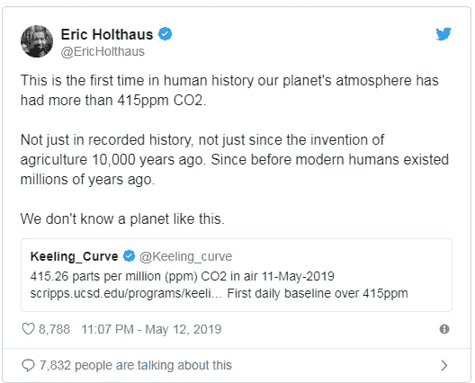

The level reached 415 ppm yesterday

我们编码吧？😃

导入带有常用别名的包。

Pandas 🐼 and friends

读取包含原始数据集的 [URL](https://bolin.su.se/data/stockholm/files/stockholm-historical-weather-observations-2017/temperature/monthly/stockholm_monthly_mean_temperature_1756_2017_hom.txt) 。

Reading the data

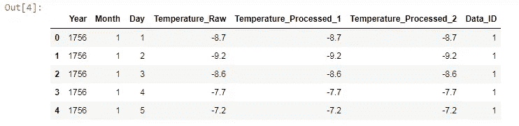

Stockholm Temperatures Data Set

我们感兴趣的问题是:

# 自 50 年代以来，斯德哥尔摩的平均气温是否比 1756 年前的气温高？

为了回答这个问题，我们将对数据进行转换，使分类变量指示世纪以及平均气温是来自 50 年代前后的某一年。

Before and After 50's

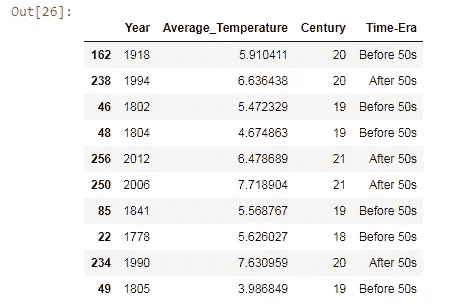

Data Set Sample After the Transformation (Yearly Average Temperatures)

有了这个转换后的数据集，我们可以开始探索，并对平均温度有初步的了解。

我们来做个 10 大气温排名？做好准备。

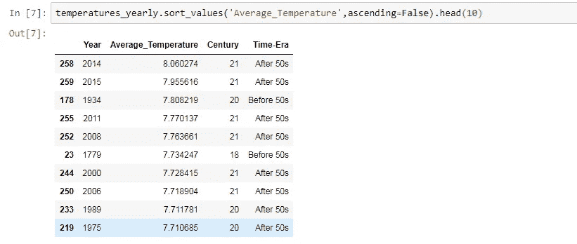

Top 10 Yearly Average Temperatures since 1756

8 从 1970 年开始。

7 如果你回到 1980 年。

6 如果扩展到 1990 年。

5 起发生在 2000 年以后。

😲

好像发生了什么事，不是吗？绝对值得对这些数字进行深入调查。

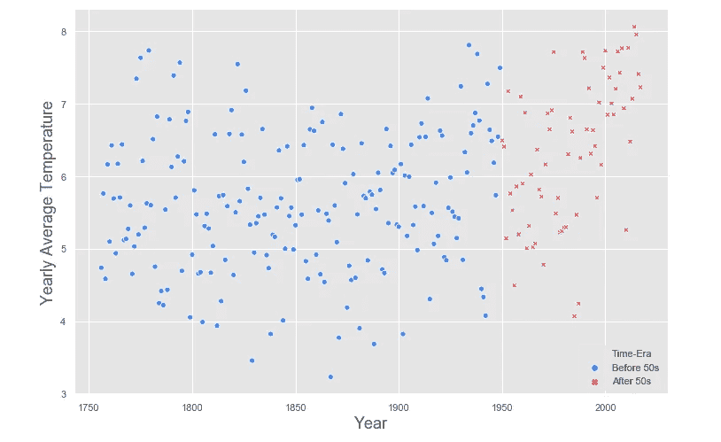

Are the temperatures coming from the same process?

上面的图表实际上表明，在 50 年代以后的几年里，平均温度向更高的值移动。箱线图总是能拯救我们，让我们对这些数字有更好的直觉。

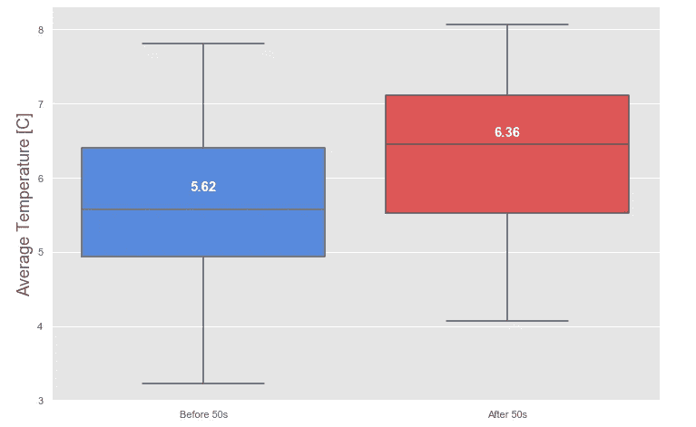

Boxplot of Temperature Average Differences (before and after 50's)

箱线图显示，50 年代后的中值温度大于 50 年代前全年平均温度的 75%

## 自 50 年代以来，平均气温上升了 0.74 摄氏度

大约 1 摄氏度的上升会带来巨大的后果。

雄辩。😩

你听说过蜂群计划吗？它与箱线图来自同一个系列，但您可以有效地看到数据点。当点数不太高时，我总是喜欢看一看，以获得关于分布的真实感觉。在我们的例子中，有 262 个平均温度。很好！

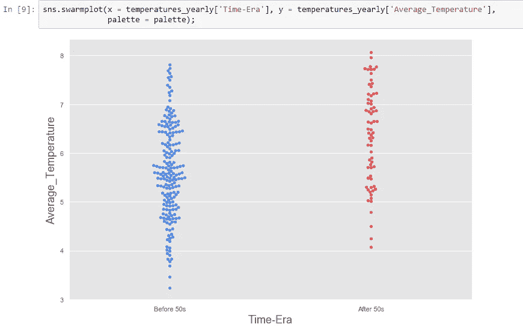

Swarmplot and Seaborn 💙

你对蓝色和红色的分布有什么看法？它们来自同一个来源吗？

我认为现在的问题说得很好。是时候停止猜测，使用统计工具了。

**假设检验**。

你还记得你的统计学入门课吗？我不知道。😸

假设检验的第一件事，不好意思，是假设。我们的是什么？我们称之为无效假设。

## 两个时期的平均温度相差近 0.74°C，这是由于温度分布的随机波动造成的，也就是说，斯德哥尔摩的天气没有任何变化。

我们的工作是通过计算观察到这种差异或更高的概率来挑战这一假设，如果斯德哥尔摩的天气没有变化的话。

如果它足够小，我们就有证据表明斯德哥尔摩真的变得越来越热，我们自豪地拒绝零假设。如果这样的可能性很高，我们就不能根据这个数据宣称有任何变化。

好吧。

我们必须模拟一个**零世界**并计算概率。但是怎么做呢？

第一，零世界。在这个世界上，自 50 年代以来什么都没有改变，所以两组中的任何一个温度在整个时期的任何时间都是可能的。

有意思。

如何在两组之间调整温度并重新标记它们呢？绝对没有问题，因为天气过程在过去的 262 年里都是一样的。下面我们有这样做的代码。

Shuffling in a Null World

具体的例子。我们有两组， ***a*** 和 ***b*** 。置换函数打乱数据并重新标记。现在清楚了吗？

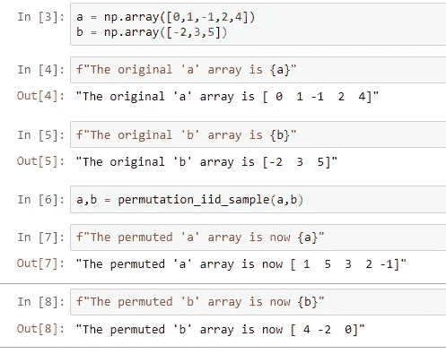

Permutation and Relabeling

排列前 ***a*** 和 ***b*** 的平均差值为 0.8。

在排列之后，平均差变成-1.8。在零世界中，这种差异是随机发生的正常波动。如果我们一次又一次地重复这个过程，几次，我们可以建立两组之间平均差异的分布。这个技术的名字叫做 [**引导**](https://en.wikipedia.org/wiki/Bootstrapping_(statistics)) 。

你对将这种东西应用于斯德哥尔摩的温度感到好奇吗？

我是。

下面的代码来完成任务。

Permutation on Two Samples

我们将对我们的数据进行 10000 次排列和重新标记，以绘制两组(50 度之前和之后)在所谓的零世界中平均温度差异的概率分布。

换句话说，我们正在模拟我们已经记录了 10000 次(1756-2017)的 262 年期间。

所有的权力💻！

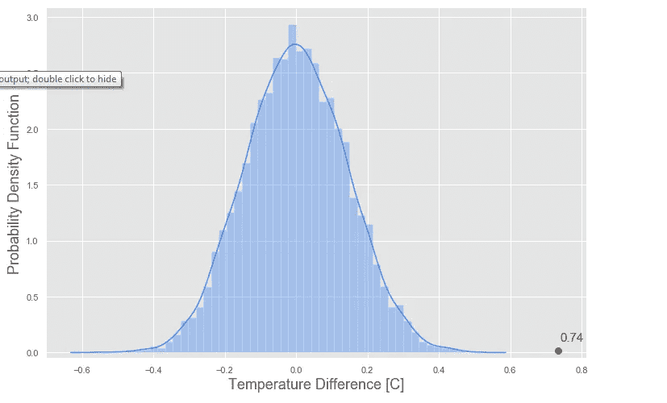

Simulated Null Hypothesis

正如我们在上面看到的，在零空间中，观察到 0.74°c 的差异是极其罕见的。

极其罕见。

有多稀有？在零世界中观察到的值等于或高于我们感兴趣的统计量的概率称为 **p 值。**

让我们计算一下，在我们模拟的零假设下，观察到 0.74°C 或更高的极端温差的概率。

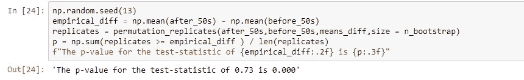

p-value

正如通过检查该图所预期的那样，p 值为零。有 3 个十进制数字的零。

有了这么低的 p 值，我们可以自信地拒绝零假设，并说产生斯德哥尔摩温度的天气过程发生了变化。

# 斯德哥尔摩真的越来越热了。如果 50 度之前和之后的温度来自同一分布，则观察到的温度平均差(0.74 摄氏度)不会发生。

我个人喜欢直观地看到正在发生的事情。在下面的图中，我们可以看到零世界的所有 10000 个实现和我们的经验差异(0。74 C)作为孤独的红点。

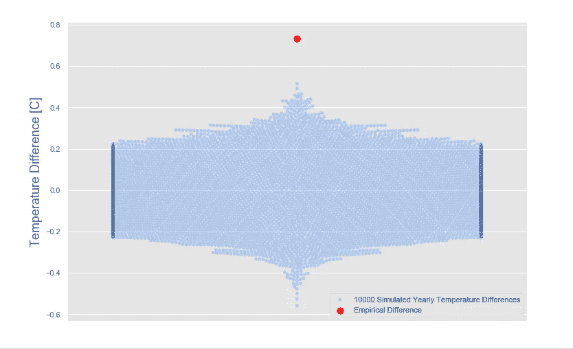

10000 Realizations of the Null World

我们能睡得安稳吗？

还没有。在我们对零世界的模拟中，我们使用了 bootstrap，认为所有的温度都是相互独立的，即一年的温度与前几年的温度没有关系。如果是这样的话，我们的假设检验很可能已经失败，因为它可能已经破坏了时间序列对随后几年温度的依赖性。

我们必须检查这个假设。正如我在航空业的一位前老板过去常说的那样:“一切未经检查的东西都是错的”。

下一张图在 x 轴上显示了给定年份的温度，在 y 轴上显示了下一年的温度。如果我们的独立性假设在数据集中成立，我们将看不到任何确定的模式。

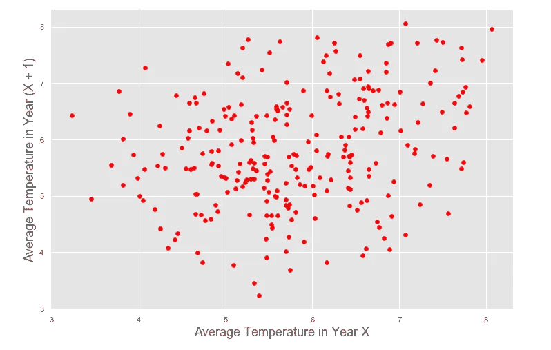

Average Temperature with Lag of 1 year

👏我们通过了。

另一个也是最后一个检查。让我们计算给定年份温度和随后 20 年的平均相关性。

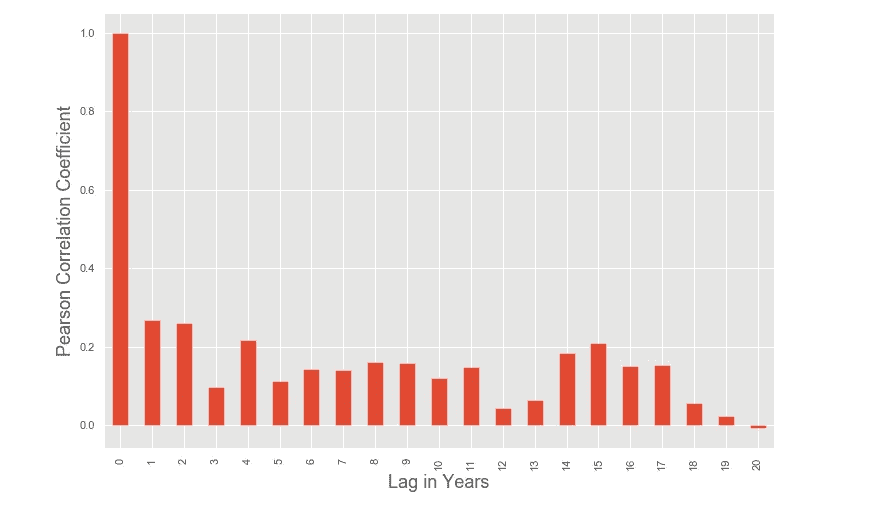

Temperatures Pearson Coefficients (lag of 20 years)

太好了！人们可以看到一年和随后几年之间的弱相关性。

我的瑞典同事很早就知道这一点，因为他们总是说，去年炎热的夏天对今年即将到来的夏天没有任何影响。

我们的零世界经受住了，我们声称斯德哥尔摩的天气发生了变化。

所有代码都在我的 [GitHub](https://github.com/Schots/Stockholm-Temperatures) 里。

你也可以通过 [LinkedIn](https://www.linkedin.com/in/maykon-schots-a543b49/) 联系我。感谢阅读！