# 那是只莺吗？Python 中 Keras CNN 的鸟类分类

> 原文：<https://towardsdatascience.com/is-that-a-warbler-bird-classification-with-keras-cnn-in-python-db4606555a33?source=collection_archive---------11----------------------->

## 有没有想过“那是什么鸟？”

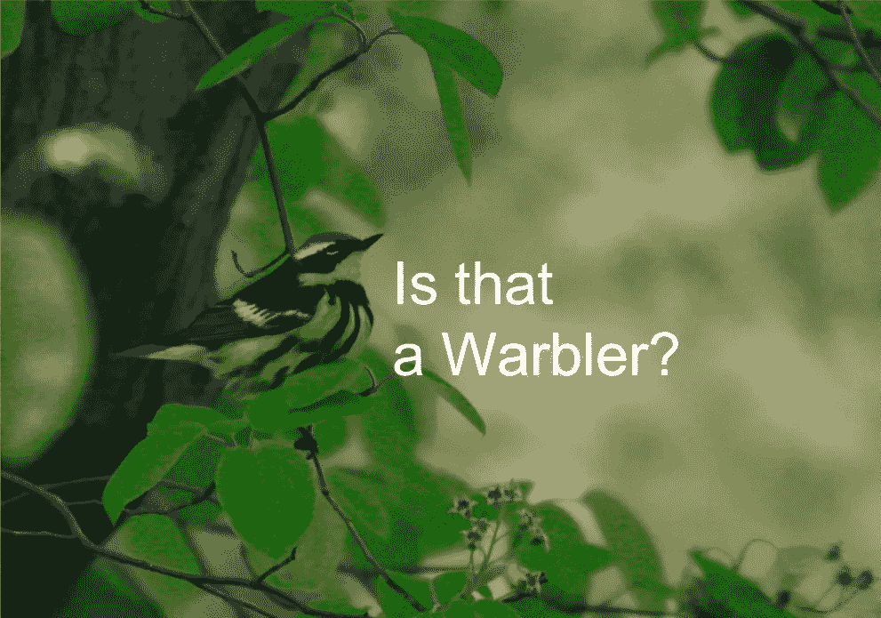

我一直想知道“那是什么鸟？”当我带着我的狗在波士顿的一个公园散步时，那里一年四季都充满了鸟类:夏天是小鸭子，秋天/春天是迁徙的鸣鸟，冬天是水鸟。我的爷爷(一个长期观察鸟类的人)给了我 Sibley 鸟类野外指南，这激发了我的爱好。在你认为这是老年人的爱好之前，我强烈建议你去观鸟，尤其是如果你有相机的话。

由于大多数小鸟不会安静地坐足够长的时间，让你翻阅 400 页野外指南并比较 20 多个标记，我开始拍摄鸟类的照片，希望我能有足够清晰的照片供以后识别。然后我发现了一个名为 [eBird](https://ebird.org/home) 的网站，它可以让你追踪你在哪里见过哪种鸟。你甚至可以上传一张照片作为证明。对于那些喜欢口袋妖怪的书呆子来说，就像那样，但有真正的活鸟！


Source: [https://www.trollandtoad.com/pokemon/pokemon-miscellaneous-supplies/pokemon-1999-pikachu-meowth-pokedex-2-pocket-folder/1167040](https://www.trollandtoad.com/pokemon/pokemon-miscellaneous-supplies/pokemon-1999-pikachu-meowth-pokedex-2-pocket-folder/1167040)

偶尔，我会上传一张错误的鸟的照片，但幸运的是，有 eBird 志愿者监控这些鸟的照片，并给你发电子邮件(友好地)说你标记了错误的物种。但是不要经常这样做，因为那样他们会锁定你的帐户(哎呀！).通常，这些志愿者也会告诉你正确的物种。这对那些志愿者来说是一项繁重的工作！

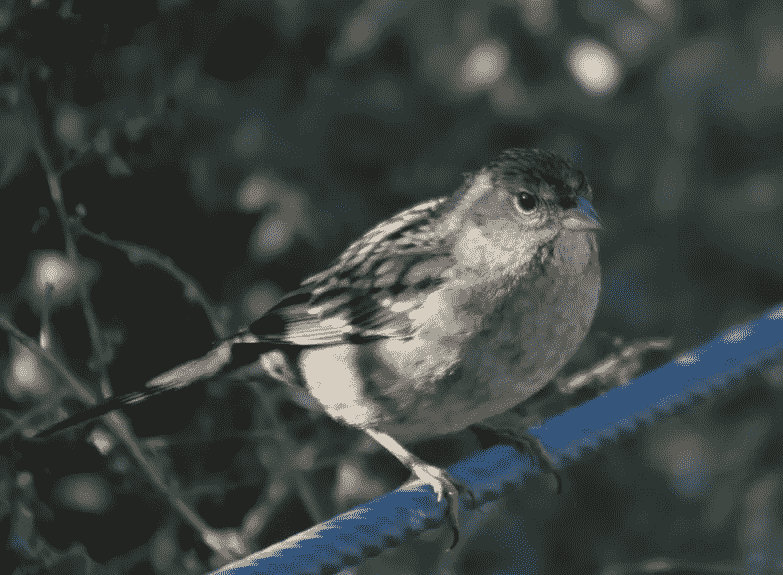

Not a Savannah Sparrow

作为一名数据科学家，我在想:如果我们可以自动检查每一张用深度学习上传的鸟类照片，会怎么样？作为一个周末项目的原理证明，我创建了这个预测模型来检测鸟类图像是否是一只莺(我爷爷最喜欢的鸟类类别)。

# 项目定义

给定一只鸟的图像，预测它是否是一只林莺(见下面的林莺物种标签)

# 数据集

本项目数据集来自加州理工学院-加州大学圣迭戈分校 Birds-200–2011(【http://www.vision.caltech.edu/visipedia/CUB-200-2011.html】T2)。该数据集包含 200 种鸟类的 11，788 张图片。由于任何一个物种的图像数量都很少，作为原则的证明，我决定将所有的莺图像进行分组。

# 设置:加载元数据

让我们从聚集加州理工学院-加州大学圣地亚哥分校提供的所有元数据开始:

```
import pandas as pd
import matplotlib.pyplot as plt
import numpy as np#path to dataset
data_path = '../CUB_200_2011/CUB_200_2011/'# aggregate datasets
df_images = pd.read_csv(data_path+'images.txt', 
                        sep = ' ',header = None, 
                        names = ['img_num','img'])
df_labels = pd.read_csv(data_path+'image_class_labels.txt', 
                        sep = ' ',header = None, 
                        names = ['img_num','class_id'])
df_classes = pd.read_csv(data_path+'classes.txt', 
                         sep = ' ', header = None, 
                         names = ['class_id','bird_class'])
df_split = pd.read_csv(data_path +'train_test_split.txt', 
                       sep = ' ', header = None, 
                       names = ['img_num','dataset'])df = pd.merge(df_images, df_labels, on = 'img_num', how = 'inner')
df = pd.merge(df, df_classes, on = 'class_id',how = 'inner')
df = pd.merge(df, df_split, on = 'img_num',how = 'inner')
```

数据包含图像编号、img 名称(带路径)、物种 id 以及物种文本，如下所示。由于我们将进行自己的培训/测试分割，因此我们将忽略该团队提供的分割，即最后一列。

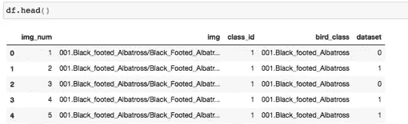

# 制作莺输出标签

我浏览了物种列表，提取了列表中的所有鸣鸟:

```
warbler_class = ['020.Yellow_breasted_Chat','158.Bay_breasted_Warbler',
       '159.Black_and_white_Warbler', '160.Black_throated_Blue_Warbler',
       '161.Blue_winged_Warbler', '162.Canada_Warbler',
       '163.Cape_May_Warbler', '164.Cerulean_Warbler',
       '165.Chestnut_sided_Warbler', '166.Golden_winged_Warbler',
       '167.Hooded_Warbler', '168.Kentucky_Warbler',
       '169.Magnolia_Warbler', '170.Mourning_Warbler',
       '171.Myrtle_Warbler', '172.Nashville_Warbler',
       '173.Orange_crowned_Warbler', '174.Palm_Warbler',
       '175.Pine_Warbler', '176.Prairie_Warbler',
       '177.Prothonotary_Warbler', '178.Swainson_Warbler',
       '179.Tennessee_Warbler', '180.Wilson_Warbler',
       '181.Worm_eating_Warbler', '182.Yellow_Warbler',
       '183.Northern_Waterthrush', '184.Louisiana_Waterthrush', '200.Common_Yellowthroat']
```

这允许我们制作一个二进制输出标签:

```
df['OUTPUT_LABEL'] = (df.bird_class.isin(warbler_class)).astype('int')
```

# 将数据分为训练和验证

我们可以将数据分为 70%训练数据和 30%验证数据。

```
df = df.sample(n = len(df), random_state = 42)
df_train_all = df.sample(frac = 0.7, random_state = 42)
df_valid = df.drop(df_train_all.index)
```

并检查两组的患病率是否相同:

```
def calc_prevalence(y):
    return sum(y)/ len(y)print('train all %.3f'%calc_prevalence(df_train_all.OUTPUT_LABEL))
print('valid %.3f'%calc_prevalence(df_valid.OUTPUT_LABEL))
```

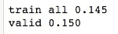

大约各占 15%

# 图像增强

在这一点上，我们可以只是训练一个深度学习模型，但由于不平衡，该模型可能最终只会默默预测不是一只林莺。我试过了，发生在我身上。

为了抵消这种不平衡，我们需要获取或制作更多的林莺图像，或者对非林莺图像进行二次采样。对于这个项目，我将使用数据增强(旋转，缩放，裁剪，翻转等)来增加林莺图像的数量。为了更好的回顾数据增强，请看这个[蝴蝶探测器项目](/classify-butterfly-images-with-deep-learning-in-keras-b3101fe0f98)。

让我们从数据帧中抓取所有的林莺图像:

```
warbler_imgs = df_train_all.loc[df_train_all.OUTPUT_LABEL == 1,’img’].values
```

然后，我们可以使用 Keras ' T0 '来制作新的增强图像。为了简单起见，我将把这些新图像保存在一个增强的林莺文件夹中。此外，给非林莺图像添加增强可能是个好主意，这样 DL 模型就不会知道‘增强’是林莺图像，但我现在跳过这一步。我也看过其他文章在训练中做这种增强，但是我现在也跳过这个。

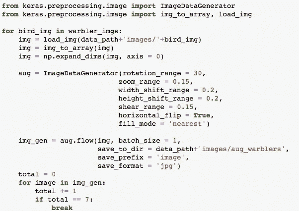

然后我们可以聚集增强的图像:

```
 from os import listdirwarbler_aug_files = ['aug_warblers/'+ a for a in listdir(data_path+'images/aug_warblers/') if a.endswith('.jpg')]df_aug = pd.DataFrame({'img':warbler_aug_files, 'OUTPUT_LABEL': [1]*len(warbler_aug_files) })
```

并与我们现有的培训相结合

```
df_c = pd.concat([df_train_all[['img','OUTPUT_LABEL']],df_aug],
                 axis = 0, ignore_index = True, sort = False)
```

为了安全起见，让我们以 1:1 的比率在莺和非莺之间平衡数据:

```
rows_pos = df_c.OUTPUT_LABEL == 1
df_pos = df_c.loc[rows_pos]
df_neg = df_c.loc[~rows_pos]
n= min([len(df_pos), len(df_neg)])
df_train = pd.concat([df_pos.sample(n = n,random_state = 42), 
                      df_neg.sample(n = n, random_state = 42)], 
                     axis = 0)
df_train = df_train.sample(frac = 1, random_state = 42)
```

# 构建 X 和 Y

我们现在可以为机器学习建立我们的 X 和 Y。为了做到这一点，让我们创建一个函数来加载给定数据帧的所有图像，该数据帧

*   将每个图像的大小调整为 224x224
*   转换为 RGB (3 通道)
*   从 0 到 1 归一化(即除以 255)

```
IMG_SIZE = 224
def load_imgs(df):
    imgs = np.ndarray(shape = (len(df), IMG_SIZE, IMG_SIZE,3), dtype = np.float32)
    for ii in range(len(df)):
        file = df.img.values[ii]
        img = load_img(data_path+'images/'+file, target_size=(IMG_SIZE, IMG_SIZE),color_mode='rgb')
        img = img_to_array(img)/255
        imgs[ii] = img
    return imgs
```

我们可以用

```
X_train = load_imgs(df_train)
X_valid = load_imgs(df_valid)y_train = df_train.OUTPUT_LABEL.values
y_valid = df_valid.OUTPUT_LABEL.values
```

这里的 X 矩阵并不是我们想要的 Keras，所以让我们用

```
# reshape
X_train = X_train.reshape(X_train.shape[0], IMG_SIZE,IMG_SIZE, 3)
X_valid = X_valid.reshape(X_valid.shape[0], IMG_SIZE,IMG_SIZE, 3)
```

我最后的 X_train 有一个形状(14104，224，224，3 ),这意味着我们有 14104 个 224 x 224 的图像，有 3 种颜色。

我们可以用以下方式绘制其中一幅图像:

```
ii = 3
plt.imshow(X_train[ii])
plt.title(df_train.img.iloc[ii])
plt.show()
```

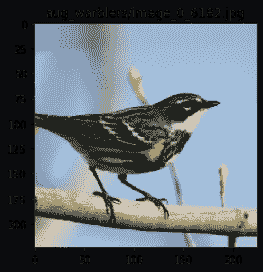

Image of augmented yellow-rumped warbler

# CNN 机器学习模型

为简单起见，让我们创建一个架构，该架构具有两个带 dropout 的 CNN 层、一个密集层和用于该二进制分类器的最终 sigmoid。稍后可以尝试其他更复杂的架构。

```
from keras.models import Sequential
from keras.layers import Conv2D, MaxPool2D, Dense, Flatten, Dropoutmodel = Sequential()
model.add(Conv2D(filters = 64, kernel_size = (5,5), 
                 activation = 'relu', 
                 input_shape = X_train.shape[1:]))
model.add(MaxPool2D(pool_size = (3,3)))
model.add(Dropout(rate = 0.25))
model.add(Conv2D(filters = 64, kernel_size = (3,3), 
                 activation = 'relu'))
model.add(MaxPool2D(pool_size = (3,3)))
model.add(Dropout(rate = 0.25))
model.add(Flatten())
model.add(Dense(64, activation = 'relu'))
model.add(Dropout(rate = 0.25))
model.add(Dense(1, activation = 'sigmoid'))
```

我们将用 Adam 和二元交叉熵损失(即 2 类的对数损失)来编译我们的模型。

```
model.compile(
                loss = 'binary_crossentropy',
                optimizer = 'adam',
                metrics = ['accuracy'])
```

您可以用以下方法训练您的分类器(为了加快速度，我刚才用 64 的批量做了 2 个时期):

```
model.fit(X_train, y_train, batch_size = 64, epochs= 2, verbose = 1)
```

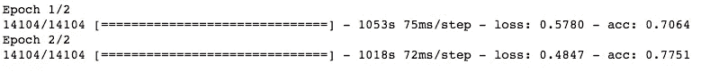

# 预测和模型性能

我们可以计算训练和验证的预测值，如下所示:

```
y_train_preds = model.predict_proba(X_train,verbose = 1)
y_valid_preds = model.predict_proba(X_valid,verbose = 1)
```

我将把验证预测保存在 df_valid 中，以便进一步分析

```
df_valid['pred'] = y_valid_preds
```

我们可以看看我们做得最好(最高平均分)的林莺种类

```
df_valid.loc[(df_valid.OUTPUT_LABEL == 1) ].groupby('bird_class').pred.mean().sort_values(ascending = False)
```

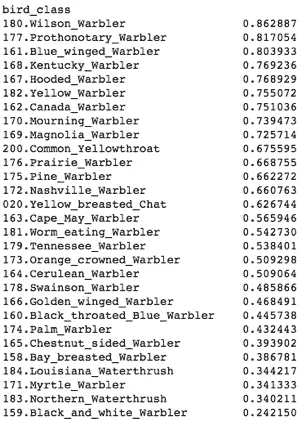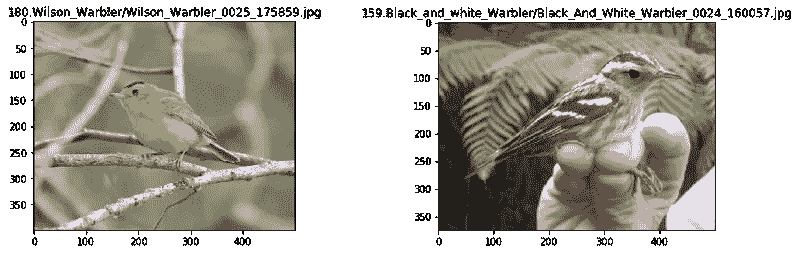

从一些图片来看，似乎这个模型对黄色的莺比对没有黄色的莺做得更好。

我们也可以看看模型倾向于认为是鸣鸟但不是的物种:

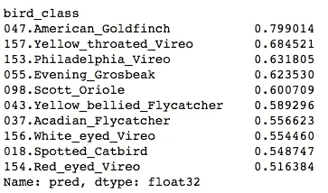

这是有道理的，因为金翅雀非常黄！

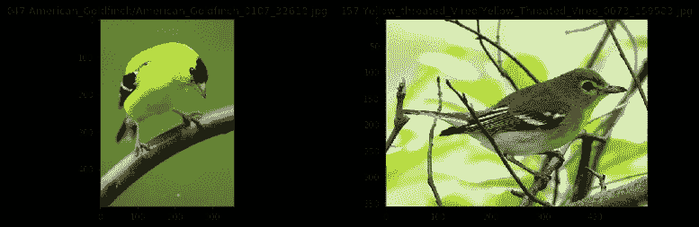

我们可以计算一系列指标的性能(关于分类指标的教程，请参见我的帖子[这里](/understanding-data-science-classification-metrics-in-scikit-learn-in-python-3bc336865019)

```
from sklearn.metrics import roc_auc_score, accuracy_score, \
                            precision_score, recall_score
def calc_specificity(y_actual, y_pred, thresh):
    # calculates specificity
    return sum((y_pred < thresh) & (y_actual == 0)) /sum(y_actual ==0)def print_report(y_actual, y_pred, thresh):

    auc = roc_auc_score(y_actual, y_pred)
    accuracy = accuracy_score(y_actual, (y_pred > thresh))
    recall = recall_score(y_actual, (y_pred > thresh))
    precision = precision_score(y_actual, (y_pred > thresh))
    specificity = calc_specificity(y_actual, y_pred, thresh)
    print('AUC:%.3f'%auc)
    print('accuracy:%.3f'%accuracy)
    print('recall:%.3f'%recall)
    print('precision:%.3f'%precision)
    print('specificity:%.3f'%specificity)
    print('prevalence:%.3f'%calc_prevalence(y_actual))
    print('pred pos:%.3f'%(sum(y_pred > thresh)/len(y_actual)))
    print(' ')
    return auc, accuracy, recall, precision, specificity
```

因为我们平衡了数据，所以让我们设置一个阈值 0.50 来标记预测的莺:

```
thresh = 0.5
print('train')
print_report(y_train, y_train_preds[:,0], thresh);
print('valid')
print_report(y_valid, y_valid_preds[:,0], thresh);
```

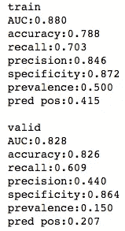

我们可以用以下公式绘制 ROC 曲线:

```
from sklearn.metrics import roc_curve, roc_auc_scorefpr_train, tpr_train, t_train = roc_curve(y_train, y_train_preds[:,0])
auc_train = roc_auc_score(y_train, y_train_preds[:,0])fpr_valid, tpr_valid, t_valid = roc_curve(y_valid, y_valid_preds[:,0])
auc_valid = roc_auc_score(y_valid, y_valid_preds[:,0])plt.plot(fpr_train, tpr_train, 'r-', label = 'Train AUC:%.3f'%auc_train)
plt.plot(fpr_valid, tpr_valid, 'b-', label = 'Valid AUC:%.3f'%auc_valid)plt.plot([0,1],[0,1], 'k--')
plt.xlabel('FPR')
plt.ylabel('TPR')
plt.legend()
plt.show()
```

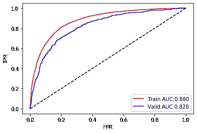

正如我们可以看到的，这个简单模型的 AUC 在验证上相当高。这给了我建立一个分类器来帮助我标记鸟类图像的巨大希望。

让我们用我自己的一些图片来测试一下:

```
file = 'magnolia2.png'
print(file)
x = load_img(file, target_size=(IMG_SIZE, IMG_SIZE),color_mode='rgb')
x= img_to_array(x)/255
x=x.reshape(1,IMG_SIZE,IMG_SIZE, 3)
print('prob it is warbler:%.3f'%model.predict_proba(x,verbose = 1)[0][0])
plt.imshow(load_img(file))
plt.show()
```

我可以正确地把玉兰花莺归类为莺

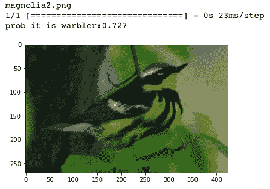

并把这种冲浪苏格兰人归类为非林莺

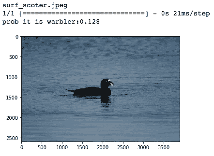

# 结论

在这篇文章中，我们建立了一个简单的 CNN 模型来预测一张鸟的照片是不是一只莺！