# 工作时间的不同是性别工资差距的真正原因吗？[互动信息图]

> 原文：<https://towardsdatascience.com/is-the-difference-in-work-hours-the-real-reason-for-the-gender-wage-gap-interactive-infographic-6051dff3a041?source=collection_archive---------3----------------------->

劳工部每年都会发布一份关于男女薪酬差距的报告。

女性年收入的中位数是 30，000 美元，而男性是 40，000 美元。换句话说，职业女性的收入是男性的 75%。

但是[这个差距](https://visme.co/blog/wage-gap/)没有考虑到这样一个事实，即平均而言，男性比女性工作的时间更长。根据美国人口普查数据，男性平均每周工作 41.0 小时，而女性平均每周工作 36.3 小时。

许多人认为性别歧视是收入差异的主要原因。其他人认为父母身份和性别角色通常比男性更能影响女性的收入。

为了更好地理解薪酬差距，我们根据婚姻和父母身份对受访者进行了分类【T4 2】。已婚夫妇与没有孩子的单身者之间的差距更大。对于已婚父母来说，差距更大。

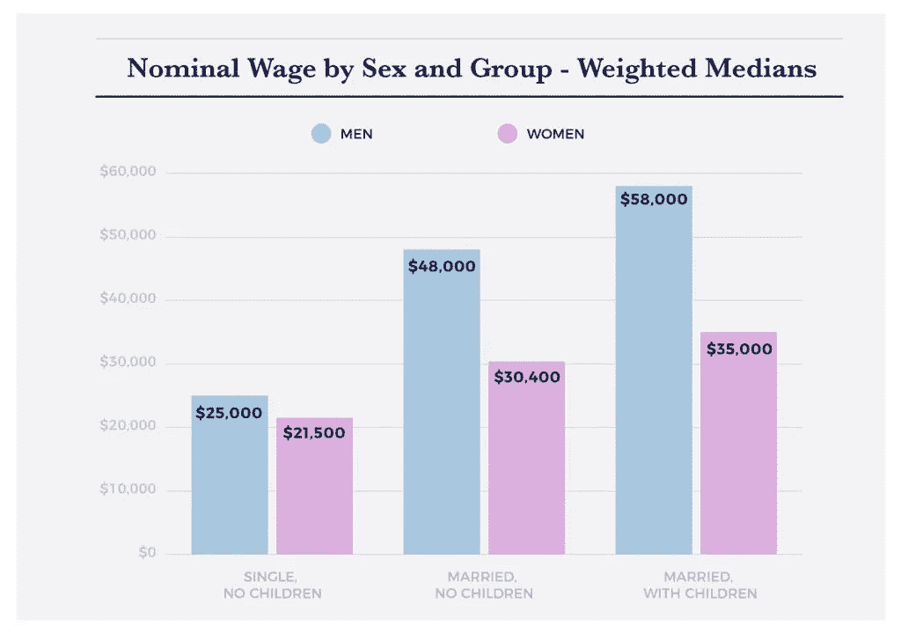

Created with [Visme](https://www.visme.co/)

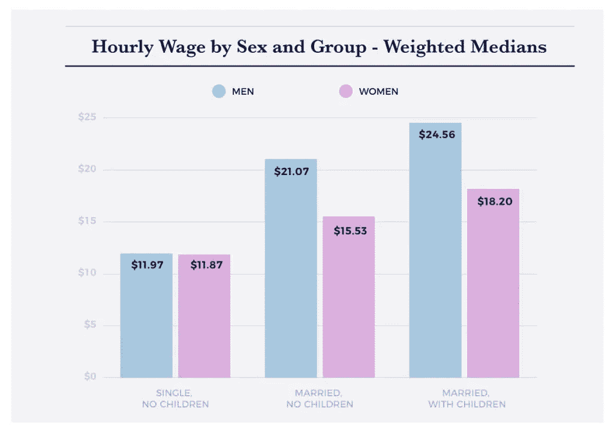

但是我们也发现已婚父亲比其他男人工作更多，而已婚母亲比没有孩子的已婚妇女工作更少。

我们分析了数百种美国职业的薪酬差距。根据我们的研究，在大多数职业中，薪酬差距的主要来源在于男女工作时间的差异，而婚姻状况和父母身份几乎可以解释所有这些工作时间的差异。

女性和男性的不同行为对性别工资差距产生了影响。正如我们将在下面看到的，谁在外面做大部分工作，谁呆在家里的决定在两个方面影响了薪酬差距:它改变了名义收入，但它也影响了男女每小时工作的收入。

***探究跨职业的工资收入差异。*** [***查看全屏版此处***](https://nchibana.github.io/) ***。***

# 几个具体的例子

让我们来看看美国最常见的职业:经理。这种职业代表了我们在美国看到的整体趋势。

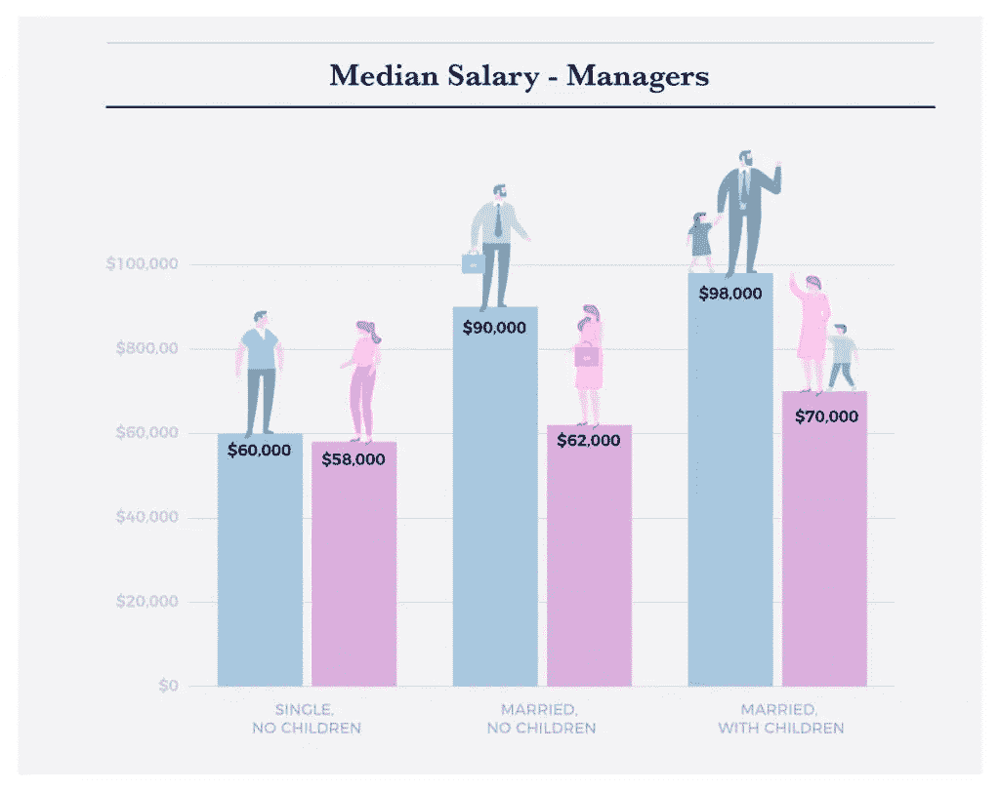

没有孩子的单身男性经理的年薪中值为 6 万美元，而没有孩子的单身女性经理的年薪为 5.8 万美元。平均而言，单身男性经理每周工作 43.7 小时，而单身女性经理每周工作 42.3 小时。

这意味着男性每周多挣 3.4%，但多工作 3.5%。

但是当我们看已婚夫妇之间的收入差距时，我们看到了一幅不同的画面。女性和男性已婚经理的薪水确实更高。但是男人比女人挣得多。

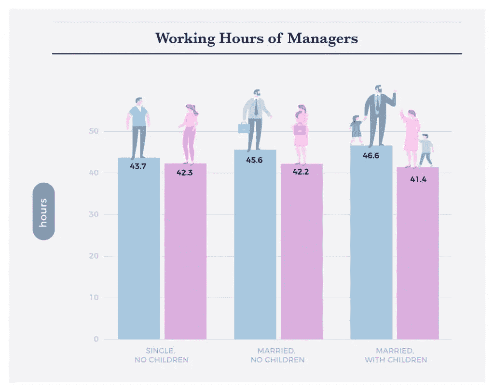

没有孩子的已婚男性经理的平均收入为 9 万美元，而没有孩子的已婚女性经理的平均收入为 6.2 万美元。31%的工资差距。换句话说，男性挣 1 美元，女性挣 0.69 美元。

这种差距很大程度上可以用工作时间来解释。男人结婚后往往工作更多。男性每周平均工作时间增加了 4.3%，而女性每周工作时间保持不变。这是差距扩大的部分原因。

但是花在工作上的时间并不能解释所有的性别工资差距。没有孩子的已婚男性经理每小时的工资也更高:他们每小时挣 38.40 美元，而没有孩子的已婚女性只有 28.70 美元。这意味着，没有孩子的已婚男性经理每工作一小时，收入比女性多 34%。正如我们将在下面详细看到的，不同的时薪与就业市场趋势有关。

我们可以在学校教师、秘书、护士、客户服务代表和许多其他职业中看到相同的模式:没有孩子的单身人士的薪酬差距较小，已婚人士的薪酬差距较大。

# 总体趋势的例外

我们已经看到，对于最常见的职业，没有孩子的单身人士几乎没有绝对的薪酬差距，这种差距可以用工作时间的差异来解释。但是有一些职业确实显示了这部分人的差距。

值得注意的例子是司机、零售销售员、主管和看门人。有趣的是，我们可以在这些职业中看到相同的一般模式:对于已婚夫妇来说，不受控制的差距急剧增加，即使他们没有孩子。

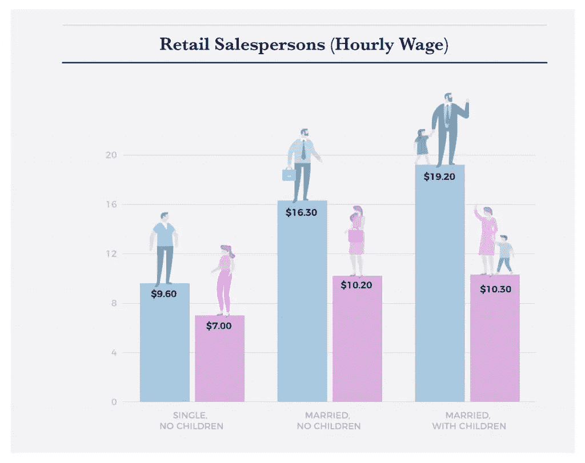

Created with [Visme](https://www.visme.co/)

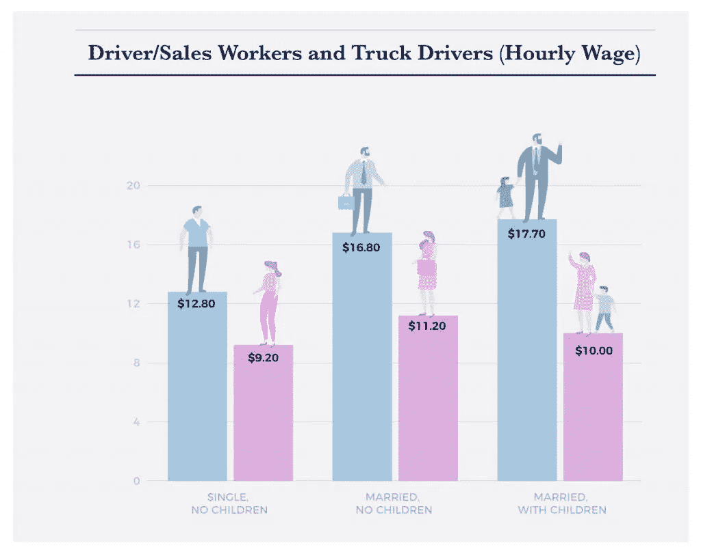

同样的一般模式在没有孩子的单身女性比男性同事挣得多的职业中重复出现。他们中的一些人是秘书、客户服务代表、厨师、库存职员、办公室职员和接待员。

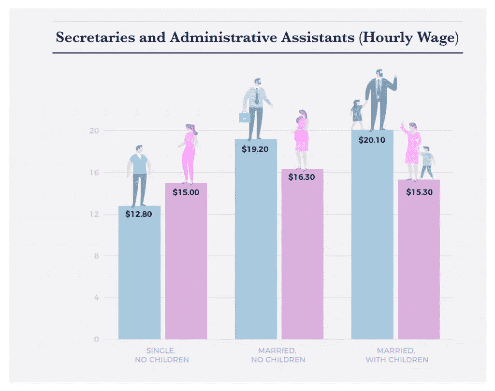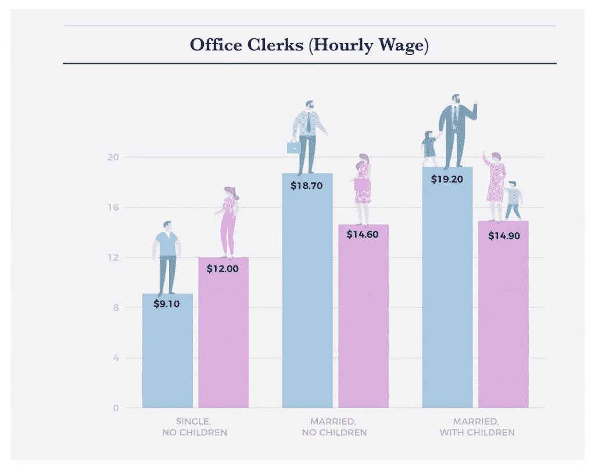

在所有这些职业中，如果女性结婚，薪酬差距就会逆转，男性仍然比女性挣得多。

# 更多的工作时间也意味着更高的工资

现在，让我们仔细看看支付给女性和男性的不同时薪。数据显示，女性和男性的时薪持续存在差异，尤其是已婚女性和男性。但数据也显示，男性比女性工作更多。

在仔细研究了这些数据之后，我们发现了时薪和工作时间之间的关系。平均时薪随着每周工作时间的增加而增加。两性都是如此。

在下面的图表中，我们绘制了女性和男性的时薪。为了分离婚姻和父母身份的影响，我们只考虑了没有孩子的单身人士。

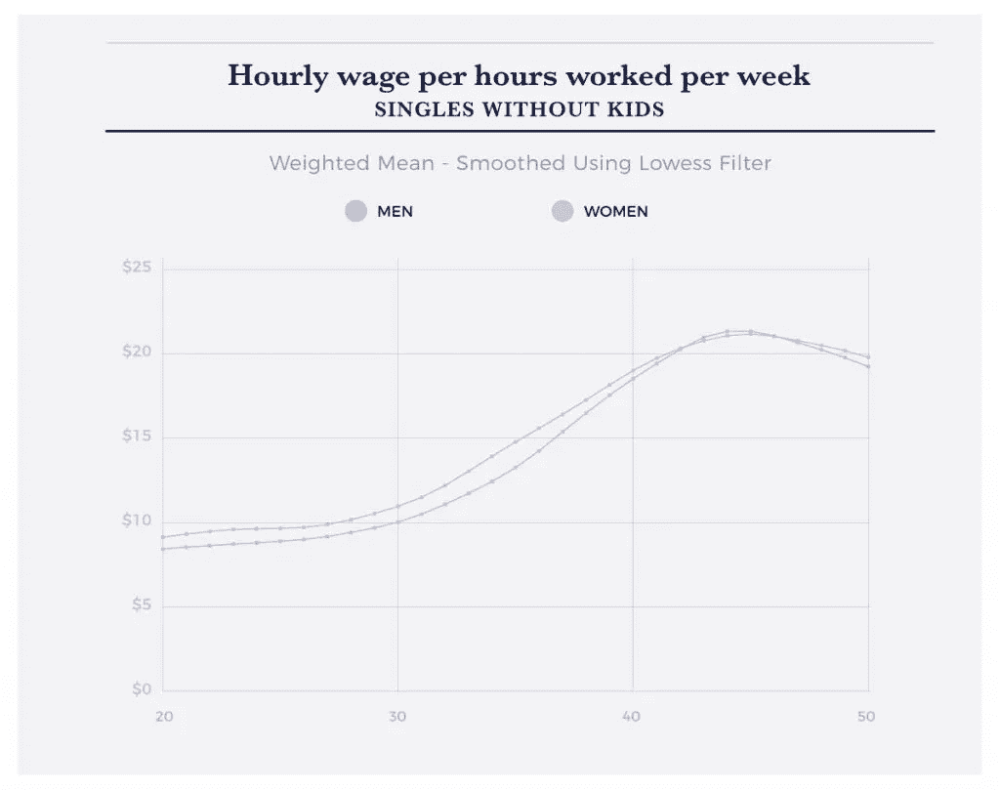

在下一张图表中，我们可以看到每一组的平均工作时间:

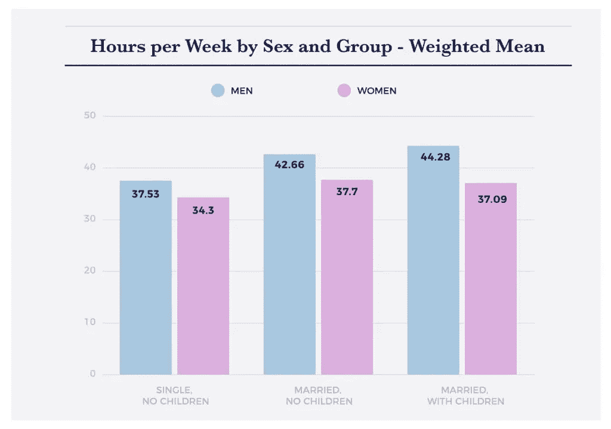

在每周工作时间的相关范围内，平均时薪随着工作时间的增加而增加。

因为男性往往比女性工作更长时间，尤其是如果他们已婚，如果他们是已婚父母，工作时间更长，这可以解释薪酬差距的很大一部分。

此外，上图显示，平均而言，没有孩子的单身女性每工作一小时获得的报酬高于男性。这可能意味着，如果女性工作时间与男性相同，其他条件保持不变，这一群体将不会有薪酬差距。

# 年龄和经历呢？

值得注意的是，年龄和工作经验也是性别差距辩论中的相关因素。为了区分年龄和工作经验对不同群体薪酬差距的可能影响，我们绘制了单身女性和无子女男性每个年龄的加权平均工作时间。

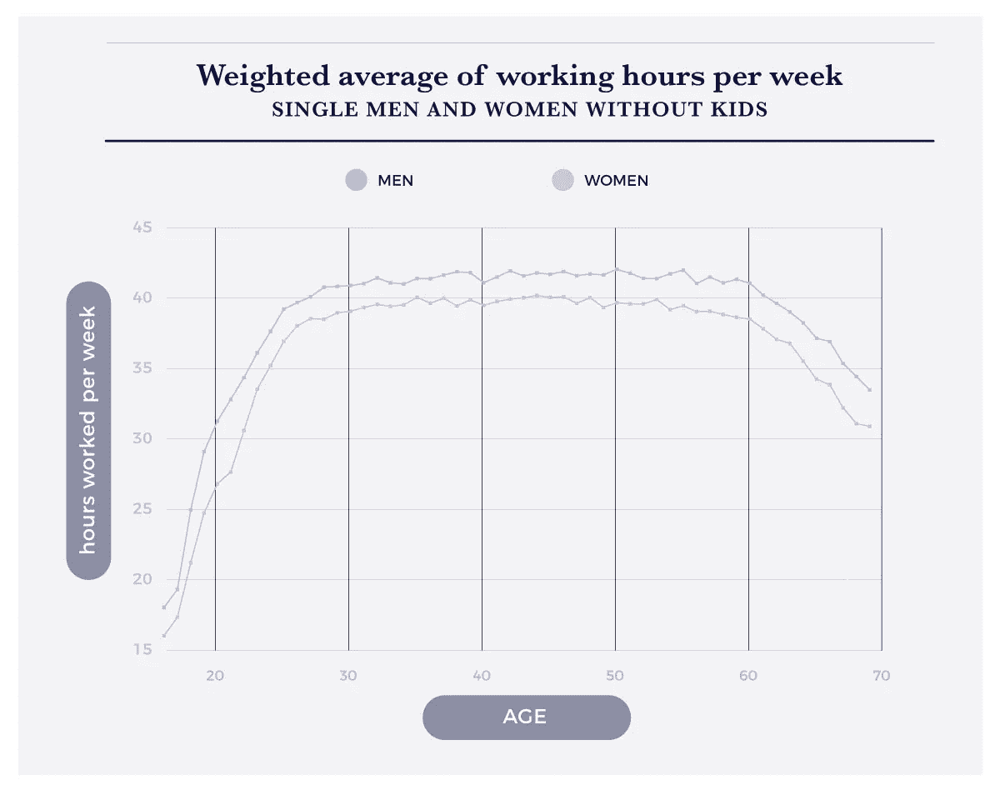

Created with [Visme](https://www.visme.co/)

对于没有孩子的单身人士来说，每个年龄段的差距都很小。但是对于已婚夫妇来说，每个年龄段的工作时间都有明显的差距。

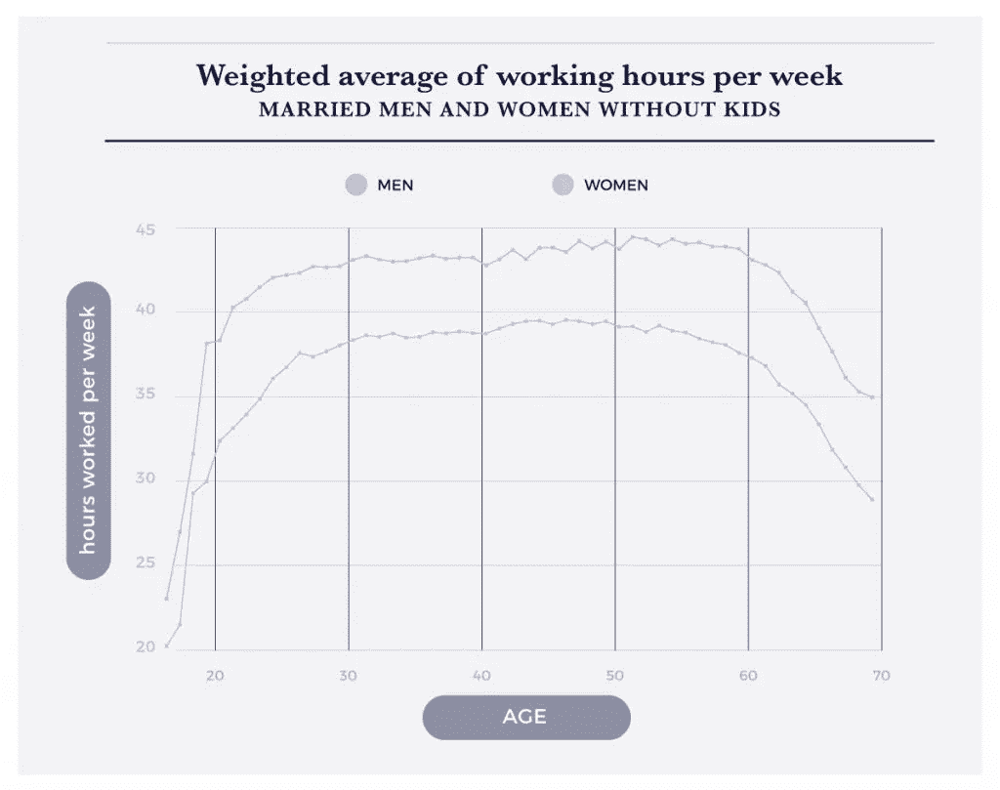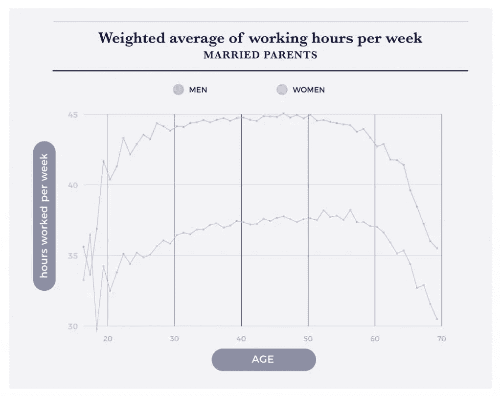

如果我们考虑到随着男女年龄的增长，时薪的变化，男性时薪的增长要比女性时薪多。在所有三组中都可以看到相同的模式。

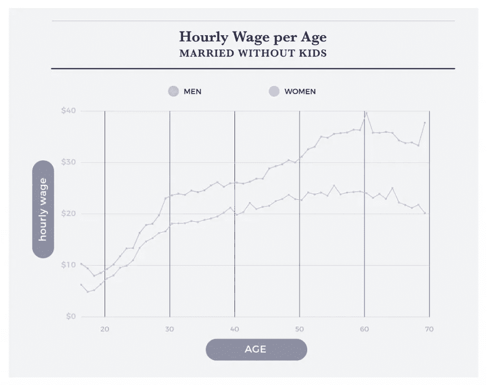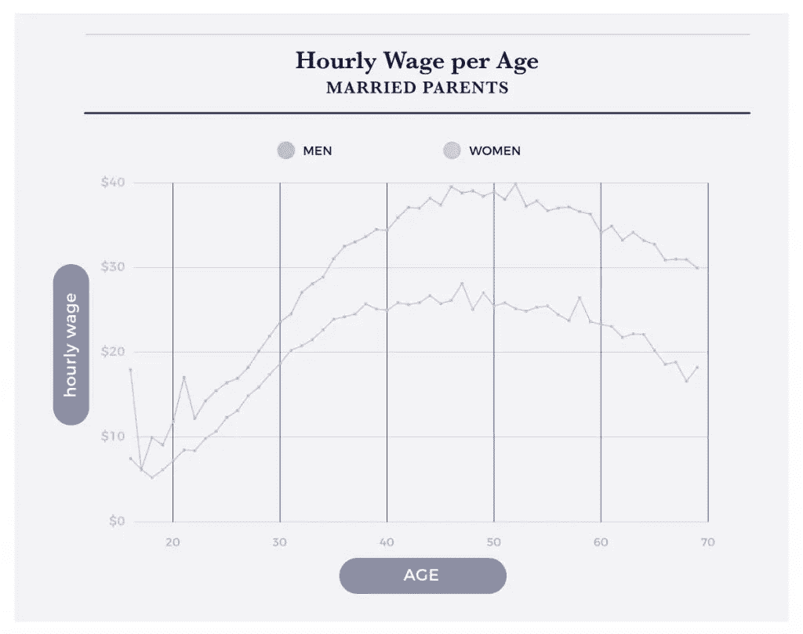

上面的图表表明，工作经验与这些年的工作时间相关。随着时间的推移，男人比女人积累了更多的实践和训练。如果工人有更多的经验，就业市场的报酬会更高。换句话说，随着男性比女性获得更多的经验，差距会越来越大。

# 那么性别工资差距的真正原因是什么呢？

在这篇文章中，我们发现性别薪酬差距的主要来源之一是，平均而言，女性和男性在工作上投入的时间不同，尤其是在结婚和为人父母之后。

关于性别薪酬差距的文献非常广泛。不同的论文侧重于不同的原因来解释它。提到最多的两个原因是性别歧视和母性和性别角色。

如果做同样的工作，一个女人得到的报酬比一个男人少，那就是对妇女的性别歧视。

如果我们认为工作时间的长短决定了我们是否认为一份工作和另一份工作是一样的，那么这些数据在总体上并不支持性别歧视的观点。

已婚妇女的时薪比已婚男子的平均时薪低，但一个可能的解释是，如果工作时间减少，就业市场的时薪就会减少，而且已婚妇女往往工作得更少。几乎在每个职业中都可以看到同样的模式。

此外，男性倾向于投入更多的时间工作，因此随着时间的推移获得更多的经验，如果工人有更多的经验，就业市场支付更多。

这并不意味着性别歧视不存在。我们的分析表明，总体而言，大部分差距不是由性别歧视造成的。

关于薪酬差距的第二个方面，关于性别角色的社会观念影响着女性和男性的行为。此外，与父母身份相关的生物因素确实在偏好差异的产生中发挥了作用。即女性怀孕，女性哺乳。性别之间的这些差异可能是为什么女性比夫妻更倾向于呆在家里的合理解释，尤其是在结婚生子之后。

综上所述，我们可以说，根据我们的分析，与婚姻状况和父母身份相关的就业市场力量和性别偏好可以解释几乎所有的薪酬差距。大部分差距并不是性别歧视的结果。

# 方法学

这项分析使用了美国人口普查局 2017 年美国社区调查(ACS)的微观数据，这些数据是通过 IPUMS 美国服务 [7](https://visme.co/blog/wage-gap/#notes) 提取的。

小时平均工资是我们自己使用税前工资和薪金总收入以及被调查者通常每周工作的小时数计算出来的。

我们还从我们的数据库中删除了一小部分我们认为不具有代表性的受访者，即时薪高于每小时 900 美元且低于每小时 3 美元的人。

此外，为了分离出年龄较大时男女之间的显著差异可能造成的影响，我们只考虑了年龄小于 70 岁的人。

我们使用 Python 和 R 来聚合和处理数据。最终的数字是广泛的研究过程和各种测试的结果。如果您遇到错误或失误，请不要犹豫，与我们联系。

# 笔记

1.  税前工资和薪金收入中位数。只有 70 岁以下的工人。没有过滤掉任何异常值，对于本文的其余部分，我们过滤掉了我们认为不正常和不具有代表性的案例。更多信息参见方法部分。

2.为了分离父母身份和婚姻状况的影响，我们只考虑了三组人:未婚无子女、已婚无子女和已婚有子女。进一步的研究也可以考虑更多的类别，比如单亲父母。

3.尽管受到社会学方面和性别角色的影响，但夫妻双方可以商定不同的选择和自愿决定。

4.为了计算时薪，我们使用了受访者通常每周工作的平均小时数。

5.还是有利于女性的小差距。

6.此外，这里没有画出，随着男女年龄的增长，工作时间的差异略有增加。

7.尽管受到社会因素和性别角色的影响，这些可以是夫妻双方同意和自愿做出的决定。

8.史蒂文·拉格斯、萨拉·弗勒德、罗纳德·戈肯、约西亚·格罗弗、艾琳·迈耶、何塞·帕卡斯和马修·索贝克。美国 IPUMS:版本 8.0[数据集]。明尼苏达州明尼阿波利斯市:IPUMS，2018 年。[https://doi.org/10.18128/D010.V8.0](https://doi.org/10.18128/D010.V8.0)

*本帖* [*原版*](https://visme.co/blog/wage-gap/) *最早出现在 Visme 的* [*视觉学习中心*](http://blog.visme.co/) *。*