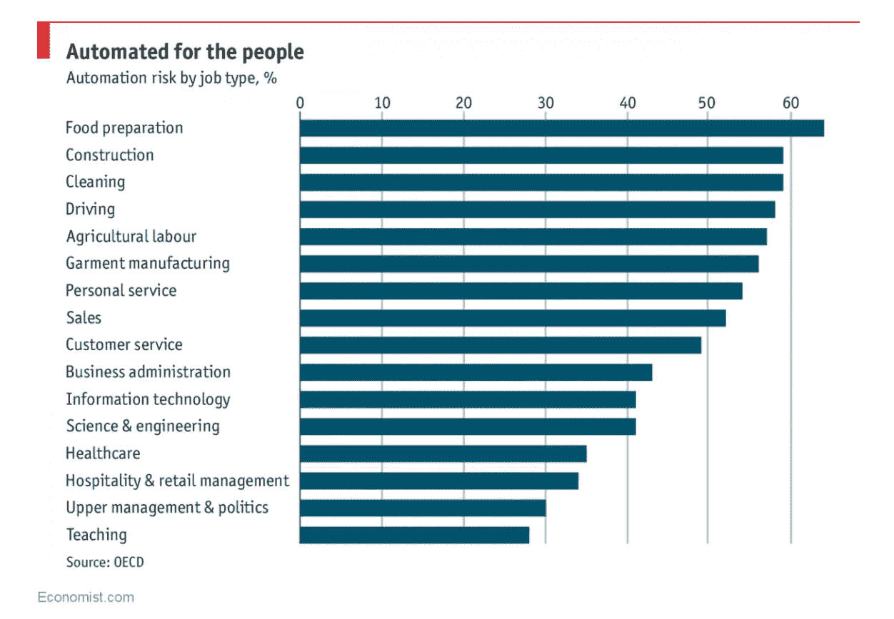

# 数据科学家的工作有被自动化的风险吗？

> 原文：<https://towardsdatascience.com/is-the-job-of-data-scientist-at-risk-of-being-automated-60583e96670f?source=collection_archive---------5----------------------->

[Source](https://www.pexels.com/photo/mountain-2212861/)

## **一个有用的测试，用于确定你的工作是否可以由一台应用于数据科学家的机器来完成**

[阿玛拉定律](http://www.rationaloptimist.com/blog/amaras-law/)指出，我们倾向于高估一项技术的短期效果，但低估其长期效果。我们看到这一幕在从火车到[互联网](https://spotlessdata.com/blog/amaras-law)到现在的[机器学习](https://www.gartner.com/doc/3883664/hype-cycle-data-science-machine)的各种技术中反复上演。趋势几乎总是相同的:最初，对创新能力的极度乐观的断言之后是一段幻灭期，当它无法交付时，最终，我们知道如何使用技术，它继续从根本上重塑我们的整个世界[(这被称为炒作周期)。](https://en.wikipedia.org/wiki/Hype_cycle)

阿马拉定律的基本思想——比声称的更小的短期影响，但比想象的更大的长期影响——也可以在技术对人类工作的总体影响中反复看到。19 世纪 30 年代发明的第一台钢犁并没有立即取代所有的农民，但是从 1850 年到现代，美国从事农业工作的人口比例从 50%上升到 2%。(通过一系列的创新，而不仅仅是机械技术，现在更少的人生产出了更多的食物。)

同样，[美国制造业的就业岗位从占总就业岗位的 40%下降到不到 10%，这不是一两年的事，而是几十年的事(通过自动化和外包的结合)。我们再次看到*在几年的过程中出现了小波动，但在足够长的时间内*经济出现了根本性的重组。此外，必须指出的是**人们总是能找到其他工作。**今天，](https://en.wikipedia.org/wiki/Manufacturing_in_the_United_States)[我们的失业率达到了 50 年来的最低水平](https://tradingeconomics.com/united-states/unemployment-rate)，因为当[一些工作实现自动化时，人们就会转向新的工作](https://www.amazon.com/WTF-Whats-Future-Why-Its/dp/0062565710)。我们不断发明新的职业来满足我们的需求，包括整个服务经济(自从农业和制造业衰落以来，它雇佣了大多数美国人)，或者在个人层面上，数据科学家的角色，直到 2012 年才得到广泛认可。

当我们思考自动化在当今时代的影响时，值得记住这两点——变化需要时间，我们总是会为人类发明新的工作。人们很容易被声称[“近一半的工作易受自动化影响”](https://www.economist.com/graphic-detail/2018/04/24/a-study-finds-nearly-half-of-jobs-are-vulnerable-to-automation)的报告冲昏头脑，这似乎暗示我们应该关注几年内大量失业的工人。

Nothing gets more clicks than fear! ([Source)](https://www.economist.com/graphic-detail/2018/04/24/a-study-finds-nearly-half-of-jobs-are-vulnerable-to-automation)

从阿玛拉定律的角度来看，我认为这项研究低估了由机器完成的工作的百分比:我们 99%的工作会因为新技术而被淘汰，但是只有在足够长的时间内才会被淘汰。随着我们的工作逐渐自动化，我们将简单地向前移动到下一个，可能是一个尚未被发明的职业。

> 从短期来看，技术的影响被夸大了，但从长期来看却被低估了，包括技术对就业市场的影响。

话虽如此，思考哪些工作可能在短期内实现自动化以及原因仍然很有趣，因此我们可以专注于学习人类增加最大价值的技能。在他的优秀著作《第四时代:智能机器人、有意识的计算机和人类的未来》中，[拜伦·里斯](https://byronreese.com/author/)展示了自动化高风险工作的特点。这些是:

*   **重复:**无论是身体上还是精神上
*   创造力低:不需要即兴创作和新颖的思维方式
*   社交智商低:不需要沟通、说服或魅力
*   **有限的培训:**自动化工作的容易程度与完整描述该工作的“手册”的长度成反比

除了详细描述这些特征之外，Reese 还概述了一个确定工作“自动化风险”的便捷工具。以下 10 个问题并不能保证一份工作会不会自动化，但它们确实提供了一个框架来量化对大多数人来说通常是情绪化的问题:“机器人会取代我的工作吗？”(答案是大多数人认为机器不会抢走*他们的*工作，而是会抢走*其他*人的工作。

# 测试

我将浏览这些问题，并根据我作为一名数据科学家所学到的知识来回答它们。这并不意味着是对整个领域的客观分析——每个职位都是不同的，所以不同意也没关系。作为背景，我在数据科学领域工作了 2 年:1 年从事研究生研究项目，2 个月在普惠公司担任数据分析师实习生，4 个月在 Feature Labs 担任数据科学家，6 个月在 Cortex Building Intelligence 担任全职数据科学家。我主要是根据我目前在 [Cortex](http://get.cortexintel.com) 的工作来回答这些问题，在那里，我们使用大数据和机器学习来提高商业办公楼的能效(证明*你可以同时对环境和经济产生积极影响*)。我们是一家小型创业公司(大约 10 人)，我既没有管理任何员工，也没有正式的经理，尽管我与一名高级软件工程师密切合作。

这项测试的满分是 100 分，分数越高表明自动化的脆弱性越大。(这个测试出现在这本书的第 10 章，但是我鼓励你阅读整本书。您也可以[自己在线参加考试](https://byronreese.com/quiz/?score=6#addition-test-question-4)f；为了清楚起见，我重新表述了一些问题)。

1.  你工作中的两天有多相似？(0:完全没有，10:非常相似)

**4 / 10** 。虽然编写代码有时会感觉公式化，但作为数据科学家的工作不仅仅是构建机器学习模型。有些日子我可能会花时间重构代码(我很乐意将这种事情交给机器)，有些日子我会为客户进行一次性数据分析，有些日子我不得不去一栋大楼调整一些有故障的传感器，以获得可靠的数据。(哦，你以为所有的数据都整齐地打包在一个干净的 csv 文件中，然后手工提交？好吧，欢迎来到现实世界，在这里获取数据意味着在一栋办公楼的地下室里爬来爬去重新连接一个电表)。简而言之，日复一日的相似性很低，这使得这项工作令人兴奋，也不容易被机器接管。

**2。在工作中，您多久需要移动一次物理位置？(0:从不，10:一直)**

**6 / 10。**对于大多数数据科学家/软件工程师来说，我想这个答案更重要，因为你每天都在同一间办公室的同一张桌子上工作。就我的角色而言，我确实在一张办公桌前花了很多时间，但我也会去纽约市周围的不同建筑。(同样，没有数据就无法进行数据科学，而获取数据需要付出巨大的努力。)此外，我在纽约的办公室和 DC 华盛顿的总部之间来回奔波，因为说到底，面对面的交流是最有效的。

**3。有多少人知道或做你的工作？(0:几乎没有，10:很多)**

**5 / 10** 。当你在一个领域工作时，很容易陷入过滤泡沫，你认为你的工作非常重要，因此每个人都必须知道。就像我在数据科学中发现的那样，即使与该领域之外的人进行几次简短的交谈，也会打消你的这种想法。在技术领域之外，很少有人听说过“数据科学家”这个术语，更不用说知道一个人是做什么的了。我求助于说我分析数据，如果这不能让人们理解，我会提到一些关于计算机和电子表格的东西。总的来说，工作越专业化(意味着越少的工人在做)，自动化的可能性就越小，因为投资资源来建造一台能够完成这项工作的机器的动力就越小。

**4。你的工作培训有多长时间？(0:年，10:天)**

**0 / 10。**数据科学的培训非常广泛，你不可能在为期 6 周甚至 12 周的训练营中学到所有知识。虽然我不认为四年制学位是成功的必要条件，但你需要长时间的学习，积累解决实际问题的经验**，才能成为一名有效的工业数据科学家。此外，这份工作需要不断学习，总是在寻找新的工具和更好的方法来解决你的问题。任何教授数据科学的机器都需要每 6 个月进行一次“智力升级”以保持最新。**

****5。你的工作需要重复的体力活动吗？(0:完全没有，10:完全没有)****

****8 / 10。**我的答案可能再次低于大多数其他数据科学家，因为我必须帮助在建筑物中集成我们的技术。这是一个我们在机器旁边没有机会的领域；计算机绝对擅长重复做同样的事情数百万次而不出错。如果我们能告诉电脑正确的键，我们马上就失业了。**

****6。你做决定需要的最长时间是多少？(0:超过 5 分钟，10:几秒)****

****0 / 10** Reese(测试的作者)将这个问题的最长时间设定为 5 分钟，这似乎太短了。我们在 Cortex 做出的一些决定需要花数周时间仔细研究结果，并经过公司各级员工的深思熟虑。几乎我们的决策不仅涉及定量指标(数字)，还涉及定性度量(我们能向客户解释这一点吗，这些特性是人类可以理解的吗)。我们构建的数据科学解决方案不仅仅取决于误差最低的解决方案，而是通过考虑许多不同需求的合理决策来确定的。**

****7。你的工作需要与其他人建立情感联系吗？(0:绝对必要，10:完全没有必要)****

****5 / 10。如果你认为你可以通过成为数据科学家来逃避人们，那么对不起，你选择了错误的职业。在一家公司成功工作需要不断的沟通:在一个典型的日子里，我可能会与客户、首席执行官、销售团队和客户成功团队交谈，他们都对不同的方法反应最好(定量与定性、自信与开放式)。这还没有考虑到我与其他工程师的对话，包括代码审查、查看模型输出、开发新的问题解决方案、讨论代码风格等等。简而言之，如果你打算在任何一家公司工作，都要磨练你的沟通技巧。****

****8。你的工作需要创造力吗？(0:工作的全部基础，10:创造性被积极阻止)****

****4 / 10。**也许我是夸大了我认为数据科学中的创造力，但我们不断面临无法用同样的方法解决的新问题，这意味着我们需要“以不同的方式思考”。如果我们认为创造力包括使用许多不同工具的能力，那么数据科学必须排在前列。我希望有解决数据科学问题的最佳实践，但无论如何，事实并非如此。因此，我的工作需要尝试各种方法来解决每一个问题，如果现有的方法都行不通，有时还需要开发自己的方法。**

****9。你直接管理员工吗？(0:多，10:无)****

****10 / 10。**作为个人贡献者，我不直接管理任何员工。尽管如此，对于数据科学家来说，管理当然不是不可能的。**

****10。其他人会以同样的方式做你的工作吗？(0:完全不一样，10:完全一样)****

****4 / 10** 。在数据科学的发展过程中，答案是否定的。解决数据科学问题的方法太多了，两个人无法使用同一种方法。我有机会重新实现几年前构建的建模管道，每次我都惊讶于现在使用最新的工具编写代码是多么容易。除了工具之外，基本方法也可能不同:使用具有广泛特征工程的简单模型，或者限制特征并使用复杂模型。最终，数据科学领域可能会在一些方法上崩溃，但即使到了那个时候，在做这项工作时，仍然会有足够的个人细微差别的空间。**

## ****数据科学对自动化的总体脆弱性:46 / 100****

**根据里斯的说法，任何低于 70 岁的工作在整个职业生涯中都是安全的。虽然我认为数据科学在短期内没有被自动化的风险(对试图向你出售自动化数据科学工具的公司保持怀疑)，但我对十年后“数据科学家”的角色是否仍然存在没有信心。**

**相反，我认为数据科学工具将继续变得更容易使用，直到非专业人士能够有效地使用它们。到那时，数据科学将是一项基本技能，但不仅限于少数专家，我们不需要任何受过数据科学专门培训的人。我对这一次充满希望，因为我一再看到领域专业知识对于构建有效的数据科学管道的重要性。如果我们能够将正确的工具交到在某个领域有经验的人手中，那么数据科学就可以实现其提高效率和支持客观决策的承诺。总之，自动化不太可能取代数据科学的工作，但如果开发了正确的工具，数据科学家可能会成为一个无关的专业。**

## **如果不是自动化，那我们该担心什么？**

**数据科学面临着比机器人抢走我们工作的幽灵更现实的问题。这值得更深入的研究，但现在，开始思考我们如何解决这些问题:**

*   ****言过其实和言过其实:**数据科学实际能做的和媒体描述的之间有很大差距。数据科学并不是解决每个问题的灵丹妙药，在生产中部署机器学习模型(我们在 [Cortex](http://get.cortexintel.com) 每天做数百次)需要正确数据和利用它的专业知识的极其罕见的结合。事实上，对公司来说，最大的价值在于可视化当前隐藏在电子表格中的数据(或者用小 Python 自动完成简单的电子表格任务)。大多数公司不具备深度学习的能力或需求。避免炒作列车或风险失去信任时，你不能交付。**
*   ****算法偏差:**任何接受数据科学家培训的人都应该被要求阅读凯茜·奥尼尔的 [*数学毁灭武器*。总结一下这篇非同寻常的文章，当算法根据有偏差的数据进行训练时，它们会强化和放大现有的偏差。开发模型的人类甚至不必因为现有的不平等在机器学习的支持下永久存在而对自己抱有偏见。数据科学承诺是客观的，但数据收集或分析没有任何客观性。如果我们希望数据科学惠及尽可能多的人，那么我们需要开始思考如何消除我们模型中的偏见，包括欢迎和支持更加多样化的贡献者群体。](https://weaponsofmathdestructionbook.com/)**
*   ****无法重现的结果。**进行一次性分析并在学术论文中展示一项发现很容易，但要获得即使在同一台机器上对相同数据也能重复再现的结果却困难得多！这个问题终于[开始得到一些关注](https://www.hpcwire.com/2019/02/19/machine-learning-reproducability-crisis-science/)，我希望[更广泛的科学再现性问题](https://www.nature.com/collections/prbfkwmwvz)能够带来新的工具或方法。缺乏可重复的结果会导致对数据科学方法的信任度下降:如果你某一天告诉你的客户一个数字，而在稍后的时间里告诉他们一个完全不同的数字来获得相同的结果，他们为什么要依赖你的预测呢？**
*   ****摇摇欲坠的数据科学基础设施:**使用开源数据科学工具的人比以往任何时候都多(想想 Python、numpy、scikit-learn、pandas、matplotlib、scipy、pymc3)，但贡献者和维护者的数量却没有相应增长。自由和开源软件是伟大的，但是对于贡献者来说，当他们在全职工作之外自愿做这些工具时，维护这些工具是很困难的。贡献的方式有很多种，从提交 bug 到修复问题到简单的捐款([现在就去这里](https://numfocus.org/)如果你想帮忙，就成为 NumFocus 的经常性捐助者)，我们需要开始支持我们领域所立足的基础。不幸的是，这是一个没有得到太多关注的关键问题，我以前写过这个话题[因为它很重要。](/a-data-science-public-service-announcement-fe81fbe6dc3f)**

**除了以上这些，我还担心正规教育系统没有培养出有效的数据科学家。由于学生接受了专门的数据科学培训，可能会有许多数据科学家能够编写出高超的 Jupyter 笔记本，但不知道如何将机器学习模型投入生产。**在 Jupyter 笔记本上的干净数据集上获得一次结果与每天在真实数据上运行数百次模型并将结果提供给客户之间存在巨大差距。我不知道在大学环境中，目前的课程是否能弥补这个差距。****

**最后一点，在 Cortex，我们从未被数据科学所能构建的功能所限制——这些技术本身很容易用开源工具来实现——而是被获取数据、清理数据、当前格式化数据、运行模型以及向客户提供这些预测(以及解释)所需的复杂性所限制。我的建议是，除了传统的数据科学统计和编程课程之外，花一些时间认真学习软件工程和数据工程。**

**虽然“数据科学家”的角色可能不会持续太久——不是因为自动化，而是因为更易于使用的工具——但在数据科学中学习的技能只会变得更加相关。不管是好是坏，我们生活在一个数据饱和、技术驱动的世界，理解数据并操纵技术为你服务(而不是相反)的能力至关重要。如果你现在是一名数据科学家，继续应用这些技能并学习新的技能。对于那些学习进入该领域的人来说，要认识到你不一定是在为“数据科学家”的职位做准备，而是在为一个数据科学技能将变得越来越受重视的世界做准备。**

**我写一些关于数据科学的文章，偶尔也会写一些其他有趣的话题。你可以通过推特 [@koehrsen_will](http://twitter.com/@koehrsen_will) 联系我。如果帮助环境*和*的底线吸引你，那么也许可以联系我们 Cortex。**