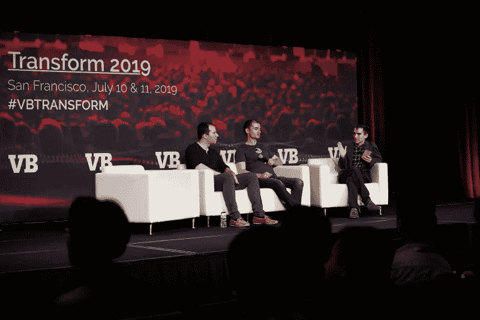
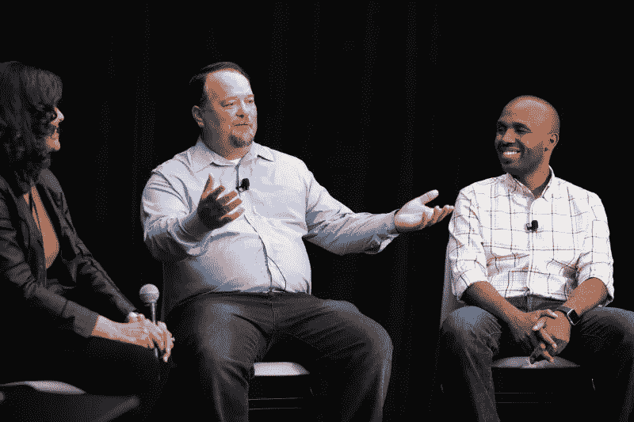
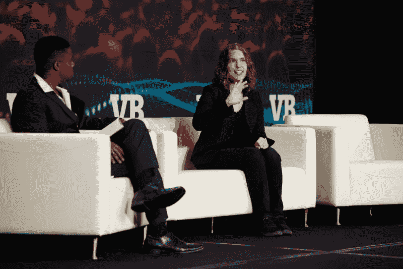

# 市场最终准备好大规模采用人工智能了吗？

> 原文：<https://towardsdatascience.com/is-the-market-finally-ready-for-mass-ai-adoption-300d4417cc24?source=collection_archive---------37----------------------->

## 来自 VentureBeat Transform 的五个啊哈时刻

Greg Brockman, Co-founder & Chairman and Ilya Sutskever, Co-founder & Chief Scientist, OpenAI; Kyle Wiggers, Staff Writer, VentureBeat

我刚刚从旧金山的 Venture Beat Transform 2019 大会回来，我不得不说，多年来第一次，我开始感觉到这个行业终于开始变得*。*

*我具体说的是什么？嗯，传统上我总是对的，这一次，我对市场在采用机器学习方面可能遇到的挑战的看法令人难以置信地正确。看看这些优秀的博客帖子；*

1.  *[机器学习有时是错误的——你如何处理这一点才是最重要的](https://blog.prototypr.io/machine-learning-is-sometimes-wrong-how-you-deal-with-that-is-everything-dc38b0cf61a8)*
2.  *[一个有趣的子编辑如何帮助解释机器学习](https://medium.com/datadriveninvestor/how-a-funny-subreddit-helps-explain-machine-learning-265aef3e8776)*
3.  *[集成 AI？这里有三个你将要遇到的问题。](https://medium.com/hackernoon/integrating-ai-here-are-3-problems-youre-about-to-encounter-f0f89414608f)*
4.  *[什么机器学习不是](https://medium.com/@aaronedell/what-machine-learning-isnt-d70f8a48d1ce?source=your_stories_page---------------------------)*

*我真的觉得这次会议上的每个人都读过这些帖子，并向观众报告了他们所了解到的一切。当然，这正是没有发生的事情。*

## *帮助人类做出更好的决定*

**

*Maribel Lopez, Founder & Principal Analyst, Lopez Research; Bill Groves, Chief Data Officer, Walmart; Josh Patterson, GM of Data Science, NVIDIA*

*几千年来，我第一次参加了一个人工智能会议，会上有人在台上谈论立即采用机器学习。所以最后，我认为市场，作为一个整体，真的开始理解价值在哪里，以及为什么机器学习可以是这样一种令人惊叹的技术。*

*在会议上，一家公司谈论他们所做的一切是如何帮助人类做出更好的决定，这让我大吃一惊。不要胡说什么 100%全自动化，或者用比我们更好的模型取代人类的认知…只是一个关于简单的机器学习驱动的解决方案的炉边聊天，让人类做出更好的决定。*

*这个**就是**机器学习唯一适合做的事情。它可以挖掘数十亿比特的数据，只显示重要的内容，它可以预测何时何地会出现问题，供人类审查，它可以让我们专注于做人类独特的事情。微软的 CTO 在此后不久表示“专注非常重要”。是的，它是我的好先生，是的，它是。*

## *嵌入人类*

*在这项有些新的技术中，数据科学家作为我们的向导和领导者仍然占据着至高无上的地位。我敢肯定，我们都希望自己能成为专家，但今天机器学习最有价值的一个方面是你能在多大程度上用数据集解决问题。盖普、脸书和优步都发表了关于他们如何成功地将机器学习集成到他们的堆栈中的演讲，毫无疑问，他们有一些共同点。*

*这些企业成功部署人工智能的最有趣的共同点是将数据科学家嵌入到整个组织的不同团队中。这些勇敢的男男女女花了大部分时间倾听。“人们遇到了什么问题？”他们会问自己。只有在与他们的同事坐在一起并了解问题后，他们才会推荐 ML-powered 解决方案。这就是他们如何在组织内实现人工智能采用的规模。一家主要的云供应商(可能是 AWS)告诉脸书的某个人，他们内部使用的人工智能比所有使用他们人工智能服务的客户的总和还要多。*

*这很关键。在尝试实现技术之前，必须考虑一个问题。“让我们用人工智能做点什么”是行不通的。这就像说“让我们用电做点什么”或“互联网”。*

## *不准确和不确定性*

*会议中我最喜欢的部分是计算机视觉跟踪中的一个面板，它是关于皇家加勒比游轮公司在餐馆中计算人数的用例。如果只有两件事加在一起会让我暴跳如雷，那就是*的队伍*和*的餐馆*。因为拥挤，等待食物是我对地狱的理解。*

*因为其中一家餐厅已经客满就把我引到另一家餐厅，这肯定会阻止我在皇家加勒比游轮上策划一场叛变。嗯……这正是他们所做的，但是他们是用计算机视觉做的！*

*他们的目标是使用餐厅闭路电视摄像头的摄像头反馈来计算在场的人数，并将这些信息传递给一个应用程序，该应用程序会为顾客重新安排路线。但是他们遇到了一个问题。训练计算机视觉模型从鱼眼安全摄像头流中计数是每个机器学习工程师最糟糕的噩梦。*

*我举手问他们为什么不使用安装在更好地方的不同的摄像机，答案让我吃惊。新的摄像机必须通过海事认证，并在船停靠在干船坞时安装，这比仅仅在一些可怕的鱼眼视频上训练 YOLO 要昂贵得多。*

*在鱼眼视频摄像头上训练人员计数器并没有产生一个可以超级准确地了解餐馆人数的模型。幸运的是，他们意识到区分 100-115 个人没有商业价值。他们真正需要知道的是一个人数范围，以确定空间有多满。所以他们不担心返回一个完全准确的数字。*

*EXCELCIOR！这正是如何实现机器学习。*

## *故障模型*

**

*Khari Johnson, Senior Staff Writer, VentureBeat; Hilary Mason, GM Machine Learning, Cloudera*

*Cloudera 机器学习总经理希拉里·梅森(Hilary Mason)列出了企业在实施人工智能时可能会遇到的几种*失败模式*。排在首位的是**不切实际的期望**。啊，好不切实际的期望，每当我照镜子或写博客时都会想起它。但这也是我在人工智能行业多年来一直在专业战斗的事情。*

*在同一次炉边谈话中，有人在台上提到，围绕机器学习的媒体炒作是有问题的，因为它没有关注某样东西是否有用。[早在 2018 年初，我就写了一篇关于](https://medium.com/hackernoon/integrating-ai-here-are-3-problems-youre-about-to-encounter-f0f89414608f)的令人难以置信的文章，因为即使在那时，错配预期的趋势也在全面展开。所以，再次看到其他人鹦鹉学舌般地反驳我所认为的成功大规模采用人工智能的根本障碍，这是一种美妙的解脱。*

*这里有一个例子来说明它是如何发生的，更重要的是，你可以如何解决它。*

*当语音到文本第一次成为一种 API 服务时，我看到销售人员去广播公司推销它，作为人类创作隐藏字幕的替代方案。当客户实际通过这些系统运行他们的内容时，结果只有大约 80%的准确性… **如果他们幸运的话**。作为隐藏式字幕的替代方案，语音转文本失败了。*

*当我看到这种情况发生时，我抓住销售团队，将他们带到一个房间，并演示了语音到文本如何生成大量可搜索的术语(例如人、地点和事物)，这些术语为内容经理和存档提供了大量价值。然后，销售团队开始讨论解决可搜索性问题，这时候我们开始看到成功。*

*我们不应该到处寻找用机器学习来解决的问题，我们需要从问题开始，看看机器学习如何增加价值。*

## *谁拥有未来？*

*希拉里·梅森还提醒我们，开发人员习惯于与确定性系统进行交互。如果我把 2+2 放进一个计算器，4 应该总是出来。但是在机器学习中，你第一次把 2+2 放到一个系统中，答案可能是错误的。开发者需要开始习惯学习的系统，用误差棒返回概率的系统。*

*开发人员广泛使用机器学习将会看到该技术的更大市场采用，但真正的奇迹将会发生在一旦它通过开发人员的世界，并达到产品的水平。只有产品经理了解业务和市场，并且在理论上，能够在技术和企业购买者之间建立桥梁。他们知道客户真正需要什么，而不是开发人员、数据科学家、销售人员或其他任何人。*

*然而，机器学习的诀窍是克服进入的技术障碍。让开发人员和产品经理能够开发、实现和扩展有用的机器学习的工具正在我们说话的时候进入市场。随着这些能力在正确的位置上渗透到正确的人的头脑中，我们将看到我们都被承诺的人工智能的大规模采用。*