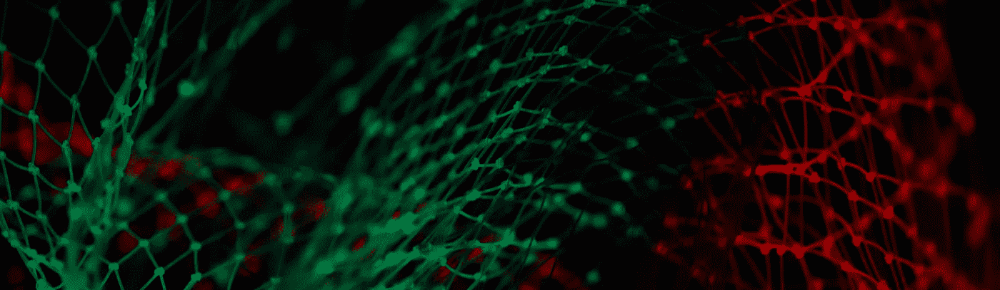
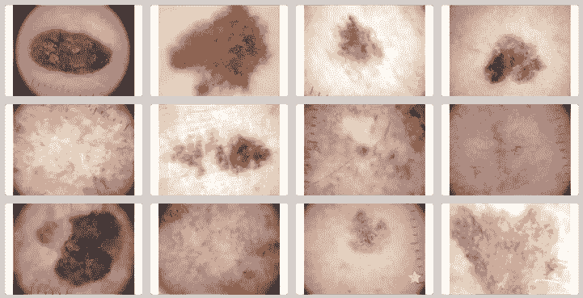
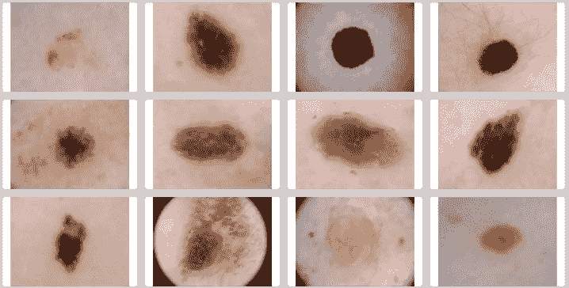
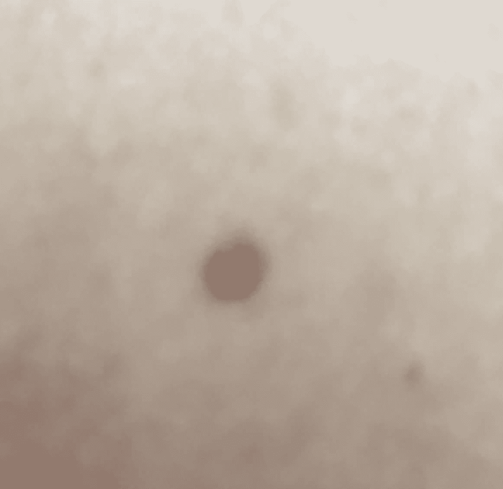

# 出版偏见正在塑造我们对人工智能的看法

> 原文：<https://towardsdatascience.com/is-the-medias-reluctance-to-admit-ai-s-weaknesses-putting-us-at-risk-c355728e9028?source=collection_archive---------18----------------------->

Photo: [Pietro Jeng](https://unsplash.com/@pietrozj) via [Unsplash](https://unsplash.com/photos/n6B49lTx7NM)

## 媒体不愿意承认 AI 的弱点是不是让我们处于危险之中？

机器学习最近引起了人们极大的兴趣，这种兴趣正在蔓延到以各种方式影响我们生活的技术。

从推荐我们应该在 Youtube 上观看哪个视频的算法，到有一天可能为我们驾驶汽车的算法，我们看到决策权越来越多地委托给机器。这开启了一些伟大的可能性——在网上发现符合我们兴趣的新内容，无人驾驶汽车让我们放松或赶完一些工作，同时带我们去我们需要去的地方。

不幸的是，它也为事情以意想不到的方式出错打开了空间。例如，Youtube 的推荐算法已经了解到，让用户留在网站上的最佳方式是向他们提供更离谱和更极化的内容，无人驾驶汽车可能会在看似平凡的设置中撞车( [*并杀死*](https://en.wikipedia.org/wiki/Death_of_Elaine_Herzberg) )。

当机器被留下来自学如何很好地执行一项功能时，它们可以找到解决这个问题的方法，这是我们自然不会预料到的。

## 检测皮肤癌

在他的书[深度医学](https://www.amazon.com/Deep-Medicine-Artificial-Intelligence-Healthcare/dp/1541644638)中，埃里克·托普描述了机器学习的一些主要进展，这些进展指向了我们在机器决策方面不可避免的未来。

他描述的一个例子是 2017 年在 *Nature* 上发表的一篇[里程碑式的论文](https://www.nature.com/articles/nature21056#main)。这篇论文描述了一个经过训练的深度神经网络，用于诊断皮肤癌，其准确性与 21 名经委员会认证的皮肤科医生相当。

这篇论文包括了一些关键的例子，这些例子突出了用来进行预测的图像部分。这些看起来都很合理，算法的大部分焦点都放在皮肤损伤本身。总体而言，这篇论文看起来非常令人印象深刻，自 2017 年发表以来，它已经被引用了 1000 多次。

A sample of images of **malignant cancers** used for training and testing the algorithm — available from [www.isic-archive.com](http://www.isic-archive.com)

但是，在论文发表后，这项研究的作者[注意到他们的算法](https://www.sciencedirect.com/science/article/pii/S0022202X18322930?via%3Dihub)中有一个偏差——如果图像中有一把尺子，更有可能将图像标记为恶性癌症。皮肤科医生经常使用尺子来测量照片中皮肤病变的大小，如果他们特别关注它的话，所以带尺子的照片更有可能是癌性的。

A sample of images of **benign lesions** used for training and testing the algorithm — available from [www.isic-archive.com](http://www.isic-archive.com)

## 这种偏见有多重要？

如果算法有时依赖于统治者来做出诊断，这是值得担心的吗？

这种偏倚的重要性取决于它影响多少样本，以及这种误差如何在患者中分布。如果每 1000 名患者出现一个随机误差，并且没有更准确的方法，这通常被认为是一个可接受的误差率。但是，如果发生了高比率的错误，或者错误严重影响了特定的患者群体，这在伦理上更令人担忧。

例如，如果一家诊所决定在他们的照片中总是包含尺子，该算法将始终过度预测去该诊所的患者的癌症。这可能导致生活在该地区的患者出现系统性的不利情况。此外，**如果皮肤科医生因为完全依赖这种算法而决定取消尺子，算法的准确性可能会下降**。

事实上，在将病变分为九个主要临床类别时，深度神经网络的准确率为 55.4%，而两位皮肤科医生的准确率分别为 55.0%和 53.3%。即使尺子对准确性的影响非常小，这也很容易使天平向有利于皮肤科医生的方向倾斜。

## 过分承诺

另一个问题是，作者认为，有了这样的算法，人们甚至可以不必再去看皮肤科医生了——他们可以用智能手机拍下一颗可疑的痣，然后看看是否有什么值得担心的。这在概念上是一个伟大的想法——它将使获得专家医疗保健的途径民主化，并使定期检查更加容易。

> “这种快速、可扩展的方法可在移动设备上部署，并有可能产生重大的临床影响，包括扩大初级保健实践的范围，并增加皮肤科专家的临床决策。”
> — [原创自然论文](https://www.nature.com/articles/nature21056)

My attempt at photographing one of my moles with an iPhone SE camera :(

问题是，虽然这是该论文的一个主要主张，但智能手机照片并没有经过该算法的测试。人们为自己的皮肤拍摄的照片类型可能在光线、照片质量、缩放和许多其他因素方面与皮肤科医生不同，这使得该算法超出了其原始训练条件。我们知道，当机器学习算法获得的数据与它们被训练的数据不同时，它们的行为可能不可预测。

我的手机在捕捉痣的特写镜头方面做得很糟糕，这表明你需要一部更新、更贵的手机来实现这个功能。这意味着使用该算法降低的成本将只适用于那些买得起带漂亮摄像头的新手机的人。

此外，论文中显示的病变照片在肤色上非常相似。对用智能手机测试人工智能检测皮肤癌的人的采访表明，肤色的变化是算法需要训练处理的一个主要因素，此外还有一些简单的因素，如[某人的手臂有多多毛](https://www.mobihealthnews.com/content/depth-advances-and-challenges-digital-dermatology)。

## 出版偏差

该算法对统治者的依赖在最初的《自然》杂志论文中没有涉及——这种实现在近一年后首次出现在[媒体](https://www.medpagetoday.com/dermatology/generaldermatology/70513)上。

当你查找关于“皮肤癌”、“神经网络”/“机器学习”和“统治者”的文章时，你会得到 10 篇新闻文章，其中 4 篇涉及该算法中发现的偏差，其中约有 4500 篇文章描述了用于检测皮肤癌的神经网络/机器学习算法。似乎人们听到令人印象深刻的新结果比听到这些大肆宣传的算法的失败更兴奋。

这是[出版偏见](https://en.wikipedia.org/wiki/Publication_bias)的一个经典问题，成功被愉快地发表，但负面结果被期刊和新闻媒体拒绝，通常不会被公之于众。在 2019 年 3 月出版的 [Deep Medicine](https://www.amazon.com/Deep-Medicine-Artificial-Intelligence-Healthcare/dp/1541644638) 中，该算法仍被用作人工智能改变我们行医方式的令人印象深刻的力量的一个例子，这一事实表明，关于这些算法局限性的信息是多么难以渗透大众观点。

托普在他的书中专门用了一个章节来讨论人工智能的缺点，并提到了其他没有达到宣传效果的算法，但却忽略了这个算法的局限性。由于这些算法缺乏透明度，在弱点变得清晰之前，可能需要时间和更多样化的测试。因此，一旦这些算法不再是头条新闻，就很难保持对它们的理解。

## 该不该让 AI 演医生？

虽然人工智能在医疗保健领域取得了稳步进展，但正在发布的算法可以用来在没有独立测试和几乎不了解他们如何做出预测的情况下做出诊断决策。没有什么动机去公布一个算法的弱点，而且相关方通常也没有能力进行自己的测试。

这让患者和临床医生等利益相关者不得不相信算法创造者的话是可靠的。随着意外算法偏差和弱点的证据越来越多，这可能会成为消费者的一个不舒服的位置。

要求更大程度的开放应该会改善这种状况。这篇论文提供了一幅图像中九个特征的例子，该算法正利用这些特征来做出决策。如果该算法是在一个开放的数据集上训练的，那么这些例子可以提供给所有的图像，这将使偏见更容易被公众发现。

> “医疗培训/验证数据的可用性受到限制，这些数据经许可用于当前研究，因此不公开。在合理要求和斯坦福医院许可的情况下，作者可能会提供一些数据。”
> —摘自论文的数据可用性声明

幸运的是，在这种情况下，论文的作者依赖于公开可用图像和斯坦福医院图像的组合，这意味着我们可以查看训练数据的子集。否则，如果作者不承认，我们根本不知道统治者可能是一种偏见，我们也不知道这种偏见可能会影响多少图像([自己看看](https://www.isic-archive.com/#!/topWithHeader/onlyHeaderTop/gallery))。

除了期望围绕这些算法如何工作有更多的开放性，公布这些算法犯的错误以及它们的成功有助于人们对机器学习算法可能失败的原因形成直觉。提高公众的人工智能素养——围绕它在哪里被使用，训练和测试数据来自哪里，它正在做出什么决定，我们应该对这些决定有多大信心，以及这些决定是如何做出的——对于提高公众的信任以及控制开发这些算法的公司来说至关重要。

在提高人工智能的可解释性方面正在取得进展。如果消费者推动这成为批准重要用途算法的强制性部分，我们[可能会更好地避免未来这些算法中出现意想不到的偏见。](https://rss.onlinelibrary.wiley.com/doi/10.1111/1740-9713.01404)