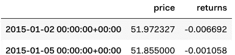
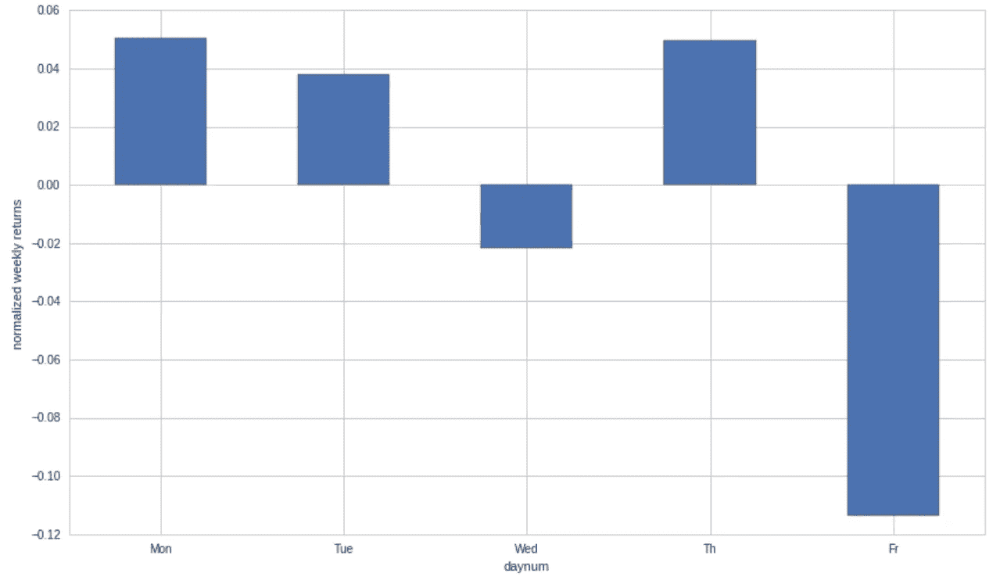
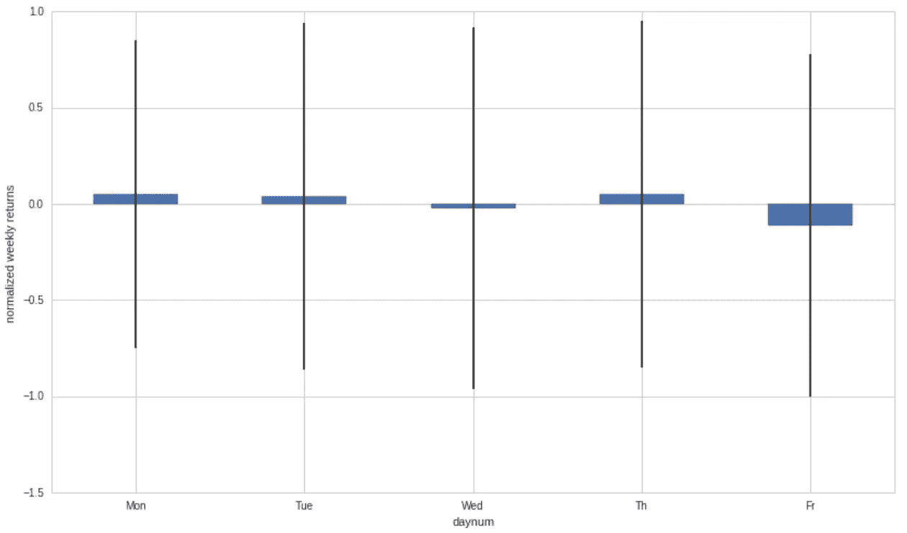
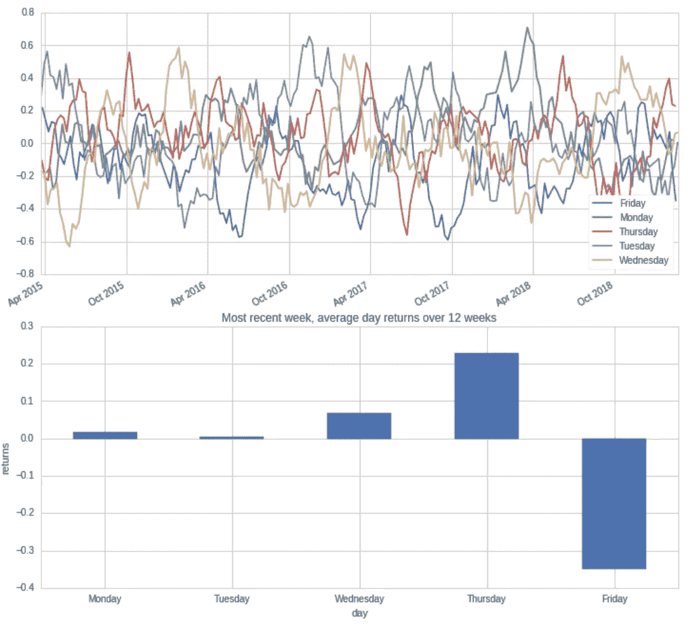
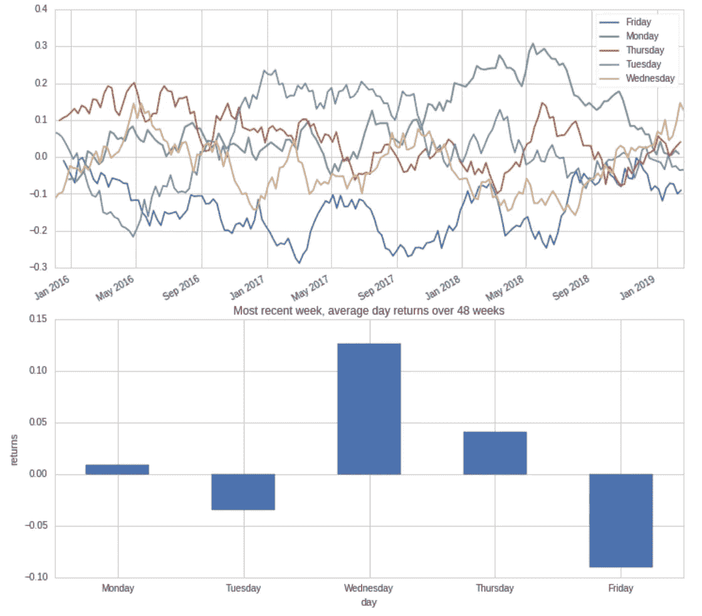

# 哪一天投资最好？

> 原文：<https://towardsdatascience.com/is-there-a-best-day-for-scheduled-deposits-in-investment-accounts-b23b8402948d?source=collection_archive---------11----------------------->

## 你应该选择哪一天作为你投资帐户的循环日？


Photo by [Wyron A](https://unsplash.com/@wyron?utm_source=medium&utm_medium=referral) on [Unsplash](https://unsplash.com?utm_source=medium&utm_medium=referral)

早点存，定期存。太好了。你将定期存款安排到一些指数化投资，可能是 ETF，也可能是通过像 Betterment、WealthFront 等机器人顾问。

定期存款对冲了你对市场时机的押注。在我的例子中，我设定了一个机器人顾问的周存款，并想知道市场中是否有一个周模式显示一周中有利于投资的一天。我们能得到平均值的优势吗？

值得庆幸的是，所有的工具都是免费的，可以尝试得到这个问题的方向性答案。

# 对统计数据的初步看法

Quantopian 的平台提供免费的数据源和工具来构思交易算法。这个问题的好去处，让我们开始吧。

QTradableStocksUS 是一个由 Quantopian 管理的股票大世界，它去除了细价股和其他非流动性股票，但仍然是一个大世界。我正在查看自 2015 年以来该领域的所有股票回报。

To use those gists, you will need to create an account on [Quantopian](http://www.quantopian.com)

```
Number of equities: 3039
```

现在，让我们得到在所考虑的时间段内每天所有符号的平均收益。

```
avg_returns = pipeline_output.groupby(level=0).mean()
avg_returns.head(2)
```



average returns and gratuitous average price

因为我们需要周模式，所以让我们添加星期和星期号。我们想要的是相对于每周平均回报的相对回报，而不是绝对回报，所以我们用平均值和标准差来标准化每周。

基于此，什么是平均每天的回报呢？在过去 4 年左右的时间里，似乎周一早上是你计划投资的最佳时间。



Normalized weekly returns over all 3000+ stock per day

请记住，回报是正常的，所以周五 12%的下跌谢天谢地不是市场上每周发生的事情。

# 没那么快…

嗯，我们有多少变化？



now with error bars

哎哟。这种模式突然变得不那么吸引人了。尽管如此，周五仍有 5%的可能性低于平均水平，相当于 0.05 的 p 值，这在统计上是显著的。YMMV 取决于您可接受的 p 值阈值。

让我们继续挖掘，看看均值是如何随时间演变的。

# 周日模式是如何随时间演变的？

让我们来看看在一个特定的观察范围内，这些相对收益是如何随着时间的推移而变化的。例如，如果我在几年内对 12 周的滑动窗口做同样的分析，这些天会一直翻转还是我们会看到一个模式？



很难看出，但纵观 12 周的滑动窗口，周五可能是一个月来表现最差的一天？到处都是。

更长的时间窗口怎么样？下面 48 周。



从更长的时间来看，周五似乎是最糟糕的一天，所以从这个角度来看，周一进行定期存款并不是一个坏选择。

# 最后

不足为奇的是，几乎没有任何迹象表明任何重要的东西已经被套利掉了。然而，轻微的趋势使我选择我的经常性存款日为星期一。**声明，这不构成投资建议**。

接下来呢？我很想知道基于这个因素的多空策略会有怎样的表现，这是 Quantopian 拥有强大工具的另一件事。此外，我很想看看某些股票在一周内的表现是否非常可预测。可能是后续文章的主题。

感谢你对这篇文章的评论和修改！

***注来自《走向数据科学》的编辑:*** *虽然我们允许独立作者根据我们的* [*规则和指导方针*](/questions-96667b06af5) *发表文章，但我们不认可每个作者的贡献。你不应该在没有寻求专业建议的情况下依赖一个作者的作品。详见我们的* [*读者术语*](/readers-terms-b5d780a700a4) *。*